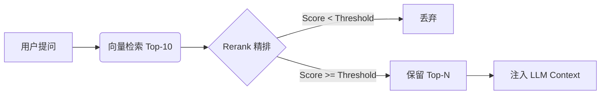

# Research Agent - 大模型聊天会话管理系统

一个功能完整的大模型聊天应用，支持多会话管理、流式输出、工具调用和状态持久化。

## 特性

- **Docker 容器化部署** - 一键部署到生产服务器，支持 Docker Compose 编排
- **LangGraph 1.0+** - 使用最新的 `StateGraph` 构建复杂的工具调用工作流
- **多会话管理** - 创建、删除、切换聊天会话
- **流式/非流式输出** - 支持 SSE 实时流式响应
- **SQL Agent** - 官方推荐的多步骤工作流（表探测、Schema 解析、查询生成、SQL 校验、执行）
- **SQL 安全拦截** - 基于正则黑名单的代码层硬校验，严格禁止 `DROP`, `DELETE`, `UPDATE` 等破坏性操作
- **日期标准化** - 针对数据库日期字段（如 `DD/MM/YYYY`）的自动 ISO 8601 转换清洗
- **SQL 弹性限流** - 智能判断查询行数，超限时自动截断并返回预览预览及系统警告，防止上下文溢出
- **CSV 数据导出** - 支持将大量 SQL 结果直接导出为 CSV 文件供用户下载，全程不占 LLM 上下文
- **状态持久化** - PostgresSaver 自动管理 Agent 状态
- **现代 UI/UX** - 基于 Neural Tones + AI Purple 设计系统，支持毛玻璃效果与流畅动画
- **前后端分离** - FastAPI + Vue 3 + TypeScript
- **技能系统 (Skills)** - 动态加载业务领域知识，支持大规模上下文管理 (Agent V2)
- **RAG 知识增强** - 支持 PGVector / Milvus Hybrid 检索，Milvus 可在 `Ollama` 与 `llama.cpp + Qwen3 Embedding` 之间切换，并可选接入 NVIDIA Rerank 精排


## 技术栈

### 后端

| 技术           | 说明                              |
| -------------- | --------------------------------- |
| FastAPI        | 高性能异步 Web 框架                |
| SQLAlchemy     | Python ORM                         |
| PostgreSQL     | 关系型数据库                       |
| LangGraph      | LLM 应用开发框架 (1.0+ 版本)       |
| DeepSeek       | 联网大语言模型 (API)               |
| Ollama         | 本地大模型推理服务 (可选)           |
| PostgresSaver  | Agent 状态持久化                   |
| psycopg_pool   | PostgreSQL 连接池                  |

### 前端

| 技术          | 说明                  |
| ------------- | --------------------- |
| Vue 3         | 渐进式 JavaScript 框架 |
| TypeScript    | 类型安全              |
| Vite          | 前端构建工具          |
| Pinia         | 状态管理              |
| Tailwind CSS  | CSS 框架 (支持 Neural Tones + AI Purple) |
| Axios         | HTTP 客户端           |


## Docker 快速部署（推荐）

最简单的部署方式是使用 Docker Compose：

```bash
# 1. 克隆项目
git clone <repository-url>
cd rearch_agent

# 2. 配置环境变量
cp .env.production .env
nano .env  # 修改数据库密码和LLM配置

# 3. 启动所有服务
docker-compose up -d --build

# 4. 验证
curl http://localhost:8000/
```

详细部署文档：[deploy/README.md](./deploy/README.md)

---

## 快速开始

### 前置要求

- Python 3.12+
- Node.js 18+
- PostgreSQL 14+

### 1. 克隆项目

```bash
git clone <repository-url>
cd rearch_agent
```

### 2. 配置环境变量

项目当前直接使用根目录 `.env` 文件。若不存在，可在根目录新建 `.env` 并参考下列配置：

```bash
# .env
DATABASE_URL='postgresql://用户名:密码@localhost:5432/rearch_agent'

# DeepSeek 配置 (推荐，响应快，SQL 能力强)
DEEPSEEK_API_KEY='your-deepseek-api-key'
DEEPSEEK_BASE_URL='https://api.deepseek.com/v1'
DEEPSEEK_MODEL='deepseek-chat'

# (可选) Ollama 配置 (本地推理)
OLLAMA_BASE_URL='http://localhost:11434'
OLLAMA_MODEL='qwen3:30b'
OLLAMA_NUM_CTX=32768
OLLAMA_KEEP_ALIVE=-1

AGENT_TEMPERATURE=0.1
AGENT_MAX_TOKENS=2000
MYSQL_DATABASE_URL='mysql+pymysql://...'

# SQL Agent 限流配置
SQL_AGENT_TOP_K=1000         # 软限制：指导 LLM 生成 SQL 时的 LIMIT
SQL_RESULT_HARD_LIMIT=500    # 硬限制：后端强制截断行数，防内存溢出
SQL_RESULT_PREVIEW_ROWS=5    # 截断时给 LLM 展示的预览行数

# RAG & Rerank 配置
RAG_BACKEND='milvus_hybrid'      # 检索后端：pgvector | milvus_hybrid
RAG_SIMILARITY_THRESHOLD=0.01   # 初筛分值阈值（针对 RRF 分数进行过滤，建议 0.01-0.05）
NVIDIA_API_KEY='your-key'       # NVIDIA NIM API Key
RERANK_ENABLED=true             # 是否启用精排
RERANK_MODEL='nvidia/rerank-qa-mistral-4b'
RERANK_TOP_N=3                  # 精排后最终保留并注入 LLM 上下文的文档数量
RERANK_SCORE_THRESHOLD=0.0      # 精排评分阈值

# Milvus Embedding Provider 配置
EMBEDDING_PROVIDER='ollama'     # ollama | llama_cpp
OLLAMA_EMBED_MODEL='qwen3-embedding:0.6b'
LLAMA_CPP_EMBED_BASE_URL='http://127.0.0.1:8081'
LLAMA_CPP_EMBED_MODEL='Qwen/Qwen3-Embedding-0.6B-GGUF:q8_0'
LLAMA_CPP_EMBED_TIMEOUT=30
QWEN_QUERY_INSTRUCTION_ENABLED=true
QWEN_QUERY_INSTRUCTION='Given a web search query, retrieve relevant passages that answer the query'
```

### 3. 安装依赖

**后端依赖**：
```bash
pip install -r requirements.txt
```

或手动安装核心依赖：
```bash
pip install fastapi uvicorn sqlalchemy psycopg[binary,pool]
pip install langchain langchain-deepseek langgraph-checkpoint-postgres cryptography
```

**前端依赖**：
```bash
cd frontend
npm install
```

### 4. 初始化数据库

```bash
# 创建数据库
createdb rearch_agent

# 启动后端服务（会自动创建表）
uvicorn backend.app.main:app --reload --host 0.0.0.0 --port 8000
```

### 5. 启动前端

```bash
cd frontend
npm run dev
```

### 6. 访问应用

- 前端界面：http://localhost:5173
- 后端 API 文档：http://localhost:8000/docs
- ReDoc 文档：http://localhost:8000/redoc

## 项目结构

```
rearch_agent/
├── backend/                        # 后端应用与相关文档
│   ├── app/
│   │   ├── main.py                # FastAPI 应用入口
│   │   ├── api.py                 # RESTful API 路由
│   │   ├── crud.py                # 数据库 CRUD 操作
│   │   ├── models.py              # SQLAlchemy ORM 模型
│   │   ├── schemas.py             # Pydantic Schema
│   │   ├── database.py            # 数据库连接
│   │   ├── config.py              # 配置管理
│   │   ├── services.py            # 基础版服务
│   │   ├── services_graph.py      # LangGraph SQL Agent 服务
│   │   ├── test_*.py              # 后端冒烟 / 功能测试脚本
│   │   └── agent/                 # Agent 模块化架构核心
│   │       ├── service.py             # 核心服务编排
│   │       ├── service_llama.cpp.py   # 本地 llama.cpp 适配服务实验入口
│   │       ├── state.py               # Graph 状态定义
│   │       ├── constants.py           # 常量定义
│   │       ├── middleware/            # 中间件
│   │       ├── tools/                 # 专用工具集
│   │       ├── utils/                 # 底层工具库
│   │       ├── development/           # 实验与开发模块
│   │       └── vector/                # RAG 向量检索与精排引擎
│   │           ├── base.py                # 检索器与精排器抽象基类
│   │           ├── embedding_provider.py  # Milvus Embedding Provider 统一入口
│   │           ├── factory.py             # 检索 / 精排工厂
│   │           ├── milvus_hybrid/         # Milvus 混合检索实现
│   │           ├── milvus_init/           # Milvus 数据导入工具集
│   │           ├── pgvector/              # PGVector 纯向量检索实现
│   │           ├── pgvector_init/         # PGVector 数据导入工具集
│   │           └── rerank/                # NVIDIA Rerank 精排器封装
│   ├── docs/                    # 后端技术文档
│   ├── llamaCpp/                # llama.cpp 本地部署脚本
│   └── Dockerfile               # 后端 Docker 镜像配置
├── frontend/                    # 前端应用
│   ├── src/
│   │   ├── api/                 # API 请求封装
│   │   ├── components/          # Vue 公用组件
│   │   ├── views/               # 页面视图
│   │   ├── stores/              # Pinia 状态管理
│   │   └── types/               # TypeScript 类型定义
│   ├── vite.config.ts           # Vite 配置
│   └── package.json             # 前端依赖
├── deploy/                      # 部署文档与辅助配置
├── openspec/                    # 规格与变更提案
├── .env                         # 当前本地环境变量
├── changelog.md                 # 项目变更记录
├── memory.md                    # 项目长期记忆
├── requirements.txt             # Python 依赖
└── README.md                    # 本文件
```

## API 端点

### 会话管理

| 方法   | 路径                     | 功能               |
| ------ | ------------------------ | ------------------ |
| POST   | `/api/chat/sessions`     | 创建会话           |
| GET    | `/api/chat/sessions`     | 获取所有会话       |
| GET    | `/api/chat/sessions/{id}` | 获取单个会话       |
| PUT    | `/api/chat/sessions/{id}` | 更新会话           |
| DELETE | `/api/chat/sessions/{id}` | 删除会话           |

### 消息管理

| 方法   | 路径                                | 功能                 |
| ------ | ----------------------------------- | -------------------- |
| POST   | `/api/chat/messages`                | 创建消息             |
| GET    | `/api/chat/messages/{id}`           | 获取单条消息         |
| GET    | `/api/chat/sessions/{id}/messages`  | 获取会话的所有消息   |
| DELETE | `/api/chat/messages/{id}`           | 删除消息             |

### Agent 聊天

| 方法 | 路径                | 功能               |
| ---- | ------------------- | ------------------ |
| POST | `/api/chat/message` | 发送消息（非流式） |
| POST | `/api/chat/stream`  | 发送消息（流式）   |

#### 示例请求

**非流式**：
```bash
curl -X POST http://localhost:8000/api/chat/message \
  -H "Content-Type: application/json" \
  -d '{
    "message": "搜索最新的深度学习论文",
    "session_id": "会话ID",
    "stream": false
  }'
```

**流式**：
```bash
curl -X POST http://localhost:8000/api/chat/stream \
  -H "Content-Type: application/json" \
  -d '{
    "message": "搜索最新的深度学习论文",
    "session_id": "会话ID",
    "stream": true
  }'
```

## 核心功能

### PostgresSaver 状态管理

Agent 的对话状态由 PostgresSaver 自动管理，无需手动加载历史：

```python
# 初始化
from psycopg_pool import ConnectionPool
from langgraph.checkpoint.postgres import PostgresSaver

self.conn_pool = ConnectionPool(conninfo=settings.database_url)
self.checkpointer = PostgresSaver(self.conn_pool)

# 使用
config = {"configurable": {"thread_id": str(session_id)}}
result = agent.invoke({"messages": [...]}, config=config)
```

### Agent 模块化架构 (Agent V2)

该系统已升级为高度模块化的 Agent V2 架构，替代了传统的 Multi-Step 模式，核心流程如下：

1. **预加载 Schema**: 移除了原生的 `sql_db_list_tables` 和 `sql_db_schema` 工具，在服务启动时全量解析表结构与中文注释，提升响应速度和准确度。
2. **技能路由增强 (SkillMiddleware)**: 在核心 Agent 前置中间件拦截请求，动态加载特定业务领域（如订单、物流）的 Schema 上下文，防止全局全量 Schema 注入导致 LLM 上下文溢出 (Token Limit)。
3. **知识与示例检索 (BusinessRagMiddleware)**: 基于 PGVector 或 Milvus 的混合检索，智能匹配相关的业务术语解释或历史相似的优质 SQL 示例。
4. **安全与弹性 SQL 执行 (Wrapped Query Tool)**: 深度封装了执行节点，强制进行基于正则黑名单的语法与安全检查（拦截 `DROP` 等命令），并带有智能行数截断限流机制，大结果自动总结为预览。
5. **异步/大文件导出**: 针对巨量查询结果请求，系统提供单独的 `export_to_csv` 工具让 Agent 可以选择生成下载链接而非污染对话历史。

### 日期标准化清洗 (Strategy A)

为了解决 `DD/MM/YYYY` 等碎片化日期格式导致 LLM 比较失败的问题，系统在 `run_query` 节点后会无条件对输出结果进行 ISO 8601 (`YYYY-MM-DD`) 转换清洗。

```python
# 清洗逻辑示例
def normalize_dates_in_text(text: str):
    # 将 DD/MM/YYYY 转换为 YYYY-MM-DD
    # 确保 LLM 可以通过字符串比较正确理解日期逻辑
    ...
```

### 数据库表结构

**业务表**（用于前端展示）：
- `chat_sessions` - 会话信息
- `chat_messages` - 聊天消息

**检查点表**（PostgresSaver 自动创建）：
- `checkpoints` - Agent 状态存储
- `checkpoint_blobs` - 大型二进制数据
- `checkpoint_writes` - 写入记录

### RAG 知识检索增强

系统采用 "Retrieve-then-Rerank" 的两阶段检索架构，确保业务知识的准确注入。

#### 召回数量规则汇总 (Recall Rules)

| 组合模式 | 第一阶段 (初筛召回 - `doc_k`) | 第二阶段 (精排保留 - `top_n`) | 最终注入数量 |
| :--- | :--- | :--- | :--- |
| **仅混合检索** | **5 条** (硬编码在 `service.py`) | 无 | **5 条** |
| **混合检索 + Rerank** | **10 条** (算法自动放大) | **3 条** (由 `RERANK_TOP_N` 控制) | **3 条** |

#### 相关配置参数 (Configuration Parameters)

| 环境变量 | 默认值 | 说明 |
| :--- | :--- | :--- |
| `RAG_BACKEND` | `milvus_hybrid` | 检索后端：`pgvector` (纯向量) 或 `milvus_hybrid` (混合) |
| `RAG_SIMILARITY_THRESHOLD` | `None` | 初筛阈值。针对 RRF 分数过滤，推荐值 **0.01 ~ 0.05** |
| `RERANK_ENABLED` | `false` | 是否开启 NVIDIA NIM 精排层 |
| `RERANK_TOP_N` | `3` | 精排后最终保留并注入 LLM 上下文的文档数量 |
| `RERANK_SCORE_THRESHOLD` | `0.0` | 精排评分阈值 |
| `EMBEDDING_PROVIDER` | `ollama` | Milvus 稠密向量 provider：`ollama` 或 `llama_cpp` |
| `LLAMA_CPP_EMBED_BASE_URL` | `http://127.0.0.1:8081` | `llama.cpp` embedding 服务地址 |
| `LLAMA_CPP_EMBED_MODEL` | `Qwen/Qwen3-Embedding-0.6B-GGUF:q8_0` | `llama.cpp` 使用的 Qwen3 Embedding 模型标识 |

> [!TIP]
> **RRF 分数说明**：混合检索使用的是 RRF 融合机制，其分数通常在 0 到 0.1 之间，远小于传统的余弦相似度。调整 `RAG_SIMILARITY_THRESHOLD` 时请从较小的值开始尝试。

> [!IMPORTANT]
> 当 `EMBEDDING_PROVIDER` 从 `ollama` 切换到 `llama_cpp`（或反向切换）后，需要重新执行 `python -m backend.app.agent.vector.milvus_init.init_milvus` 重建 Milvus Collection，确保入库向量与查询向量来自同一套 embedding 配置。

架构图：


## 开发指南

### 后端开发

```bash
uvicorn backend.app.main:app --reload --host 0.0.0.0 --port 8000
```

### 前端开发

```bash
cd frontend
npm run dev
```

### 代码规范

详见 [CLAUDE.md](./CLAUDE.md) 文档。

### 技术文档

- [llama.cpp + Qwen3 Embedding 接入与复用最佳实践](./backend/docs/llamacpp-qwen3-embedding-local-deployment.md)
- [RAG 架构与技术总结](./backend/docs/RAG架构与技术总结.md)
- [FastAPI 与 SQLAlchemy 知识点](./backend/docs/FastAPI与SQLAlchemy知识点复习.md)
- [PostgresSaver 集成重构总结](./backend/docs/PostgresSaver集成重构总结.md)
- [连接池与上下文管理器详解](./backend/docs/连接池与上下文管理器详解.md)

## 常见问题

### 代理连接错误 (Connection error)

**错误现象**：
```
httpcore.ConnectError: [WinError 10061] 由于目标计算机积极拒绝，无法连接。
connect_tcp.started host='127.0.0.1' port=7890
```

**原因**：OpenAI 客户端（langchain-deepseek 底层使用）自动检测 Windows 系统代理设置，尝试通过 `127.0.0.1:7890` 连接，但代理服务未运行。

**解决方案**：在 `backend/app/agent/service.py` 中创建禁用代理的 HTTP 客户端：

```python
import httpx

# 创建不使用代理的 HTTP 客户端
_no_proxy_client = httpx.Client(
    proxy=None,  # 明确禁用代理
    timeout=60.0
)

# 传递给 ChatDeepSeek
llm = ChatDeepSeek(
    ...,
    http_client=_no_proxy_client,  # 禁用代理
)
```

**修改时间**：2025-01-07

### PostgresSaver 报错

确保使用 `ConnectionPool` 初始化：

```python
# ✅ 正确
self.conn_pool = ConnectionPool(conninfo=DB_URL)
self.checkpointer = PostgresSaver(self.conn_pool)

# ❌ 错误
self.checkpointer = PostgresSaver.from_conn_string(DB_URL)
```

### Agent 不记得对话

检查是否传递了 `config` 参数：

```python
config = {"configurable": {"thread_id": str(session_id)}}
result = agent.invoke({...}, config=config)
```

更多问题请参考 [CLAUDE.md](./CLAUDE.md)。

## 许可证

MIT License

## 贡献

欢迎提交 Issue 和 Pull Request！
