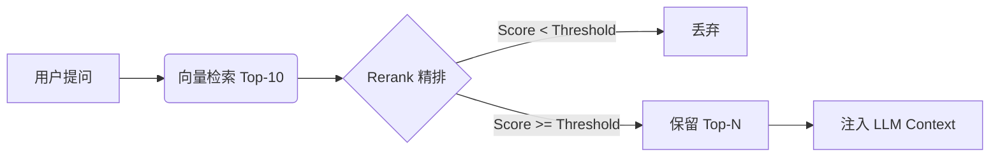

# Research Agent - 大模型聊天会话管理系统

一个功能完整的大模型聊天应用，支持多会话管理、流式输出、工具调用和状态持久化。

## 特性

- **Docker 容器化部署** - 一键部署到生产服务器，支持 Docker Compose 编排
- **LangGraph 1.0+** - 使用最新的 `StateGraph` 构建复杂的工具调用工作流
- **多会话管理** - 创建、删除、切换聊天会话
- **流式/非流式输出** - 支持 SSE 实时流式响应
- **结构化流式事件** - 流式聊天升级为 `token/status/tool_call/tool_result/final/error` 事件协议，默认界面仅展示最终结论，过程细节仅用于轻量状态提示或内部调试
- **SQL Agent** - 官方推荐的多步骤工作流（表探测、Schema 解析、查询生成、SQL 校验、执行）
- **SQL 安全拦截** - 基于正则黑名单的代码层硬校验，严格禁止 `DROP`, `DELETE`, `UPDATE` 等破坏性操作
- **日期标准化** - 针对数据库日期字段（如 `DD/MM/YYYY`）的自动 ISO 8601 转换清洗
- **SQL 弹性限流** - 智能判断查询行数，超限时自动截断并返回预览预览及系统警告，防止上下文溢出
- **CSV 数据导出** - 支持将大量 SQL 结果直接导出为 CSV 文件供用户下载，全程不占 LLM 上下文
- **聊天内嵌图表** - 当用户明确要求生成图表时，后端生成 chart artifact，前端按 `chart_id` 拉取并渲染折线图或柱状图
- **方案 B 数据字典 Bento 抽屉** - 正式选用 Bento 磁贴网格仪表盘与平滑拉出毛玻璃 Drawer 抽屉的交互架构，将聊天与字典完美融合。白名单通过 `.env` `DIMENSION_TABLES` 配置，连接失败直接报错便于排查。
- **双击联动注入与毛玻璃 Spark Toast 反馈** - 双击抽屉中维度表任何单元格或字段名，数据自动追加到聊天输入框光标停留处；输入框边缘泛起 `.input-glow` 呼吸灯发光，底端浮现毛玻璃 Transition Toast。
- **前端安全下载** - 导出结果通过 `file_id` 映射到后端下载接口，前端可直接点击下载 CSV，而不暴露服务器绝对路径
- **Markdown 结果展示** - 助手完成态消息支持 Markdown 渲染，适合表格、列表、代码块和统计摘要展示
- **状态持久化** - FastAPI 本地模式使用 `AsyncPostgresSaver`，托管模式由 LangGraph 自动管理 Agent 状态
- **Markdown 结果展示** - 助手完成态消息支持 Markdown 渲染，适合表格、列表、代码块和统计摘要展示
- **状态持久化** - FastAPI 本地模式使用 `AsyncPostgresSaver`，托管模式由 LangGraph 自动管理 Agent 状态
- **现代 UI/UX** - 基于 Neural Tones + AI Purple 设计系统，采用 **Arctic Glass (方案一)** 设计语言，支持毛玻璃效果、渐变光晕与流畅动画
- **前后端分离** - FastAPI + Vue 3 + TypeScript
- **元数据驱动仪表盘 (Dashboard)** - 首页通过 `GET /api/chat/skills` 自动发现后端技能，并根据 `models.py` 定义的 `title` 和 `example_questions` 动态渲染能力矩阵，支持“直接提问”自动初始化会话。
- **技能系统 (Skills)** - 动态加载业务领域知识，并支持“领域 skill + 场景 skill”二级披露、场景目录聚合与自动发现，适配固定统计与固定流程场景
- **代码阅读讲解子智能体** - 新增 code-explainer，用于解释代码架构、技术栈、流程与调用链，帮助快速上手仓库
- **代码质量审查子智能体** - 新增 code-reviewer，用于在 review 场景下聚焦 bug、回归风险、安全隐患和测试缺口
- **开发指南提炼技能** - 新增 development-guide-synthesizer，用于把开发实现、讨论结论和踩坑经验沉淀成可复用的手册
- **RAG 知识增强** - 支持 PGVector / Milvus Hybrid 检索，Milvus 可在 `Ollama` 与 `llama.cpp + Qwen3 Embedding` 之间切换，并可选接入 NVIDIA Rerank 精排
- **反馈驱动型自演进 Few-Shot 案例库** - 前端支持用户对 AI 消息进行 👍 / 👎 / ⭐（收藏），管理员在审核面板对收藏的案例进行同步/异步审核。通过规则提取器（包括安全拦截、单步/多步 SQL 提取、空结果集过滤、澄清链路精准拓扑回溯和业务技能域隔离）及 LLM 提炼层（意图重写与 SQL 脱敏参数化），自动沉淀黄金案例入库，实现智能体在运行中自我学习与持续进化。
- **多 System 消息终极合并自愈** - 在大模型调用前的临界时机，通过终极安全合并中间件（SafeMergeSystemMiddleware）利用原生的 `merge_message_runs` 自动将核心系统提示词与 RAG 背景知识合并，解决在 strict 模式的本地推理引擎（如 vLLM）中由于非首位 system 消息引发 of 400 校验报错，同时提升本地小参数大模型的 Attention 集中度与 Prefix Caching 效率
- **vLLM 专属精确分词引擎** - 新增 `VllmTokenEstimator` 支持直接调用 vLLM 推理后端的 `/tokenize` 端点获取 100% 精确的 Token 计算结果，根治粗糙估算造成的边界溢出。可在 `.env` 中通过 `TOKEN_ESTIMATOR_ENGINE` 变量实现与 `llama_cpp` 引擎的平滑热切换。
- **思考模式控制** - 支持 Qwen3.6 MoE 深度推理（Thinking）功能的开关控制。当前处于“隐藏阶段”，由后端 `.env` 中的 `LLM_ENABLE_THINKING=true/false` 静态变量进行全局默认配置，前端已预留磨砂玻璃质态 `ToggleSwitch` 交互组件与 API 协程透传通道，便于后续升级完善运行时动态切换能力
- **澄清问答卡片 (AskUserQuestion)** - 支持基于 LangGraph 1.1.8 原生 `interrupt` 中断控制流的澄清问答。当大模型遇到需求模糊或执行技术权衡时，挂起流式响应并向下游输出结构化问答卡片；前端以毛玻璃轻量卡片形式渲染，支持单选/多选/自定义输入互斥，并提供 Hover 实时 Markdown 对比预览。用户确认提交后，通过 `/api/chat/resume` 恢复流式生成，并对历史卡片进行 disabled 锁定。
- **Agent 技能文档化** - 新增技能相关的领域文档、问题追踪与标签分诊手册，提升智能体在特定任务下的标准化执行能力
- **数据库物理词典三层折叠面板 (DB Lexicon display)** - 在线 RAG 元数据检索打通了结构化流事件。在聊天卡片气泡底端提供嵌套折叠面板，清晰拆解推荐表 DDL 骨架（支持 SQL 代码高亮）、字段去重值映射对照表、主键与行属性关联表，极大提升 SQL 智能体执行过程透明度。

- **项目上下文 (CONTEXT.md)** - 沉淀项目特有的领域术语与核心业务逻辑，为 Agent 提供统一的背景知识基座

## 技术栈

### 后端

| 技术          | 说明                         |
| ------------- | ---------------------------- |
| FastAPI       | 高性能异步 Web 框架          |
| SQLAlchemy    | Python ORM                   |
| PostgreSQL    | 关系型数据库                 |
| LangGraph     | LLM 应用开发框架 (1.0+ 版本) |
| DeepSeek      | 联网大语言模型 (API)         |
| Ollama        | 本地大模型推理服务 (可选)    |
| AsyncPostgresSaver / PostgresSaver | Agent 状态持久化 |
| psycopg_pool  | PostgreSQL 连接池            |

### 前端

| 技术         | 说明                                     |
| ------------ | ---------------------------------------- |
| Vue 3        | 渐进式 JavaScript 框架                   |
| TypeScript   | 类型安全                                 |
| Vite         | 前端构建工具                             |
| Pinia        | 状态管理                                 |
| ECharts      | 聊天内嵌图表渲染                         |
| Tailwind CSS | CSS 框架 (支持 Neural Tones + AI Purple) |
| Axios        | HTTP 客户端                              |

## Docker 快速部署（推荐）

最简单的部署方式是使用 Docker Compose：

```bash
# 1. 克隆项目
git clone <repository-url>
cd rearch_agent

# 2. 配置环境变量
cp .env.production .env
nano .env  # 修改数据库密码和LLM配置

# 3. 启动所有服务
docker-compose up -d --build

# 4. 验证
curl http://localhost:8000/
```

详细部署文档：[deploy/README.md](./deploy/README.md)

---

## 快速开始

### 前置要求

- Python 3.12+
- Node.js 18+
- PostgreSQL 14+

### 1. 克隆项目

```bash
git clone <repository-url>
cd rearch_agent
```

### 2. 配置环境变量

项目当前直接使用根目录 `.env` 文件。若不存在，可在根目录新建 `.env` 并参考下列配置：

```bash
# .env
DATABASE_URL='postgresql://用户名:密码@localhost:5432/rearch_agent'

# DeepSeek 配置 (推荐，响应快，SQL 能力强)
DEEPSEEK_API_KEY='your-deepseek-api-key'
DEEPSEEK_BASE_URL='https://api.deepseek.com/v1'
DEEPSEEK_MODEL='deepseek-chat'

# (可选) Ollama 配置 (本地推理)
OLLAMA_BASE_URL='http://localhost:11434'
OLLAMA_MODEL='qwen3:30b'
OLLAMA_NUM_CTX=32768
OLLAMA_KEEP_ALIVE=-1

AGENT_TEMPERATURE=0.1
AGENT_MAX_TOKENS=2000
MYSQL_DATABASE_URL='mysql+pymysql://...'

# SQL Agent 限流配置
SQL_AGENT_TOP_K=1000         # 软限制：指导 LLM 生成 SQL 时的 LIMIT
SQL_RESULT_HARD_LIMIT=500    # 硬限制：后端强制截断行数，防内存溢出
SQL_RESULT_PREVIEW_ROWS=5    # 截断时给 LLM 展示的预览行数
SQL_EXPORT_DIR=''            # 可选：CSV 导出文件目录，默认系统临时目录/sql_agent_exports
SQL_EXPORT_TTL_HOURS=24      # CSV 导出文件有效期（小时）
CHART_ARTIFACT_DIR=''        # 可选：图表 artifact 目录，默认系统临时目录/sql_agent_charts
CHART_ARTIFACT_TTL_HOURS=24  # 图表 artifact 有效期（小时）
CHART_ARTIFACT_MAX_POINTS=100 # 聊天图表单次最大点数，超限时提示先聚合或导出 CSV

# RAG & Rerank 配置
RAG_BACKEND='milvus_hybrid'      # 检索后端：pgvector | milvus_hybrid
RAG_SIMILARITY_THRESHOLD=0.01   # 初筛分值阈值（针对 RRF 分数进行过滤，建议 0.01-0.05）
NVIDIA_API_KEY='your-key'       # NVIDIA NIM API Key
RERANK_ENABLED=true             # 是否启用精排
RERANK_MODEL='nvidia/rerank-qa-mistral-4b'
RERANK_TOP_N=3                  # 精排后最终保留并注入 LLM 上下文的文档数量
RERANK_SCORE_THRESHOLD=0.0      # 精排评分阈值

# Milvus Embedding Provider 配置
EMBEDDING_PROVIDER='ollama'     # ollama | llama_cpp
OLLAMA_EMBED_MODEL='qwen3-embedding:0.6b'
LLAMA_CPP_EMBED_BASE_URL='http://127.0.0.1:8081'
LLAMA_CPP_EMBED_MODEL='Qwen/Qwen3-Embedding-0.6B-GGUF:q8_0'
LLAMA_CPP_EMBED_TIMEOUT=30
QWEN_QUERY_INSTRUCTION_ENABLED=true
QWEN_QUERY_INSTRUCTION='Given a web search query, retrieve relevant passages that answer the query'
```

前端如需临时查看流式过程细节，可在 `frontend/.env.local` 中增加：

```bash
VITE_CHAT_DEBUG_STREAM=true
```

默认不配置或配置为 `false` 时，聊天界面仅展示最终结论，过程状态仅保留为轻量提示。

### 3. 安装依赖

**后端依赖**：

```bash
pip install -r requirements.txt
```

或手动安装核心依赖：

```bash
pip install fastapi uvicorn sqlalchemy psycopg[binary,pool]
pip install langchain langchain-deepseek langgraph-checkpoint-postgres cryptography
```

**前端依赖**：

```bash
cd frontend
npm install
```

### 4. 初始化数据库

```bash
# 创建数据库
createdb agent_memory

# Windows 本地开发建议使用 Python 启动入口（默认关闭 reload）
python run_backend.py
```

### 5. 启动前端

```bash
cd frontend
npm run dev
```

### 6. 启动 LangGraph Dev 调试入口

项目约定的 Python 环境为 `py312_agent`。运行 `langgraph dev --allow-blocking` 前，请先切换到对应 conda 环境：

```bash
conda activate py312_agent
langgraph dev --allow-blocking
```

Windows CMD 下也可以直接使用根目录脚本：

```bat
start_langgraph_dev.bat
```

### 7. 访问应用

- 前端界面：http://localhost:5173
- 后端 API 文档：http://localhost:8000/docs
- ReDoc 文档：http://localhost:8000/redoc

## 项目结构

```
rearch_agent/
├── database/                    # 数据库结构快照与分析输入文件
│   ├── README.md                # 数据库快照目录说明
│   └── defect_db_schema_snapshot.json # defect_db 字段结构快照
├── .claude/                      # Claude Code 本地配置
│   ├── agents/                   # 项目级子智能体定义
│   │   ├── code-explainer.md     # 代码阅读与解释子智能体
│   │   └── code-reviewer.md      # 代码质量审查子智能体
│   ├── commands/                 # Claude 自定义命令
│   └── skills/                   # Claude 本地技能
├── .agents/                      # Codex / Agent 侧扩展能力
│   └── skills/
│       └── code-explainer/       # 代码阅读与解释 skill
│       └── development-guide-synthesizer/ # 开发指南提炼 skill
│           └── SKILL.md
│       └── prototype/                    # 快速原型构建 skill
│       └── setup-matt-pocock-skills/     # 技能环境配置 skill
├── backend/                      # 后端应用
│   ├── app/
│   │   ├── main.py                # FastAPI 应用入口
│   │   ├── api.py                 # RESTful API 路由
│   │   ├── crud.py                # 数据库 CRUD 操作
│   │   ├── models.py              # SQLAlchemy ORM 模型
│   │   ├── schemas.py             # Pydantic Schema
│   │   ├── database.py            # 数据库连接
│   │   ├── config.py              # 配置管理
│   │   ├── chart_artifacts.py     # 图表 artifact 存储与读取
│   │   ├── services.py            # FastAPI Agent 兼容适配层
│   │   ├── services_graph.py      # LangGraph SQL Agent 服务
│   │   ├── test_*.py              # 后端冒烟 / 功能测试脚本
│   │   ├── agent/                 # Agent 模块化架构核心
│   │   └── skills/                # 业务技能注册中心（领域 + 场景 + 资产）
│   │       ├── service.py             # Agent V2 核心运行时（兼容 LangGraph CLI）
│   │       ├── service_llama.cpp.py   # 本地 llama.cpp 适配服务实验入口
│   │       ├── state.py               # Graph 状态定义
│   │       ├── constants.py           # 常量定义
│   │       ├── middleware/            # 中间件（包含技能、上下文警报、业务 RAG 与安全合并自愈）
│   │       ├── tools/                 # 专用工具集
│   │       ├── utils/                 # 底层工具库
│   │       │   ├── vllm_token_estimator.py # vLLM 专属精准分词估算器
│   │       ├── development/           # 实验与开发模块
│   │       └── vector/                # RAG 向量检索与精排引擎
│   │           ├── base.py                # 检索器与精排器抽象基类
│   │           ├── embedding_provider.py  # Milvus Embedding Provider 统一入口
│   │           ├── factory.py             # 检索 / 精排工厂
│   │           ├── milvus_hybrid/         # Milvus 混合检索实现
│   │           ├── milvus_init/           # Milvus 数据导入工具集
│   │           ├── pgvector/              # PGVector 纯向量检索实现
│   │           ├── pgvector_init/         # PGVector 数据导入工具集
│   │           └── rerank/                # NVIDIA Rerank 精排器封装
│   ├── llamaCpp/                # llama.cpp 本地部署脚本
│   └── Dockerfile               # 后端 Docker 镜像配置
├── frontend/                    # 前端应用
│   ├── src/
│   │   ├── api/                 # API 请求封装
│   │   ├── components/          # Vue 公用组件
│   │   ├── views/               # 页面视图
│   │   ├── stores/              # Pinia 状态管理
│   │   └── types/               # TypeScript 类型定义
│   ├── vite.config.ts           # Vite 配置
│   └── package.json             # 前端依赖
├── deploy/                      # 部署文档与辅助配置
├── docs/                        # 项目文档总目录
│   ├── 120jph_agent_architecture.html # 涂装车间 AI 助手交互式系统架构图
│   ├── 120jph_agent_architecture.relationship.md # 涂装车间 AI 助手 Excalidraw 完整系统架构图
│   ├── 120jph_agent_backend_architecture.relationship.md # Agent 核心设计亮点拓扑图
│   ├── sql_result_truncation_analysis.md # 维度表数据截断与对齐分析报告
│   ├── vLLM 部署与多系统消息冲突解决方案.md # vLLM 部署下多系统消息冲突解决方案
│   ├── 本地大模型部署与Agent架构选型技术方案报告.md # 本地大模型部署与Agent架构选型技术方案报告
│   ├── backend/                 # 后端技术文档
│   │   └── rpd/                 # 后端需求与 RAG 方案草稿
│   ├── todolist/                # 评审记录、优化待办与后续跟踪
│   ├── agents/                  # Agent 专用文档（领域、问题追踪、标签）
│   │   ├── domain.md                # 领域文档规范
│   │   ├── issue-tracker.md         # 问题追踪机制
│   │   └── triage-labels.md         # 标签分诊指南
│   └── obsidian/
│       ├── agent-sql-learning/  # Agent / SQL 相关学习笔记
│       ├── architecture-learning/ # 架构与部署认知笔记
│       ├── backend-learning/    # 后端开发学习导航与编号笔记
│       ├── data-quality-learning/ # 数据格式与质量相关笔记
│       └── frontend-learning/   # 前端专题学习笔记
├── openspec/                    # 规格与变更提案
├── .env                         # 当前本地环境变量
├── CONTEXT.md                    # 项目核心领域知识与背景（Agent 优先阅读）
├── changelog.md                 # 项目变更记录
├── memory.md                    # 项目长期记忆
├── requirements.txt             # Python 依赖
└── README.md                    # 本文件
```
## API 端点

### 会话管理

| 方法   | 路径                      | 功能         |
| ------ | ------------------------- | ------------ |
| POST   | `/api/chat/sessions`      | 创建会话     |
| GET    | `/api/chat/sessions`      | 获取所有会话 |
| GET    | `/api/chat/sessions/{id}` | 获取单个会话 |
| PUT    | `/api/chat/sessions/{id}` | 更新会话     |
| DELETE | `/api/chat/sessions/{id}` | 删除会话     |
| GET    | `/api/chat/skills`       | 获取后端动态发现的所有技能与场景 |


### 消息管理

| 方法   | 路径                               | 功能               |
| ------ | ---------------------------------- | ------------------ |
| POST   | `/api/chat/messages`               | 创建消息           |
| GET    | `/api/chat/messages/{id}`          | 获取单条消息       |
| GET    | `/api/chat/sessions/{id}/messages` | 获取会话的所有消息 |
| DELETE | `/api/chat/messages/{id}`          | 删除消息           |

### Agent 聊天

| 方法 | 路径                | 功能               |
| ---- | ------------------- | ------------------ |
| POST | `/api/chat/message` | 发送消息（非流式） |
| POST | `/api/chat/stream`  | 发送消息（流式，结构化 SSE 事件） |
| POST | `/api/chat/resume`  | 恢复因 interrupt 挂起的流式生成 |
| GET  | `/api/chat/files/{file_id}` | 下载 SQL 导出的 CSV 文件 |

#### 示例请求

**非流式**：

```bash
curl -X POST http://localhost:8000/api/chat/message \
  -H "Content-Type: application/json" \
  -d '{
    "message": "搜索最新的深度学习论文",
    "session_id": "会话ID",
    "stream": false
  }'
```

**流式**：

```bash
curl -X POST http://localhost:8000/api/chat/stream \
  -H "Content-Type: application/json" \
  -d '{
    "message": "搜索最新的深度学习论文",
    "session_id": "会话ID",
    "stream": true
  }'
```

流式接口返回结构化 SSE 事件，核心事件类型包括：

- `token`：文本增量
- `status`：阶段状态（如检索中、查询中、整理答案中）
- `tool_call`：工具调用开始或参数流
- `tool_result`：工具结果
- `final`：最终答案与聚合后的工具信息
- `error`：错误事件

## 核心功能

### PostgresSaver 状态管理

Agent 的对话状态由 checkpointer 自动管理，无需手动加载历史。当前项目约定：

- FastAPI 本地模式：`AsyncConnectionPool + AsyncPostgresSaver`
- LangGraph 托管模式：由平台自动注入 `checkpointer/store`

本地模式示例：

```python
# 初始化
from psycopg_pool import AsyncConnectionPool
from langgraph.checkpoint.postgres.aio import AsyncPostgresSaver

self.conn_pool = AsyncConnectionPool(conninfo=settings.database_url, open=False)
await self.conn_pool.open(wait=True)
self.checkpointer = AsyncPostgresSaver(self.conn_pool)
await self.checkpointer.setup()

# 使用
config = {"configurable": {"thread_id": str(session_id)}}
result = await agent.ainvoke({"messages": [...]}, config=config)
```

### Agent 模块化架构 (Agent V2)

该系统已升级为高度模块化的 Agent V2 架构，替代了传统的 Multi-Step 模式，核心流程如下：

1. **预加载 Schema**: 移除了原生的 `sql_db_list_tables` 和 `sql_db_schema` 工具，在服务启动时全量解析表结构与中文注释，提升响应速度和准确度。
2. **技能路由增强 (SkillMiddleware)**: 在核心 Agent 前置中间件拦截请求，动态加载特定业务领域（如订单、物流）的 Schema 上下文，防止全局全量 Schema 注入导致 LLM 上下文溢出 (Token Limit)。
3. **二级技能披露 (Domain + Scenario)**: 领域 skill 只提供公共业务知识与场景摘要；固定统计、固定报表类问题可按需再加载场景 skill，获取固定 workflow、统计口径、易错点与模板引用。当前场景已按目录聚合组织，并通过自动发现接入，新增场景不再手改注册中心。
4. **知识与示例检索 (BusinessRagMiddleware)**: 基于 PGVector 或 Milvus 的混合检索，智能匹配相关的业务术语解释或历史相似的优质 SQL 示例。
5. **安全与弹性 SQL 执行 (Wrapped Query Tool)**: 深度封装了执行节点，强制进行基于正则黑名单的语法与安全检查（拦截 `DROP` 等命令），并带有智能行数截断限流机制，大结果自动总结为预览。
6. **异步/大文件导出**: 针对巨量查询结果请求，系统提供单独的 `export_to_csv` 工具让 Agent 可以选择生成下载文件而非污染对话历史；前端会根据工具结果自动展示下载卡片。

### 日期标准化清洗 (Strategy A)

为了解决 `DD/MM/YYYY` 等碎片化日期格式导致 LLM 比较失败的问题，系统在 `run_query` 节点后会无条件对输出结果进行 ISO 8601 (`YYYY-MM-DD`) 转换清洗。

```python
# 清洗逻辑示例
def normalize_dates_in_text(text: str):
    # 将 DD/MM/YYYY 转换为 YYYY-MM-DD
    # 确保 LLM 可以通过字符串比较正确理解日期逻辑
    ...
```

### 数据库表结构

**业务表**（用于前端展示）：

- `chat_sessions` - 会话信息
- `chat_messages` - 聊天消息

**检查点表**（PostgresSaver 自动创建）：

- `checkpoints` - Agent 状态存储
- `checkpoint_blobs` - 大型二进制数据
- `checkpoint_writes` - 写入记录

### RAG 知识检索增强

系统采用 "Retrieve-then-Rerank" 的两阶段检索架构，确保业务知识的准确注入。

#### 召回数量规则汇总 (Recall Rules)

| 组合模式              | 第一阶段 (初筛召回 - `doc_k`)    | 第二阶段 (精排保留 - `top_n`)     | 最终注入数量 |
| :-------------------- | :------------------------------- | :-------------------------------- | :----------- |
| **仅混合检索**        | **5 条** (硬编码在 `service.py`) | 无                                | **5 条**     |
| **混合检索 + Rerank** | **10 条** (算法自动放大)         | **3 条** (由 `RERANK_TOP_N` 控制) | **3 条**     |

#### 相关配置参数 (Configuration Parameters)

| 环境变量                   | 默认值                                | 说明                                                    |
| :------------------------- | :------------------------------------ | :------------------------------------------------------ |
| `RAG_BACKEND`              | `milvus_hybrid`                       | 检索后端：`pgvector` (纯向量) 或 `milvus_hybrid` (混合) |
| `RAG_SIMILARITY_THRESHOLD` | `None`                                | 初筛阈值。针对 RRF 分数过滤，推荐值 **0.01 ~ 0.05**     |
| `RERANK_ENABLED`           | `false`                               | 是否开启 NVIDIA NIM 精排层                              |
| `RERANK_TOP_N`             | `3`                                   | 精排后最终保留并注入 LLM 上下文的文档数量               |
| `RERANK_SCORE_THRESHOLD`   | `0.0`                                 | 精排评分阈值                                            |
| `EMBEDDING_PROVIDER`       | `ollama`                              | Milvus 稠密向量 provider：`ollama` 或 `llama_cpp`       |
| `LLAMA_CPP_EMBED_BASE_URL` | `http://127.0.0.1:8081`               | `llama.cpp` embedding 服务地址                          |
| `LLAMA_CPP_EMBED_MODEL`    | `Qwen/Qwen3-Embedding-0.6B-GGUF:q8_0` | `llama.cpp` 使用的 Qwen3 Embedding 模型标识             |

> [!TIP]
> **RRF 分数说明**：混合检索使用的是 RRF 融合机制，其分数通常在 0 到 0.1 之间，远小于传统的余弦相似度。调整 `RAG_SIMILARITY_THRESHOLD` 时请从较小的值开始尝试。

> [!IMPORTANT]
> 当 `EMBEDDING_PROVIDER` 从 `ollama` 切换到 `llama_cpp`（或反向切换）后，需要重新执行 `python -m backend.app.agent.vector.milvus_init.init_milvus` 重建 Milvus Collection，确保入库向量与查询向量来自同一套 embedding 配置。

架构图：



## 开发指南

### 后端开发

```bash
python run_backend.py
```

Windows 本地开发默认推荐使用 `python run_backend.py`（或 `start_backend.bat`），以便在 Uvicorn 启动前预先切换到 `WindowsSelectorEventLoopPolicy`，兼容 `AsyncPostgresSaver` / `psycopg` 异步连接池。

注意：Windows 下该启动入口默认会关闭 `reload`。原因是 `uvicorn --reload` 使用 `WatchFiles` 时会额外启动子进程，而子进程不会继承当前进程里预先设置的 `SelectorEventLoop` 策略，最终仍会在 `AsyncConnectionPool` 初始化阶段失败。Docker / Linux 部署仍可继续使用 `uvicorn backend.app.main:app`。

### 前端开发

```bash
cd frontend
npm run dev
```

### 代码规范

详见 [CLAUDE.md](./CLAUDE.md) 文档。

### 技术文档

- [Obsidian Agent / SQL 学习导航](./docs/obsidian/agent-sql-learning/00_Agent与SQL学习导航.md)
- [Obsidian 架构学习导航](./docs/obsidian/architecture-learning/00_架构学习导航.md)
- [Obsidian 后端开发学习导航](./docs/obsidian/backend-learning/00_后端开发学习导航.md)
- [Obsidian 数据质量学习导航](./docs/obsidian/data-quality-learning/00_数据质量学习导航.md)
- [Obsidian 前端学习导航](./docs/obsidian/frontend-learning/00_前端学习导航.md)
- [Docker 容器网络与外部服务访问指南](./docs/backend/Docker容器网络与外部服务访问指南.md)
- [聊天取消与中断机制开发指南](./docs/backend/聊天取消与中断机制开发指南.md)
- [聊天流式输出结构化事件开发指南](./docs/backend/聊天流式输出结构化事件开发指南.md)
- [SQL导出文件下载开发指南](./docs/backend/SQL导出文件下载开发指南.md)
- [前端聊天消息 Markdown 渲染开发指南](./docs/前端聊天消息Markdown渲染开发指南.md)
- [LangSmith Tracing Metadata 与 Tags 开发指南](./docs/backend/LangSmith%20Tracing%20Metadata%20%E4%B8%8E%20Tags%20%E5%BC%80%E5%8F%91%E6%8C%87%E5%8D%97.md)
- [Milvus RAG 异步化故障排查指南](./docs/backend/Milvus-RAG-异步化故障排查指南.md)
- [Milvus 延迟初始化工作流程详解](./docs/backend/延迟初始化工作流程详解.md)
- [llama.cpp + Qwen3 Embedding 接入与复用最佳实践](./docs/backend/llamacpp-qwen3-embedding-local-deployment.md)
- [RAG 架构与技术总结](./docs/backend/RAG架构与技术总结.md)
- [Skills 文档导航](./docs/backend/skills/README.md)
- [新增业务领域技能开发指南](./docs/backend/skills/新增业务领域技能开发指南.md)
- [新增场景技能开发指南](./docs/backend/skills/新增场景技能开发指南.md)
- [技能注册中心与加载机制说明](./docs/backend/skills/技能注册中心与加载机制说明.md)
- [FastAPI 与 SQLAlchemy 知识点](./docs/backend/FastAPI与SQLAlchemy知识点复习.md)
- [PostgresSaver 集成重构总结](./docs/backend/PostgresSaver集成重构总结.md)
- [连接池与上下文管理器详解](./docs/backend/连接池与上下文管理器详解.md)
- [SQL 查询截断机制与维度表对齐矛盾分析报告](./docs/sql_result_truncation_analysis.md)
- [vLLM 部署与多系统消息冲突解决方案](./docs/vLLM%20部署与多系统消息冲突解决方案.md)
- [本地大模型部署与 Agent 架构选型技术方案报告](./docs/本地大模型部署与Agent架构选型技术方案报告.md)
- [120JPH 涂装车间 AI 助手系统架构图 HTML 交互网页](./docs/120jph_agent_architecture.html)
- [120JPH 涂装车间 AI 助手系统架构图 Obsidian Excalidraw 格式](./docs/120jph_agent_architecture.relationship.md)
- [120JPH 涂装车间 AI 助手 Agent 核心设计亮点拓扑图 Obsidian Excalidraw 格式](./docs/120jph_agent_backend_architecture.relationship.md)
- [120JPH 涂装车间 AI 助手 Agent 核心 RAG 详细架构图 Obsidian Excalidraw 格式](./docs/120jph_agent_rag_architecture_detailed.relationship.md)
- [120JPH 涂装车间 AI 助手 Agent 核心 RAG 简明架构图 Obsidian Excalidraw 格式](./docs/120jph_agent_rag_architecture_simplified.relationship.md)
- [LangGraph 记忆与状态持久化机制技术指南](./docs/langgraph_memory_and_persistence_guide.md)


## 常见问题

### 代理连接错误 (Connection error)

**错误现象**：

```
httpcore.ConnectError: [WinError 10061] 由于目标计算机积极拒绝，无法连接。
connect_tcp.started host='127.0.0.1' port=7890
```

**原因**：OpenAI 客户端（langchain-deepseek 底层使用）自动检测 Windows 系统代理设置，尝试通过 `127.0.0.1:7890` 连接，但代理服务未运行。

**解决方案**：在 `backend/app/agent/service.py` 中创建禁用代理的 HTTP 客户端：

```python
import httpx

# 创建不使用代理的 HTTP 客户端
_no_proxy_client = httpx.Client(
    proxy=None,  # 明确禁用代理
    timeout=60.0
)

# 传递给 ChatDeepSeek
llm = ChatDeepSeek(
    ...,
    http_client=_no_proxy_client,  # 禁用代理
)
```

**修改时间**：2025-01-07

### PostgresSaver 报错

FastAPI 本地模式下，确保“同步/异步接口成对使用”：

```python
# ✅ 正确：异步 saver 搭配异步调用
self.conn_pool = AsyncConnectionPool(conninfo=DB_URL, open=False)
await self.conn_pool.open(wait=True)
self.checkpointer = AsyncPostgresSaver(self.conn_pool)
await self.checkpointer.setup()
result = await agent.ainvoke({...}, config=config)

# ❌ 错误：异步 graph 搭配同步 saver
self.conn_pool = ConnectionPool(conninfo=DB_URL)
self.checkpointer = PostgresSaver(self.conn_pool)
async for chunk in agent.astream(...):
    ...
```

### Agent 不记得对话

检查是否传递了 `config` 参数：

```python
config = {"configurable": {"thread_id": str(session_id)}}
result = agent.invoke({...}, config=config)
```

从 `2026-03-27 20:40` 起，项目采用双模式持久化策略：

- FastAPI 本地模式通过 `backend/app/services.py` 适配层在 startup 中创建 `AsyncPostgresSaver`
- `langgraph dev` 调试入口通过 `langgraph.json -> backend/app/agent/service.py:build_agent_graph` 加载工厂函数，托管环境下由 LangGraph 自动注入 `checkpointer/store`

更多问题请参考 [CLAUDE.md](./CLAUDE.md)。

## 许可证

MIT License

## 贡献

欢迎提交 Issue 和 Pull Request！

