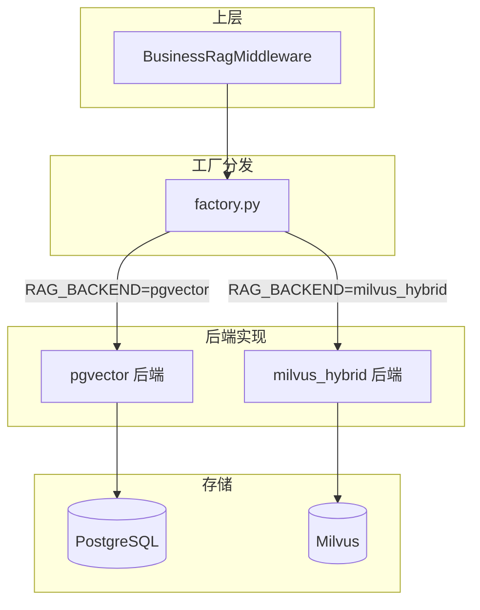
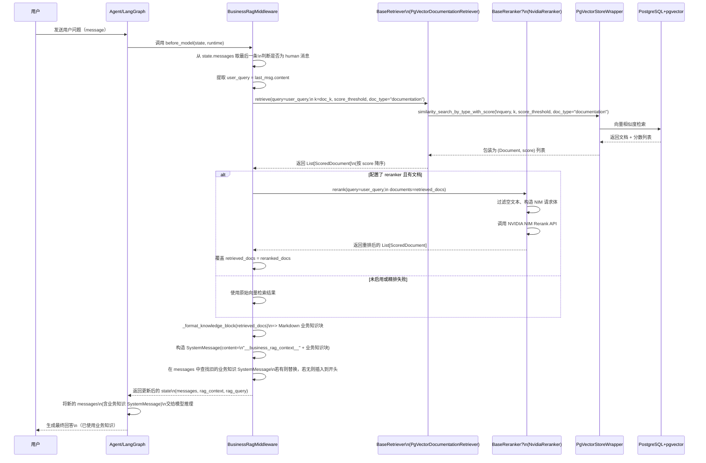
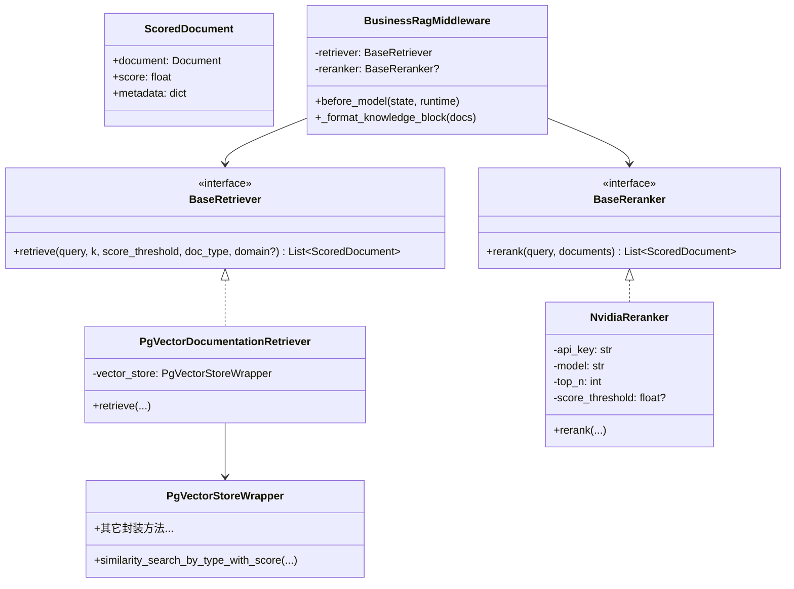

### 向量检索与精排模块概览（RAG 重构）

本目录封装了业务知识 RAG 管道中的「检索 + 精排」能力，对上暴露统一的抽象接口，对下屏蔽 pgvector / NVIDIA 等具体实现细节。

- **核心目标**：让上层（如 `BusinessRagMiddleware`、Agent 流程）只依赖抽象接口，不关心底层向量库和精排服务如何实现或部署。
- **当前实现**：支持两种后端，通过 `settings.rag_backend` 切换：
  - **pgvector**: PostgreSQL + `pgvector` 扩展（默认，纯向量检索）。
  - **milvus_hybrid**: LlamaIndex + Milvus（混合检索：稠密向量 + BM25 稀疏向量 + RRF 融合）。性能卓越，支持中文关键词精准匹配。
- **配置要点**：使用 NVIDIA NIM Embeddings 作为向量模型，支持可选 NVIDIA NIM Rerank 作为精排层（不论后端如何切换，精排始终可用）。

---

### 目录结构与职责

- **`base.py`**：抽象接口层  
  - 定义 `ScoredDocument`：带分数的 `Document` 包装类型。  
  - 定义 `BaseRetriever`：统一检索接口，负责「根据 query 召回文档列表」。  
  - 定义 `BaseReranker`：统一精排接口，负责「对候选文档重新打分排序」。  

- **`factory.py`**：工厂方法（对上游的唯一入口）  
  - 函数 `create_business_retriever_and_reranker()`：  
    - 根据 `settings.rag_backend` 选择后端。  
    - 分发至 `pgvector` 或 `milvus_hybrid` 初始化逻辑。  
    - 返回值：`(retriever: BaseRetriever, reranker: Optional[BaseReranker])`，供中间件等上层直接使用。  

- **`pgvector/`**：PgVector 后端具体实现。

- **`milvus_hybrid/`** (NEW)：Milvus 混合检索后端。
  - 基于 LlamaIndex + Milvus 实现。
  - 检索逻辑：`Dense Embedding` + `BM25 (jieba)` + `RRF Ranking`。

- **`rerank/`**：精排服务实现。

---

### RAG 配置项清单

可通过 `.env` 文件或环境变量配置：

| 变量名 | 默认值 | 说明 |
| :--- | :--- | :--- |
| `RAG_BACKEND` | `pgvector` | RAG 后端：`pgvector` 或 `milvus_hybrid` |
| `MILVUS_URI` | `http://localhost:19530` | Milvus 服务地址 |
| `MILVUS_COLLECTION_NAME` | `rag_store` | Milvus 集合名称 |
| `MILVUS_EMBED_DIM` | `1024` | 向量维度 (NVIDIA env-embedqa-e5-v5) |
| `MILVUS_RRF_K` | `60` | 混合检索 RRF 融合参数 |
| `RERANK_ENABLED` | `false` | 是否开启精排层 |

---

### 架构图（多后端支持）



  - `nvidia_reranker.py`  
    - 类 `NvidiaReranker(BaseReranker)`：  
      - 通过 NVIDIA NIM Rerank API（`https://ai.api.nvidia.com/v1/retrieval/nvidia/reranking`）对候选文档进行精排。  
      - 核心方法 `rerank(query, documents)`：  
        - 从 `Document` 提取文本，过滤空文本。  
        - 构造 NIM 请求体（query + passages）。  
        - 调用 API，按返回的 `logit` 分数降序排序。  
        - 支持：
          - `score_threshold` 分数阈值过滤。  
          - `top_n` 截断。  
        - 失败降级策略：  
          - 网络异常 / 超时 / 响应格式错误时，记录 warning/error，**回退为原始文档顺序，分数统一设为 0.0**。

---

### 从用户问题到检索结果的调用流程

下面以 `BusinessRagMiddleware` 为入口，串起来本次 RAG 重构后的完整调用链。

#### 1. 应用启动 / Agent 初始化阶段：构建检索器与精排器

1. 上层（例如应用启动代码、Agent 构建逻辑）调用：
   - `from backend.app.agent.vector.factory import create_business_retriever_and_reranker`
2. 执行 `create_business_retriever_and_reranker()`：  
   - 读取 `settings.rag_backend`，当前仅支持 `"pgvector"`，其它值会回退为 `"pgvector"` 并打印 warning。  
   - 调用 `create_business_vector_store(collection_name="rag_store", embedding_model="baai/bge-m3", pg_connection_string=settings.database_url)`：  
     - `_get_nvidia_api_key()` 获取 NVIDIA API Key。  
     - 初始化 `NVIDIAEmbeddings`。  
     - 根据 PG 连接串创建 `PgVectorStoreWrapper`。  
   - 基于向量库实例化 `PgVectorDocumentationRetriever(vector_store)`。  
   - 如果 `settings.rerank_enabled` 为 `True`，则尝试创建 `NvidiaReranker`：  
     - 使用 `settings.nvidia_api_key` / `settings.rerank_model` / `settings.rerank_top_n` / `settings.rerank_score_threshold` 进行配置。  
     - 创建失败时记录 warning，降级为「仅向量检索」。  
3. 工厂函数返回：  
   - `retriever: BaseRetriever`（当前为 `PgVectorDocumentationRetriever`）。  
   - `reranker: Optional[BaseReranker]`（当前为 `NvidiaReranker` 或 `None`）。

上层通常会将这两个对象注入到 `BusinessRagMiddleware` 中。

#### 2. 请求处理阶段：RAG 中间件如何使用检索 + 精排

`backend/app/agent/middleware/rag_middleware.py` 中定义了 `BusinessRagMiddleware`，它在 Agent 执行前阶段自动注入业务知识：

1. 初始化中间件：
   - `BusinessRagMiddleware(retriever=retriever, doc_k=5, score_threshold=..., reranker=reranker)`  
   - 其中 `retriever` / `reranker` 就是上一步由工厂创建的实例。

2. 当有新请求到来、Agent 即将调用模型前，会触发中间件的 `before_model(state, runtime)`：  
   - 从 `state["messages"]` 中取出最后一条消息 `last_msg`，仅在其为用户消息时才继续检索（通过 `_is_human_message` 判断）。  
   - 将 `last_msg.content` 作为 `user_query`。  
   - 调用统一检索接口：
     - `scored_results = retriever.retrieve(query=user_query, k=doc_k, score_threshold=score_threshold, doc_type="documentation")`  
   - 提取文档：
     - `retrieved_docs = [item.document for item in scored_results]`。  
   - 如果配置了精排服务且有候选文档：  
     - `reranked_results = reranker.rerank(user_query, retrieved_docs)`  
     - `retrieved_docs = [item.document for item in reranked_results]`  
     - 发生异常则记录 warning，并回退使用原始向量检索顺序。

3. 将检索/精排后的文档转换为系统提示词：  
   - 调用 `_format_knowledge_block(retrieved_docs)`：
     - 只处理 Documentation 类型文档。  
     - 使用 metadata 中的 `term` / `aliases` / `domain` 等字段，格式化为 Markdown，形成「业务术语说明」块。  
   - 构造带有内部标识符 `__business_rag_context__` 的 `SystemMessage`，内容示意：
     - `## 业务知识库`  
     - 「下面是与当前用户问题相关的业务资料，请在回答中充分利用这些信息：...」  
   - 如果之前已经有业务知识系统消息，则替换旧的；否则将新消息插入到 `messages` 开头。

4. `before_model` 返回更新后的 state：  
   - `"messages"`：加入了业务知识系统消息后的消息列表。  
   - `"rag_context"`：本次检索到的文档列表（方便后续链路复用）。  
   - `"rag_query"`：本次检索使用的用户问题文本。

最终效果：**Agent 在看到用户消息前，就已经能在 `messages` 中看到一条包含业务知识的系统消息，从而实现「检索增强生成」**。

---

### 学习与扩展建议

- **理解抽象接口**  
  - 建议先从 `base.py` 开始，看懂 `BaseRetriever` / `BaseReranker` 的入参和返回类型，这是整个 RAG 管道的「协议」。  
  - 之后再看 `PgVectorDocumentationRetriever` / `NvidiaReranker` 如何实现这些协议。

- **理解调用顺序**  
  - 按顺序阅读：
    1. `factory.py`（创建 retriever + reranker）  
    2. `pgvector/vector_store.py`（向量库如何被创建）  
    3. `pgvector/pgvector_retriever.py`（检索逻辑）  
    4. `rerank/nvidia_reranker.py`（精排逻辑）  
    5. `middleware/rag_middleware.py`（如何把 RAG 接入到 Agent 流程）  

- **未来扩展方向**  
  - 支持更多文档类型：`doc_type` 可扩展为 `ddl` / `sql_example` 等，并在向量库和中间件层打通。  
  - 支持多后端：在 `factory.py` 中新增 `"hybrid"` / `"milvus"` 等分支，实现多路检索策略。  
  - 优化提示词格式：根据实际模型效果，调整 `_format_knowledge_block` 的 Markdown 结构和内容密度。

---

### 图示概览（结构图 + 时序图 + 原理图）

#### 1. 模块结构关系图

```mermaid
flowchart LR
    subgraph 上层
        A[BusinessRagMiddleware\nrag_middleware.py]
        S[CustomState\n+ LangGraph/Agent]
    end

    subgraph 向量与精排抽象层
        B[BaseRetriever\nBaseReranker\nbase.py]
        F[工厂: create_business_retriever_and_reranker()\nfactory.py]
    end

    subgraph PgVector 后端
        V[PgVectorStoreWrapper\npgvector/pgvector_wrapper.py]
        VS[create_business_vector_store()\npgvector/vector_store.py]
        PR[PgVectorDocumentationRetriever\npgvector/pgvector_retriever.py]
    end

    subgraph 精排后端
        R[NvidiaReranker\nrerank/nvidia_reranker.py]
    end

    subgraph 底层依赖
        DB[(PostgreSQL\n+ pgvector)]
        E[NVIDIAEmbeddings\n(bge-m3)]
        NIM[NVIDIA NIM Rerank API]
        AU[ensure_windows_selector_loop()\nasync_utils.py]
    end

    S --> A

    A -->|依赖接口| B
    A -->|实例注入| F

    F -->|创建| VS
    VS -->|封装| V
    F -->|返回| PR
    F -->|可选返回| R

    PR -->|使用| V
    VS -->|使用| E
    VS -->|连接| DB
    VS -->|导入调用| AU

    R -->|调用| NIM
```

#### 2. 一次请求的时序图：从用户问题到注入业务知识



#### 3. 原理图：检索 + 精排的管道视图

```mermaid
flowchart TD
    Q[用户问题 Query] --> E1[Embedding\nNVIDIAEmbeddings\nbge-m3]
    E1 --> VQ[向量化后的 Query]

    VQ --> S1[向量相似度检索\nPgVectorStoreWrapper]
    S1 --> C1[候选文档 + 相似度分数\n(初筛结果)]

    C1 -->|可选| RP[NVIDIA Rerank\nNIM Rerank API]
    RP --> C2[重排后的文档 + 精排分数]

    C1 -->|未启用精排/失败降级| Fallback[C1 直接作为最终文档列表]

    C2 --> OutDocs[最终文档列表\n(ScoredDocument)]
    Fallback --> OutDocs

    OutDocs --> KB[格式化为业务知识块\n_format_knowledge_block]
    KB --> SM[SystemMessage\n(业务知识系统消息)]
    SM --> Model[LLM/Agent\n生成回答]

    style E1 fill:#e5f5ff,stroke:#3b82f6
    style S1 fill:#ecfdf5,stroke:#16a34a
    style RP fill:#fef3c7,stroke:#f59e0b
    style KB fill:#f3e8ff,stroke:#9333ea
    style SM fill:#fee2e2,stroke:#ef4444
```

#### 4. 类/接口关系图（简化版）



#### 5. 初始化阶段结构图：工厂如何组装组件

```mermaid
flowchart LR
    subgraph Config[配置 settings]
        SB[settings.rag_backend\n(默认 pgvector)]
        SE[settings.nvidia_api_key]
        SD[settings.database_url / DATABASE_URL]
        SR[settings.rerank_enabled\n+ 模型名/阈值/top_n]
    end

    F[create_business_retriever_and_reranker()\nfactory.py]

    SB --> F
    SE --> F
    SD --> F
    SR --> F

    F -->|调用| BV[create_business_vector_store()\npgvector/vector_store.py]
    BV -->|返回| V[PgVectorStoreWrapper]
    V --> PR[PgVectorDocumentationRetriever]

    F -->|构造可选| NR[NvidiaReranker]
    F -->|返回| OUT[(retriever, reranker?)]

    style V fill:#ecfdf5,stroke:#16a34a
    style PR fill:#ecfdf5,stroke:#16a34a
    style NR fill:#fef3c7,stroke:#f59e0b
```

