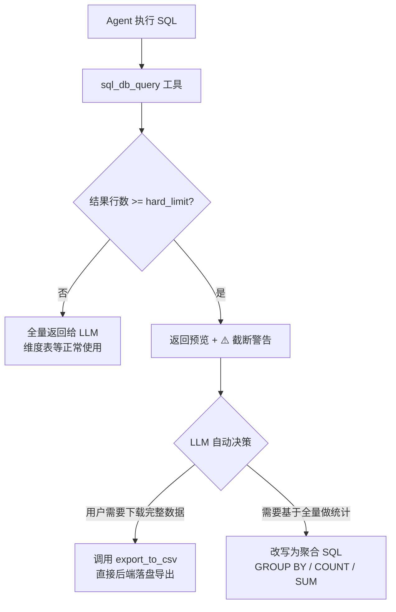

# SQL Agent 大结果集处理与弹性限流实战指南

## 1. 背景与核心痛点

在基于大模型（LLM）的 Database Agent 开发中，处理 SQL 查询返回的数据量是一个经典难题。我们通常会面临以下核心痛点：

### 1.1 大模型能力的边界
1. **Token 限制与成本爆炸**：如果将数万条原始记录（如业务流水表、日志表）直接返回给 LLM，会瞬间撑爆上下文窗口长度，导致大模型拒绝服务，或者产生高昂的 API 账单。
2. **“迷失在中间” (Lost in the Middle) 效应**：即便上下文窗口足够大，当大模型阅读过长的文本数据时，往往无法准确记忆和抓取关键信息，导致后续的归纳总结出现严重幻觉或数值错误。
3. **计算角色错位**：LLM 擅长基于文本进行“推理（Reasoning）”和“代码生成”，而不是作为一个聚合计算引擎去处理数组累加。让 LLM 去统计 10000 行返回数据中的总金额，不仅速度极慢，且结果极易出错；这种统计工作本应由数据库通过 `SUM()` 聚合函数完成。

### 1.2 固化 LIMIT 方案的局限性
为了防止上下文爆炸，常规做法是**强制给 SQL 附加 `LIMIT 1000`** 或者直接截断结果。但在企业级应用中，这种“一刀切”方案存在致命缺陷：
* 对于**维度表**（如“生产区域字典表”，总共就几十上百行），大模型需要获取**全量数据**进行理解和分类判断。如果强制截断，大模型看到的业务规则将“残缺不全”。

---

## 2. 解决方案：弹性限流与两层架构设计

为了兼顾“维度表全量读取”、“明细表防止爆炸”以及“用户导出海量数据”的需求，我们设计了一套**弹性限流与预警机制**。

该方案分为两个主要维度：**LLM 上下文保护** 与 **直接数据传输出路**。

### 2.1 基于行数估算的弹性截断机制

我们在 `sql_db_query` 工具的内部加入了一套基于行数的动态干预逻辑：
1. **配置分离**：系统内维护两套阈值。
    - `SQL_AGENT_TOP_K` (软限制，如 2000)：通过 System Prompt 建议 LLM 自己在写 SQL 时附加的极限阀值。
    - `SQL_RESULT_HARD_LIMIT` (硬限制，如 1000)：程序级别的强制熔断红线。
    - `SQL_RESULT_PREVIEW_ROWS` (预览行数，如 5)：超限熔断时，给大模型展示的表头/预览数据。
2. **执行后估算**：SQL 查出结果后，在工具方法内实现一个快速估算行数的方法（如通过正则判定 Python 元组 `[('...'), (...)]` 的数量）。
3. **动态分发**：
    - **如果结果行数 < `hard_limit`**：说明是小结果集（如维度表、或已经正确使用 Group By 的聚合结果），**全量返回** 给 LLM，大模型正常推理。
    - **如果结果行数 >= `hard_limit`**：触发防御，**强制截断数据**。但**并不直接抛出错误**，而是向大模型返回一段结构化的 **预警信息 (System Warning)** 和 **前 5 行预览数据**。

### 2.2 System Warning 的巧妙注入
大模型的思考是依附于工具返回结果的。当发生截断时，如果不给明确引导，大模型会自动拿仅存的 1000 条数据去做所谓的总结报表（这是极其错误的）。

因此，返回给大模型的截断信息长这样：
```text
⚠️ SYSTEM WARNING: 查询结果已达到系统硬限制 (1000 行) 并被强制截断。
以下仅展示前 5 行数据预览，基于此数据进行的汇总分析可能不完整或不准确。

建议操作：
1. 如果用户需要完整原始数据，请建议使用 export_to_csv 工具导出为 CSV 文件下载。
2. 如果需要统计分析，请改写 SQL 使用 GROUP BY / COUNT / SUM 等聚合函数，让数据库完成计算。

数据预览 (前 5 行):
[(...)]
```
这段“提示词注入”会中断 LLM 的直接回答欲，引导它通过其他手段（改写聚合并重新查询，或调用其它工具）来解决此时的问题。

### 2.3 专用的数据导出工具 (`csv_export_tool.py`)
为了满足用户可能说“我就要把这三个月每天所有的设备报警明细拿下来自己用 Excel 看”的需求。
由于 LLM 上下文无法承受，我们单写一个脱窗的 Action Tool 给 Agent 使用。

- **`export_to_csv(query: str, required_skill: str)` 工具**：当大模型评估后认为应当把原始数据导给用户时，它会写好查询语句并调用这个工具。
- 这个工具在后台使用 SQLAlchemy 驱动数据库直接拉取数据，使用标准的 `csv` 模块直接落盘写成文件存储。在工具的 `return` 中，**仅仅向大模型返回文件存储路径，而没有把原始表结构放回给 LLM。**
- 这种设计做到了数据流层面彻彻底底的 **大模型上下文隔离机制**。

### 总结：核心架构逻辑图

通过以下流程图，可以直观理解 Agent 在面对不同规模结果集时的决策路径：



---

## 3. 开发落地指南

### 第一步：拆分并定义环境变量配置
在 `.env` / `config.py` 中独立定义你的限制参数。避免将 LLM 的 prompt limit 规则和底层代码硬熔断混为一谈。

```python
# backend/app/config.py 示例
sql_agent_top_k: int = 2000          # 提示词层建议阈值
sql_result_hard_limit: int = 1000    # 代码底层拦截阈值
sql_result_preview_rows: int = 5     # 拦截后回吐预览量
```

### 第二步：包装基础 SQL 执行工具
你的 `sql_db_query` 永远不能像黑盒一样仅仅给模型吐回 `str(cursor.fetchall())`。

```python
# 核心限流伪代码示例
estimated_rows = _estimate_row_count(raw_result_str)

if estimated_rows >= hard_limit:
    preview_data = _extract_preview_rows(raw_result_str, preview_rows)
    return (
        f"⚠️ SYSTEM WARNING: 强制截断 (限制 {hard_limit} 行)。\n"
        f"不能用于统计汇总。建议改写聚合 SQL 或建议用户导出 CSV。\n"
        f"数据预览 (前 {preview_rows} 行):\n{preview_data}"
    )
return raw_result_str
```
*(注意：估算行数的算法需要低消耗，对返回的长文本使用 `count("), (")` 是实战中性价比极高的方案)。*

### 第三步：设计并挂载隔离存储工具 (CSV Export)
实现专用的落地工具并提供给模型。一定要注意共享安全规则（与基础查询一致的防注入正则匹配及业务领域权限控制参数）。

### 第四步：调整 System Prompt 规则
修改用于驱动系统的大模型 System Prompt。
尽管工具返回会包含引导词，但从顶部 Prompt 确立基调依然重要：

> 规则：
> - 当需要进行统计分析（如计数、求和、趋势分析）时，必须使用 GROUP BY / COUNT / SUM 等聚合函数让数据库完成计算，严禁拉取大量原始明细数据后自行汇总。
> - 当查询结果被系统截断时（出现 SYSTEM WARNING），不要基于截断后的数据进行汇总分析。应主动告知用户数据不完整。

---

## 4. 总结与体会

在基于 RAG/Agentic 架构解决企业内网数据提取任务时，模型与数据（Database）的互动边界是必须关注的重点。

- **不能将大模型视为 Data Warehouse（数据仓库分析组件）。** 让 LLM 纯依靠上下文窗口处理算术问题是反模式的。大模型的作用只有两个：意图理解 -> SQL Code Generation。应当“指引计算”而不是“亲身涉事汇总计算”。
- **弹性预警代替暴力报错**。给予前置几行的 Sample（预览数据），既能在超限被截断后避免业务中断，又同时让模型能够看到这几条数据，进而完成对表结构数据的自我认知，方便它下一回合修正自己的 SQL（如“哦原来这个日期长这样，我 next steps 需要去 `group by date_trunc()`”）。
- **工具隔离（Tooling Context Isolation）**。将耗费上下文的大动作封装出外部工具，使用文件、URL 等作为大模型世界的替身（ID / Pointer），是解决 Agent Token 问题的重要思想。不仅是 SQL 大表，如果是批量下载日志、多PDF文本合并均可复用这个思路。
