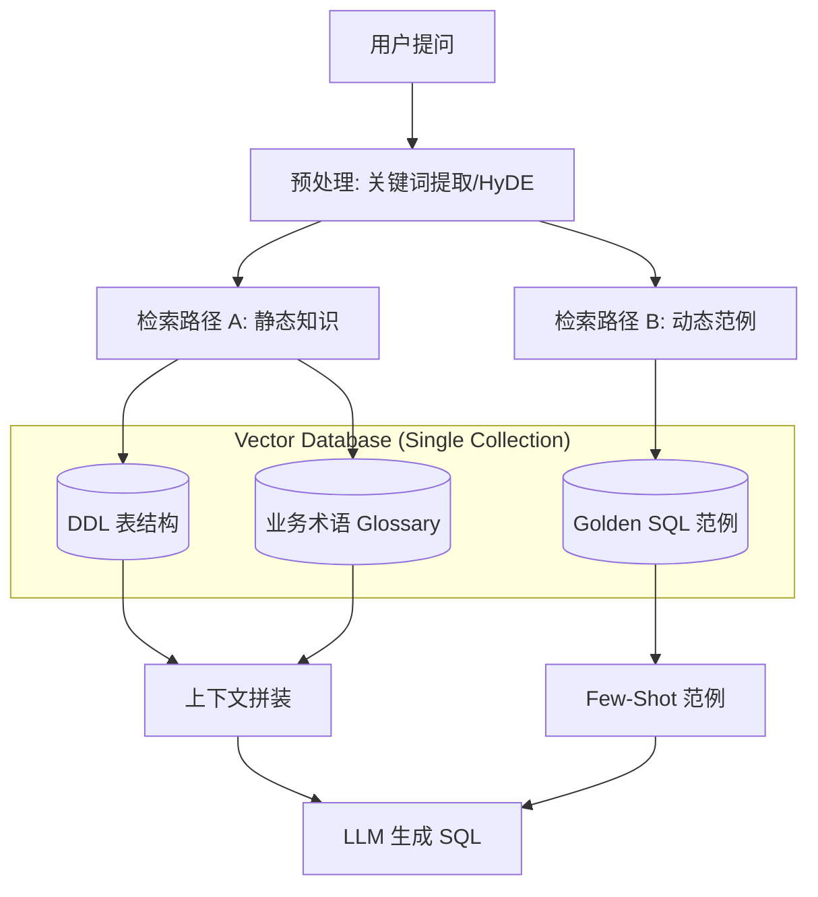

# Text-to-SQL RAG 最佳实践开发指南 (Best Practices Guide)

基于对 Vanna 2.0 架构的深度拆解及对其"语义鸿沟"问题的优化思考，以下是构建企业级 Text-to-SQL 系统的推荐方案。

---

## 1. 核心架构设计 (Architecture)

推荐采用 **"双路检索 + 混合增强 (Dual-Path Retrieval)"** 架构。



---

## 2. 数据库结构方案 (Database Schema)

推荐使用 **"单一集合 + 强元数据 (Single Collection + Rich Metadata)"** 方案。

### 2.1 物理结构
所有数据存入同一个 Collection，便于统一运维和 ID 管理。

| 字段 | 类型 | 说明 |
| :--- | :--- | :--- |
| **id** | string | UUID |
| **document** | string | **核心差异点**：不要只存代码，要存"业务描述+代码"的混合文本，用于 Embed。 |
| **metadata** | json | 用于过滤的结构化标签。 |

### 2.2 数据类型定义 (The 3 Pillars)

#### A. 表结构 (DDL)
> **关键优化**: 这里的 `document` 字段必须包含中文描述，解决"搜不到"的问题。

```json
{
  "id": "ddl_orders",
  "document": "表名: 订单表 (orders)\n业务含义: 记录所有电商交易流水及金额。\n关键字段: region_id (区域), amount (销售额), dt (订单日期)...",
  "metadata": {
    "type": "ddl",
    "table_name": "orders",
    "domain": "sales"
  }
}
```

#### B. 业务术语 (Documentation)
用于对齐人与数据库的认知偏差。

```json
{
  "id": "doc_profit",
  "document": "术语: 毛利 (Gross Profit)\n定义: 销售额(amount) 减去 成本(cost)。\n同义词: 赚钱, 收益, 利润",
  "metadata": {
    "type": "documentation",
    "domain": "finance"
  }
}
```

#### C. 标准范例 (Golden SQL)
用于教会 LLM 特殊的语法或复杂的逻辑。

```json
{
  "id": "sql_complex_join",
  "document": "问题: 计算每个大区的季度毛利环比增长率。\n(复杂的多表 Join 和窗口函数示例)",
  "metadata": {
    "type": "sql_example",
    "sql": "SELECT ...",
    "complexity": "high"
  }
}
```

---

## 3. 检索策略 (Retrieval Strategy)

不要直接拿用户原话去搜，分三步走：

### 第一步：查询改写 (Query Rewrite)
*   **提取关键词**: 把 "北京上个月卖得咋样" 转化为 `Target: Sales, Region: Beijing, Time: Last Month`。
*   **同义词扩展**: 将 `Sales` 扩展为 `Revenue, Amount`。

### 第二步：分层检索 (Layered Retrieval)
1.  **搜 DDL**: 使用 `type='ddl'` 过滤。
    *   *技巧*: 调高 `top_k` (如 10-15)，因为 DDL 通常很短，多带给 LLM 没坏处。
2.  **搜文档**: 使用 `type='documentation'` 过滤。
    *   *技巧*: 只有相似度 > 0.8 的才召回，避免引入噪音。
3.  **搜 SQL**: 使用 `type='sql_example'` 过滤。
    *   *技巧*: 只需要 `top_k=3`，作为 Few-Shot 参考即可。

### 第三步：组装 Prompt (Prompt Engineering)

```markdown
# Role
你是一个精通 SQL 的数据分析专家。

# Context (From DDL & Docs)
以下是数据库结构：
- orders (订单表): ...
- ...

以下是业务定义：
- 毛利 = amount - cost

# Reference (From Golden SQL)
参考以前类似的查询写法：
Q: 计算上月毛利
SQL: SELECT sum(amount - cost) FROM ...

# Task
请回答用户问题：北京上个月卖得咋样？
```

---

## 4. 关键避坑指南 (Common Pitfalls)

1.  **不要只 Embed DDL 代码**:
    *   ❌ `CREATE TABLE t1 (c1 int)` -> 向量只有 "table", "t1", "int" 的特征。
    *   ✅ `表 t1 是销售表，c1 是金额` -> 向量拥有了 "销售", "金额" 的语义。
2.  **不要让 SQL 示例污染 DDL**:
    *   一定要通过 metadata (`type='ddl'` vs `type='sql'`) 进行物理或逻辑隔离，否则搜表结构时搜出一堆 SQL 语句会干扰 LLM。
3.  **冷启动问题**:
    *   项目初期没有 Golden SQL 怎么办？人工手写 10-20 条覆盖核心场景的 Golden SQL 存入库中。这一步性价比极高。
