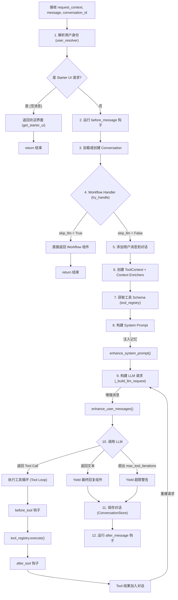
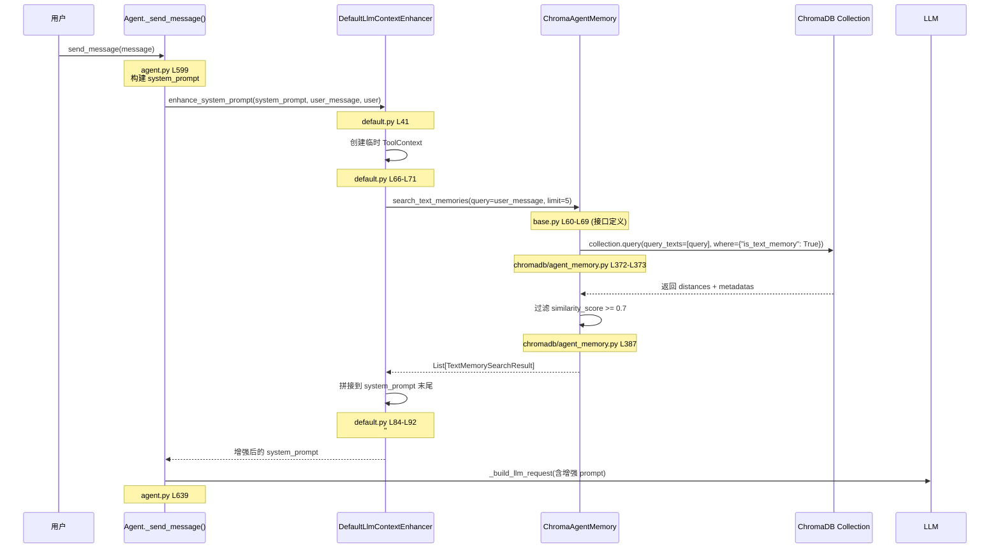
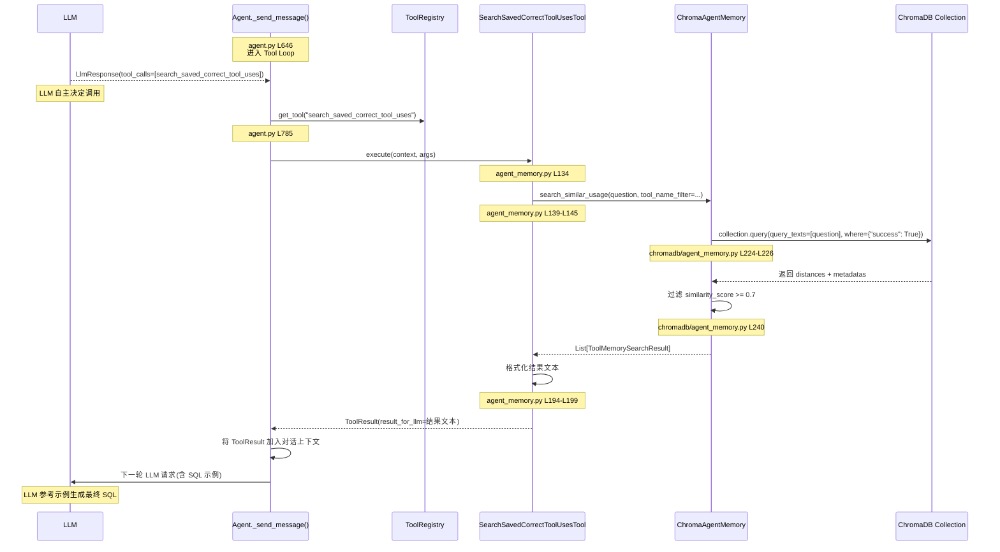

# Agent 核心机制深度解析

本文档汇总了 Agent 的主控流程、Vanna 2.0 的双路检索机制（RAG），以及消息增强扩展点的深度源码解析。

---

## 1. Agent 核心大脑：_send_message 完整流程

`_send_message` 是 Agent 的主控流程，负责从接收用户消息到最终流式输出 UI 组件的全过程。它像一条智能流水线，协调了用户解析、生命周期钩子、工作流处理、LLM 调用及工具执行。

### 1.1 核心流程图 (Mermaid)

### 1.2 关键阶段详解

1.  **准备阶段 (Phase 1-4)**
    -   **用户解析**：从 RequestContext 中提取用户信息。
    -   **Starter UI**：若是首次空消息，直接返回欢迎界面，**短路退出**。
    -   **Workflow Handler**：尝试让 Workflow 处理消息（如按钮点击），若成功则 **短路退出**，不调用 LLM。

2.  **构建阶段 (Phase 5-9)**
    -   **上下文组装**：创建 `ToolContext`，运行 `ContextEnricher` 注入额外数据。
    -   **Prompt 构建**：
        -   `enhance_system_prompt`：注入历史记忆（只做一次）。
        -   `enhance_user_messages`：处理用户消息（每次 LLM 调用前都做）。

3.  **执行循环 (Phase 10 - Tool Loop)**
    -   这是一个 `while` 循环，受 `max_tool_iterations` 限制。
    -   **LLM 决策**：LLM 决定是回复文本还是调用工具。
    -   **工具执行**：若调用工具，执行 `before_tool` -> `execute` -> `after_tool`，结果回填对话历史，**重新触发 LLM**。

4.  **收尾阶段 (Phase 11-12)**
    -   LLM 输出最终文本后，保存对话记录，触发 `after_message` 钩子，完成响应。

---

## 2. Vanna 2.0 双路检索机制详解 (RAG)

Vanna 2.0 采用了 **"主动注入"** 和 **"被动调用"** 双路并行的检索机制，以解决 DDL/文档与 SQL 示例的不同需求。

### 2.1 全局检索视图

```mermaid
flowchart TB
    subgraph 用户输入
        Q["用户提问"]
    end

    subgraph path1["路径 1: Enhancer 预注入 (自动)"]
        direction TB
        E1["Agent._send_message()"] --> E2["enhance_system_prompt()"]
        E2 --> E3["search_text_memories()"]
        E3 --> E4["ChromaDB query<br/>where: is_text_memory=True"]
        E4 --> E5["拼接到 System Prompt"]
    end

    subgraph llm["LLM 推理"]
        L1["LLM 收到增强后的 Prompt"]
        L1 --> L2{"需要参考<br/>SQL 示例？"}
    end

    subgraph path2["路径 2: Tool 调用 (LLM 自主)"]
        direction TB
        T1["Tool Call: search_saved_correct_tool_uses"]
        T1 --> T2["search_similar_usage()"]
        T2 --> T3["ChromaDB query<br/>where: success=True"]
        T3 --> T4["ToolResult 返回给 LLM"]
    end

    subgraph output["最终输出"]
        O1["LLM 生成 SQL"]
    end

    Q --> E1
    E5 --> L1
    L2 -- 是 --> T1
    L2 -- 否 --> O1
    T4 --> O1

    style path1 fill:#1a3a2a,stroke:#4ade80
    style path2 fill:#1a2a3a,stroke:#60a5fa
    style llm fill:#2a2a1a,stroke:#facc15
```

> **机制对比**:
> *   **路径 1 (Enhancer)**: 针对 DDL 和业务文档，由系统并在 LLM 介入前自动完成。
> *   **路径 2 (Tool)**: 针对 SQL 示例，由 LLM 在推理过程中自主决定是否调用。

### 2.2 路径一：Enhancer 预注入 (DDL/文档)

此路径由 `DefaultLlmContextEnhancer` 类实现。它是一个"记忆注入器"，在 LLM 被调用之前，连接 **Agent 记忆库 (AgentMemory)** 与 **System Prompt**。

- **类比理解**：就像客服人员在接听电话前，助手快速调阅客户档案并把通过便利贴（System Prompt）递给客服（LLM），使其能更有针对性地回答问题。

#### 工作流程时序图

> LLM 收到任务**之前**，系统自动完成检索并注入 System Prompt。

#### 核心解析

1. **接收输入**：获取原始 `system_prompt` 和用户当前消息 `user_message`。
2. **检查记忆库**：若 `agent_memory` 未配置，直接返回原始 Prompt。
3. **搜索记忆**：
    - 创建临时 `ToolContext`。
    - 调用 `agent_memory.search_text_memories(query=user_message, limit=5)`。
4. **注入内容**：
    - 若搜到相关记忆，格式化为 `## Relevant Context from Memory` 段落。
    - 追加到原始 `system_prompt` 末尾。
5. **异常处理**：全流程被 `try/except` 包裹，搜索失败仅记录日志，不阻断主流程（优雅降级）。
6. **代码位置**: 
    - 定义：`src/vanna/core/enhancer/default.py`
    - 调用：`src/vanna/core/agent/agent.py` (_send_message 方法中)

### 2.3 路径二：Tool 自主调用 (SQL 示例)

SQL 示例被注册为一个标准工具 (`search_saved_correct_tool_uses`)，LLM 根据需要自主检索。

#### 工作流程时序图

> LLM 在推理过程中**自己决定**是否调用 `search_saved_correct_tool_uses` 工具。

### 2.4 关键函数索引

| 顺序 | 函数 | 文件 | 行号 | 说明 |
|:---:|:---|:---|:---:|:---|
| ① | `Agent._send_message()` Tool Loop | [agent.py](file:///d:/Python/workplace/NL2SQL/vanna-main/src/vanna/core/agent/agent.py#L646) | 646 | while 循环处理 Tool 调用 |
| ② | `ToolRegistry.get_tool()` | [agent.py](file:///d:/Python/workplace/NL2SQL/vanna-main/src/vanna/core/agent/agent.py#L785) | 785 | 查找注册的 Tool 实例 |
| ③ | `SearchSavedCorrectToolUsesTool.execute()` | [agent_memory.py](file:///d:/Python/workplace/NL2SQL/vanna-main/src/vanna/tools/agent_memory.py#L134) | 134 | **核心**：执行 SQL 示例搜索 |
| ④ | `AgentMemory.search_similar_usage()` | [base.py](file:///d:/Python/workplace/NL2SQL/vanna-main/src/vanna/capabilities/agent_memory/base.py#L47) | 47 | 抽象接口 |
| ⑤ | `ChromaAgentMemory.search_similar_usage()` | [agent_memory.py](file:///d:/Python/workplace/NL2SQL/vanna-main/src/vanna/integrations/chromadb/agent_memory.py#L202) | 202 | ChromaDB 向量搜索实现 |

---

## 3. 消息增强扩展点：enhance_user_messages

### 3.1 作用与现状
- **作用**：这是一个扩展点，允许开发者在发送给 LLM 之前修改或增强用户的消息列表（`List[LlmMessage]`）。
- **现状**：在默认实现 `DefaultLlmContextEnhancer` 中，该方法是一个 **空操作 (No-op)**，直接返回原消息列表，不做任何修改。

### 3.2 调用时机与注意事项
- **调用位置**：`_build_llm_request` 方法中。
- **调用频率**：**极高**。每次构建 LLM 请求时都会调用，包括在 **Tool Loop（工具循环）** 的每一次迭代中。
- **扩展警示**：如果开发者重写此方法，必须小心 **避免重复注入**。因为在一个多轮工具调用的任务中，该方法会被反复执行，若盲目追加内容会导致 Prompt 爆炸。

---

*文档整合时间：2026-02-10*
