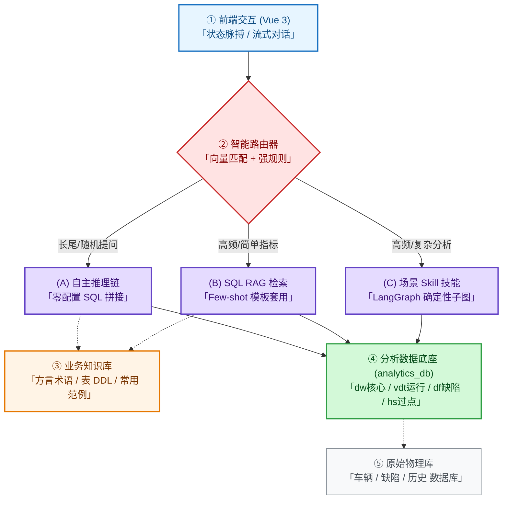

# 120JPH 涂装车间 AI 助手架构方案（极简版）

为解决大模型在车间落地的**速度、精度、准确性、一致性、领域壁垒**五大痛点，采用“分流治理、降维数据”的极简架构。

---

## 一、 核心架构拓扑

---

## 二、 四大核心模块

### 1. 智能路由（意图分流）
*   **机制**：提问输入后，先通过**向量检索 + 强规则**进行分类。
*   **原则**：高频走模板（B/C 链），长尾走自主（A 链），确保速度与准确性。

### 2. 三轨执行引擎
*   **自主推理 (A 链)**：大模型结合表 DDL 自主生成 SQL，具备 **SQL 安全审计拦截**。
*   **Few-shot 检索 (B 链)**：匹配并修改库中现成 SQL 范例，**100% 准确**，首字响应极快。
*   **场景 Skill (C 链)**：将“相邻车缺陷分析”、“滞留车分析”等复杂业务固化为 **LangGraph 独立子图**，保障输出格式与计算口径完全一致。

### 3. RAG 业务知识库（业务大脑）
*   **内容**：车间术语字典（方言换算）、数据库 DDL 资产（字段注释）、SQL 范例模板。
*   **作用**：抹平工业领域壁垒，防止大模型编造字段或误解指标。

### 4. 统一分析底座（多源数据连接、清洗与重构）
*   **机制**：对实时车辆、缺陷检测、过点历史等多源数据库进行连接、清洗与重构，合并为专为 LLM 优化的 `analytics_db`。
*   **价值**：LLM 仅需理解 4-5 张核心大宽表（`dw` / `vdt` / `df` / `hs`），免除复杂的多表 Join 逻辑，从根本上解决逻辑错误。
