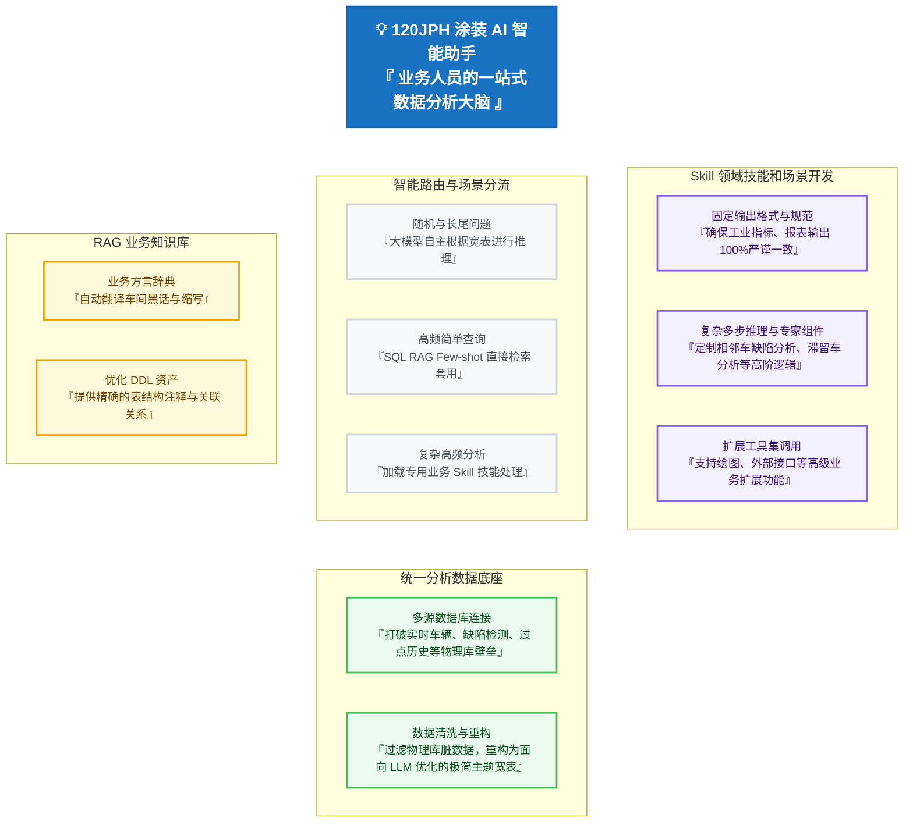

# 120JPH 涂装车间 AI 智能助手（汇报版）

本方案专为**非技术管理层与业务人员**设计，采用“卡片式概念图”阐述设计思路，不体现复杂的数据库连接与技术细节，重点体现**业务场景的分类治理、核心支撑以及业务价值**。

---

## 一、 整体设计概念图 (Bento Cards)

---

## 二、 业务场景治理亮点

对非技术决策者而言，本方案的核心成效在于**“分流治理，各尽所能”**：

| 业务场景 | 我们的处理逻辑 | 业务汇报价值亮点 |
| :--- | :--- | :--- |
| **随机与长尾提问** | **大模型自主根据宽表进行推理** | 💡 **无死角的灵活性**：对于临时性、非固化的提问，直接利用大模型的强大泛化能力，基于预先净化的主题宽表进行自主推理，给业务人员留有充分的自由度。 |
| **高频简单查询** | **SQL RAG Few-shot 直接检索套用** | ⚡ **极速与零偏差**：将高频简单的指标查询通过相似度检索，直接套用预设的 SQL 范例，避开复杂推理过程，**响应极快且逻辑绝对正确**。 |
| **复杂高频分析** | **Skill 领域技能和场景开发** | 🎯 **专家级精准度**：针对极具深度的业务指标（如相邻车缺陷分析、滞留车分析），通过开发固定的 Skill 技能，锁死计算口径与图表格式，保证**输出质量绝对稳定可靠**。 |
