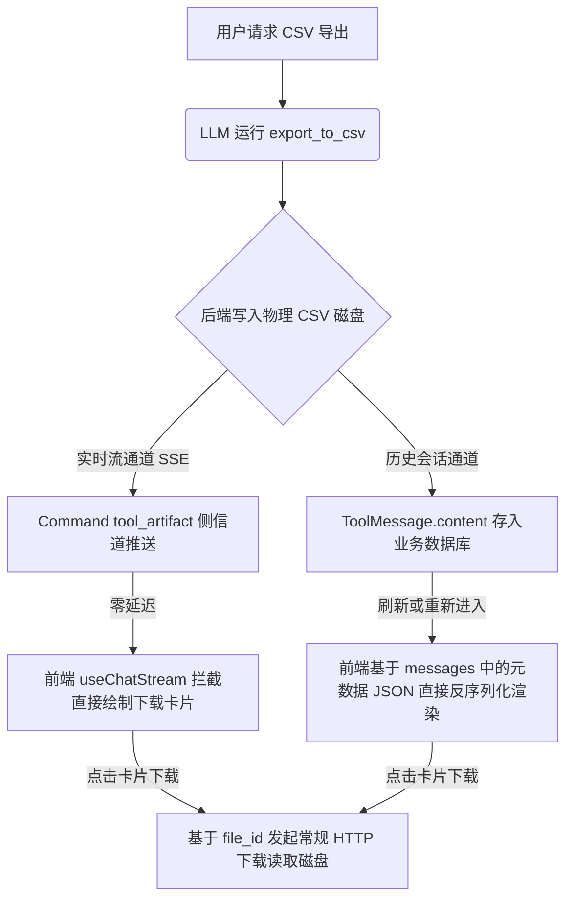

# 06_export_to_csv_side_channel_refactor.md - CSV 导出工具侧信道直推交付与契约对齐实施方案

> **日期**：2026-07-20  
> **状态**：待实施  
> **前置依赖**：`04_single_tool_query_result_decoupling.md`（SQL 预览直推已落地）与 `05_build_chart_artifact_side_channel_refactor.md`（图表直推已落地）  
> **目标**：将 `export_to_csv` 导出工具由目前的老旧打字机返回大 JSON 机制，重构为 `Command + tool_artifact` 侧信道直推模式。让下载卡片零延迟即时呈现在前端，同时让 LLM 视图极净化以杜绝冗余 JSON 散文，并保持历史消息的磁盘寻址懒下载前向兼容。

---

## 一、 现状与痛点分析 (Current Gaps)

### 1.1 大模型被迫阅读与打印大 JSON 串，导致打字机延迟
在目前的 [csv_export_tool.py](file:///f:/000_dev/Python/workplace/rearch_agent/.tree/features/agent-llamaindex-rag/backend/app/agent/tools/csv_export_tool.py#L125-L126) 中，工具在生成完 CSV 磁盘文件后，直接将整个元数据 record 进行 `json.dumps` 并以 `string` 格式返回给大模型：
```python
record["message"] = "CSV 导出成功，前端可使用 file_id 调用下载接口获取文件。"
return json.dumps(record, ensure_ascii=False)
```
大模型读取到此返回后，极易发生以下问题：
- 在回复正文中大篇幅“复述”或复刻该 JSON 代码，导致前端聊天框出现难看的代码堆叠。
- 必须等大模型把整句话（或被二次包装的回复）打字吐完后，前端才能在对应的 messages 记录中提取出 parsed JSON 渲染下载卡片，严重破坏了实时性的用户体验。

### 1.2 口径验证一致性与 OOM 安全风险
* **未对齐只读语法验证**：当前的 `export_to_csv` 虽然调用了 `validate_readonly_query`，但是依然有自建 `engine.connect()` 查询逻辑，存在代码逻辑碎片化。
* **潜在 OOM 崩溃**：对大型查询无限制进行 `result.fetchall()`，在导出超大结果集（比如几十万甚至上百万行）时，若没有硬上限保护机制（OOM limit guard），极其容易将宿主机/容器的物理内存击垮。

---

## 二、 推荐方案与架构设计 (Proposed Architecture)

本方案采用与 **04（SQL 预览）** 和 **05（ECharts 图表）** 完全对齐的**“双轨制”**传输架构：



### 2.1 大模型视图与侧信道视图分层 (View Layering)

我们将工具契约分为面向大模型的 **LLM 紧凑视图** 以及面向前端的 **侧信道工件视图** :

| 通道载体 | 字段与内容 | 接收方与用途 |
|---|---|---|
| **LLM 视图** (`ToolMessage.content`) | `"CSV 文件导出成功。文件名: export_20260720_1520.csv, 包含 52,300 行数据, 文件 ID: file_xxx"` | **大模型**：仅用作执行状态确认，字数极少，防幻觉，省 Token |
| **侧信道视图** (`tool_artifact` SSE) | `kind: "file_export"`, 携带完整元数据：`file_id`, `filename`, `row_count`, `col_count`, `columns`, `size_bytes`, `expires_at` | **前端**：实时拦截直接解包渲染下载按钮，**无需等待打字机** |

### 2.2 历史会话的前向兼容回退 (Fallback Mechanism)
在历史回溯中，完全延续与图表（05）同构的设计：
* **数据落库不变**：`ToolMessage(content=json.dumps(record))` 作为内容物理持久化存入数据库 `chat_messages` 表中的 `tool_results` 字段。
* **懒加载兼容**：前端在渲染历史消息时，从 `tool_results` 解析出 `ExportArtifact` 的元数据后即可直接绘制出绿色卡片，当用户手动点击“下载 CSV”按钮时，依旧基于 `file_id` 去后端流式读取磁盘文件。

---

## 三、 详细实现步骤 (Implementation Steps)

### Task 1: 后端工具重构

1. **修改文件**：`backend/app/agent/tools/csv_export_tool.py`
2. **导入依赖**：
   ```python
   from langgraph.types import Command
   from langchain_core.messages import ToolMessage
   ```
3. **添加 OOM limit guard 机制**：
   在 `.env` 中声明 `SQL_EXPORT_MAX_ROWS=100000` (如果未定义则默认 100k)。如果执行结果长度超过该上限，抛出 `ToolException` 提前中断执行，防止内存溢出崩溃。
4. **改写返回值**：
   在保留 CSV 写盘 `create_export_record` 行为后，将尾部直接返回 string 改为返回 `Command` 对象：
   ```python
            record = create_export_record(...)
            
            # 元数据 record 的深拷贝用于 messages 持久化
            llm_content = f"CSV 文件导出成功。文件名: {filename}, 包含 {row_count} 行数据, 文件 ID: {record['file_id']}"
            
            return Command(update={
                "messages": [
                    ToolMessage(
                        content=json.dumps(record, ensure_ascii=False), # 保留 JSON 指针供历史回溯读取
                        tool_call_id=str(runtime.tool_call_id) if runtime and hasattr(runtime, "tool_call_id") else "call_unknown",
                    )
                ],
                "tool_artifact": {
                    "kind": "file_export",
                    "file_id": record["file_id"],
                    "filename": filename,
                    "row_count": row_count,
                    "col_count": col_count,
                    "columns": columns,
                    "size_bytes": record.get("size_bytes", 0),
                    "expires_at": record.get("expires_at", "")
                }
            })
   ```

### Task 2: 前端气泡展示区 (`MessageItem.vue`) 改造

1. **增加 `fileExport` 计算属性**：
   在 `MessageItem.vue` 脚本中增加流式侧信道拦截判断：
   ```typescript
   // 判断实时侧信道推送的 tool_artifact 是否为 file_export
   const fileExport = computed(() => {
     const artifact = queryResult.value
     if (artifact && artifact.kind === 'file_export') {
       return artifact
     }
     return null
   })
   ```
2. **在气泡内追加流式直推节点**：
   定位到模板气泡的工件渲染区域，在历史循环 `exportArtifacts` 之前加入直推渲染卡片：
   ```html
         <!-- 新机制：侧信道直达的 CSV 导出，无需等待打字机 (流式优先) -->
         <div v-if="fileExport" class="space-y-3 px-4 pb-3">
           <div class="rounded-[22px] border border-emerald-200 bg-gradient-to-br from-emerald-50 via-white to-emerald-50/50 px-4 py-3 shadow-sm">
             <div class="flex items-start justify-between gap-4">
               <div class="min-w-0">
                 <div class="text-sm font-semibold text-emerald-800">CSV 文件已生成</div>
                 <div class="mt-1 break-all text-sm text-emerald-700">{{ fileExport.filename }}</div>
                 <div class="mt-2 text-xs leading-5 text-emerald-700/90">
                   <span>{{ fileExport.row_count }} 行 × {{ fileExport.col_count }} 列</span>
                   <span v-if="fileExport.size_bytes"> · {{ formatFileSize(fileExport.size_bytes) }}</span>
                 </div>
                 <div v-if="fileExport.columns && fileExport.columns.length > 0" class="mt-1 text-xs leading-5 text-emerald-700/90">
                   列名：{{ fileExport.columns.join('、') }}
                 </div>
                 <div v-if="fileExport.expires_at" class="mt-1 text-xs leading-5 text-emerald-700/80">
                   有效期至：{{ formatDateTime(fileExport.expires_at) }}
                 </div>
               </div>
               <button
                 type="button"
                 class="shrink-0 rounded-2xl bg-emerald-600 px-3 py-2 text-sm font-medium text-white transition hover:bg-emerald-700"
                 @click="handleExportDownload(fileExport.file_id)"
               >
                 下载 CSV
               </button>
             </div>
           </div>
         </div>
         
         <!-- 旧机制：历史消息兼容 (保留) -->
         <div v-else-if="!isUser && exportArtifacts.length > 0" class="space-y-3 px-4 pb-3">
            ...
         </div>
   ```

---

## 四、 验证方案 (Verification Plan)

### 4.1 自动化测试
* 建立 TDD 单元测试，拦截 `export_to_csv.invoke` 后的返回结果，确保其输出结构为 `Command`，`tool_artifact` 存在 `kind: "file_export"`，且元数据字段完整。
* 编写测试断言对于超限查询，工具可返回带安全拦截提示的 `ToolException`。

### 4.2 手动功能测试
- [ ] **直推秒出**：新导出一个 CSV 文件，拦截 SSE 的 `tool_artifact` 事件，验证下载卡片在文本生成前瞬时出现，且控制台无报错。
- [ ] **下载检验**：点击卡片按钮，校验 HTTP 请求带上 `file_id` 后能顺利激活浏览器下载，拿到全量数据的 CSV 物理文件。
- [ ] **历史追溯**：刷新页面或切会话，历史消息里的下载按钮依旧正常显示且下载功能完备。
