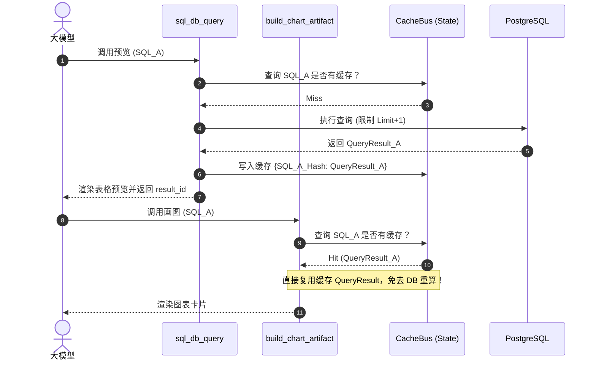

# P3 阶段后续优化方案：QueryResult 缓存、元数据通道与词典侧信道化 (Future Roadmap)

> **修订日期**：2026-07-20  
> **方案状态**：设计规约中 (DRAFT)  
> **文档位置**：`docs/StructuredOutput/refactor/08_future_refactoring_and_optimization_roadmap.md`  
> **核心目标**：在 P0/P1/加固阶段成果（侧信道 Command 落地、Linter 拉平、死代码物理删除、工具链加固）的基础之上，推进 P2 级“同一 SQL 重跑 3 次”痛点攻关，打通“元数据结构化侧信道”，并对物理词典及提问工具进行最后的契约收拢。

---

## 一、 核心攻关一：消灭同一 SQL 重跑 3 次 (P2 - QueryResult 与缓存总线)

### 1.1 痛点描述
在一次会话循环中，大模型经常经历 **“数据预览 (sql_db_query) -> ECharts 画图 (build_chart_artifact) -> 全量 CSV 导出 (export_to_csv)”** 三部曲。
目前，三个工具虽然共享了校验 linter，但在执行层依然是**各自独立建立连接、执行物理查询并加载结果**。
* **口径漂移**：由于 LLM 每一次生成 SQL 串可能由于随机性产生微调（如别名大小写、条件顺序），导致图表统计口径和导出的 CSV 产生不可预知的指标分歧，用户极难察觉。
* **数据库算力浪费**：对于大表（如千万级 Defect 日志表），相同的慢查询连续跑 3 次对 PG 实例将是毁灭性打击。

### 1.2 缓存总线与 `result_id` 复用机制设计

为了在不侵入工具独立性的原则下消除这一痛点，我们设计了 **SQL 缓存总线 (SQL Cache Bus)**。



#### 实现策略：
1. **基于 SQL 规范化 Hash 的缓存拦截**：
   * 在共享查询入口 `execute_readonly_query_to_struct` 内部，对输入的 SQL 进行**标准化格式处理**（如去除首尾空格、换行符折叠、大小写脱敏）。
   * 对标准化 SQL 生成 SHA256 签名 `sql_hash`。
2. **Turn 级生命周期缓存 (State-level Cache)**：
   * 将缓存字典 `sql_cache: dict[str, dict]` 挂载在 LangGraph 的 `CustomState` (L16) 内部。
   * **缓存清除机制**：缓存仅在当前 Turn（一次完整的用户提问至 Agent 回复）中保持生命周期，在 Agent 进入下一个交互 Turn 时，由中间件自动清空，防止内存长期滞留大对象引发 OOM。
   * **行数安全性**：预览查询使用的是 `limit` 截断，若缓存中命中的是预览的截断结果，而后续 CSV 导出请求的是“全量结果”，则缓存判定为“半命”（需要自动向数据库追加拉取未截断的剩余部分，或者当预览未截断时直接复用）。

---

## 二、 核心攻关二：元数据通道与 extractMetaData 正则反刮退役 (P3)

### 2.1 现状与漏洞
系统当前极度依赖“后端注入文本 -> 大模型在散文中复述 -> 前端 markdown.ts 正则反刮”的三段式链路：
* 后端将数据库查询的物理时刻注入为 `[数据真实查询时刻: ...]` 文本。
* `base_system_prompt.md` 要求模型在正文里复述 `数据来源:表名`。
* 前端通过 `extractMetaData` 中的 `DATA_SOURCE_REGEX` 等正则反向刮取，一旦大模型输出的文本多写了一个句号或空格，前端徽章就会直接残缺报错。

### 2.2 结构化元数据通道设计

得益于已经大获成功的 `Command` 侧信道，我们决定将**数据来源**与**查询时刻**等元数据直接以结构化字段形式输出，物理阻断散文文本传输。

```python
# 修改 backend/app/schemas.py 定义
class QueryMetadata(BaseModel):
    source_tables: List[str] = Field(default_factory=list, description="本次查询关联的物理表/视图")
    query_time: str = Field(..., description="数据库物理执行时刻 ISO 字符串")
    original_row_count: int = Field(..., description="物理结果集真实总行数")
    is_truncated: bool = Field(False, description="是否被 preview limit 截断")

class ToolArtifactPayload(BaseModel):
    kind: str  # "query_result" | "chart_spec" | "file_export"
    data: dict
    metadata: QueryMetadata  # <--- 侧信道携带的结构化元数据
```

#### 前端改造：
* 前端 `MessageItem.vue` 在监听到 `tool_artifact` 时，直接将 `metadata` 绑定到 Vue 响应式状态中。
* 卡片底部的“数据来源表 Badge”与“查询时间”直接读取 `metadata.source_tables` 和 `metadata.query_time`，不再对 Markdown 文本进行任何正则匹配。
* **提示词瘦身**：从 `base_system_prompt.md` 中物理删去关于“数据来源表与查询时间复述约束”的 30 行描述，大幅节省大模型的 Input Token 空间。

---

## 三、 遗留工具契约与架构收拢

### 3.1 物理词典检索工具 (sql_lexicon_tools.py) 的侧信道改造
* **现状**：`search_db_value_lexicon`、`search_db_row_lexicon`、`search_db_table_schema` 依然是直接返回 markdown 表格文本。
* **优化方案**：
  * 重构其返回值，由 `str` 变更为返回 `Command(update={messages, tool_artifact})`。
  * 将纠偏出的 nodes/scores/table_name 等数据封装进 `kind: "lexicon_match"` 侧信道，前端为其定制高度易用的下拉推荐或智能补全悬浮卡片，彻底避免大模型在正文输出里打出长串的 md 物理表定义，让会话区域更加简洁清爽。

### 3.2 澄清卡片工具 (AskUserQuestion) 标准化对齐
* **现状**：该工具目前是唯一一个直接继承 `BaseTool` 子类的过时工具，无法接收 `ToolRuntime` 等系统级参数，游离在体系之外。
* **优化方案**：
  * 将 `class AskUserQuestion(BaseTool)` 重构为使用标准的 `@tool` 装饰器。
  * 改写其与 LangGraph 交互时使用的 `interrupt` 触发，统一支持 `runtime: ToolRuntime` 注入，对齐整个后端工具库的统一架构约定。
