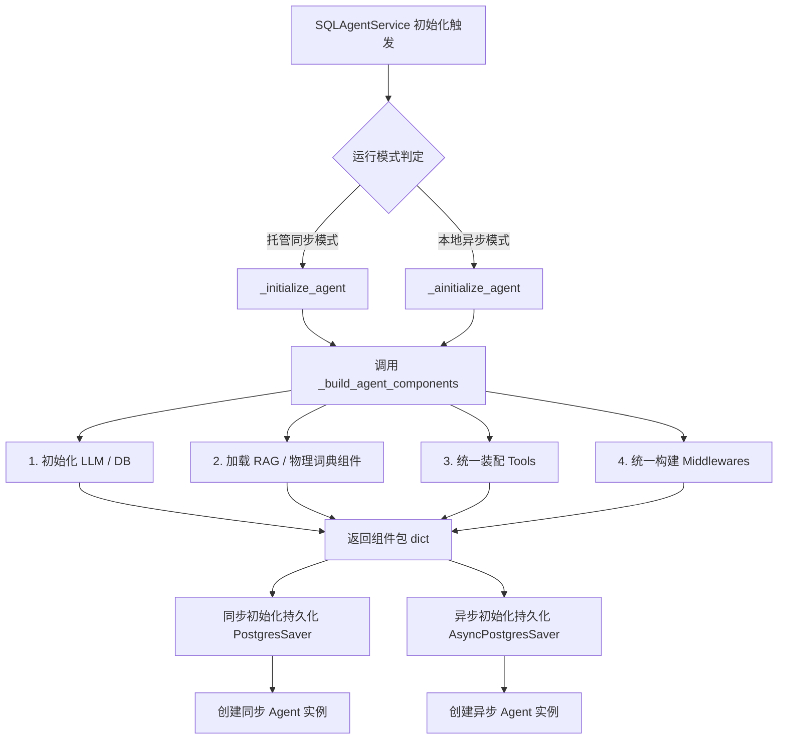

# SQL Agent 双轨初始化路径解耦与工厂化重构设计方案

> **状态**：已落地并合入（最终落地在中间件处采用 LangChain 原生 SummarizationMiddleware 结合 exact_token_counter 闭包实现）  
> **议题**：双轨初始化（同步/异步）逻辑重复度高，维护成本与对齐风险较大  
> **目标文件**：[service.py](file:///f:/000_dev/Python/workplace/rearch_agent/.tree/features/agent-llamaindex-rag/backend/app/agent/service.py)

---

## 一、 现状分析与痛点

目前 `SQLAgentService` 为兼容两种运行环境，设计了两个平行的初始化入口：
1. **同步路径 (`_initialize_agent`)**：由 LangGraph CLI / Dev 托管模式在启动加载 Graph 时同步调用。
2. **异步路径 (`_ainitialize_agent`)**：由 FastAPI 本地启动时通过异步类方法 `create_local_async` 调用。

### 核心痛点
* **代码严重重复（约 120 行）**：从大模型创建、数据库连接、RAG 组件预热、工具装配（Linter 注入）到中间件链条装配，同步和异步函数中的代码完全一致。
* **高昂的对齐成本**：未来只要对工具箱进行增删（如本期为 CSV 和图表工具注入 DDL 信息），或者对中间件（如 RAG 中间件、Prompt 编译器）进行配置调整，开发人员必须在 `_initialize_agent` 和 `_ainitialize_agent` 中手动同步修改两遍。一旦遗漏，将直接导致托管模式和本地模式的行为分叉，出现难以排查的 Bug。

---

## 二、 推荐优化方案：配置构建器模式 (Config Builder Pattern)

将工具装配、元数据准备、中间件链装配等 **“纯 CPU 密集/纯逻辑组装”** 的过程完全剥离，收拢到一个统一的私有方法 `_build_agent_components` 中。

### 架构图示


---

## 三、 详细变更方案

### 3.1 [service.py](file:///f:/000_dev/Python/workplace/rearch_agent/.tree/features/agent-llamaindex-rag/backend/app/agent/service.py) 结构调整

#### 1. 新增私有方法 `_build_agent_components`
抽取所有共享的准备工作，返回一个结构化字典：
```python
    def _build_agent_components(self) -> dict:
        """
        统一构建 Agent 的核心组件（LLM、DB、Tools、System Prompt、Middlewares）。
        此方法不涉及持久化资源的初始化，保持纯逻辑组装。
        """
        _configure_proxy_settings()

        # 1. 准备大模型与数据库连接
        llm = _create_llm(self._use_ollama)
        db, _ = _create_database_connection()

        # 2. 准备 RAG / SQL 示例工具
        logger.info("开始初始化业务知识 RAG 组件及 SQL 示例检索能力...")
        rag_middleware = None
        retriever = None
        reranker = None
        try:
            retriever, reranker = create_business_retriever_and_reranker()
            if retriever is not None:
                if hasattr(retriever, "warmup"):
                    retriever.warmup()
                doc_k = 10 if reranker is not None else 5
                rag_middleware = BusinessRagMiddleware(
                    retriever=retriever,
                    reranker=reranker,
                    doc_k=doc_k,
                    score_threshold=getattr(settings, "rag_similarity_threshold", None),
                    db=db,
                )
                logger.info("业务知识 RAG 中间件已启用")
        except Exception as exc:
            logger.warning("业务知识 RAG 组件初始化失败: %s", exc)

        lexicon_retriever = rag_middleware.lexicon_retriever if rag_middleware else None
        
        # 3. 统一装配工具链
        tools = _prepare_tools(db, llm, retriever=retriever, lexicon_retriever=lexicon_retriever)
        system_prompt = _build_system_prompt(db)
        token_estimator = _create_token_estimator()

        # 4. 构建模型调用限制与链条中间件
        call_limit_middlewares = []
        if settings.agent_model_call_run_limit > 0:
            call_limit_middlewares.append(
                ModelCallLimitMiddleware(
                    run_limit=settings.agent_model_call_run_limit,
                    exit_behavior=settings.agent_call_limit_exit_behavior,
                )
            )
        if settings.agent_tool_call_run_limit > 0:
            call_limit_middlewares.append(
                ToolCallLimitMiddleware(
                    run_limit=settings.agent_tool_call_run_limit,
                    exit_behavior=settings.agent_call_limit_exit_behavior,
                )
            )

        # Token 估算器与上下文警告中间件
        summarization_middleware = ConversationSummarizationMiddleware(
            llm=llm,
            token_estimator=token_estimator,
        )

        middleware_list = [
            *call_limit_middlewares,
            summarization_middleware,
            SkillMiddleware(db),
            _create_context_warning_middleware(token_estimator),
            PromptCompilerMiddleware(),
        ]
        if rag_middleware:
            middleware_list.insert(0, rag_middleware)

        return {
            "llm": llm,
            "tools": tools,
            "system_prompt": system_prompt,
            "middleware": middleware_list,
        }
```

#### 2. 重构同步路径 `_initialize_agent`
简化为调用组件构建器，执行同步持久化，最后创建 Agent：
```python
    def _initialize_agent(self) -> None:
        """初始化 Agent（同步路径）。"""
        try:
            components = self._build_agent_components()

            # 本地同步模式下手动创建 PostgresSaver
            self._initialize_persistence()

            agent_kwargs = (
                {"store": self.store, "checkpointer": self.checkpointer}
                if not self._managed_runtime
                else {}
            )

            self.agent = create_agent(
                model=components["llm"],
                tools=components["tools"],
                system_prompt=components["system_prompt"],
                middleware=components["middleware"],
                **agent_kwargs,
            )
            logger.info("SQL Agent 同步路径初始化成功")
        except Exception as exc:
            logger.error("SQL Agent 同步路径初始化失败: %s", exc)
            raise
```

#### 3. 重构异步路径 `_ainitialize_agent`
结构完全与同步对齐，仅在持久化处采用 `await` 异步方法：
```python
    async def _ainitialize_agent(self) -> None:
        """异步初始化 Agent（异步路径），供 FastAPI 本地独立模式使用。"""
        try:
            components = self._build_agent_components()

            # 本地异步模式下创建 AsyncPostgresSaver
            await self._ainitialize_persistence()

            agent_kwargs = (
                {"store": self.store, "checkpointer": self.checkpointer}
                if not self._managed_runtime
                else {}
            )

            self.agent = create_agent(
                model=components["llm"],
                tools=components["tools"],
                system_prompt=components["system_prompt"],
                middleware=components["middleware"],
                **agent_kwargs,
            )
            logger.info("SQL Agent 异步路径初始化成功")
        except Exception as exc:
            logger.error("SQL Agent 异步路径初始化失败: %s", exc)
            raise
```

---

## 四、 方案优势与收益

1. **零代码冗余 (Zero Redundancy)**：消除双轨初始化链路中超过 95% 的重复逻辑，确保工具集、RAG 中间件、Prompt 处理器和各种防御检查永远完全一致。
2. **极佳的可维护性 (High Maintainability)**：未来如果有新特性加入（如安全拦截拦截审计告警），只需在 `_build_agent_components` 中添加一行代码，两种运行模式将同时获得更新。
3. **零向下兼容影响 (Zero Breaking Changes)**：完全保持 `SQLAgentService` 类的对外 API 不变。所有使用 `SQLAgentService()` 或 `SQLAgentService.create_local_async()` 的地方均不需任何改动，实现无缝替换。

---

## 五、 验证与上线步骤

1. **静态语法检查**：在 `conda activate py312_agent` 环境下运行 `mypy` 或 `python -m py_compile backend/app/agent/service.py` 确保无任何语法和类型错误。
2. **单元测试回归**：运行现有的所有单元测试套件：
   * `pytest backend/app/agent/test_service_interrupt.py`（测试本地异步链路）
3. **LangGraph CLI 验证**：在 Windows 下运行 `start_langgraph_dev.bat`，验证同步路径加载 Graph 无报错且能正常连入后台。
4. **FastAPI 本地服务联调**：启动后端服务 `start_backend.bat` 并从前端发起一次聊天、CSV 导出与图表渲染，确认各项工具表现正常。
