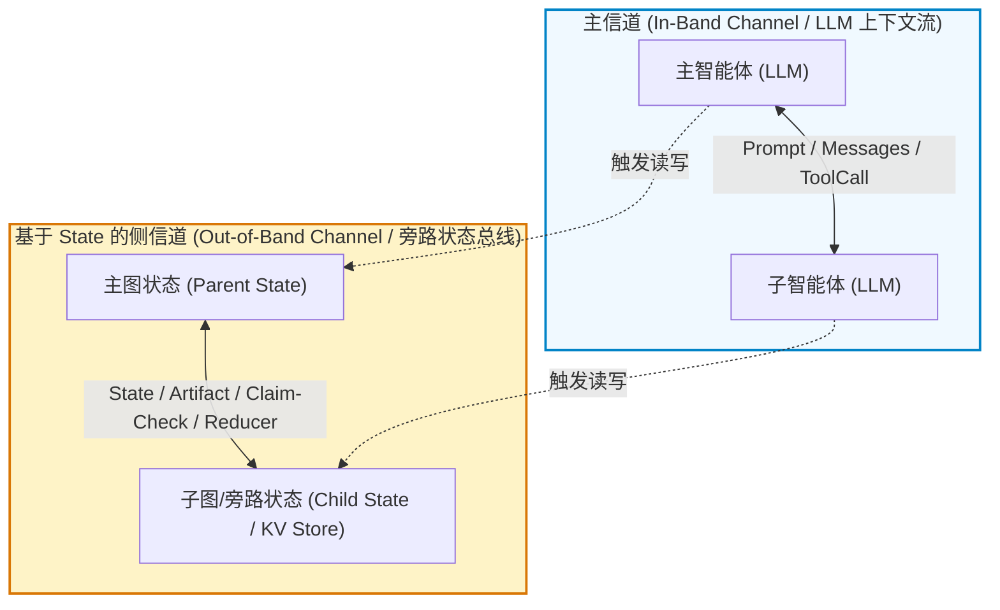
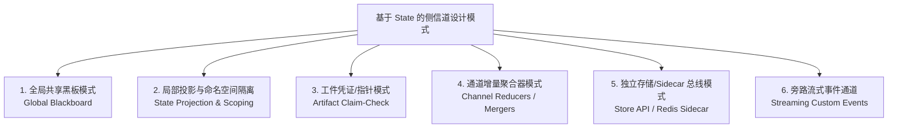
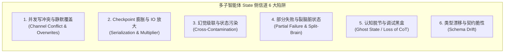
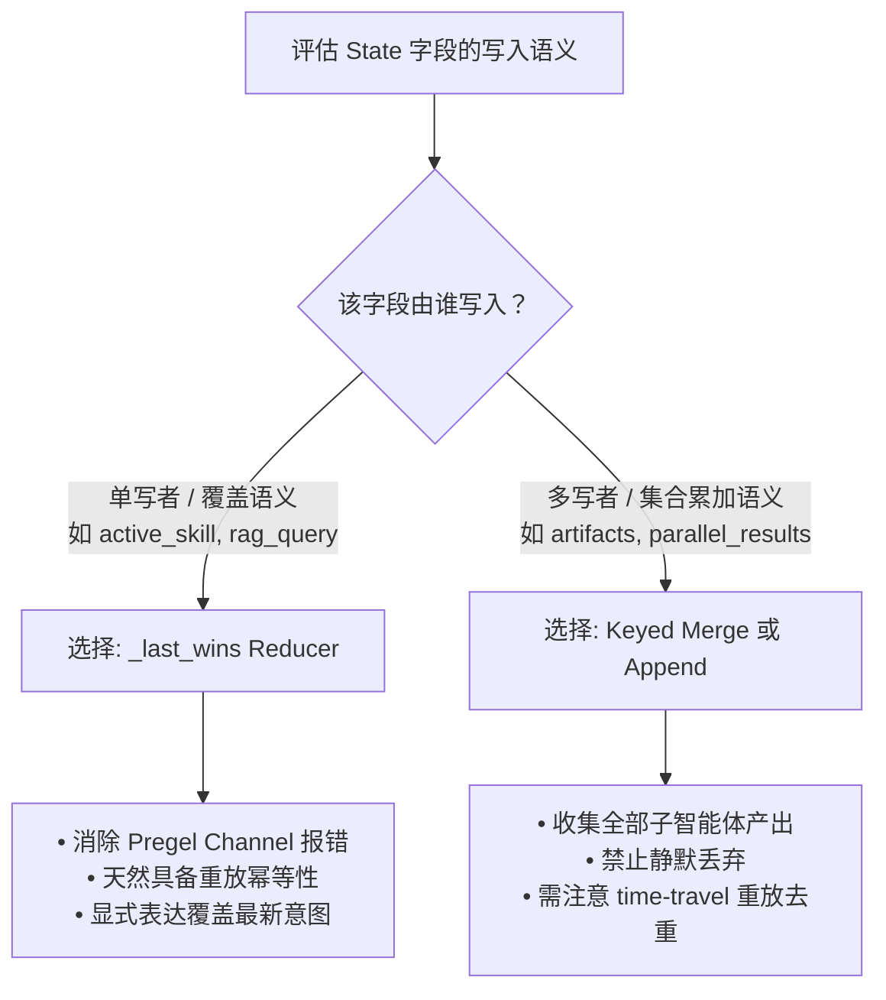
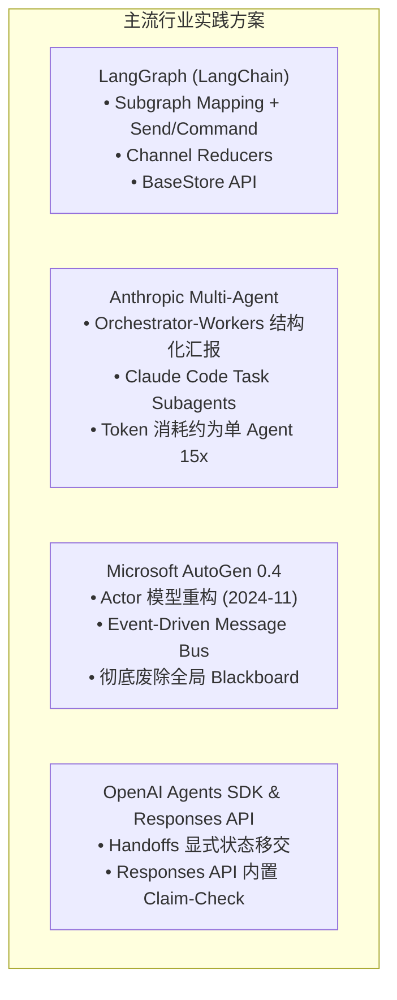

# 主子智能体架构下基于 State 的侧信道设计与行业实践深度研究报告

> **文档版本**：v2.0（经 Claude Code 深度审查修订）  
> **生成时间**：2026-08-16  
> **文档主题**：主子与多子智能体（Supervisor-Worker / Fan-Out Fan-In）架构下的 State 侧信道设计模式、并发与状态隐患、最佳实践边界、行业前沿方案及本项目 Gap 分析。

---

## 1. 架构概念界定：主信道与 State 侧信道

在以 **Supervisor-Worker（主控-多子智能体）** 或 **Hierarchical Multi-Agent（分层多智能体）** 为核心的系统架构中，智能体间的信息流转通常分为两类通道：



- **主信道（In-Band Channel / LLM 上下文流）**：
  以大模型的上下文窗口（`messages: list[BaseMessage]`）为载体，通过自然语言、思维链（CoT）、工具调用（Tool Calls）及工具响应（Tool Messages）显式传递信息。
  * **特点**：LLM 完全可见并能直接用于推理决策；但 Token 昂贵（在 Orchestrator-Workers 架构下，总体 Token 开销约为单 Agent 串行的 10~15 倍）、受窗口限制，容易引起“中间遗忘（Lost-in-the-Middle）”，且极度不适合传输海量表格、中间特征图、二进制或高频状态信号。
- **State 侧信道（Out-of-Band Channel / 旁路状态通道）**：
  指**脱离或半脱离 LLM 消息流**，利用计算图框架的 **State（状态容器 / 字典）、外部存储（Blob / Redis / DB）、或专用 Reducer 通道**，在主智能体与子智能体、子智能体与环境/前端之间进行旁路数据读写、聚合与传递的机制。
  * **特点**：Token 零消耗或极低消耗、支持强类型与复杂数据结构、适合传输大体量结果（如万行 SQL 查询集）和生命周期控制变量。

---

## 2. 基于 State 的侧信道设计分类（6 种核心模式）

在当前主流多智能体架构中，基于 State 的侧信道设计主要有以下 6 种形态：



### 模式 1：全局共享黑板模式（Global Shared Blackboard）
- **核心机制**：主子智能体共享同一个顶层扁平 State 字典。主智能体在 `state["task_meta"]` 中注入上下文，子智能体直接在全局 State 的 `state["defect_records"]` 或 `state["sql_results"]` 中写入结果。
- **优点**：结构简单直观，开发门槛低。
- **缺点**：无作用域隔离，存在严重的变量名污染与并发覆写风险。

### 模式 2：局部状态投影与命名空间隔离模式（State Projection & Scoping / Lens Pattern）
- **核心机制**：主图（Parent Graph）与子图（Child Subgraph）定义完全不同的 State Schema。主智能体拉起子智能体时，通过**投影函数（Input Mapper）**仅提取子智能体所需的状态子集；子智能体执行完毕后，主图通过**挂载函数（Output Mapper）**将结果写入主 State 的特定命名空间字段（如 `state["subagent_outputs"][agent_id]`）。
- **优点**：状态完全隔离，子图内部的临时中间变量不会污染主状态。
- **适用场景**：多专家专业化分工、清晰的主从委托（Delegation）。

### 模式 3：工件凭证/指针模式（Artifact Claim-Check Pattern）
- **核心机制**：大体积数据（如 10 万行 SQL 记录、DataFrame、多模态图像/文件）不直接放入 State 内存字典，而是写入对象存储（S3/MinIO）、本地临时文件沙箱或缓存层。State 侧信道与 LLM 主信道中仅保留轻量级句柄（`ArtifactHandle`，包含 `artifact_id`, `uri`, `schema_summary`, `row_count`）。
- **优点**：彻底杜绝 State 膨胀与 LLM 消息上下文溢出，读写分离。
- **典型应用**：数据分析 Agent、代码生成沙箱、报表生成 Agent。

### 模式 4：通道增量聚合器模式（Channel Reducer & Fan-In Aggregation）
- **核心机制**：针对多子智能体并发执行场景，在 State 字段声明专用的 **Reducer 算子**（如 LangGraph 的 `Annotated[dict, merge_dicts]` 或 `Annotated[list, operator.add]`）。子智能体并发返回增量更新（Delta），框架引擎自动在超级步骤（Super-step）边界利用 Reducer 执行合并。
- **优点**：从引擎底层避免并发写报错，支持 Fan-out / Fan-in 拓扑。

### 模式 5：外挂独立内存/存储总线模式（Sidecar Store / External Memory Namespace）
- **核心机制**：将**短期运行状态（Graph State）**与**跨节点共享持久化数据（Store API / Redis）**彻底分离。主子智能体通过约定的层级命名空间（如 `("tenant_1", "session_abc", "shared_knowledge")`）进行键值读写。
- **优点**：State 自身保持轻量，支持跨会话、跨 Subgraph、跨生命周期的数据共享。

### 模式 6：旁路流式事件通道（Streaming Custom Events & Telemetry）
- **核心机制**：子智能体产生的过程遥测（进度百分比、图表渲染中间态、Thinking 流、Linter 校验告警）不写入持久化状态机，而是通过事件总线（如 `dispatch_custom_event()` / SSE）直接旁路推送到前端或监控端。
- **优点**：前端获得毫秒级流式体感，且不会产生无意义的持久化 Checkpoint 数据库写入。

---

## 3. 在“主 + 多子智能体”下会遇到的核心问题与机理

当架构演进为“一个主智能体 + 多个并行子智能体（1-to-N Fan-Out）”时，如果不加约束地使用 State 侧信道，会遭遇以下 6 类严重问题：



### 3.1 并发写冲突机制辨析：Pregel Channel 冲突 vs Checkpointer 乐观锁
在分布式或图并发执行中，开发者常将两套完全独立的冲突机制混淆：
1. **Pregel 图引擎 Super-step Channel 冲突**（如 `langgraph.errors.InvalidUpdateError`）：
   - **发生时机**：图执行的超级步骤（Super-step）边界。
   - **机理**：主图派发的多个并行子节点在同一超步中向未配置 Reducer 的通道（默认的 `LastValue` channel）写入了不同值。Pregel 引擎判定为非法非确定性更新并直接抛出异常。
   - **解法**：通过 `Annotated[..., custom_reducer]` 显式指定归并语义。
2. **Checkpointer 乐观并发冲突（Optimistic Concurrency Conflict）**：
   - **发生时机**：持久化提交层（如 `AsyncPostgresSaver`）。
   - **机理**：两个不同的客户端请求或并发 Run 试图以相同的父快照版本推进同一个 `thread_id`，触发持久化存储的版本冲突（防止 Double-Booking）。

### 3.2 状态体积膨胀与 Checkpointer 放大效应
1. **单次快照序列化开销**：
   LangGraph Checkpointer 在每个超步结束时，通过 `JsonPlusSerializer`（MsgPack 系）对 State 进行快照持久化。若将大量原始明细塞入 State，一旦单记录超过 PostgreSQL TOAST 阈值（约 2KB），会导致存储碎片化和反序列化 CPU 飙升。
2. **多子智能体并发下的写放大乘数（Write Multiplier）**：
   在 deepagents / LangGraph 分层架构中，每个子智能体运行都可能产生独立的 Checkpoint 链。
   $$\text{总 Checkpoint 写入次数} \approx \text{超步数} \times (1 + \text{并发子智能体数})$$
   并发度越高，数据库 IO 写入量呈线性甚至超线性放大。

### 3.3 状态污染与幻觉级联扩散（Cross-Contamination & Hallucination Cascading）
- **现象**：子智能体 A 在探索过程中生成的中间未校验数据或错误假设直接写入全局共享 State，子智能体 B 或主智能体在后续步骤读取了该数据，误将其作为既定真理（Ground Truth）继续推演，形成系统性错误放大。

### 3.4 部分失败（Partial Failure）与脏状态悬挂
- **现象**：主智能体派发的 4 个子任务中，2 个成功写入 State，1 个超时，1 个由于工具报错退出。
- **解法**：不宜套用重型的分布式事务（2PC），而应在 Agent 协议层采用 **`FailedResult` 容错封装模式**：子智能体异常被捕获并封装为包含错误码与部分结果的结构体，回传主控由其决定降级（Fallback）或重试。

### 3.5 认知脱节与调试黑盒化（Loss of Traceability / "Ghost State"）
- **现象**：LLM 本质是依赖 Prompt / Messages 上下文进行语义推理的。若核心业务逻辑大量依赖侧信道悄悄传递数据，而在 LLM 消息流中毫无体现：
  - LLM 在最终汇总时会产生“认知脱节（不知数据从何而来，无法生成合理的解释性总结）”；
  - 开发者在 LangSmith / Langfuse 等链路追踪工具中无法复现推理链条，形成调试黑盒。

### 3.6 Schema 漂移与接口契约脆性（Schema Drift & Untyped Fragility）
- **现象**：各子智能体由不同提示词或不同模型驱动，对共享字典的键名、数据结构假定不一致（如子智能体 A 写 `{"status": "ok"}`，子智能体 B 写 `{"is_success": true}`），导致运行时频繁抛出 `KeyError`。

---

## 4. Reducer 语义选型决策框架与最佳实践辨析

针对业界讨论激烈的“`last_wins` 是否属于反模式”，需根据**业务写入语义与幂等性要求**建立正交的决策框架：



### 4.1 Reducer 选型决策表

| 字段语义类别 | 典型字段示例 | 推荐 Reducer 算子 | 并发行为 | 重放/幂等性评估 |
| :--- | :--- | :--- | :--- | :--- |
| **单写者覆盖字段** | `rag_query`, `active_skill`, `context_warning` | `_last_wins` (`lambda _a, b: b`) | 后到者胜出（消除引擎报错，保留覆盖语义） | **天然幂等**（Checkpointer 重放不会产生重复） |
| **多写者键控聚合字段** | `subagent_artifacts`, `subtask_status` | `keyed_dict_merge` (字典按 ID 合并) | 按键合并，各子智能体独立保留结果 | **天然幂等**（相同 ID 重复写入结果一致） |
| **流水账累积字段** | `messages`, `audit_logs` | `add_messages` / `operator.add` | 列表追加 | **非幂等**（节点直接重放时需去重机制） |

### 4.2 最佳实践 vs 反模式对照矩阵

| 维度 | ❌ 行业反模式（Anti-Pattern） | ✅ 工业级最佳实践（Best Practice） |
| :--- | :--- | :--- |
| **数据传递** | 将海量原始数据（SQL 结果集、完整文本）直接塞入 State 或 Prompt | **Claim-Check 模式**：原始数据存入临时存储/沙箱，State 仅存轻量 `ArtifactHandle`（URI + 摘要） |
| **状态作用域** | 扁平全局 State，所有子智能体无阻碍任意读写 | **Scope 隔离与子图封装**：主子 State 分离，通过输入/输出映射函数显式投影 |
| **并发合并** | 多写者累加字段误用裸覆盖（导致静默丢数据） | **根据语义明确 Reducer**：覆盖型用 `_last_wins`，聚合型用 `keyed_merge` |
| **持久化开销** | 盲目在 State 写入超限大对象触发 PG TOAST 碎片 | **状态轻量化 + 监控**：监控 Checkpoint P95 字节数，大体积数据强制转工件 |
| **认知可解释性** | 业务决策全靠侧信道隐式变量，LLM 上下文一片空白 | **双轨协同**：侧信道存明细，主信道同步注入结构化摘要（Structured Summary）与执行状态 |
| **异常恢复** | 某个子智能体报错导致整图崩溃或遗留脏数据 | **容错隔离**：子智能体异常被包裹为 `FailedResult` 写入结果通道，主控决定降级或重试 |

---

## 5. 行业顶级框架与前沿方案分析（2026 最新格局）



### 5.1 LangGraph（LangChain 官方）
LangGraph 是当前基于图状态机的代表性框架，其核心侧信道与并发原语包括：
1. **`Send` 原语（Map-Reduce 式 Fan-Out）**：
   条件边（Conditional Edges）可返回 `[Send("worker_node", worker_input_state)]`，为每个并行子任务构造完全独立的局部状态输入。
2. **`Command` 原语（Fan-In 显式路由与回写）**：
   子节点返回 `Command(update={"artifacts": ...}, goto="supervisor")`，显式控制状态增量更新与控制流汇聚。
3. **Subgraph 映射隔离**：
   父图（`ParentState`）调用子图（`ChildState`）时，通过声明式节点函数对输入状态做裁剪，并在子图退出时将结果映射回父图的指定字段。
4. **LangGraph Store (`BaseStore`)**：
   将“执行流短时状态（State）”与“全局长时共享数据（Store）”分离，提供跨 Thread 的命名空间 KV 检索。
5. **`dispatch_custom_event()` 旁路流**：
   中间遥测与 UI 状态通过流式事件直接发射，彻底避免 Checkpointer 数据库写放大。

### 5.2 Anthropic（Building Effective Agents 架构指南）
Anthropic 在其多智能体权威指南中明确推崇 **Orchestrator-Workers** 模式：
- **无隐式共享内存**：拒绝子 Agent 之间共享可变内存。
- **结构化汇报协议（Structured Handoff）**：主 Agent 将任务拆解为子任务并派发；子 Agent 独立运行，完成后仅向主 Agent 返回高密度的 `WorkerResult` 摘要。
- **现成工程范例（Claude Code Task Tool）**：Claude Code 在处理大型子任务时拉起只读或受限环境的 subagent，完成后将结构化结果汇报回主会话。
- **量化成本洞察**：Anthropic 研究表明，Orchestrator-Workers 的 Token 开销约为单 Agent 串行探索的 **10~15 倍**，强化了“主信道高密度压缩、侧信道处理细节”的必要性。

### 5.3 Microsoft AutoGen 0.4（重大架构革新）
在 2024 下半年发布的 AutoGen 0.4 中，微软彻底推翻了 0.2 版本的全局对话状态共享，转向 **Actor 模型**：
- **完全废除全局 Blackboard**：每个 Agent 都是一个完全独立的 Actor，拥有绝对私有的 State。
- **事件驱动消息传递（Message-Passing Concurrency）**：Agent 之间禁止直接读写彼此的内部状态，所有协作均通过强类型 Topic 发布/订阅（Pub/Sub）或 RPC 消息显式传递。

### 5.4 OpenAI Agents SDK 与 Responses API（2025~2026 前沿体系）
- **废弃历史包袱**：Swarm（已归档）与 Assistants API（已宣布退役）由新一代 **OpenAI Agents SDK** 与 **Responses API** 取代。
- **Handoffs 显式移交**：通过类型化的 Handoff 机制移交 Agent 控制权，依赖注入式的 `Context` 对象随调用链显式传递。
- **服务端 Claim-Check 原生化**：在 Responses API 中，`file_search` / `computer_use` 等复杂工具产出的文件与向量上下文完全托管于服务端，LLM 仅持有资源 ID。

---

## 6. 本项目现状对照分析（Gap Analysis）

将上述六种模式对照当前仓库（`backend/app/agent/`、`deepagents`、`chat_service.py`）现状：

| 模式 | 本项目现状 | 评估与演进建议 |
| :--- | :--- | :--- |
| **1. 全局黑板** | **部分存在**：`CustomState(AgentState)` 全量字段透传给子智能体 | 暂由 `deepagents` 的 `private_state_keys` 排除机制做基础防护，但仍存在字段过度暴露 |
| **2. 投影隔离** | **未实现**：子智能体与主 Agent 共享同一个 `CustomState` | 待演进：利用 `deepagents` 子智能体 `state_schema` 配置专用局部 Schema |
| **3. Claim-Check** | **已有雏形**：`tool_artifact` 机制已支持工件注册 | 完善方向：确保万行 SQL 查询明细只进 Artifact，主消息流仅注入元数据与行数摘要 |
| **4. Reducer** | **已落地修复**：`state.py` 为全量扩展键补充 `_last_wins` | 正确消除了 Pregel 并发报错；后续应针对多子智能体聚合字段补充 `keyed_merge` |
| **5. Store API** | **暂未使用** | 跨轮次持久化完全依赖 Checkpointer，长期领域知识目前走 RAG 动态检索注入 |
| **6. Streaming 事件** | **深度应用**：`chat_service.py` 支持 SSE 子智能体归属解析与 Artifact 事件 | 符合业界标准，前端通过三处白名单机制防丢，体感优良 |

---

## 7. 生产落地代码范式（对齐 deepagents 与强类型契约）

以下给出结合 `deepagents` 体系与泛型 Keyed Reducer 的标准实现：

```python
from typing import Annotated, Dict, Any, List, TypeVar, Optional
from typing_extensions import NotRequired, TypedDict
import operator
from pydantic import BaseModel, Field
from deepagents.state import AgentState

# ==========================================
# 1. 强类型工件句柄（Claim-Check）
# ==========================================
class ArtifactHandle(BaseModel):
    artifact_id: str
    uri: str
    summary: str
    row_count: int
    columns: List[str]
    created_by: str  # 记录产出子智能体 ID

# ==========================================
# 2. 泛型 Keyed Reducer：安全合并多子智能体并发字典
# ==========================================
T = TypeVar("T")

def merge_keyed_dict(
    existing: Optional[Dict[str, T]], 
    updates: Optional[Dict[str, T]]
) -> Dict[str, T]:
    """泛型字典按 Key 合并算子，天然具备幂等性"""
    merged = dict(existing or {})
    if updates:
        merged.update(updates)
    return merged

def _last_wins_reducer(_a: Any, b: Any) -> Any:
    """单写者覆盖语义 Reducer，消除 Pregel 并发检查报错"""
    return b

# ==========================================
# 3. 对齐项目的扩展状态定义（CustomState）
# ==========================================
class ProductionAgentState(AgentState):
    # 覆盖语义字段：单写者更新
    rag_context: Annotated[NotRequired[List[Any]], _last_wins_reducer]
    rag_query: Annotated[NotRequired[Optional[str]], _last_wins_reducer]
    active_skill: Annotated[NotRequired[Optional[str]], _last_wins_reducer]
    
    # 聚合语义字段：多子智能体并发安全收集（Keyed Merge）
    subagent_artifacts: Annotated[NotRequired[Dict[str, ArtifactHandle]], merge_keyed_dict]
    subtask_results: Annotated[NotRequired[Dict[str, str]], merge_keyed_dict]

# ==========================================
# 4. 子智能体输入/输出状态投影（Projection Mapper）
# ==========================================
class DefectAnalysisWorkerState(TypedDict):
    """子智能体私有状态，完全与父图解耦"""
    vehicle_id: str
    task_scope: str
    internal_scratchpad: list

def project_to_subagent(parent_state: ProductionAgentState, vehicle_id: str) -> DefectAnalysisWorkerState:
    """父状态 -> 子状态投影（Input Mapper）"""
    return {
        "vehicle_id": vehicle_id,
        "task_scope": parent_state.get("active_skill", "default"),
        "internal_scratchpad": []
    }
```

---

## 8. 总结与落地闭环建议

1. **Reducer 语义选型双轨制**：
   - 对于单写者/覆盖型字段（如 `rag_query`, `context_warning`），显式使用 `_last_wins`，消除引擎报错并确保幂等重放；
   - 对于多子智能体并行汇总字段（如 `subagent_artifacts`），必须使用 `merge_keyed_dict`，防止并发覆盖导致数据静默丢失。
2. **监控 Checkpoint 开销，防范写放大**：
   - 将 State 字段大小纳入配置化告警，监控 `checkpoint_blobs` 表的平均和 P95 字节数；
   - 关注子智能体并发导致的快照写入放大效应，大体量数据坚决走 Claim-Check 旁路存储。
3. **主子状态渐进式投影隔离**：
   - 逐步将子智能体的 `state_schema` 从全量 `CustomState` 改造为局部专属 Schema，减少无意义的状态拷贝与回写冲突。
4. **双轨同步机制保证认知可解释性**：
   - 子智能体在侧信道写入工件句柄的同时，必须向主信道返回一条**高密度的结构化摘要消息（Structured Summary）**，确保 LLM 具备完整的推理上下文与可解释性。
5. **异常包裹与主控容错闭环**：
   - 子智能体抛出的异常应被封装为结构化的 `FailedResult` 写入结果通道，由主控智能体统一评估降级、切换策略或向用户发起澄清。
