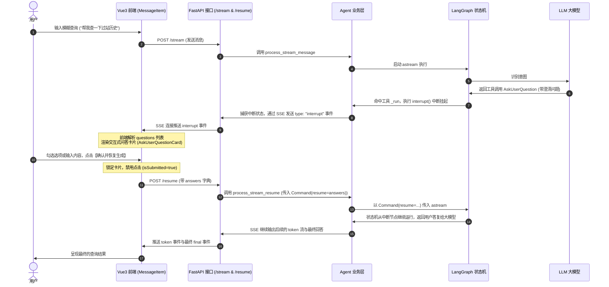

# AskUserQuestion 工具前后端设计模式与中断 (Interrupt) 机制指南

本文对 `AskUserQuestion`（用户澄清提问）工具的后端与前端设计模式、LangGraph 中断（Interrupt）与恢复机制、交互协议、避坑指南及 Lessons Learned 进行了全方位的结构化技术总结。

---

## 目录
- [一、 概述与应用场景](#一-概述与应用场景)
- [二、 整体架构与交互时序](#二-整体架构与交互时序)
- [三、 后端设计模式与核心实现](#三-后端设计模式与核心实现)
  - [3.1 工具定义：BaseTool 继承 vs @tool 装饰器](#31-工具定义basetool-继承-vs-tool-装饰器)
  - [3.2 Pydantic 数据模式定义](#32-pydantic-数据模式定义)
  - [3.3 容错设计：大模型 Stringified 参数的预校验过滤](#33-容错设计大模型-stringified-参数的预校验过滤)
- [四、 LangGraph Interrupt (中断) 与恢复机制](#四-langgraph-interrupt-中断与恢复机制)
  - [4.1 工具中触发 Interrupt](#41-工具中触发-interrupt)
  - [4.2 拦截中断状态并构造 SSE 事件](#42-拦截中断状态并构造-sse-事件)
  - [4.3 /resume 接口无状态恢复流式执行](#43-resume-接口无状态恢复流式执行)
- [五、 前端设计模式与交互渲染](#五-前端设计模式与交互渲染)
  - [5.1 SSE 客户端流式事件解析与运行时校验](#51-sse-客户端流式事件解析与运行时校验)
  - [5.2 问答卡片 (AskUserQuestionCard) 交互设计模式](#52-问答卡片-askuserquestioncard-交互设计模式)
  - [5.3 响应式状态管理与组件复用状态清理](#53-响应式状态管理与组件复用状态清理)
- [六、 避坑指南与 Lessons Learned](#六-避坑指南与-lessons-learned)
  - [6.1 SSE 校验逻辑引起的“流式未终止”Bug](#61-sse-校验逻辑引起的流式未终止bug)
  - [6.2 Vue 3 组件流式复用状态残留 Bug](#62-vue-3-组件流式复用状态残留-bug)
  - [6.3 提示词引导与 Bias toward action](#63-提示词引导与-bias-toward-action)
  - [6.4 混合输入断裂 Bug 与 Python f-string 大括号转义陷阱](#64-混合输入断裂-bug-与-python-f-string-大括号转义陷阱)

---

## 一、 概述与应用场景

`AskUserQuestion` 是智能体（SQL Agent）与用户之间进行结构化澄清的核心交互工具。传统的对话模型在遇到歧义需求、缺失关键参数或面临技术抉择时，通常通过纯文本直接询问，这会导致用户不得不手打回复，增加了交互成本。

通过 `AskUserQuestion` 工具，大模型可以将提问转化为**卡片式多栏交互**。其主要应用场景包括：
1. **缺失关键条件补充**：如用户要求查询某车辆的过站历史，但未指定“车身号”或“过站位置”，大模型可调起开放文本问答卡片引导用户输入。
2. **多查询路径抉择**：如存在多个相似的车间读写站，且用户表意模糊，大模型可生成单选或多选卡片让用户选择。
3. **技术方案/口径权衡**：面临具有不同性能或维度的业务统计口径时，大模型可给出备选项（并推荐最优解）让用户最终拍板。

---

## 二、 整体架构与交互时序

整个工具的执行路径跨越了 **FastAPI 后端、LangGraph 状态机状态图、SSE 流式协议、Vue 3 渲染组件**。

下面是 `AskUserQuestion` 的核心时序流程：



---

## 三、 后端设计模式与核心实现

后端核心代码主要位于 [ask_user_question.py](file:///f:/000_dev/Python/workplace/rearch_agent/.tree/features/agent/backend/app/agent/tools/ask_user_question.py)。

### 3.1 工具定义：BaseTool 继承 vs @tool 装饰器

在本项目中，`AskUserQuestion` 采用了继承 `BaseTool` 的声明方式，而没有使用 `@tool` 装饰器。其核心设计考量如下：

| 工具定义方式 | 优点 | 缺点 / 限制 | 为什么 `AskUserQuestion` 选择它 |
| :--- | :--- | :--- | :--- |
| **`@tool` 装饰器** | 编写极其简便，支持直接通过 Python 函数的 Docstring 和类型签名自动生成 LLM Tool Schema。 | 对复杂参数校验（如级联 Schema、自定义验证规则）支持能力较弱；难以对字段验证进行细粒度控制。 | 不选用。因为本工具具有深度结构化参数（如问题列表嵌套选项列表），且需要对 LLM 容易生成的 Stringified JSON 进行防错预解析。 |
| **继承 `BaseTool`** | 1. **结构强约束**：通过明确指定 `args_schema` 进行强制校验。<br/>2. **自定义参数验证**：可直接在 `BaseModel` 中定义 Pydantic `@field_validator` 等预校验过滤钩子。<br/>3. **契约高内聚**：工具元数据（name、description、args_schema）与执行体（_run）高内聚，便于单元测试。 | 编写代码略多，需要显式声明独立的 Schema 类。 | **选用**。满足大模型调用时的强参数校验需求，且能在进入业务处理前，彻底规避由于参数格式错误导致的链路崩塌。 |

### 3.2 Pydantic 数据模式定义

为了同时满足“单选/多选问题”与“纯文本问答”两种形态，数据 Schema 设计如下：
* **`QuestionOption`**：代表选择题中的选项。包含必填的 `label` 属性和选填的 `description` 属性。
* **`QuestionItem`**：代表单个澄清问题。
  * `question`：具体提问文本（也将作为用户答复字典的 Key 回传给大模型）。
  * `header`：可选分类。
  * `multiSelect`：是否多选。
  * `options`：备选项列表。**声明为 `Optional`**，若不传此字段，前端将自动降级为纯文本输入框，用以收集特定的自由输入（例如车身号、起始时间等）。
* **`AskUserQuestionSchema`**：聚合 1~4 个 `QuestionItem` 问题卡片。

### 3.3 容错设计：大模型 Stringified 参数的预校验过滤

在实践中，由于本工具接收一个 `questions: List[QuestionItem]` 的列表参数，大模型在调用时，有时会将本该是 JSON Array 结构的列表序列化为 `string` 形式（例如传入 `"questions": "[{\"question\": \"...\"}]"`）。这会直接导致 Pydantic 抛出 `ValidationError: Input should be a valid list`。

为此，在 `AskUserQuestionSchema` 中实现了一个**容错过滤器 (Before Validator)**：

```python
class AskUserQuestionSchema(BaseModel):
    questions: List[QuestionItem] = Field(description="澄清问题卡片列表，支持 1~4 个")

    @field_validator("questions", mode="before")
    @classmethod
    def parse_questions(cls, v):
        if isinstance(v, str):
            v = v.strip()
            # 大模型可能会用 markdown 代码块包裹 JSON 字符串，在此进行剥离
            if v.startswith("```"):
                lines = v.splitlines()
                if len(lines) > 2:
                    if lines[0].startswith("```"):
                        lines = lines[1:]
                    if lines[-1].startswith("```"):
                        lines = lines[:-1]
                v = "\n".join(lines).strip()
            try:
                v = json.loads(v)
            except Exception:
                try:
                    import ast
                    v = ast.literal_eval(v)
                except Exception:
                    pass
        return v
```
此设计保障了工具即使在面对大模型“幻觉”输出序列化字符串或被 Markdown 围栏包裹的代码块时，也能实现自愈和规范化解析。

---

## 四、 LangGraph Interrupt (中断) 与恢复机制

在 LangGraph 1.1.8+ 中，引入了基于 `interrupt()` 和 `Command(resume=...)` 的一流 Human-in-the-loop (人机交互) 架构。

### 4.1 工具中触发 Interrupt

在 `AskUserQuestion` 的 `_run` 内部，通过直接调用 `interrupt(...)` 函数挂起当前节点。`interrupt` 函数会物理中断当前 Thread 的图执行，并将参数抛出作为中断事件的 Payload：

```python
def _run(self, questions: List[dict]) -> dict:
    # 1. 触发 LangGraph 内置的 interrupt，挂起当前 Thread 
    # 2. 传入的 payload 将由 aget_state() 获取
    # 3. 挂起完成后，当外部恢复运行传入 Command(resume=user_answers) 时，
    #    本函数将唤醒并直接返回 user_answers 给 Agent
    answers = interrupt({
        "type": "ask_user_question",
        "questions": questions
    })
    return answers
```

### 4.2 拦截中断状态并构造 SSE 事件

后端服务的核心执行循环定义在 [services.py](file:///f:/000_dev/Python/workplace/rearch_agent/.tree/features/agent/backend/app/services.py) 的 `_stream_execution_loop` 中。
当 `astream` 结束其前一轮执行（因为碰到 `interrupt` 而自然暂停，未到达图的 Terminus）后，代码通过 `agent.aget_state(resolved_config)` 主动拉取当前 Thread 状态：

```python
# 检查 Graph 是否因 AskUserQuestion 挂起
state = await self.agent.aget_state(resolved_config)
state_next = state.next if state else []
state_tasks = state.tasks if state else []

if state_next and any("tools" in n or "AskUserQuestion" in n for n in state_next):
    if state_tasks and state_tasks[0].interrupts:
        # 获取由 interrupt() 抛出的 Payload
        interrupt_val = state_tasks[0].interrupts[0].value
        if isinstance(interrupt_val, dict) and interrupt_val.get("type") == "ask_user_question":
            questions = interrupt_val.get("questions", [])
            # 向 SSE 队列派发 interrupt 结构化消息，向前端传送澄清数据
            await _emit({
                "type": "interrupt",
                "questions": questions,
                "session_id": session_id
            })
            return  # 提前终止本轮 SSE 生成通道
```

### 4.3 /resume 接口无状态恢复流式执行

当用户点击提交答复后，前端会请求 [api.py](file:///f:/000_dev/Python/workplace/rearch_agent/.tree/features/agent/backend/app/api.py) 的 `/api/chat/resume` 接口。
恢复执行的核心在于构造 `Command(resume=answers)`：

```python
# backend/app/services.py 中的 process_stream_resume 逻辑
async def process_stream_resume(
    self, session_id: str, answers: dict[str, Any], config: dict = None
) -> AsyncIterator[dict[str, Any]]:
    # 1. 绑定相同的 session_id 以还原 LangGraph 的 Thread 状态
    resolved_config = self._build_config(session_id, config, request_mode="stream")
    
    # 2. 构造 Command 对象作为 astream 的新输入
    input_data = Command(resume=answers)
    
    # 3. 驱动核心流执行循环继续产生新事件
    async for event in self._stream_execution_loop(session_id, resolved_config, input_data):
        yield event
```

---

## 五、 前端设计模式与交互渲染

前端组件位于：
* 消息渲染气泡：[MessageItem.vue](file:///f:/000_dev/Python/workplace/rearch_agent/.tree/features/agent/frontend/src/components/MessageItem.vue)
* 澄清卡片组件：[AskUserQuestionCard.vue](file:///f:/000_dev/Python/workplace/rearch_agent/.tree/features/agent/frontend/src/components/AskUserQuestionCard.vue)
* SSE 客户端连接：[chat.ts](file:///f:/000_dev/Python/workplace/rearch_agent/.tree/features/agent/frontend/src/api/chat.ts)

### 5.1 SSE 客户端流式事件解析与运行时校验

前端通过 `ReadableStream` 逐包解析 SSE 流。为了确保数据完整性并防御非法事件，[chat.ts](file:///f:/000_dev/Python/workplace/rearch_agent/.tree/features/agent/frontend/src/api/chat.ts#L203-L233) 实现了严格的类型检查模式：

* **支持非强约束选项验证**：在校验 `interrupt` 事件的 `questions` 时，由于本系统支持纯文本填空问答，必须**允许 `q.options` 为 `undefined` 或 `null`**。
* **判定流式终止状态**：当解析器拦截到 `final`、`error` 或 `interrupt` 三者之一时，会标记 `sawTerminalEvent = true`。这样在解析遇到 `[DONE]` 终止符时，系统便知道整个流已合规完成。

### 5.2 问答卡片 (AskUserQuestionCard) 交互设计模式

`AskUserQuestionCard.vue` 采用了以下交互机制：

1. **非互斥容错与智能拼接逻辑**：
   - 问题如果有 `options`，用户点击选项会将其填充至 `answers`，同时**允许**用户在下方的文本域 (`customInputs`) 中补充输入参数，两者不再相互清除。
   - 这不仅保障了当大模型未正确拆分而产生“混合意图澄清”（例如：同时选择读写站和输入车身号）时用户的操作路径闭环，还能在 `handleSubmit` 中将两者智能拼接为 `${selectedText}; 关联输入: ${custom}` 合并回传。
   - 此外，通过动态 label（变更为 `“补充参数 / 关联说明”`）与自适应 placeholder，引导用户精准输入相关数据。
2. **纯填空智能降级与类型徽章优化**：
   * 当问题不存在选项（`item.options` 为空）时，组件自动隐藏选项列表，直接渲染出纯开放文本域，并智能更改 placeholder 为 `"请在此输入您的回答..."`。
   * 同时，**自适应隐藏**无实际意义的“单选/多选”类型徽章（通过 `v-if="item.options && item.options.length > 0"` 限制），仅在有备选项时显示，彻底消除了纯文本模式下的界面语义歧义。
3. **多问题卡片进度编号导航**：
   * 当澄清卡片包含 2 个及以上问题时（`questions.length > 1`），自动在每道题目的左上角渲染高对比度蓝色编号徽章（形如 `问题 1 / 3`、`问题 2 / 3` 等），起到视觉导向和提问导航作用，能极其有效地防范用户在多参澄清场景下的输入遗漏。
4. **状态单向封锁模式 (Lock Pattern)**：
   * 当 `isSubmitted` 属性为 `true` 时，整个卡片会被添加 `opacity-80 pointer-events-none` 样式，使得文本框进入 `disabled` 状态、选项不再可点，规避了用户的二次重复提交或恶意窜改行为。

### 5.3 响应式状态管理与组件复用状态清理

在 Vue 3 单页应用中，处于 `isStreaming: true` 阶段的当前助手消息气泡（`MessageItem`）会保持激活状态，并随着数据流的追加不断更新。
* **挑战**：如果在同一个 SSE 会话的生命周期内，大模型触发了多轮澄清（例如：澄清问题 A -> 用户提交 -> 模型继续运行 -> 再次遇到不确定性 -> 触发澄清问题 B），Vue 会倾向于**复用**同一个 `MessageItem.vue` 组件，而不是重新挂载（Unmount）。
* **Bug 表现**：如果本地提交标志 `isLocalSubmitted` 仅仅保存在组件内部且在初始化时设为 `false`，当问题 B 推送过来时，由于组件未重构挂载，`isLocalSubmitted` 仍然残留上一轮的 `true` 值，导致问题 B 刚一展现就处于锁定只读状态。
* **解决方案**：在 `MessageItem.vue` 中添加一个针对 `questions` 计算属性的**深度监听器 (Deep Watcher)**。一旦检测到推入的问题列表发生实质性内容变化，自动将本地锁重置为可编辑态：

```typescript
// MessageItem.vue 中监听澄清问题包的变化
watch(
  () => questions.value,
  (newQuestions) => {
    if (newQuestions && newQuestions.length > 0) {
      // 只要有新的澄清问题推入，物理重置本地提交锁定状态，恢复交互
      isLocalSubmitted.value = false
    }
  },
  { deep: true }
)
```

---

## 六、 避坑指南与 Lessons Learned

### 6.1 SSE 校验逻辑引起的“流式未终止”Bug
* **痛点回顾**：先前为了支持开放式填空，后端去掉了 `options` 字段。但是前端 SSE 校验器 `chat.ts` 中写了强判定 `!Array.isArray(q.options)`。
* **后果**：前端遇到开放式问答包时，会直接将 `interrupt` 事件判定为非法事件并静默丢弃。这导致前端连接未能捕获到任何终止态事件（`sawTerminalEvent = false`），在流关闭时抛出异常：`流式响应在收到终止标记前未返回 final 或 error 事件`，进而阻塞后续的提交与交互。
* **教训**：**协议规范演进时，数据校验必须双端同步。** 特别是对于 SSE 这种强数据流驱动的传输模型，校验层的一丁点不匹配都会导致流的状态机卡死。

### 6.2 Vue 3 组件流式复用状态残留 Bug
* **痛点回顾**：大模型第一轮澄清提交后恢复，接着发起第二轮澄清，结果新卡片无法输入。
* **后果**：用户无法操作卡片，流式对话卡死，必须刷新页面或重建会话。
* **教训**：在组件复用模型中（特别是流式响应的中间状态展示层），**不能依赖 Mounted 钩子执行状态初始化。** 必须根据数据流推送的数据特征（如利用 deep watch 监听 questions 内容改变），主动清理和重置本地交互状态。

### 6.3 提示词引导与 Bias toward action
* **痛点回顾**：如果不加克制地给大模型提供 `AskUserQuestion` 工具，大模型很容易退化为“提问狂魔”——遇到稍微不确定的路径、或者数据库查出多条数据时，不作任何自主推理就抛出卡片打扰用户。
* **解决方案**：在系统提示词中增加严格的**行动导向原则（Bias toward action）**。
  1. 只有在**信息缺失**（如未给车号）或**涉及破坏性操作**时才允许调起澄清。
  2. 针对技术细节、常规的 SQL 筛选等，智能体应自主根据上下文寻找最优解并主动尝试。
  3. 备选项中若存在推荐项，必须将推荐项前置并打上 `(Recommended)` 标签。

### 6.4 混合输入断裂 Bug 与 Python f-string 大括号转义陷阱
* **痛点回顾**：大模型（如 `gpt-5-nano`）在面对“需要用户既选择又输入”的混合场景时，虽然 Prompt 提示要拆分为 2 个独立的 `QuestionItem`，但模型依然倾向于将两者压进同一个 `QuestionItem`。由于前端组件的单选/多选状态与 textarea 之间存在互斥的强物理清除逻辑，且 textarea 的 label 写死为“其他/自定义说明”，导致用户物理上根本无法同时进行两项输入，操作路径断裂。
* **解决方案**：
  1. **前端非互斥容错与智能拼接**：解除了 Vue 3 澄清组件内部的强清空逻辑，支持两者共存；优化文本框 label 与 placeholder 引导语义；并在用户提交时，若两部分皆有，则前端以 `; 关联输入: ` 分隔无损拼接（例如 `"Station A; 关联输入: 782026xxxxxx"`）合并传回后端。这既不破坏现有的 answers 字典扁平格式，又能依赖大模型极强的自然语言语义理解能力平滑闭环。
  2. **双端 Schema 强力加固**：在 Pydantic 的 `QuestionItem` 和 `AskUserQuestionSchema` 的 `description` 描述中、以及 `service.py` 内部 System Prompt 澄清规范里加入具体的 **JSON 正反面调用拆分示例**，强力约束纠正大模型的参数生成行为。
* **开发陷阱：Python f-string 转义崩溃**：
  - **现象**：在 `service.py` 里的 `_build_system_prompt` 中补充 JSON 拆分示例时，由于整个 System Prompt 是由 Python **f-string**（即 `f"""..."""`）包裹的，未转义的大括号（如 `"options": [{"label": "Station A"}]` 中的单大括号 `{}`) 会在运行时被 Python 误解释为插值占位符，且其中的冒号被解读为变量的格式说明符（format specifier），导致系统在应用 lifespan 预加载时抛出 `ValueError: Invalid format specifier ' "Station A"' for object of type 'str'` 并崩溃退出。
  - **教训**：在用 f-string 定义包含 JSON 示例、或者是包含 DDL / 正则匹配等其他包含 `{` 和 `}` 的静态大字符串模板时，**必须双写大括号进行物理转义（即用 `{{` 和 `}}`）**，防范低级运行时语法崩溃。
