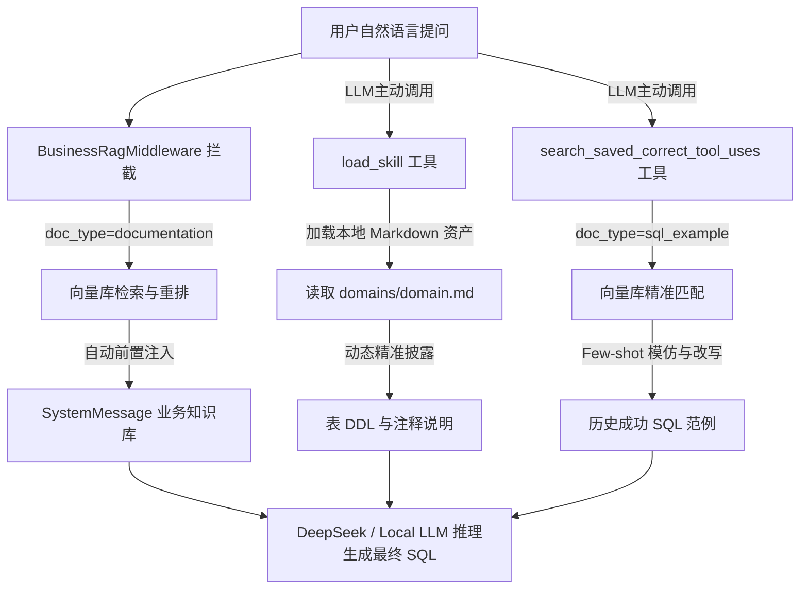

# RAG 架构与技术栈总结

更新时间：2026-05-29 13:20 Asia/Shanghai

主要修改内容：
- 系统化归纳补充 Agent 层的 RAG 三通道注入机制（业务知识自动拦截、DDL/Schema动态按需披露、SQL示例工具化召回）与职责分离设计
- 对齐当前代码实现，补充 Milvus embedding provider 可在 `ollama` 与 `llama.cpp` 间切换
- 修正文档中遗留的 `NVIDIA V5` / “仅 Ollama” 等过时描述
- 补充 `llama.cpp + Qwen3 Embedding` 的 query instruction 与归一化策略

本文档基于现有代码库中的配置和实现（特别是 `factory.py`、`query_engine.py` 和 `config.py` 等模块），对项目当前的检索增强生成 (RAG) 架构和技术选型进行梳理和总结。

## 1. 核心检索架构 (RAG Backend)

项目设计了一套灵活的解耦检索架构，代码层面通过 **工厂模式（Factory Pattern）** 实现了对不同检索后端的接管。通过配置环境变量 `RAG_BACKEND`，系统能够无缝切换底层的向量数据库和检索策略。

目前系统支持两套并行的向量检索架构（**生产及开发环境默认启用的是 Milvus 混合检索**）：

### 1.1 Milvus 混合检索架构（默认配置: `milvus_hybrid`）
- **底层框架**：基于 `LlamaIndex` 编排引擎 + `Milvus` 高性能向量数据库。
- **检索策略（Hybrid Search）**：双路混合召回。
  - **稠密检索（Dense Retrieval）**：通过传统的向量化相似度进行计算检索（度量方式采用 IP - 内积相似度）。
  - **稀疏检索（Sparse Retrieval）**：基于 `BM25` 稀疏算法。该支路专门集成了 `jieba` 分词器及其特定过滤器（如 `cnalphanumonly`），针对中文关键词和长词提供精准命中能力。
- **排序与策略融合**：
  - 基于 **RRF (Reciprocal Rank Fusion，倒数排序融合)** 算法将两路检索（稠密与稀疏）产生的结果进行重新评分排位。
  - 默认配置：`rrf_k=60`，最终向下游传递 `similarity_top_k`（默认为 5）个最具价值的参考分块数据。

### 1.2 PGVector 纯向量存储架构（备用 / 降级配置: `pgvector`）
- **底层框架**：基于关系型 PostgreSQL 数据库的 `pgvector` 插件方案。主要由自定义的 `PgVectorDocumentationRetriever` 来实现。
- **检索策略**：基于单纯的稠密向量检索来进行数据召回。相较于混合架构，更侧重于简便和轻量化。

---

## 2. 核心大模型与预训练模型选型

在不同的处理环节，架构引入了不同职责的模型来保障生成质量：

### 2.1 嵌入模型 (Embedding Model)
视 RAG Backend 不同，系统采用不同的 Embedding 模型配置机制以确保检索能力：
- **Milvus 模式下 (默认)**：
  - **模型族**：本地私有化 `Qwen3-Embedding-0.6B`
  - **向量维度**：1024 维（由 `MILVUS_EMBED_DIM` 显式配置）
  - **Provider 切换方式**：由 `EMBEDDING_PROVIDER` 控制，可选：
    - `ollama`：使用 `OLLAMA_EMBED_MODEL=qwen3-embedding:0.6b`
    - `llama_cpp`：使用 `LLAMA_CPP_EMBED_MODEL=Qwen/Qwen3-Embedding-0.6B-GGUF:q8_0`
  - **统一接入方式**：两种 provider 都通过共享的 `embedding_provider.py` 入口挂载到 `LlamaIndex Settings.embed_model`，确保建库与查询使用同一套 embedding 配置。
  - **llama.cpp 路径的检索增强**：
    - 默认调用 `POST /embedding`
    - query 侧启用 Qwen 官方建议的 `instruction-aware embedding`
    - 返回向量在进入 Milvus 前会做 L2 normalize，以配合 `IP`（内积）相似度计算
- **PGVector 模式下**：
  - **模型名称**：智源研究院 `baai/bge-m3`
  - **调用方式**：在执行业务工厂 `create_business_vector_store()` 初始化时单独挂载，和 Milvus 路径互不影响。

### 2.2 重排序精排模型 (Reranker) - [可选链路]
系统前瞻性地设计并植入了可选的“二次精排”层，用来进一步矫正检索结果的优先级和准确度。
- **开关机制**：受控于环境变量 `RERANK_ENABLED` （默认为 False）。
- **模型名称**：英伟达 `nvidia/rerank-qa-mistral-4b`
- **主要作用**：当该层开启时，由基础引擎检出的 `Top-K` 节点会再次送给该模型，进行极其精细但算力消耗高的交叉注意力评分，并根据 `RERANK_SCORE_THRESHOLD` 截断剔除弱相关内容，最终返回 `RERANK_TOP_N`（默认 3）条最精华数据用于最终合成。

### 2.3 文本生成与合成大模型 (LLM)
负责最终整合 Reference Nodes 并对用户输出最终回答：
- **开发与云端常规基座**：`deepseek-chat` (DeepSeek V3 系列)，默认作为 `LlamaIndex` 的全局大模型 (`Settings.llm`) 进行推理，提供了极高的性价比与优秀的推理水平。
- **私有化与本地模型探索**：项目的配置文件中明确预留并部署了针对 RTX 5090 等终端优化的本地 Ollama 推理堆栈（默认挂载参数为 `qwen3:30b` 及 `32768` 上下文）。表明有在本地及离线环境下提供大模型支持的设计能力。

---

## 3. 工作流执行流向解析
标准的 RAG 查询执行链路上，目前引擎将表现出如下生命周期（以开发模块 `development/hybrid/query_engine.py` 为例）：
1. **系统加载与延迟连接**：为防止不必要的长连接，Milvus 路径实现了向量存储的**延迟初始化**。只有在首次调用 `retrieve()` 时才会真正连接后端服务并加载 `VectorStoreIndex`。
2. **文本向量化**：获取 User Query 后，通过选定的 Embedding 模型进行在线向量化。
   - `ollama` 路径：直接调用本地 Ollama embedding 模型
   - `llama.cpp` 路径：通过 `/embedding` 接口向本地 `llama-server` 发送请求；对 query 自动拼接 `Instruct: ...\nQuery: ...`，对文档入库文本保持原文
3. **节点召回与重排序**：
   - 如果启用混合模式，则自动切分 User Query 执行 BM25 相关性查库操作，并与向量化查库操作合并。
   - 使用 RRF 公式重打分聚合。
   - 判断 Reranker 配置项，如果开启则进一步调用 Mistral-4b 过滤节点列表。
4. **合成输出**：将最终存活下来的高质量文本提取出来包裹成上下文 Prompt，连同问题一起递交给 DeepSeek 等主力大语言模型进行 `synthesize`（合成输出）。
5. **记录观测**：支持接入完整的 `LangSmith` 监控追踪链路（如果 `LANGSMITH_TRACING=true`）。

---

## 4. Agent 层 RAG 融合与三通道注入机制 (Agent-level RAG Fusion)

在应用层，系统并非将 RAG 粗暴地作为单一的“提示词补充”，而是根据业务数据的物理属性和查询规律，推行了**通道隔离与职责分离 (Separation of Concerns)** 的三通道注入设计。这构成了工业级高可用 SQL Agent 的关键壁垒。

### 4.1 业务知识自动注入通道 (Business Knowledge)
* **内容实体**：车间指标计算口径（如“NV数量=缺陷数×单车缺陷系数”）、常见术语转换、逻辑过滤条件定义。
* **注入机制**：**被动自动拦截模式 (Passive Interception)**。
  * `BusinessRagMiddleware` 中间件在会话开启的最前端执行，无需模型显式调用。
  * 后台检索时强制限定向量数据库条件为 `doc_type="documentation"`（完全过滤掉 SQL 示例与 DDL 信息）。
  * 通过 **Rerank 精排** 筛选出最高评分的少量节点（默认 Top-3），以 `### 业务术语说明 (Documentation)` 文本块在首位自动注入为当前会话的 `SystemMessage`。

### 4.2 数据表 DDL 及注释动态披露通道 (Schema & Database Comments)
* **内容实体**：表结构 DDL、主外键关系、各列对应的物理其中文业务注释（如 `station_1_defect_count` 代表右侧）。
* **注入机制**：**声明式主动加载模式 (Declarative On-Demand Load)**。
  * **全局屏蔽**：为防范高维数据库海量字段撑爆 LLM 窗口，系统静态提取数据库注释并缓存后，**主动移除了** 默认的 `sql_db_list_tables` 和 `sql_db_schema` 工具，阻断大模型盲目读取全局 Schema。
  * **按需披露**：模型必须根据当前分析的问题领域主动调用 `load_skill(skill_name)`，此工具在后台直接调用文件加载器读取并确定性地返回 `backend/app/skills/domains/<domain>/domain.md` 中的明文内容。
  * **优势**：DDL 与注释采用纯文本资产管理，不仅具备 100% 的确定性（不走 RAG 召回，防止错乱），而且把最易出错的“业务字段映射”与表结构动态绑定，提供了极致安全的 Schema 披露。

### 4.3 成功 SQL 示例动态检索通道 (SQL Few-shot Examples)
* **内容实体**：已被人工校准且在生产环境中成功执行过的 SQL 查询范例。
* **注入机制**：**工具化主动检索模式 (Active Tool-driven Search)**。
  * 挂载 `search_saved_correct_tool_uses` 专用检索工具。在系统执行纪律中，强力引导模型在编写 SQL 前根据用户提问主动进行 Few-shot 检索（除非使用了固定的场景技能）。
  * 检索时强制限定向量条件为 `doc_type="sql_example"`。
  * 召回高度相似的历史 SQL 模板后，Agent 通过 Local Few-shot 学习机制，直接在范例基础上进行**增量式改写**（例如完美模仿 `STR_TO_DATE` 的非标时间转换），极大提升了复杂 SQL 首次生成的成功率。

---

## 总结
整套 RAG 系统立足于业务扩展性与高性能设计。当前支持低成本降级路径（PGVector）与高性能主路径（Milvus Hybrid + RRF 混合搜索 + 可选 Rerank 精排）双轨架构；其中 Milvus 的稠密向量已经统一迁移到本地私有化 `Qwen3-Embedding-0.6B` 方案，并支持在 `Ollama` 与 `llama.cpp` 之间切换，兼顾部署灵活性、离线能力与检索效果。
同时，在应用层构建了**职责分明的三通道注入机制**，将**自动业务拦截、声明式物理 DDL 披露与主动式 SQL 示例检索**有机结合，在保证高召回率的同时实现了极致的 Token 控制与业务安全红线保护。
