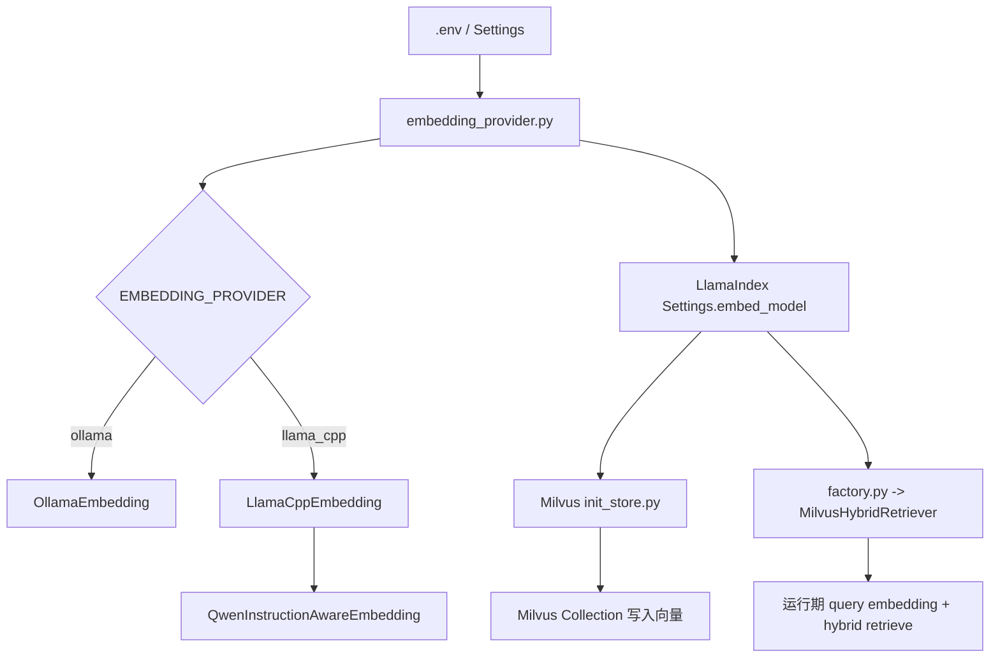
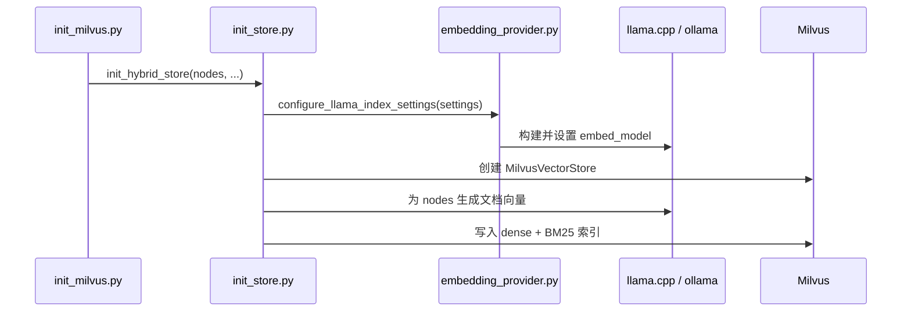
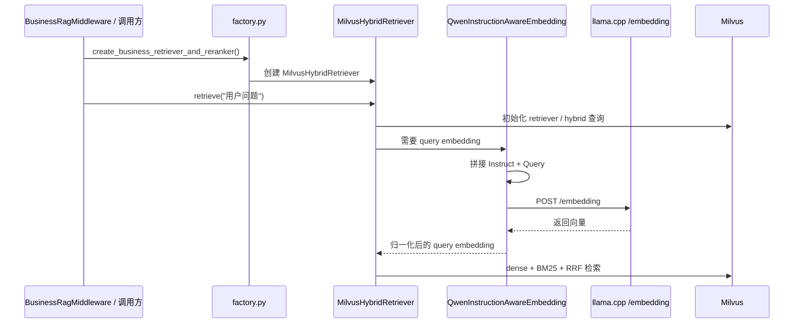

# llama.cpp + Qwen3 Embedding 接入与复用最佳实践

更新时间：2026-03-24 16:05 Asia/Shanghai

主要修改内容：
- 将原“本地部署说明”整合为一份完整的 `llama.cpp + Qwen3 Embedding` 改造实践文档
- 补充项目内真实架构、调用链路、API 接口格式、部署步骤、排障经验与复用建议
- 增加相关目录与关键文件索引，方便后续二次开发与快速定位

## 1. 文档目标

本文档用于沉淀本项目本次 `llama.cpp + Qwen3 Embedding` 改造的完整实践，覆盖以下内容：

- 为什么要做这次改造
- 项目内的架构落点与职责分层
- 建库与查询两条链路的真实执行流程
- `llama.cpp` embedding API 的实际请求 / 响应格式
- 本地部署、验证、切换与重建索引的注意事项
- 后续同类改造时可直接复用的开发心智与检查清单

适用范围：

- 当前项目的 `Milvus Hybrid RAG`
- 本地 `llama.cpp` 部署的 `Qwen/Qwen3-Embedding-0.6B-GGUF:q8_0`
- 需要在 `ollama` 与 `llama.cpp` 之间切换 embedding provider 的场景

## 2. 改造背景与目标

本次改造的核心目标有三个：

1. 保留原有 `ollama` embedding 能力，不破坏既有链路。
2. 为 `Milvus Hybrid RAG` 新增 `llama.cpp + Qwen3 Embedding` 方案。
3. 通过 `.env` 控制 provider 切换，并保证建库与查询使用同一套 embedding 配置。

本次改造明确不做的事情：

- 不改 `pgvector` 路径
- 不引入 `/v1/embeddings` 双协议兼容
- 不在首期做自动维度探测
- 不强依赖批量 embedding API

## 3. 相关目录与关键文件

### 3.1 目录总览

```text
backend/
├── app/
│   ├── config.py
│   ├── test_embedding_provider.py
│   ├── test_rag_milvus_hybrid.py
│   └── agent/
│       └── vector/
│           ├── embedding_provider.py
│           ├── factory.py
│           ├── milvus_hybrid/
│           │   ├── milvus_retriever.py
│           │   └── milvus_store.py
│           └── milvus_init/
│               ├── init_milvus.py
│               ├── init_store.py
│               └── data/
docs/
└── backend/
    ├── RAG架构与技术总结.md
    └── llamacpp-qwen3-embedding-local-deployment.md
```

### 3.2 文件职责

- `backend/app/config.py`
  - 统一读取 `.env` 中的 embedding provider 与 Qwen instruction 配置。
- `backend/app/agent/vector/embedding_provider.py`
  - 本次改造的核心入口。
  - 负责根据配置构建 `OllamaEmbedding` 或 `LlamaCppEmbedding`。
  - 负责 query instruction 包装与向量归一化。
- `backend/app/agent/vector/factory.py`
  - 运行期检索工厂。
  - 创建 `MilvusHybridRetriever` 前统一注入 `LlamaIndex Settings.embed_model`。
- `backend/app/agent/vector/milvus_init/init_store.py`
  - 建库入口。
  - 在写入 Milvus 前使用同一套 embedding 配置。
- `backend/app/agent/vector/milvus_hybrid/milvus_retriever.py`
  - 运行期 `retrieve()` 调用入口。
  - 触发 LlamaIndex 的 query embedding 和 hybrid 检索。
- `backend/app/test_embedding_provider.py`
  - 覆盖 provider 分发、query instruction 包装、`llama.cpp` 响应解析与归一化。
- `backend/app/test_rag_milvus_hybrid.py`
  - 覆盖工厂与 Milvus Hybrid 冒烟行为。

## 4. 总体架构

### 4.1 架构原则

本次改造遵循三个原则：

- 最小改动：不拆原有检索流程，只抽出共享 embedding provider 入口。
- 单一配置源：建库与查询都从同一套 `.env` 配置生成 embedding。
- 保守兼容：默认 `EMBEDDING_PROVIDER=ollama`，切换到 `llama_cpp` 才走新链路。

### 4.2 架构示意



### 4.3 为什么必须共用同一入口

Milvus 中存储的向量，必须和运行期查询向量来自同一 embedding 方案，否则会出现：

- 检索召回明显变差
- 相似度排序异常
- 看起来“服务正常但结果不准”

因此：

- `milvus_init/init_store.py` 必须和 `factory.py` 使用同一个 provider 构建逻辑。
- provider 切换后必须重新建库。

## 5. 配置设计

### 5.1 关键环境变量

```env
EMBEDDING_PROVIDER='llama_cpp'

OLLAMA_BASE_URL='http://localhost:11434'
OLLAMA_EMBED_MODEL='qwen3-embedding:0.6b'

LLAMA_CPP_EMBED_BASE_URL='http://127.0.0.1:8081'
LLAMA_CPP_EMBED_MODEL='Qwen/Qwen3-Embedding-0.6B-GGUF:q8_0'
LLAMA_CPP_EMBED_TIMEOUT=30

QWEN_QUERY_INSTRUCTION_ENABLED=true
QWEN_QUERY_INSTRUCTION='Given a web search query, retrieve relevant passages that answer the query'

MILVUS_EMBED_DIM=1024
MILVUS_URI='http://localhost:19530'
MILVUS_COLLECTION_NAME='rag_store'
MILVUS_OVERWRITE=true
```

### 5.2 参数说明

| 参数 | 作用 | 备注 |
| --- | --- | --- |
| `EMBEDDING_PROVIDER` | 选择 `ollama` 或 `llama_cpp` | 默认保留 `ollama` |
| `LLAMA_CPP_EMBED_BASE_URL` | `llama.cpp` 服务地址 | 当前约定 `http://127.0.0.1:8081` |
| `LLAMA_CPP_EMBED_MODEL` | 模型标识 | 主要用于配置与日志 |
| `LLAMA_CPP_EMBED_TIMEOUT` | 接口超时 | 单位秒 |
| `QWEN_QUERY_INSTRUCTION_ENABLED` | 是否启用 Qwen query instruction | 只影响 query，不影响文档 |
| `QWEN_QUERY_INSTRUCTION` | query instruction 文本 | 默认使用通用检索语义 |
| `MILVUS_EMBED_DIM` | 向量维度 | 当前固定 `1024` |

### 5.3 关于 `QWEN_QUERY_INSTRUCTION`

这句：

```text
Given a web search query, retrieve relevant passages that answer the query
```

含义是“检索任务描述”，不是“必须联网”的意思。

它的作用是告诉 Qwen3 Embedding：

- 当前输入是检索 query
- 目标是找到能回答问题的相关段落

它不代表系统会访问互联网，本地知识库检索同样适用。

## 6. 运行流程

### 6.1 建库流程



关键点：

- 文档入库时不拼 instruction。
- 文档 embedding 会直接使用节点原文。
- 如果这里用的是 `llama_cpp`，查询时也必须继续用 `llama_cpp`。

### 6.2 查询流程



关键点：

- `retrieve()` 入口看到的仍然是原始用户问题。
- 真正发给 `llama.cpp` 做 query embedding 的文本，已经变成 `Instruct + Query` 格式。
- 文档侧不改写，只有 query 侧改写。

## 7. Query Instruction 的具体表现

当前项目在 query 侧采用 Qwen 官方推荐格式：

```text
Instruct: Given a web search query, retrieve relevant passages that answer the query
Query: <用户原始问题>
```

示例：

- 用户输入：

```text
L3F13 是什么？
```

- 实际发给 embedding 模型的文本：

```text
Instruct: Given a web search query, retrieve relevant passages that answer the query
Query: L3F13 是什么？
```

这意味着：

- 业务层日志里一般仍然看到原始 query。
- embedding 服务看到的是包装后的 query。
- 文档入库文本不会加 `Instruct:` 前缀。

## 8. API 接口格式

### 8.1 当前项目使用的接口

当前项目默认调用：

```http
POST http://127.0.0.1:8081/embedding
Content-Type: application/json
```

请求体：

```json
{
  "content": "Instruct: Given a web search query, retrieve relevant passages that answer the query\nQuery: L3F13 是什么？"
}
```

### 8.2 实际返回格式

你本机当前实测过的返回结构之一：

```json
[
  {
    "index": 0,
    "embedding": [[0.0161, -0.0416, 0.0082]]
  }
]
```

项目侧当前的兼容策略是：

- 不把 JSON 外壳写死成某一种格式
- 只要能递归提取出真正的向量数组，就认为成功

当前解析器兼容的思路包括：

- `{"embedding": [ ... ]}`
- `[{ "index": 0, "embedding": [[ ... ]] }]`
- 包在 `data` / `embeddings` / `result` 等字段中的变体

### 8.3 为什么要做兼容解析

`llama.cpp /embedding` 在不同版本 / 构建下，返回结构可能略有差异。

因此最佳实践是：

- 固定自己的请求协议
- 宽容解析返回
- 只依赖“是否提取出向量”，不要依赖固定 JSON 包装层

## 9. 部署步骤

### 9.1 安装与准备

优先使用包含 `llama-server.exe` 的 `llama.cpp` 预编译包，先确认版本可用：

```powershell
.\llama-server.exe --version
```

建议把版本单独记录到部署说明或运维记录中，便于后续排障。

### 9.2 首次启动命令

```powershell
.\llama-server.exe -hf Qwen/Qwen3-Embedding-0.6B-GGUF:q8_0 --embedding --pooling last -ub 8192 --host 127.0.0.1 --port 8081
```

参数说明：

- `-hf Qwen/Qwen3-Embedding-0.6B-GGUF:q8_0`
  - 直接从 Hugging Face 拉取模型
- `--embedding`
  - 启用 embedding 服务模式
- `--pooling last`
  - Qwen3 Embedding 推荐方式
- `-ub 8192`
  - 先采用官方常见值，后续可按机器资源调整
- `--host 127.0.0.1`
  - 仅本机访问
- `--port 8081`
  - 与其他推理服务隔离

### 9.3 本地模型启动

模型文件固定后，也可以改为本地路径启动：

```powershell
.\llama-server.exe -m <local_gguf_path> --embedding --pooling last -ub 8192 --host 127.0.0.1 --port 8081
```

### 9.4 服务验证

```powershell
$body = @{ content = "你好，RAG 混合检索部署测试" } | ConvertTo-Json
Invoke-RestMethod -Method Post -Uri "http://127.0.0.1:8081/embedding" -ContentType "application/json" -Body $body
```

验证标准：

- 返回非空向量
- 没有 HTML 页面
- 没有超时或 5xx
- 重启服务后再次请求仍然正常

## 10. 项目接入方式

### 10.1 初始化 Milvus

切换到 `llama_cpp` provider 后，需要重新建库：

```powershell
python -m backend.app.agent.vector.milvus_init.init_milvus
```

原因：

- Collection 中已存的 dense 向量是旧 provider 生成的
- query 侧改成新 provider 后，向量空间不再一致

### 10.2 运行期加载

运行期通过 `factory.py` 注入 `LlamaIndex Settings.embed_model`，并采用 Milvus 延迟初始化模式：

- 进程启动时不强连 Milvus
- 首次 `retrieve()` 时再建连接和 retriever

### 10.3 回退方案

如果本地 `llama.cpp` 服务异常，可以把 `.env` 改回：

```env
EMBEDDING_PROVIDER='ollama'
```

然后重新执行一次 `milvus_init` 重建索引，即可回到原方案。

## 11. 已落地的实现约束

### 11.1 已做

- 保留 `ollama` 原有链路
- 新增 `llama_cpp` provider 切换
- 建库与查询共用 embedding provider 入口
- Query 侧启用 instruction-aware embedding
- 对 embedding 结果做 L2 normalize
- 兼容多种 `/embedding` 返回格式

### 11.2 暂未做

- `/v1/embeddings` 双协议兼容
- 动态向量维度探测
- 真正的服务端批量 embedding 请求
- `<|endoftext|>` 后缀优化

## 12. 常见问题与排障

### 12.1 报错：`llama.cpp /embedding 返回格式无法识别`

原因：

- 当前 `llama.cpp` 实际返回结构和客户端假设不一致

处理思路：

- 先手工请求 `/embedding`
- 看看返回是单层向量、嵌套列表，还是包在其他字段中
- 确认解析器是否能提取出真正的向量数组

### 12.2 报错：切换 provider 后检索结果明显变差

常见原因：

- 只切了 `.env`，但没有重建 Milvus Collection

解决：

- 重新执行 `python -m backend.app.agent.vector.milvus_init.init_milvus`

### 12.3 报错：连接 `127.0.0.1` 失败

检查项：

- `llama-server` 是否还在运行
- 端口是否正确
- `LLAMA_CPP_EMBED_BASE_URL` 是否与实际监听地址一致
- 是否被系统代理或本地网络工具影响

### 12.4 报错：建库时慢或超时

检查项：

- `LLAMA_CPP_EMBED_TIMEOUT` 是否过小
- `-ub` 是否设置过高导致机器压力大
- 是否一次导入过多文本导致逐条请求耗时累计

## 13. 最佳实践

### 13.1 架构层

- 始终把 embedding provider 选择逻辑放在单一共享入口。
- 建库链路和查询链路不要各自维护一套 embedding 初始化逻辑。
- provider 可切换时，一定要显式文档化“切换后必须重建索引”。

### 13.2 接口层

- 优先走 `/embedding`，先把本地服务打通。
- 请求体保持最小协议：`{"content": text}`。
- 返回解析做宽容兼容，不要对外壳结构做强绑定。

### 13.3 检索效果层

- 对 Qwen3 Embedding，优先保留 query instruction。
- 文档侧保持原文，不要给文档 embedding 也拼 instruction。
- 若 Milvus 相似度使用 `IP`，建议在客户端做 L2 normalize。

### 13.4 运维层

- embedding 服务和推理服务分进程、分端口部署。
- 记录 `llama.cpp` 版本，避免“同一命令不同行为”难排查。
- 切 provider、切模型、切维度时，默认认为需要重建索引。

## 14. 开发心智与复用清单

后续遇到类似“替换 embedding provider”需求时，优先按这套心智检查：

1. 新 provider 的请求协议是什么，是否稳定。
2. 新 provider 的返回结构是否固定，是否需要兼容解析。
3. query 和 document 是否应采用不同 preprocessing 方式。
4. 向量维度是否变化，Milvus / PGVector 是否需要重建。
5. 相似度度量是否变化，是否要做 normalize。
6. 建库与查询是否真的复用了同一 embedding 构建入口。
7. 回退到旧 provider 的路径是否清晰、可操作。
8. 是否补了测试、README、部署文档和 changelog。

建议复用顺序：

1. 先补配置项
2. 再抽共享 provider
3. 接入建库链路
4. 接入查询链路
5. 补测试
6. 最后补文档和回退说明

## 15. 相关文档

- [README.md](../../README.md)
- [RAG架构与技术总结.md](./RAG架构与技术总结.md)
- [changelog.md](../../changelog.md)

## 16. 外部参考

- `llama.cpp` 官方 README: <https://github.com/ggml-org/llama.cpp>
- `Qwen3-Embedding-0.6B-GGUF` 官方模型卡: <https://huggingface.co/Qwen/Qwen3-Embedding-0.6B-GGUF>
- `Qwen3-Embedding-0.6B` 官方模型卡: <https://huggingface.co/Qwen/Qwen3-Embedding-0.6B>
- `Qwen` 官方 `llama.cpp` 文档: <https://qwen.readthedocs.io/zh-cn/stable/run_locally/llama.cpp.html>
