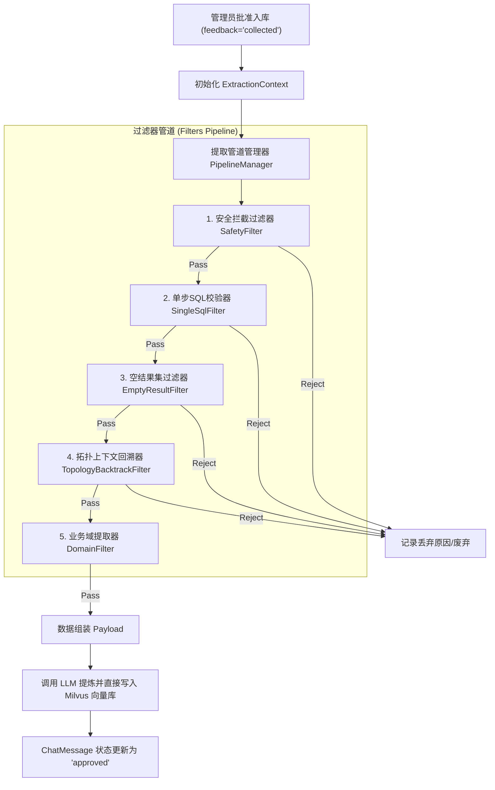

# 规则提取器 (Rule Extractor) 设计大纲

在“反馈驱动型自演进案例库”中，**规则提取器**是连接“管理员审核通过”与“后端LLM案例提炼入库”之间的核心网关。其核心目标是通过**低成本、高效率的硬性规则**，在第一关卡拦截不合格 SQL，并整合会话上下文，为后期的 LLM 意图重写提供干净且精准的素材。

---

## 1. 架构设计与数据流

本模块采用 **管道与过滤器 (Pipeline & Filters)** 架构模式。所有数据校验和上下文提取步骤都被抽象为独立的过滤器。如果任何过滤器校验失败，则提取流程立即中断，案例作废。



---

## 2. 核心类与交互设计

```python
class ExtractionContext:
    """提取任务上下文，保存会话状态、中间提取产物及最终输出结果"""
    def __init__(self, message_id: str, db_session):
        self.message_id = message_id
        self.db = db_session
        
        # 流程控制
        self.is_rejected = False
        self.reject_reason = ""
        
        # 原始数据（从 DB 自动加载）
        self.target_message = None     # 用户点击收藏的 assistant 回答
        self.history_messages = []     # 精准回溯还原的上下文消息历史链
        
        # 待输出至 LLM 的提炼素材（中间产物）
        self.raw_user_query = ""       # 用户本轮的原始提问
        self.extracted_sql = ""        # 提取出的单个成功 SQL 语句
        self.tool_result = ""          # 该 SQL 的执行返回结果
        self.domain = "general"        # 当前所属的业务技能域（required_skill）
```

```python
class BaseFilter:
    """过滤器基类"""
    def execute(self, context: ExtractionContext) -> bool:
        """
        执行特定规则。
        返回 True 表示通过，进入下一步；
        返回 False 表示不通过，在此处中断并记录原因。
        """
        raise NotImplementedError
```

```python
class PipelineManager:
    """管道调度管理器"""
    def __init__(self, filters: List[BaseFilter]):
        self.filters = filters
        
    def process(self, message_id: str, db) -> Optional[Dict[str, Any]]:
        # 1. 初始化上下文并自动拉取目标消息
        context = ExtractionContext(message_id, db)
        self._hydrate_context(context)
        
        # 2. 按顺序执行规则校验与提取
        for filter_instance in self.filters:
            if not filter_instance.execute(context):
                self._log_rejection(context)
                return None
                
        # 3. 校验全部通过，打包提炼输入
        return self._build_payload(context)
```

---

## 3. 具体过滤器 (Filter) 实现大纲

以下是应对 [sql_case_evolution_proposal.md](file:///f:/000_dev/Python/workplace/rearch_agent/.tree/features/agent/docs/mem/sql_case_evolution_proposal.md) 中提到的边缘场景的具体过滤器设计：

### 3.1 安全拦截过滤器 (`SafetyWarningFilter`)
*   **目标**：阻断任何含有恶意 SQL 或已被拦截器封禁的案例。
*   **规则**：
    *   检查关联 `tool_calls` 执行结果的 `ToolMessage`。
    *   如果内容匹配特征字符串（如 `Safety Warning`，`Blocked by security filter`，`Permission Denied`），或 SQL 含有 `DROP`, `DELETE`, `UPDATE` 等 DML/DDL 敏感词，判定为不通过。

### 3.2 单步 SQL 校验器 (`SingleSqlFilter`)
*   **目标**：仅提取最后成功的单步 SQL 语句，直接舍弃多步骤链式查询，过滤中间纠错报错 SQL。
*   **规则**：
    *   遍历当前助理消息中的所有 `tool_calls`。
    *   若其中包含多个不同的成功 `sql_db_query`（多步查询），判定为过于复杂，直接拦截丢弃。
    *   若仅有单个成功的 `sql_db_query`，则提取其执行成功的 SQL 文本并存入 `context.extracted_sql`。若提取失败或该 SQL 执行状态为报错（包含 `Error:` 或 `Exception`），则拦截丢弃。

### 3.3 空结果集过滤器 (`EmptyResultFilter`)
*   **目标**：剔除执行成功但没有返回任何有效数据的 SQL 案例。
*   **规则**：
    *   检查 `context.tool_result` 内容。
    *   将结果解析为 Python 对象，若是空列表 `[]`、空字典 `{}` 或 `Null/None`，则判定该案例参考价值极低，直接过滤丢弃。

### 3.4 拓扑上下文回溯器 (`TopologyBacktrackFilter`)
*   **目标**：基于数据库底层 `tool_call_id` 数据链，100% 精确地拓扑还原“原始问题-澄清提问-用户答案-最终SQL”的多轮上下文。
*   **规则**：
    1. 从当前的 Assistant 消息出发，向上获取紧邻的 User 消息。
    2. 解析 User 消息的 `tool_results`。若不包含澄清提问 `AskUserQuestion` 的 ID 键名，说明为常规单轮对话，上下文仅包含本轮 `User ➡️ Assistant`；
    3. 若包含该 ID 键名，则依据该 ID 精准回退匹配前一个生成该 ID 的 Assistant 消息（澄清提问卡片）；
    4. 再向上获取触发该澄清的原始 User 消息，从而构建一条完美咬合、无噪音的结构化链条，并将上下文按序存入 `context.history_messages`。

### 3.5 业务域提取器 (`DomainFilter`)
*   **目标**：实现跨业务域（Multi-Skill）的案例硬性隔离。
*   **规则**：
    *   从 `tool_calls` 的元数据中提取 `required_skill` 标签（例如 `paint_shop`）。
    *   将提取出的标签赋给 `context.domain`，确保写入 Milvus 向量库时能作为 `domain`元数据进行检索硬隔离过滤。

---

## 4. 后期更新与扩展机制

为了确保随着业务规则增加，提取器能够平滑迭代升级，系统设计了以下三大更新保障机制：

### 4.1 过滤器注册表模式 (Registry Pattern)
所有规则都在注册中心统一进行注册和顺序排列，更新规则只需调整注册列表，无需改动调度器核心逻辑：

```python
# rules_registry.py
ACTIVE_FILTERS = [
    SafetyWarningFilter(),
    SingleSqlFilter(),
    EmptyResultFilter(),
    TopologyBacktrackFilter(),
    DomainFilter(),
    # 后期新增规则直接加在此处即可
]
```

### 4.2 配置驱动 (Configuration Driven)
支持通过 `yaml` 配置文件动态调整规则参数与开关，无需修改核心逻辑代码。
```yaml
rule_extractor:
  safety_filter:
    enabled: true
    blocked_keywords: ["drop", "truncate", "grant"]
  empty_result_filter:
    enabled: true
    allow_null_values: false
  backtrack_filter:
    max_backtrack_turns: 3
```

### 4.3 软性规则支持 (Warning vs. Critical)
后期可扩展过滤器的返回结果（非单纯的 `bool`），支持 `PASS`、`WARN`、`REJECT` 三种状态：
*   `REJECT` (硬规则违规，如安全拦截)：立即中止提炼并完全废弃。
*   `WARN` (软性问题，如执行时间稍长)：允许通过并写入 Milvus 库，但在消息上增加高亮 Warning 标记，以供后续管理员二次评估。
