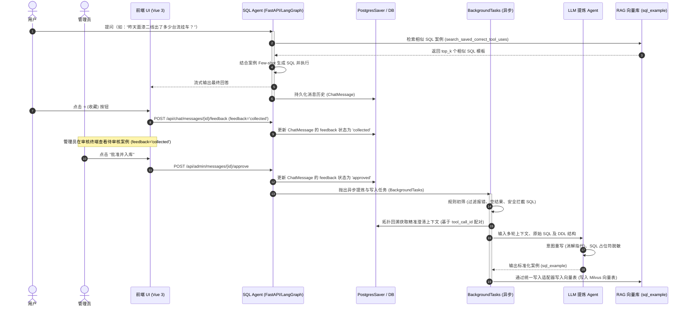

# 面向生产数据查询 SQL Agent 的“反馈驱动型自演进案例库”融合提议书 (Proposal)

## 1. 背景与痛点分析

在涂装车间等生产数据查询（SQL Agent）的实际应用中，智能体通常面临以下长尾挑战：
*   **长尾问题口径多变**：用户提问往往极其口语化且包含大量的车间方言，导致静态的 DDL 和业务术语文档（Documentation）难以完全覆盖。
*   **复杂多表关联（Join）生成困难**：大模型在生成包含 3 个表以上的 `JOIN`、子查询或复杂的窗口函数时，由于缺乏上下文相似的模板，极易产生语法错误或逻辑幻觉。
*   **“冷启动”与重用效率低**：即使智能体通过试错最终在某一轮生成了正确的 SQL，但这次成功经验并没有沉淀下来。下次用户提问相似内容时，智能体依然需要从头推理和调试，导致响应变慢且浪费 Token。

为了解决上述问题，本提议建议在现有 RAG 检索及 checkpointer 机制之上，引入一套**用户反馈驱动型自进化 Few-Shot SQL 案例库闭环系统**，让智能体在运行中自我学习、持续进化。

---

## 2. 核心目标与方案融合思路

为了兼顾**工程落地的可行性**和**入库案例的极高水准**，本方案对以下两种思路进行了深度融合：
1.  **显式反馈驱动（前端）**：在前端消息底部增加 👍 / 👎 / ⭐（收藏）交互。用户的显式收藏作为最直接的“黄金案例”信号源，降低盲目提取带来的无效计算。
2.  **隐式规则过滤与 LLM 提炼（后端）**：后端在捕获用户反馈信号后，通过规则过滤脏 SQL（报错、空结果、安全警告），并使用后台 LLM 异步进行多轮指代消解（意图重写）与 SQL 占位符脱敏，确保入库案例 100% 具备泛化性和安全性。

---

## 3. 技术架构设计

本系统将深度复用项目现有的 `FastAPI + LangGraph + Milvus` 技术栈，采用**异步解耦**的方案实施，对现有核心对话主链路的侵入降到最低。

### 3.1 总体业务时序图

---

## 4. 工程改造落地清单 (修改文件范围)

### 4.1 后端改动清单 (Python/FastAPI)

1.  **模型层** `backend/app/models.py`
    *   `ChatMessage` 表新增 `feedback` 字段（类型：`String(50)`，默认：`none`，可选值：`none` / `like` / `dislike` / `collected` / `approved`）。
2.  **Schema 层** `backend/app/schemas.py`
    *   新增 `MessageFeedbackRequest` Pydantic 规范模型，用于接收前端回传的赞踩/收藏状态。
3.  **CRUD 层** `backend/app/crud.py`
    *   新增 `update_message_feedback(db, message_id, feedback)` 方法。
    *   新增 `collect_and_save_sql_example(db, message_id)` 方法：
        *   基于已修复的持久化数据链（`tool_call_id`）精准拓扑回溯，平铺抓取当前轮前后的 `ChatMessage` 上下文。
        *   调用**规则提取器**和**LLM提炼服务**加工数据。
4.  **API 接口层** `backend/app/api.py`
    *   新增 `POST /api/chat/messages/{id}/feedback` 路由，支持用户更改赞踩或将状态标记为 `'collected'`。
    *   新增管理员接口 `POST /api/admin/messages/{id}/approve`，批准通过后，更新状态为 `'approved'`，并在响应返回后，通过 `BackgroundTasks` 异步调用 `collect_and_save_sql_example`。
5.  **检索器与向量写入适配层** (factory.py / milvus_retriever.py)
    *   放开检索器对 `doc_type` 过滤的硬编码限制，支持检索 `sql_example`。
    *   新增向量写入辅助函数 `add_document_to_store`，将提炼后的数据序列化并写入 Milvus 向量库，与现有 Milvus Hybrid 检索器保持完全一致。

### 4.2 前端改动清单 (Vue 3 / Vite)

1.  **数据类型层** `frontend/src/types/index.ts`
    *   在 `Message` 接口中，新增可选属性 `feedback?: 'none' | 'like' | 'dislike' | 'collected'`。
2.  **组件层** `frontend/src/components/MessageItem.vue`
    *   在非流式完成态消息（AI回复卡片）的底部，增加操作工具栏，渲染 👍（点赞）、👎（点踩）和 ⭐（收藏/取消收藏）按钮。
3.  **接口请求层** `frontend/src/api/messages.ts`
    *   封装前端 API 方法 `submitMessageFeedback(messageId, feedbackStatus)`。
4.  **状态管理层** `frontend/src/stores/messages.ts`
    *   在 Pinia store 中更新修改反馈状态的 Action 逻辑。

---

## 5. 特殊场景问题与应对对策

为了让自动案例沉淀机制在复杂的生产环境中具备极强的鲁棒性，系统需要针对以下 6 种典型的边缘和复杂场景，设计明确的“规则收集 ➔ LLM提炼”应对策略：

### 5.1 场景一：LLM 在纠错循环中产生了错误 SQL
*   **问题**：由于字段写错等原因，LLM 在 Loop 中生成了 1-2 次报错 of SQL，在第 3 次自我纠错成功并返回结论。消息链中同时存在多个错误的 `ToolMessage` 和一个正确的 `ToolMessage`。
*   **对策（逆向仅取成功规则）**：规则提取器逆向遍历 `messages` 时，主动跳过所有报错（如 `Error:` 开头）的 `ToolMessage`，**只锁定并抓取最靠近最终回答的、那一个执行成功（无报错）的 `ToolMessage` 及其对应 SQL**。若整个遍历中所有的 SQL 均报错，则直接舍弃该回合案例。

### 5.2 场景二：LLM 分多步骤查询并给出最终结论
*   **问题**：大模型需要执行两次以上的不同查询才能凑齐最终结论（例如：步骤 A 先生成 SQL 查到特定车身的位置 ID，步骤 B 再生成 SQL 查询该位置的具体工艺配置）。
*   **对策（极简舍弃策略）**：多步链式推理的 Few-shot 构造及大模型检索引用复杂度极高。本系统在第一阶段采用**极简舍弃策略**，规则提取器在检测到单个交互回合内成功执行了多次不同的 `sql_db_query` 时，直接判定为多步场景并舍弃该回合，不予以沉淀。系统将 100% 的精力专注于沉淀和提炼**单表/多表复杂关联的单步黄金查询案例**，这已能覆盖 95% 以上的长尾生产问题。

### 5.3 场景三：用户的一个意图需要多轮对话完成（澄清与补充提问）
*   **问题**：
    *   *澄清交互*：用户问“昨天出了多少台流挂车”，Agent 澄清“请问是一产线还是二产线？”，用户回答“二产线”，Agent 最终查数回答。
    *   *补充提问*：用户问“昨天一产线有多少流挂车”，Agent 回答后，用户接着追问“那二产线呢？”。
*   **对策（基于结构化 ID 的精准拓扑回溯与 LLM 改写）**：
    1.  **精准拓扑回溯**：由于系统已修复流式中断的持久化机制（澄清工具 `AskUserQuestion` 的原生 ID 会完整写入 Assistant 的 `tool_calls`，且用户答案会以该 ID 为键存储在 User 消息的 `tool_results` 中），提取器可实现 100% 精准的拓扑回溯：
        *   从当前成功的 Assistant 消息出发，向上寻找最近的 User 消息；
        *   解析 User 消息的 `tool_results`，若包含 `AskUserQuestion` 的 ID，则追溯到上一个 Assistant 澄清消息；
        *   继续向上追溯到触发澄清的原始 User 提问。
        这形成了极其干净、逻辑完备的多轮上下文链条，工作效率大幅提升。
    2.  **LLM 意图重写**：后台 LLM 接收到结构化链条数据后，执行“指代消解与意图重写”，将碎片化的提问与澄清融合改写为语义完整、可供单次语义检索的独立标准意图（例如“查询昨天二产线面漆段流挂缺陷的车辆总数”）。

### 5.4 场景四：SQL 执行成功，但数据库返回空结果 (Empty ResultSet)
*   **问题**：生成的 SQL 语法完全正确且执行成功，但因为数据库里没有该车身数据或昨天没有发生该缺陷，导致返回空集 `[]`。空案例的 Few-shot 参考价值极低。
*   **对策（空结果过滤规则）**：规则提取器检查 `ToolMessage.content` 的内容。如果解析为行数为 0 的空集合或 Null，则判定本条无沉淀价值，直接过滤丢弃。

### 5.5 场景五：跨业务域 (Multi-Skill) 导致的案例混淆
*   **问题**：系统包含多个技能域（如 `paint_shop` 涂装、`assembly_shop` 总装）。若提问词相似，总装的黄金 SQL 被召回并推荐给涂装的 Agent，会导致拼装出包含错误表名的 SQL。
*   **对策（Skill 域隔离检索过滤）**：
    1.  **标签写入**：规则提取器必须强行抓取 `tool_calls` 中的 `required_skill` 字段，作为案例的 `metadata.domain` 写入向量库。
    2.  **检索硬隔离**：在利用 `search_saved_correct_tool_uses` 检索相似案例时，必须使用元数据硬过滤（Metadata Hard Filter），只召回当前已加载技能域（domain）下的案例，严禁跨 Skill 混用。

### 5.6 场景六：被系统安全拦截器截断的危险 SQL
*   **问题**：用户的提问触发了安全检测（如含有 DML 危险修改操作，或访问敏感核心表），被系统的 `wrapped_query_tool` 强行拦截并报错。
*   **对策（安全警告过滤规则）**：提取器检查 `ToolMessage` 的返回值。如果其中含有安全警告标识（如 `Safety Warning` 或 `Blocked by security filter`），直接抛弃该回合，不予沉淀。

---

## 6. 人机协同（防污染审核机制）

> [!WARNING]
> **绝对的自动入库可能导致“坏案例级联放大”风险**。一旦大模型产生了一次业务口径错误但语法正确的 SQL（如计算直通率时用错了公式），自动入库后会诱导后续所有相似提问全部出错。

为了防止脏 SQL 和劣质数据灌入库中，系统提供**“半自动沉淀（人机协同）”**的安全缓冲机制：

*   **复用 `ChatMessage` 表作为审核队列**：
    不新建独立的 `pending_cases` 暂存表。当用户在前台点击 ⭐（收藏）时，后端仅更新该消息的 `feedback` 字段为 `'collected'`。
*   **前置异步初筛与预提炼**：
    收藏动作触发后，后台立即拉起异步任务运行规则过滤和 LLM 提炼（指代消解与 SQL 脱敏），将合格案例的重写文本和参数化 SQL 草稿保存至 `refined_payload`；如果规则过滤器拦截，自动将状态退回为 `'none'` 移出队列。
*   **轻量化审核终端**：
    管理端提供一个轻量级面板，拉取所有 `feedback == 'collected'` 的消息，直接展示 LLM 预先提炼好的“意图草稿”和“脱敏 SQL 模板”。管理员确认无误或轻微订正后，点击“确认入库”，后端同步 0 延迟写入 Milvus 并将消息状态置为 `'approved'`。这保证了高安全性的同时也极大地减轻了管理员的人工编写负担。

---

## 7. 分阶段实施路线图 (Phased Implementation Roadmap)

为了不对现有系统的稳定性造成冲击，建议采取“渐进式开发”：

*   **第一阶段（反馈收集基础建设与落库，已完成）**：
    *   修改后端模型 `models.py`（新增 `feedback` 字段状态 `'collected'` / `'approved'`），开发 `POST /api/chat/messages/{id}/feedback` 反馈保存接口。
    *   在前端 `MessageItem.vue` 中渲染 👍 / 👎 / ⭐ 按钮，并打通前端到后端的反馈保存逻辑。
*   **第二阶段（规则提取器管道与拓扑精准回溯，已完成）**：
    *   开发后台的**规则过滤提取器**，验证在用户点击 ⭐ 时能够基于 `tool_call_id` 正确地进行多轮拓扑回溯。
*   **第三阶段（管理员审批、LLM 意图提炼与 Milvus 写入，已完成）**：
    *   新增 `refined_payload` 字段，用于临时存储提纯草稿。
    *   重构反馈接口在 collected 时拉起前置异步提炼任务，并重构审批接口支持同步 0 延迟落库 Milvus。
    *   在 `factory.py` 中开发 `add_document_to_store` 向量写入适配器，负责写入到 Milvus 向量库。
*   **第四阶段（管理端审核终端与接口配套，已完成）**：
    *   新增后端接口 `GET /api/chat/admin/messages/pending` 拉取待审核案例。
    *   开发前端 `AdminReviewPanel.vue` 组件与 `ChatView.vue` 头部切换按钮，实现管理员对案例草稿的可视化订正和一键导入。
*   **第五阶段（大模型自主案例检索工具优化，未开始）**：
    *   优化 `search_saved_correct_tool_uses` 检索工具定义，将 `required_skill` 透传给检索器执行业务域硬隔离。
