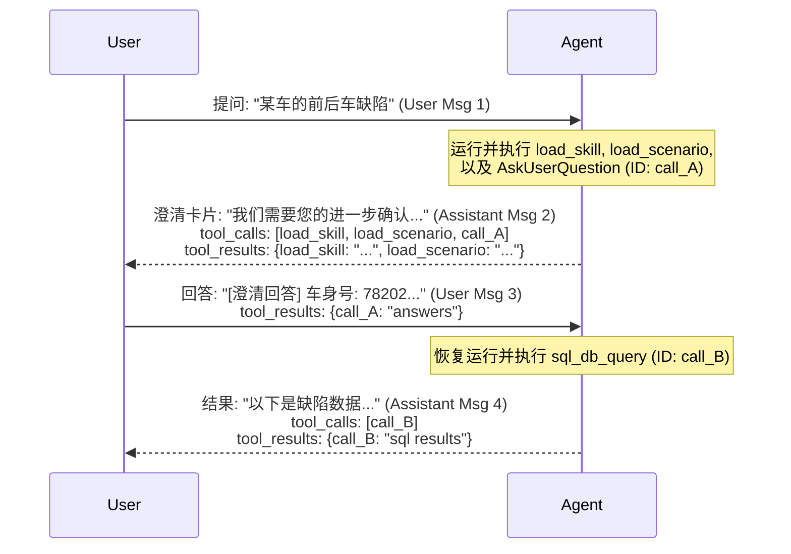

# 澄清交互场景下消息持久化与工具数据链关联分析报告

## 1. 现象诊断 (Anomalies & Phenomena)

在多轮澄清（例如调用 `AskUserQuestion` 并等待用户回复后恢复运行）的交互过程中，大模型工具链（如 `load_skill`、`load_scenario`、`AskUserQuestion`、`sql_db_query`）的物理存储发生严重的数据断层和错位：

1.  **多轮工具调用覆盖与合并**：数据库中只有最后一次工具调用的 ID（参数被强行串联拼接），前几轮的 SQL 执行结果被强行覆写丢失。
2.  **前置工具返回结果丢失**：前置工具 `load_skill` 和 `load_scenario` 虽被记录调用，但在数据库中没有任何字段记录它们的执行返回内容（`tool_results`）。
3.  **用户澄清答复 ID 断层**：用户表单的澄清回答作为 `user` 消息存入时，没有关联 `AskUserQuestion` 的工具调用 ID，关联链条在数据库关系中中断。
4.  **最终答复工具结果越界**：最后的最终 `assistant` 答复中并没有再次调用 `AskUserQuestion`，但其 `tool_results` 却包含了它的澄清答案，出现了错位和泄漏。

---

## 2. 根因分析 (Root Cause Analysis)

1.  **流式 Chunk ID 缺失碰撞**：
    在流式输出（Streaming）中，大模型生成的工具碎片 ID 只有在第一帧有值，后续均为 `None`。原逻辑只依靠局部的自增 `block_index = 0` 进行 fallback，导致在多轮 ReAct 交互中，新 Message 产生时 `block_index` 重计零，强行覆盖了已存在的键记录并累加参数文本。
2.  **中断时结果保存缺失**：
    后端 `/stream` 路由在遇到 `interrupt` 澄清提问挂起时，直接用硬编码的 `AskUserQuestion` 列表写入，完全忽略了内存中累积的 `tool_results_data` 缓存，导致在此之前执行完的工具结果（`load_skill`、`load_scenario`）被直接丢弃。
3.  **回答时 ID 匹配缺位**：
    `/resume` 接口保存用户消息时，未查询并提取上一条助理消息中该澄清工具的原生 ID，而是直接将表单字典作为 `tool_results` 落库。
4.  **恢复流事件防漏过滤缺位**：
    图恢复运行阶段会自动回放并输出 `AskUserQuestion` 的 `tool_result` 事件，后端未加拦截，导致其数据错位保存到了最终答复消息的结果中。

---

## 3. 完整系统化解决方案 (Systematic Solution)

我们基于**“一轮结束后统一保存”**与**“一比一 ID 强对齐”**的原则，实施了整体的架构重构：

### 3.1 大模型原生 `tool_call_id` 归一化
重构流式块收集方法，直接使用原生唯一 ID（如 `call_abcdef`）作为主键，通过 LangChain 的 `message.id`（分轮）+ `block_index`（分块）在内存中隔离匹配，确保多轮调用独立共存。

### 3.2 完整收网中断现场
在流式和恢复流发生挂起的 `interrupt` 节点，将内存中已经累积完成的工具调用（如 `load_skill` / `load_scenario` 并将其状态校正为 `"completed"`）以及对应的工具输出数据（`tool_results_data`）统一写入数据库。

### 3.3 问答 ID 交叉关联
用户回复时，倒序追溯最近的一条澄清工具 `AskUserQuestion` 的真实 ID（如 `call_A`），将用户答案包装为 `{"call_A": "answers"}` 形式作为该 `user` 消息的 `tool_results` 存储，建立跨消息的强映射。

### 3.4 恢复流数据去重隔离
在 `/resume` 循环中，主动拦截和 pop 剔除刚才已经恢复过的 `AskUserQuestion` 的 ID 结果，确保最终消息只保留本轮新工具（`sql_db_query`）的调用和返回。

---

## 4. 经验教训 (Lessons Learned)

1.  **流式 Chunk 状态的不连续性**：
    流式传输工具调用时，除首帧外其余帧的 ID 字段通常为空。系统必须通过分轮的 `message.id` 做主命名空间建立内存映射，以防止并发或多轮推理场景下的键冲突。
2.  **人机协同澄清卡片必须充当完整消息快照**：
    在 Agent 运行暂停的瞬间，所有在此之前的行为（如 `load_skill`）均已发生并扣费。必须一次性原子落库所有的调用和结果，保证数据库数据的完整，以防“平铺读取”历史记录时出现逻辑真空。
3.  **用户回答的本质是 Tool Result**：
    对于多轮协同的 Agent，用户的表单澄清回答应该以该澄清工具的原生 ID 为键名记录在 `tool_results` 中。通过追溯关联，可以在数据库中建立完美可还原的上下文关系，这对后续 Few-shot 自演进提炼起到了决定性的保障作用。
4.  **防范 Graph 回放事件产生的脏数据**：
    由于图恢复运行会重播上一个节点结果，API 在接收这些框架内回放事件时必须做智能去重和屏蔽，避免历史结果泄露到新轮次的答复中。
