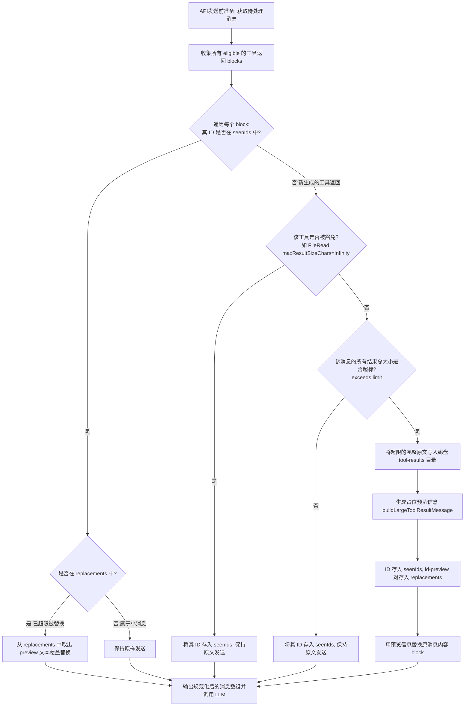
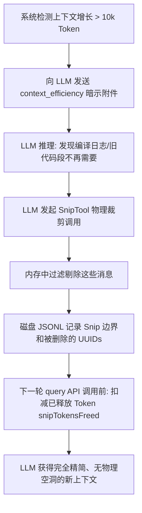

# Claude Code 上下文压缩机制深度解析：Tool Result Budget 与 Snip Compression

在面向开发场景的智能 Agent（如 Claude Code）中，上下文长度管理（Context Management）是决定其稳定性和运行成本的关键。在多轮对话中，工具执行产生的大量输出（如长篇编译日志、完整文件内容）会迅速消耗 Token，并破坏大模型的 **Prompt Cache（提示词缓存）**，导致成本和延迟呈指数级增长。

为了解决这一痛点，Claude Code 设计了两个互补的上下文压缩机制：
1. **Tool Result Budget（工具结果预算机制）**：系统级、自动触发的“就地内容块替换”机制。
2. **Snip Compression（剪裁压缩机制）**：模型级、自主决策的“整条消息级修剪”机制。

本篇报告将深度剖析这两套机制的原理、数据结构、代码实现与协同运作流程。

---

## 目录
1. [1. 核心术语与概念](#1-核心术语与概念)
2. [2. Tool Result Budget（工具结果预算机制）](#2-tool-result-budget工具结果预算机制)
   - [2.1 原理与设计目标](#21-原理与设计目标)
   - [2.2 流程图](#22-流程图)
   - [2.3 关键代码剖析](#23-关键代码剖析)
3. [3. Snip Compression（剪裁压缩机制）](#3-snip-compression剪裁压缩机制)
   - [3.1 原理与设计目标](#31-原理与设计目标)
   - [3.2 流程图](#32-流程图)
   - [3.3 对话链重链算法（Relinking）](#33-对话链重链算法relinking)
4. [4. 两者协同运作 lifecycle 示例](#4-两者协同运作-lifecycle-示例)

---

## 1. 核心术语与概念

| 术语 / 概念 | 定义与作用 | 对应源码位置 |
| :--- | :--- | :--- |
| **`tool_result`** | 大模型执行工具后返回的响应数据块，通常包含在发送给 API 的 `user` 角色消息中。 | [messages.ts](../src/utils/messages.ts) |
| **`ContentReplacementState`** | 会话（Session）级别的状态，用于记录和冷冻所有工具结果的替换决策，确保 Prompt Cache 不受历史重跑的影响。 | [toolResultStorage.ts](../src/utils/toolResultStorage.ts#L390) |
| **`seenIds`** | 存在于 `ContentReplacementState` 中的唯一 ID 集合 (`Set<string>`)。记录所有已评估过大小的 `tool_use_id`。一旦记录，决策即被“冻结”，后续轮次绝不重新评估。 | [toolResultStorage.ts](../src/utils/toolResultStorage.ts#L391) |
| **`replacements`** | 存在于 `ContentReplacementState` 中的键值对映射 (`Map<string, string>`)。记录被替换工具结果的 `tool_use_id` 到其**具体的占位预览文本**。 | [toolResultStorage.ts](../src/utils/toolResultStorage.ts#L392) |
| **`context_efficiency`** | 一种系统附加给 LLM 的效率暗示（Nudge）附件。当未剪裁的上下文增长达到设定步调（如 10k Token）时自动注入，提醒大模型调用 `Snip` 清理记忆。 | [attachments.ts](../src/utils/attachments.ts#L3959) |
| **`Snip` 工具** | 供大模型调用的系统工具，用于根据短 ID 批量从会话历史中删除消息。 | [tools.ts](../src/tools.ts#L124) |
| **`snipMetadata`** | 附带在边界消息中的元数据，记录了被剪裁消息的 UUID 列表。在会话恢复时作为“剪裁重播记录”。 | [sessionStorage.ts](../src/utils/sessionStorage.ts#L2015) |

---

## 2. Tool Result Budget（工具结果预算机制）

### 2.1 原理与设计目标
这是一个**系统自动执行的“防御性”拦截机制**。在 API 发送前，如果发现单条消息中工具返回的字符数总和超出了安全阈值，系统会将超限数据块持久化写入本地磁盘，并在发给 LLM 的 Payload 中将该内容替换为预览占位符。
* **主要目标**：将大文本剥离至本地磁盘，防止单次大吞吐直接耗尽 Token。
* **二级目标（冷冻决策）**：通过 `seenIds` 冻结以往每一轮的替换决策，保证多次请求中历史消息的字节序列绝对一致，最大化 **Prompt Cache** 命中率。

### 2.2 流程图



### 2.3 关键代码剖析
在系统评估预算时，核心入口是 [toolResultStorage.ts](../src/utils/toolResultStorage.ts) 的 [enforceToolResultBudget](../src/utils/toolResultStorage.ts#L769)。

#### 豁免工具机制：防止“套娃预览”
当模型发现预览不够，使用文件读取工具 `FileRead` 去读取磁盘中的原文时，该行为本身又是一个工具返回。为了防止它再次被替换成预览（无限套娃），系统对无上限的工具进行了硬性判定：
```typescript
// src/utils/toolResultStorage.ts
export function getPersistenceThreshold(
  toolName: string,
  declaredMaxResultSizeChars: number,
): number {
  // Infinity = hard opt-out. 
  // 读取工具的 maxResultSizeChars 是无限制的，永远豁免拦截
  if (!Number.isFinite(declaredMaxResultSizeChars)) {
    return declaredMaxResultSizeChars
  }
  return Math.min(declaredMaxResultSizeChars, DEFAULT_MAX_RESULT_SIZE_CHARS)
}
```

---

## 3. Snip Compression（剪裁压缩机制）

### 3.1 原理与设计目标
这是一个**大模型主动决策的“智能清理”机制**。当对话历史中积累了太多冗余信息（哪怕是之前替换的预览提示）导致上下文膨胀时，大模型在系统暗示下，调用 `Snip` 工具彻底将指定的历史消息从上下文数组中剥离。
* **主要目标**：由 LLM 担当大脑，主动辨别和删除不再具有时效性的历史消息，进行“垃圾回收”。
* **难点攻克（断档自愈）**：因为磁盘转录日志是只增不减（Append-only）的，为了防止重启会话时重新载入已被删消息引起“断档”，系统在反序列化时自动进行“父子链重链缝合”。

### 3.2 流程图



### 3.3 对话链重链算法（Relinking）
当会话重新恢复（Resume）时，已删除的消息使得剩下的消息的 `parentUuid` 指向了一个在 Map 中不存在的“空节点”。这会导致历史遍历中断。
在 [sessionStorage.ts](../src/utils/sessionStorage.ts) 的 [applySnipRemovals](../src/utils/sessionStorage.ts#L2011) 函数中，系统采用**路径压缩（Path Compression）**追溯算法将被裁剪节点的后继者与前驱者缝合在一起：

```typescript
// src/utils/sessionStorage.ts:2043-2056
const resolve = (start: UUID): UUID | null => {
  const path: UUID[] = []
  let cur: UUID | null | undefined = start
  
  // 沿着被删节点的父节点链往回追溯，直至找到第一个没被删除的生存节点
  while (cur && toDelete.has(cur)) {
    path.push(cur)
    cur = deletedParent.get(cur)
    if (cur === undefined) {
      cur = null
      break
    }
  }
  
  // 路径压缩：将这一条链路上所有已删节点的 parent 直接映射为最终的生存节点
  for (const p of path) deletedParent.set(p, cur)
  return cur
}

// 遍历 Map，如果有任何生存消息的 parent 节点属于已删除节点，强行重链
for (const [uuid, msg] of messages) {
  if (!msg.parentUuid || !toDelete.has(msg.parentUuid)) continue
  messages.set(uuid, { ...msg, parentUuid: resolve(msg.parentUuid) })
}
```

---

## 4. 两者协同运作 lifecycle 示例

这里以一个典型的大型报错输出为例，展示两套机制如何紧密配合：

```text
 步骤 1: 产生大日志 (150KB)
   │     • Claude 运行 npm test 产生 150KB 巨量测试日志。
   ▼
 步骤 2: 预算拦截 (Tool Result Budget)
   │     • 底层代码发现超标，将 150KB 日志存入磁盘 tool-results 目录。
   │     • API 交互中，将该工具返回内容就地替换为 2KB 预览占位符。
   │     • 该 ID 写入 seenIds，占位文本写入 replacements。
   ▼
 步骤 3: 局部回溯 (LLM Precise Reading)
   │     • Claude 从 2KB 预览发现第 450 行代码有致命报错。
   │     • Claude 发起 FileRead 调用读取该文件的第 440~460 行。
   │     • 豁免机制触发：FileRead 免于拦截，Claude 顺利阅读这 20 行原文。
   ▼
 步骤 4: 暗示清理 (Efficiency Nudge)
   │     • 经过几轮对话，BUG 修复完毕，上下文又增长了 10k Token。
   │     • 系统追加 context_efficiency 系统附件暗示。
   ▼
 步骤 5: 物理剪裁 (Snip Compression)
         • Claude 评估：“BUG 已修好，先前的测试预览消息已经没用了”。
         • Claude 调用 Snip 彻底将那条 2KB 的预览消息删除。
         • 内存过滤并修正计算 snipTokensFreed。
         • 后续对话历史再次回归极致清爽。
```

通过这一套**前端静态拦截**与**后端智能回收**的完美配合，Claude Code 在多轮极端交互下，既能保持出色的代码分析精度，又将 Token 浪费限制在了绝对的极低水平。
