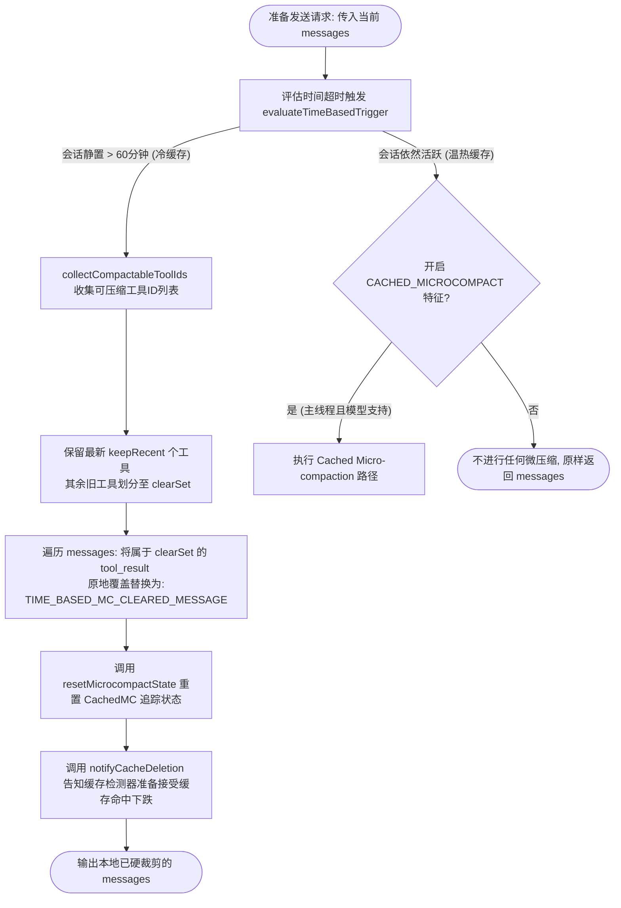
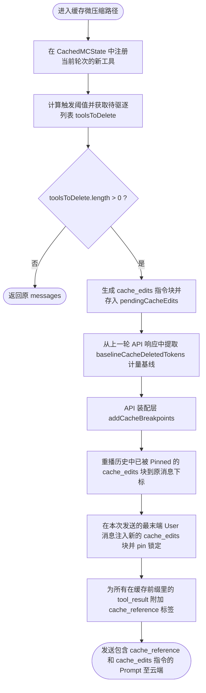

# Claude Code 核心架构：Micro-compaction（微压缩）机制深度解析

在 Claude Code 的多级消息压缩体系中，**Micro-compaction（微压缩）** 属于第二级压缩机制。其设计初衷是：当会话逐渐拉长、历史工具执行结果堆积导致 Token 压力上升时，在不影响大模型核心任务逻辑、且尽可能避免破坏 API 提示词缓存（Prompt Cache）的前提下，对可压缩工具的执行结果进行高频的微调裁减。

---

## 目录
1. [1. 核心原理：冷热双轨运行机制](#1-核心原理冷热双轨运行机制)
   - [轨 A：基于时间的微压缩 (Time-based)](#轨-a基于时间的微压缩-time-based-micro-compaction--针对冷缓存)
   - [轨 B：基于缓存编辑的微压缩 (Cached)](#轨-b基于缓存编辑的微压缩-cached-micro-compaction--针对热缓存)
2. [2. 核心术语与关键名称](#2-核心术语与关键名称)
3. [3. 双轨判定与执行流程图](#3-双轨判定与执行流程图)
   - [3.1 微压缩分发入口与轨 A 流程](#31-微压缩分发入口与轨-a时间微压缩流程)
   - [3.2 轨 B 详细装配流程](#32-轨-b缓存编辑微压缩详细装配流程)
4. [4. 机制细节与联动保障](#4-机制细节与联动保障)
5. [5. 轨 A 与 轨 B 对比总结](#5-轨-a-与-轨-b-对比总结)
6. [6. 运行场景示例](#6-运行场景示例)
   - [示例 1：轨 A 原地替换后的消息数据结构](#示例-1轨-a-原地替换后的消息数据结构)
   - [示例 2：大模型在此场景下的逻辑自愈](#示例-2大模型在此场景下的逻辑自愈)
7. [7. 深入阅读](#7-深入阅读)

---

## 1. 核心原理：冷热双轨运行机制

微压缩并不是单一的行为，而是根据用户会话的闲置状态，在客户端设计了 **“一冷一热” 双轨自适应机制**：

### 轨 A：基于时间的微压缩 (Time-based Micro-compaction) —— 针对“冷缓存”
*   **适用场景**：当会话由于用户思考或离开出现较长静置时间（差值大于配置的 `gapThresholdMinutes`，通常为 60 分钟），使得服务端的 Prompt Cache 很可能已经自动过期（Cold Cache）时。
*   **动作策略**：既然服务端缓存已经失效，下一次请求必须重新上传全部上下文并重算缓存，系统便直接**修改本地内存与历史消息**。它会把较旧的可压缩工具结果原文清空，原地替换为微型占位文本 `[Old tool result content cleared]`（常量：`TIME_BASED_MC_CLEARED_MESSAGE`）。
*   **收益**：通过在本地剔除无缓存价值的巨大旧日志、旧代码块，极大地减小了重新建立缓存时的网络开销和 Token 费用。

### 轨 B：基于缓存编辑的微压缩 (Cached Micro-compaction) —— 针对“热缓存”
*   **适用场景**：当用户正在与 Agent 持续高速交互，服务端缓存完全温热（Hot Cache）时。
*   **动作策略**：为了保证 Prompt Cache 高命中率，**绝不修改本地消息文本**。系统借助于供应商 API 专有的 **Cache Editing（缓存编辑）** 指令，在序列化时对需要删除的工具块自动贴上 `cache_reference` 引用标记，并在请求体中携带 `cache_edits` 指令包指示云端精准驱逐特定的缓存页面，而保持整个 Prompt 的逻辑位置和字节指纹对齐。
*   **收益**：在 100% 维持 Prompt Cache 命中的情况下，动态释放云端多余的 Token 负载。

---

## 2. 核心术语与关键名称

| 术语 / 关键名称 | 作用与定义说明 | 关联源文件与代码位置 |
| :--- | :--- | :--- |
| **`COMPACTABLE_TOOLS`** | **可压缩工具白名单**。只有在此白名单中的工具结果才会被微压缩清理（包含 `view_file`、`run_command`、`grep_search`、`list_dir` 等 I/O 高吞吐工具）。 | [microCompact.ts:L41-L50](file:///f:/000_dev/github/cc-haha/src/services/compact/microCompact.ts#L41-L50) |
| **`TIME_BASED_MC_CLEARED_MESSAGE`** | 轨 A 模式下原地替换的大文本清理占位符：`[Old tool result content cleared]`。 | [microCompact.ts:L36](file:///f:/000_dev/github/cc-haha/src/services/compact/microCompact.ts#L36) |
| **`gapThresholdMinutes`** | 判定会话超时并失效的静置阈值（默认 60 分钟，读取 GrowthBook 的 `tengu_slate_heron` 特征配置）。 | [timeBasedMCConfig.ts:L32](file:///f:/000_dev/github/cc-haha/src/services/compact/timeBasedMCConfig.ts#L32) |
| **`keepRecent`** | 保护窗口期。微压缩执行时，强制予以保留的最近工具调用的个数（至少保留 1 个以供大模型感知当下的任务进展）。 | [timeBasedMCConfig.ts:L33](file:///f:/000_dev/github/cc-haha/src/services/compact/timeBasedMCConfig.ts#L33) |
| **`cache_reference`** | API 层为缓存前缀中的 `tool_result` 块贴上的唯一哈希引地址（其值为 `tool_use_id`），提供云端精准编辑的寻址基准。 | [claude.ts:L3271-L3274](file:///f:/000_dev/github/cc-haha/src/services/api/claude.ts#L3271-L3274) |
| **`cache_edits`** | API 封装层拼接的一组缓存编辑动作块，通知云端驱逐特定 `cache_reference` 对应的 KVCC 页面。 | [claude.ts:L3120-L3123](file:///f:/000_dev/github/cc-haha/src/services/api/claude.ts#L3120-L3123) |
| **`pinnedEdits`** | 缓存编辑锚定机制。一旦在某条 User 消息处执行了 `cache_edits`，便会将其锚定并在后续交互中固定重播，以此维持前缀哈希一致。 | [microCompact.ts:L111-L118](file:///f:/000_dev/github/cc-haha/src/services/compact/microCompact.ts#L111-L118) |

---

## 3. 双轨判定与执行流程图

### 3.1 微压缩分发入口与轨 A（时间微压缩）流程


### 3.2 轨 B（缓存编辑微压缩）详细装配流程


---

## 4. 机制细节与联动保障

微压缩在客户端不仅仅是改改字符，而是与系统的**自愈、检测和交互**模块有着深度的耦合关系：

1.  **防 API 配对报错保障**：
    由于大模型 API 强制要求每一个 Assistant 发出的 `tool_use` 必须有一条 User 提供的 `tool_result` 对应，微压缩在轨 A 剪裁时，**绝不物理删除消息块的外壳和 `tool_use_id`**，只是将其核心的文本内容覆盖为微小的占位符。
2.  **重置自愈机制 (`resetMicrocompactState`)**：
    当轨 A 进行原地硬替换修改了 Prompt 后，由于本地消息内容彻底变了，之前在轨 B 中追踪的缓存页引用地址全部失效。因此，轨 A 在剪裁完成后，会立刻强行清空并重置 Cached MC 的追踪状态，防止下一轮轨 B 引用已不存在的页面。
3.  **拦截检测器误报 (`notifyCacheDeletion`)**：
    系统内存在 `PROMPT_CACHE_BREAK_DETECTION` (缓存断档泄漏检测器)。微压缩主动裁减缓存会导致下一次请求的缓存命中率暴跌。为了防止检测器触发告警误报，微压缩在裁剪后，会主动向检测器发送信号，使其知晓并忽略本轮由于自愿清理导致的命中下跌。

---

## 5. 轨 A 与 轨 B 对比总结

| 对比维度 | 轨 A：基于时间的微压缩 (Time-based) | 轨 B：基于缓存编辑的微压缩 (Cached) |
| :--- | :--- | :--- |
| **修改对象** | **本地消息列表（Messages）**。原地将大文本替换为占位符。 | **不修改本地消息**。通过 API Request Body 传入 `cache_edits` 指令。 |
| **缓存状态** | **冷缓存（Cold Cache）**。静置超时后发生。 | **热缓存（Hot Cache）**。在快速连续的交互期间发生。 |
| **缓存影响** | **破坏缓存前缀**。下一次请求需要重新计算缓存。 | **完美保留缓存命中**。通过 Cache Editing 精准操作，不破坏前缀哈希。 |
| **持久化** | **随 Session 写入磁盘**。会永久保存在本地会话历史中。 | **纯内存状态**。只存在于运行时的 State，随进程消亡。 |
| **Token计量** | 发送请求前通过估算即可得知省下的 Token。 | 发送请求前无法预知。需等 API 回包后从 `cache_deleted_input_tokens` 获得真实计量。 |
| **供应商依赖** | **无依赖**。通用文本协议，OpenAI、Qwen 或本地模型均可兼容。 | **强依赖**。必须大模型服务商 API 和推理端（如 Anthropic mycro 缓存页管理器）原生提供协议配合。 |

---

## 6. 运行场景示例

### 示例 1：轨 A 原地替换后的消息数据结构
当会话超时，前 10 个工具中的前 5 个被微压缩硬替换，API 实际接收的消息 Payload 结构如下：
```json
[
  {
    "role": "assistant",
    "content": [
      {
        "type": "tool_use",
        "id": "tool_use_111",
        "name": "run_command",
        "input": {"command": "bun test"}
      }
    ]
  },
  {
    "role": "user",
    "content": [
      {
        "type": "tool_result",
        "tool_use_id": "tool_use_111",
        "content": "[Old tool result content cleared]" // 原本 150KB 的测试日志被直接擦除并写上此标记
      }
    ]
  }
]
```

### 示例 2：大模型在此场景下的逻辑自愈
当模型面对被清空内容的工具结果，且在后续对话中突然需要使用该信息时，它的思考流与行为变化：
*   **输入提示**：“请基于刚才 `run_command` 的测试结果进行修复。”
*   **上下文感知**：模型发现 `tool_use_id: tool_use_111` 对应的 content 被替换为 `[Old tool result content cleared]`。
*   **模型动作**：模型得知内容由于超时过期，它不会产生幻觉去虚构日志，而是理智地再次发起调用：
    ```json
    {
      "type": "tool_use",
      "id": "tool_use_222",
      "name": "run_command",
      "input": {"command": "bun test"}
    }
    ```
    再次读取最新的测试数据，从而在客户端与 API 交互层面完成自愈与闭环。

---

## 7. 深入阅读
*   状态机的第一级压缩机制设计：[02_上下文压缩与持久化机制.md](file:///f:/000_dev/github/cc-haha/learns/02_%E4%B8%8A%E4%B8%8B%E6%96%87%E5%8E%8B%E7%BC%A9%E4%B8%8E%E6%8C%81%E4%B9%85%E5%8C%96%E6%9C%BA%E5%88%B6.md)
*   核心装配实现逻辑：[claude.ts](file:///f:/000_dev/github/cc-haha/src/services/api/claude.ts#L3131-L3281)
*   微压缩决策逻辑模块：[microCompact.ts](file:///f:/000_dev/github/cc-haha/src/services/compact/microCompact.ts)
