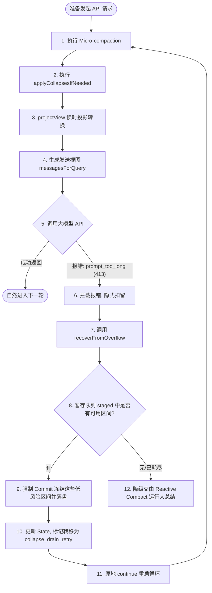

# Claude Code 核心架构：Context Collapse（上下文折叠）机制深度解析

在 Claude Code 的多级上下文管理与压缩体系中，**Context Collapse（上下文折叠）** 属于第三级渐进式压缩机制。相比于简单的文本裁减（第一级 Tool Result Budget）和盲目清理（第二级 Micro-compaction），它是一套**语义感知（Semantic-aware）**、**只读投影（Read-time Projection）** 的智能上下文优化系统。

---

## 目录
1. [1. 核心设计哲学与“读时投影”](#1-核心设计哲学与“读时投影”)
2. [2. 核心术语与定义](#2-核心术语与定义)
3. [3. 暂存与提交双轨机制](#3-暂存与提交双轨机制)
   - [3.1 后台代理 marble_origami](#31-后台代理-marble_origami)
   - [3.2 判定条件与风险评估 (Risk Assessment)](#32-判定条件与风险评估-risk-assessment)
4. [4. 执行流程与流水线顺序](#4-执行流程与流水线顺序)
   - [4.1 正常发送流程与投影转换](#41-正常发送流程与投影转换)
   - [4.2 溢出恢复与自愈 (recoverFromOverflow)](#42-溢出恢复与自愈-recoverfromoverflow)
   - [4.3 核心流程图](#43-核心流程图)
   - [4.4 与微压缩 (Micro-compaction) 的协同接力顺序](#44-与微压缩-micro-compaction-的协同接力顺序)
5. [5. 数据结构与持久化示例](#5-数据结构与持久化示例)
   - [5.1 事务日志中的 Commit 记录 (marble-origami-commit)](#51-事务日志中的-commit-记录-marble-origami-commit)
   - [5.2 事务日志中的 Snapshot 暂存记录 (marble-origami-snapshot)](#52-事务日志中的-snapshot-暂存记录-marble-origami-snapshot)
   - [5.3 LLM 接收到的 API 投影 Payload 示例](#53-llm-接收到的-api-投影-payload-示例)

---

## 1. 核心设计哲学与“读时投影”

在长对话和复杂的 Agent 交互中，直接删除历史消息会导致大模型“失忆”，而直接重写本地的历史消息又会破坏 API 的 **Prompt Cache（提示词缓存）**，导致成本和延迟飙升。

为此，Claude Code 引入了 **“读时投影”（Read-Time Projection）** 的设计：
1. **本地完整保留**：用户本地磁盘上的会话记录（`.jsonl` 文件）和屏幕终端渲染的交互历史是**原封不动、完全保留**的。用户往上滚动鼠标，依然能看到最原始的聊天、代码和报错日志。
2. **发送临时替换**：只有在向大模型 API 发起请求的那一瞬间，系统会调用转换管道（`projectView`），根据已记录的折叠决策，在内存中过滤掉被折叠的原始消息，并在对应位置塞入**预先生成好的局部摘要（Summary）**。
3. **承上启下**：这使得大模型既不需要阅读几万行的过期工具日志，又保留了历史交互的“大局观”和“最终结论”。

> [!NOTE]
> Context Collapse 在流水线中排在 Autocompact（第四级，全局大纲合并）之前。如果局部折叠能把 Token 数量控制在安全水位内，Autocompact 就会被判定为 No-op，从而最大化为大模型保留了其余关键上下文的细粒度细节。

---

## 2. 核心术语与定义

| 术语 / 关键名称 | 作用与定义说明 | 关联源文件与代码位置 |
| :--- | :--- | :--- |
| **`marble_origami`** | **Context Collapse 的系统内部代号与后台子代理（Context Agent）**。系统通过在后台异步调用该子代理来扫描历史并做出折叠决策。 | [autoCompact.ts:L180](file:///f:/000_dev/github/cc-haha/src/services/compact/autoCompact.ts#L180) |
| **`ContextCollapseCommitEntry`** | **确认折叠提交记录**。代表已经被永久确立并落盘的折叠段落，其事件类型（`type`）在 `.jsonl` 事务日志中被标记为 `'marble-origami-commit'`。 | [logs.ts:L255](file:///f:/000_dev/github/cc-haha/src/types/logs.ts#L255) |
| **`ContextCollapseSnapshotEntry`** | **暂存区快照记录**。记录当前处于“待折叠队列”（`staged`）中的候选区间、评估风险度以及子代理的时钟触发状态，事件类型标记为 `'marble-origami-snapshot'`。 | [logs.ts:L282](file:///f:/000_dev/github/cc-haha/src/types/logs.ts#L282) |
| **`staged` 队列** | 存放已经被后台子代理划定为折叠候选、但**尚未真正提交（未被替换）**的区间列表。 | [logs.ts:L285](file:///f:/000_dev/github/cc-haha/src/types/logs.ts#L285) |
| **`risk` (风险值)** | 后台子代理评估折叠该区间对当前任务造成“失忆”影响的概率，介于 `0` 到 `1` 之间。越是已经结案的讨论，风险值越低。 | [logs.ts:L289](file:///f:/000_dev/github/cc-haha/src/types/logs.ts#L289) |
| **`recoverFromOverflow`** | 溢出恢复自愈函数。当发生 `prompt_too_long` (HTTP 413) 错误时，状态机拦截报错并调用此函数，将暂存队列中的低风险段落强制提交（Drain）并重试 API。 | [query.ts:L1102](file:///f:/000_dev/github/cc-haha/src/query.ts#L1102) |

---

## 3. 暂存与提交双轨机制

Context Collapse 的判断与执行采用**异步决策、延迟提交**的双轨设计：

### 3.1 后台代理 marble_origami
为了不阻塞用户的终端交互，系统在后台开启一个轻量级的子任务线程（代号 `marble_origami`）。它会静默扫描当前的消息链，主要寻找以下区间：
1. **“非活动”的历史工具块**：例如前面轮次中运行过的 `grep_search`、`run_command` 的庞大日志输出。
2. **已经解决的旧讨论**：例如在第 N 轮中被修复的 Bug 讨论，以及对应的大片代码段。

> [!TIP]
> 最近的几轮对话（最新窗口）属于保护区，子代理绝不会将其划入折叠范围，以保障模型维持实时的交互直觉。

### 3.2 判定条件与风险评估 (Risk Assessment)
子代理并不会无脑折叠。它会运用模型推理对每个划分出的区间（由 `startUuid` 和 `endUuid` 别针定位）进行 `risk` 评分：
* **低风险 (Risk 偏低)**：Bug 已经修复、编译已经通过、或者临时性的只读搜索。这些区间的原文即使被局部摘要替代，对后文的干扰也极小。
* **高风险 (Risk 偏高)**：用户刚提出的核心需求、目前还在持续调试中的功能段。折叠会导致模型对未完结的任务产生幻觉。

评估完成后，这些区间信息被连同预先写好的 `summary` 存入 `staged` 队列中，保持“待命”状态。

---

## 4. 执行流程与流水线顺序

### 4.1 正常发送流程与投影转换
每次 `query()` 发送请求前：
1. 运行 `applyCollapsesIfNeeded`。
2. 调用 `projectView` 读取已存在的 `ContextCollapseCommitEntry` 提交记录。
3. 检查是否有 `staged` 队列中低风险且需要提前释放的区间，将其升级并提交。
4. 将被折叠范围的消息从发送数组临时剔除，缝入 `summaryContent`（包含占位 ID 的摘要块），更新后继消息的 `parentUuid` 指向，生成临时的 API 视图并发送。

### 4.2 溢出恢复与自愈 (recoverFromOverflow)
当大模型 API 返回了 `prompt_too_long` (413) 超限错误时：
1. 状态机在流式监听中拦截此报错，**不输出给用户**。
2. 调用 `recoverFromOverflow`。
3. **Drain（排空）暂存区**：立刻将 staged 队列中按风险度排序的低风险区间强制转化为真正的 Commit（写入 `.jsonl` 落盘并锁定）。
4. 状态机修改 `transition.reason` 为 `collapse_drain_retry`。
5. 原地 `continue` 重新发起 API 请求，实现**零延迟的静默自愈重试**。

### 4.3 核心流程图



### 4.4 与微压缩 (Micro-compaction) 的协同接力顺序

在每次 `query()` 的真实物理流水线中，它们按照以下严格的**接力顺序**运行：

1. **第一关：Micro-compaction (微压缩)**：
   * 优先运行。它以最快的速度、硬性规则对旧工具输出做无脑清扫（将日志内容改写为 `[Old tool result content cleared]`）。
   * **作用**：大面积削减原始消息的体积，为后续的语义折叠准备“已经打扫干净”的精简消息链，**大幅降低了后续折叠代理处理时的 Token 开销**。
2. **第二关：Context Collapse (上下文折叠)**：
   * 随后运行。在干净的链条上，加载已有的 Commit 日志，或者由代理评估并暂存。它不擦除文字，而是将**整轮对话的来龙去脉**提炼为一句有语义的 Summary 并在投影中替代原消息段落。
3. **第三关：Autocompact (全局合并)**：
   * 最后防线。如果前两者都运行了，Token 依然面临超限，才无奈启动大纲化合并，擦除所有多轮对话结构。

---

## 5. 数据结构与持久化示例

### 5.1 事务日志中的 Commit 记录 (marble-origami-commit)
当一个区间被正式折叠提交时，本地 `.jsonl` 事务日志会追加一行如下的 JSONL 记录（以 UUID 指针关联原始消息）：

```json
{
  "type": "marble-origami-commit",
  "sessionId": "a1b2c3d4-e5f6-7a8b-9c0d-1e2f3a4b5c6d",
  "collapseId": "9876543210123456",
  "summaryUuid": "f47ac10b-58cc-4372-a567-0e02b2c3d479",
  "summary": "之前我们讨论了如何排查登录 Bug，通过 run_command 发现是 .env 文件的 DB_PORT 错误，并将其修改为了 3306。",
  "summaryContent": "<collapsed id=\"9876543210123456\">之前我们讨论了如何排查登录 Bug，通过 run_command 发现是 .env 文件的 DB_PORT 错误，并将其修改为了 3306。</collapsed>",
  "firstArchivedUuid": "11111111-2222-3333-4444-555555555555",
  "lastArchivedUuid": "99999999-8888-7777-6666-555555555555"
}
```

### 5.2 事务日志中的 Snapshot 暂存记录 (marble-origami-snapshot)
后台代理 `marble_origami` 执行完毕后，更新并覆盖的暂存区快照示例：

```json
{
  "type": "marble-origami-snapshot",
  "sessionId": "a1b2c3d4-e5f6-7a8b-9c0d-1e2f3a4b5c6d",
  "staged": [
    {
      "startUuid": "88888888-4444-4444-4444-1234567890ab",
      "endUuid": "cccccccc-dddd-eeee-ffff-1234567890ab",
      "summary": "用户运行 grep_search 搜索 config 目录，未找到相关的端口定义。",
      "risk": 0.12,
      "stagedAt": 1781385600000
    }
  ],
  "armed": true,
  "lastSpawnTokens": 45200
}
```

### 5.3 LLM 接收到的 API 投影 Payload 示例
在发送前，原始的 **第 3 到第 5 轮对话（UUID 在对应范围内的消息）** 被剔除，大模型实际接收到的 Payload 列表被映射组装为：

```json
[
  {
    "role": "user",
    "content": "请帮我看看商品列表为什么没有渲染。"
  },
  {
    "role": "assistant",
    "content": [
      {
        "type": "text",
        "text": "<collapsed id=\"9876543210123456\">之前我们讨论了如何排查登录 Bug，通过 run_command 发现是 .env 文件的 DB_PORT 错误，并将其修改为了 3306。</collapsed>\n\n好的，我来检查商品列表的代码。请问目前运行有什么报错日志吗？"
      }
    ]
  }
]
```

通过这一套优雅的**后台只读映射**与**主会话延迟替换**，Claude Code 成功在大数据量交互中做到了既“目明心亮”又“极度省钱”。
