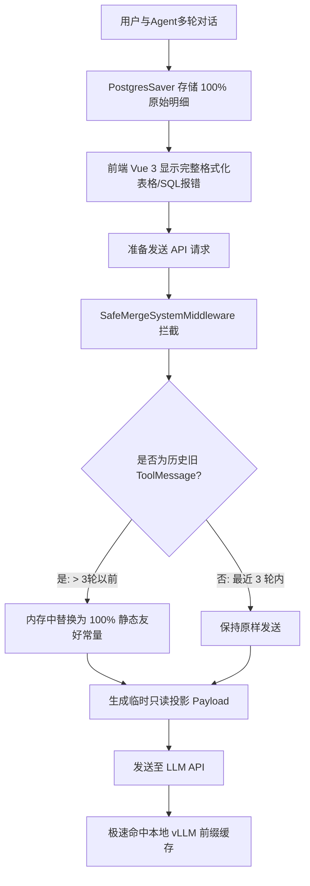

# Claude Code 上下文管理机制在 SQL Agent 系统中的借鉴与落地方案分析报告

本报告旨在评估 Claude Code 的上下文压缩与管理机制，结合本项目的核心架构（FastAPI + LangGraph + Vue 3），分析其对多会话 SQL Agent 系统的借鉴价值，并提出具体的落地方案、实施路径及优先级。

---

## 1. 痛点分析：当前 SQL Agent 的上下文瓶颈

在我们目前的大模型 SQL Agent 架构中，由于数据查询、多轮纠错以及 Few-shot 检索的业务特性，多轮对话下正面临以下瓶颈：

1. **“破坏性压缩”降低了前端交互体验**
   * **现状**：目前系统挂载的 `SummarizationMiddleware` 是“破坏性”的。当 Token 累计达到阈值（约 9000 Token）时，中间件会直接调用模型对历史消息进行摘要，并**在 Graph State 中重写消息列表**。
   * **痛点**：由于消息被原地覆盖，前端 Web UI（Vue 3）中原本格式化良好的数据表格、SQL 成功执行记录以及报错明细都会从聊天气泡里“消失”或变成干瘪的摘要文本，严重损害了用户回顾历史数据的体验。
2. **多轮调试报错导致 “Attention 污染”**
   * **现状**：SQL Agent 经常需要多次调试 SQL（执行 -> 语法错/运行时错 -> LLM 修正 -> 再次执行）。
   * **痛点**：这些失败的 `ToolMessage` 报错 Traceback 会残留在 Chat History 中。大模型在后续决策中读取到这些“历史写错的 SQL”时，容易产生直觉游离和认知干扰，导致多次重试依然写错。
3. **“暴力截断”限制了数据的深度分析**
   * **现状**：[sql_tools.py](file:///f:/000_dev/Python/workplace/rearch_agent/.tree/features/agent/backend/app/agent/tools/sql_tools.py) 为了防止单次巨量数据撑爆 LLM 窗口，实现了 Hard Limit（如截断并只返回 5 行预览）。
   * **痛点**：数据被彻底抛弃。如果 LLM 想要分析或查找未在这 5 行预览里的其他关键行，大模型无能为力，也无法在不重新请求数据库的情况下进行回溯。
4. **本地 vLLM 前缀缓存 (Prefix Caching) 频繁失效**
   * **现状**：在本地 RTX 5090 部署场景下，Prefix Caching 极度依赖 Prompt 字节指纹的一致性。
   * **痛点**：由于多次调用 SQL 执行、Few-shot 检索、以及对话历史的硬写入，历史消息指纹频繁震荡，导致首字延迟（TTFT）大幅升高。

---

## 2. 借鉴与落地：三大推荐解决方案

借鉴 Claude Code 的 `Tool Result Budget`、`Micro-compaction` 与 `Context Collapse (Read-Time Projection)`，我们针对本 SQL Agent 系统量身定制了以下三个解决方案。

### 💡 方案一：基于“读时投影 (Read-Time Projection)”的非破坏性折叠中间件

#### 2.1.1 原理设计
* **前端与数据库（真身）**：用户在 Web 界面看到的聊天气泡、数据库中由 PostgresSaver 持久化的消息记录保持 **100% 原始、完整**。
* **API 请求前（投影）**：在 [safe_merge_middleware.py](file:///f:/000_dev/Python/workplace/rearch_agent/.tree/features/agent/backend/app/agent/middleware/safe_merge_middleware.py) 执行合并系统消息和发送 API 的最后一刻，在内存中生成一个“投影”消息列表（不修改 Graph State 中的真实历史）。
* **折叠逻辑**：
  * 保留最近 $N$ 轮（如 3 轮）的原始工具执行结果。
  * 将第 $N$ 轮之前的、体积庞大的 `sql_db_query` 返回值（ToolMessage）或 `search_saved_correct_tool_uses` 返回值，就地替换为 100% 纯静态的友好占位常量，例如：
    `[SQL execution successful. Result content collapsed. Re-run query if details are needed.]`
  * 原本可能长达数万字符的历史消息链被瞬间压缩到极其微小的静态常量，使得历史前缀字节序列序列绝对保持稳固，极大地保障了 vLLM / 云端模型的 **Prefix Caching 命中率**。

---

### 💡 方案二：大模型主导的“历史垃圾清理”（Snip 机制）

#### 2.2.1 原理设计
* 针对多轮 SQL 调试过程中产生的**连续报错**，赋予 LLM 主动清理自身历史噪音的权力。
* 给 SQL Agent 挂载一个新工具：`snip_error_history(failed_tool_use_ids: list[str])`。
* **运作流**：
  1. LLM 连续尝试了 3 次 SQL，前两次因为语法错误被 `sql_db_query` 报错打回。
  2. 第三次大模型修改 SQL 成功，数据库返回了正确的数据。
  3. 大模型在最终推理回复用户之前，**自主触发** `snip_error_history`。
  4. 系统接收命令后，从内存中的历史消息链中**剔除**前两次报错的 `ToolMessage` 及其对应的 `AssistantMessage`。
  5. **收益**：大模型下一次对话时将完全摆脱先前错误 SQL 信息的干扰，实现完美的“自我降噪”。

---

### 💡 方案三：缓存写盘与“局部回溯”读取工具

#### 2.3.1 原理设计
* 改变目前 `sql_tools.py` 遇到 Hard Limit 就直接丢弃剩余数据的做法，建立如同 `Tool Result Budget` 的物理冷冻机制。
* **数据冷冻**：当 `sql_db_query` 查出 1000 行（超限），系统在后台将其完整以 JSON/CSV 形式写入服务器的 `/temp_query_results/{query_id}.json`，并在返回给 LLM 的 `ToolMessage` 里给出警告和临时 `query_id`：
  `⚠️ SYSTEM WARNING: 查询结果已超限。以下仅展示前 5 行预览。全量数据已写盘，ID: q_872ad1`
* **回溯工具**：新增 `read_query_result_lines(query_id: str, start_line: int, end_line: int)` 豁免工具。
* **收益**：当大模型通过前 5 行预览发现有必要查看第 6-20 行数据时，可以直接调用 `read_query_result_lines("q_872ad1", 6, 20)`，精准读取物理缓存文件，无需再次执行繁重的数据库查询。

---

## 3. 落地实施路线图与优先级划分

综合**开发成本**、**系统性能提升**和**用户交互体验的优化程度**，我们为这三套解决方案划分了明确的实施优先级：

| 优先级 | 解决方案 | 核心改动点 | 开发成本 | 收益评估 |
| :---: | :--- | :--- | :---: | :--- |
| **P0** (最高优先级) | **基于“读时投影”的 非破坏性折叠中间件** | 重构 `SafeMergeSystemMiddleware`，在向 LLM 传输数据时进行内存级 ToolMessage 投影替换。 | **低** (仅需重构中间件的 `_modify_request` 逻辑) | ⭐️⭐️⭐️⭐️⭐️ 1. 彻底解决前端 UI 丢失历史表格和报错的痛点。 2. 极高幅度节省多轮 Token。 3. 大幅提高 Prefix Caching 命中。 |
| **P1** (中优先级) | **LLM 主导的“历史 调试垃圾清理”(Snip)** | 1. 注册 `snip_error_history` 工具。 2. 改写 Agent 服务层，支持通过工具清空特定消息。 | **中** (需处理 LangGraph State 里的消息删除逻辑) | ⭐️⭐️⭐️⭐️ 1. 彻底解决大模型多轮纠错下的“历史写错 SQL”的 Attention 干扰。 2. 减少无效 Token。 |
| **P2** (低优先级) | **结果物理缓存与 “局部回溯”读取工具** | 1. `sql_tools.py` 增加写盘逻辑。 2. 新增 `read_query_result_lines` 工具。 | **高** (需处理文件生命周期 TTL 垃圾回收和多线程安全性) | ⭐️⭐️⭐️ 1. 解决极端复杂长表分析下“暴力截断”导致的信息盲区。 2. 避免大模型重复运行大 SQL 导致数据库过载。 |

---

## 4. 结论与下一步行动指南

1. **当前最迫切需要改变的是 SummarizationMiddleware 的破坏性合并**。应当立即着手将破坏性合并重构为 **P0 级的“读时投影”折叠**。这不仅能修复前端大屏因自动压缩导致的历史表格丢失 Bug，还能通过常量占位符为本地 RTX 5090 (vLLM) 带来几乎 100% 的前缀缓存命中。
2. **P1 级的 Snip 机制**可以作为辅助，对于容易混淆的 SQL 调试流是极佳的自愈策略。
3. **P2 级的回溯工具**由于引入了服务器物理文件的 IO 读写与文件清理生命周期，建议在项目第二阶段数据分析吞吐量进一步加大时再行引入。

---
*报告沉淀时间: 2026-06-15 14:40 Asia/Shanghai*
