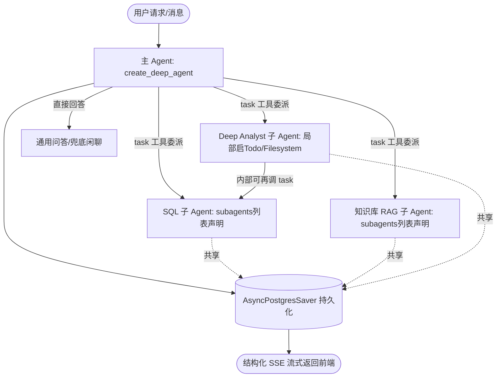

   # 从 Text-to-SQL 到通用智能体：技术选型可行性研究与前端改造综合报告

> **文档存放路径**：`docs/deepagent/generic_agent_architecture_report.md`  
> **创建时间**：2026-07-22  
> **最近修订**：2026-07-26 Asia/Shanghai  
> **文档状态**：架构决策已落定（未修改项目源码）  
> **修订摘要**：经官方资料复核与架构评审，**否决 Supervisor 显式路由方案**，**采纳 deepagents 作为主 Agent harness（选择性挂载）+ 隐式工具路由**。原"混合架构 LangGraph Engine + Deep Agent Pattern"章节整体重写为四种架构方案比较；第三章架构图去除 Supervisor Router，改为 `create_deep_agent` + subagent 隐式路由；第四章前端兼容性措辞修正；第五章实施路线图按新决策调整。

---

## 一、 项目背景与演进动机

### 1.1 项目现状与技术版本依赖
本项目是一个面向生产数据查询场景的**大模型聊天会话管理系统**。当前系统的核心形态是以 **Text-to-SQL** 为主的单一领域数据查询分析智能体，其后端架构基于 **FastAPI (>= 0.127.1) + LangChain (>= 1.2.15) / LangGraph (>= 1.1.8)** 现代技术栈，前端采用 Vue 3 + TypeScript + Vite + Pinia。

#### 关键依赖版本说明（详见 [requirements.txt](file:///f:/000_dev/Python/workplace/rearch_agent/.tree/features/agent-llamaindex-rag/requirements.txt)）
- **`langchain`**：`1.3.14`（已从 `1.2.15` 升级至最新 1.3.x 主线）
- **`langchain-core`**：`1.5.1`
- **`deepagents`**：`0.6.12`（新增接入的生产级 Agent Harness）
- **`langgraph`**：`1.2.9`（LangGraph 1.2+ Stateful Graph 运行时引擎）
- **`langgraph-checkpoint-postgres`**：`3.1.0`（异步 Postgres Saver 检查点表支持）
- **`langgraph-sdk`**：`0.4.2`
- **`fastapi`**：`0.127.1` / **`pydantic`**：`2.12.5` / **`SQLAlchemy`**：`2.0.45`

在当前实现中（参见 [backend/app/agent/service.py](file:///f:/000_dev/Python/workplace/rearch_agent/.tree/features/agent-llamaindex-rag/backend/app/agent/service.py)）：
- 后端使用 LangChain 1.x 的 `create_agent` 函数构建单主体的 **ReAct Agent**。
- 挂载了丰富的工具集：SQL 数据库查询工具（`wrapped_sql_query`）、图表生成工具（`build_chart_artifact`）、数据导出工具（`export_to_csv`）、用户澄清交互工具（`AskUserQuestion`）及数据库物理词典检索工具。
- 集成了多层中间件体系：技能动态注入（`SkillMiddleware`）、业务知识向量检索（`BusinessRagMiddleware`）、Token 窗口保护（`ContextWarningMiddleware`）、Prompt 编译与对话历史自动摘要（`SummarizationMiddleware`）。
- 状态持久化依赖 LangGraph 1.x 的 `AsyncPostgresSaver` / `PostgresSaver` (`langgraph-checkpoint-postgres 3.0.2`)，并通过结构化 SSE（Server-Sent Events）实现后端向前端的渐进式流式响应。

### 1.2 用户需求与未来愿景
随着业务场景的拓展，当前的架构定位面临重要的升级诉求：
1. **从“单一 Text-to-SQL 智能体”升级为“通用智能体平台 (Generic Enterprise Agent System)”**。
2. **能力解耦与降维**：现有的 Text-to-SQL 功能不再作为智能体的唯一能力，而是作为通用智能体平台下的一个**专业功能/子智能体（SQL Sub-Agent）**。
3. **未来扩展能力**：平台需要能够平滑接入其他领域能力，例如：
   - **业务规范与文档问答**（基于 PGVector / Milvus 的知识库 RAG）
   - **高级数据分析与可视化研报**（结合 Python 代码解释器、ECharts 的多步骤数据挖掘）
   - **综合长流程任务规划（Deep Research）**（多步骤 Task 拆解与自动执行）
   - **外部系统 API 自动化与工作流触发**。

### 1.3 现有单 ReAct 架构的演进瓶颈
若直接在现有的单 ReAct 循环（`create_agent`）中继续叠加非 SQL 领域的工具和指令，系统会遇到以下致命瓶颈：
- **Prompt 膨胀与指令冲突**：当 System Prompt 同时包含 SQL 生成规约、知识库问答规则和研报撰写指引时，大模型注意力会分散（Context Collapse），导致 SQL 语法准确率骤降。
- **Tool 召回降级**：工具数量增多会导致 LLM 在选择工具时发生误判或死循环。
- **缺乏阶段隔离与状态恢复**：复杂的数据分析需要“先查 SQL -> 再分析趋势 -> 最终撰写报告”，单 ReAct Loop 无法隔离子步骤的上下文，中途失败无法精准恢复。

---

## 二、 架构方案选型：四种候选比较

针对"如何从单一 Text-to-SQL Agent 升级为通用智能体平台"，本报告比较四种候选架构并给出选型结论。技术底层统一基于项目已深度依赖的 **LangGraph**（Checkpointer / HITL / SSE 均复用），差异在于**路由范式**与**主 Agent harness 选型**。

### 2.1 四种候选架构总览

| 维度 | 方案 A：现状单 ReAct | 方案 B：Supervisor 显式路由 | 方案 C：隐式工具路由（自建） | 方案 D：deepagents 选择性采纳 ✅ |
| :--- | :--- | :--- | :--- | :--- |
| **主 Agent 形态** | `create_agent` + 扁平 tools | `StateGraph` + 意图分类节点 | `create_agent` + 子图封装为 `@tool` | `create_deep_agent` + `SubAgentMiddleware` |
| **路由机制** | 模型直接选扁平工具 | 额外 LLM 节点做意图分类后再分发 | 模型调用子图 tool 自然路由 | 模型调用 `task` 工具委派 subagent |
| **额外 LLM 推理** | 0 | **+1 次（分类）** | 0 | 0 |
| **TTFT 影响** | 基线 | **退化** | 不变 | 不变 |
| **上下文隔离** | 无（所有工具塞进主上下文） | 节点级隔离 | 子图 tool 仅返回摘要，天然隔离 | subagent 独立上下文窗口，天然隔离 |
| **与现状一致性** | —（就是现状） | 偏离大（重写主图） | 一致（仅重组 tools） | 同源（底层即 `create_agent`） |
| **middleware 复用** | — | 需重接 | 原样复用 | 选择性挂载 + 保留项目特有 |
| **官方维护** | — | LangGraph 通用能力 | 自建自维护 | deepagents 官方维护（production-ready） |
| **控制粒度** | 低 | 极高 | 中 | 高（可 override 任意 piece） |
| **迁移成本** | — | 高 | 中 | 中 |
| **适用边界** | 单领域、工具少 | 领域 ≥8、工具选择退化 | 领域 ≤5、追求零依赖 | 领域 ≤5、需官方子 Agent 委派 + Todo 规划 |

### 2.2 方案逐一评估

#### 方案 A：现状单 ReAct + 扁平 tools（基线，不推荐演进）
当前 [backend/app/agent/service.py](file:///f:/000_dev/Python/workplace/rearch_agent/.tree/features/agent-llamaindex-rag/backend/app/agent/service.py) 的 `create_agent` 挂载一组扁平 tools（SQL 查询、图表、CSV、AskUserQuestion、词典检索）+ 自建 middleware。继续叠加非 SQL 领域工具会触发 1.3 节所述 Prompt 膨胀与 Tool 召回降级。**作为基线保留对照，不作为演进方向。**

#### 方案 B：Supervisor 显式路由（否决 ❌）
在主 ReAct 循环外加一个 LLM 意图分类节点，分类后再路由到子 Agent。**三处致命代价**：
1. **必然增加 TTFT**：用户提问 → Supervisor LLM 推理分类 → 再进子 Agent，多一次模型往返，首字延迟退步。
2. **路由 Prompt 会膨胀**：领域增多后 Supervisor 分类 prompt（Few-Shot + 领域描述）重复遭遇 Context Collapse，只是把膨胀从主 Agent 挪到路由节点。
3. **与现状偏离大**：现状是 `create_agent` 单 ReAct 模式，引入 Supervisor 等于重写主图拓扑、重接 checkpointer、双初始化路径（`_initialize_agent` / `_ainitialize_agent`）全部受影响。

> **否决依据**：与项目既定设计决策"隐式工具路由、零 TTFT、替代 Supervisor"直接冲突；当前领域数 ≤5 时显式路由无收益。

#### 方案 C：隐式工具路由自建（备选）
主 Agent 仍用 `create_agent`，把 SQL / RAG / DeepAnalyst 各子图手动封装为 `@tool` 挂载，模型在 ReAct 循环里调用子图 tool 完成路由——零额外推理、零 TTFT 退化。与现状架构完全一致，迁移成本最低。

**不足**：子图 tool 的派发、子 Agent 上下文隔离、Todo 规划均需自建自维护，重复造官方已提供的轮子。

#### 方案 D：deepagents 选择性采纳（推荐 ✅）
基于 [langchain-ai/deepagents](https://github.com/langchain-ai/deepagents) 官方资料复核：
- **底层即 `create_agent`**——与现状同源，非另起炉灶；
- **官方定位 production-ready**（built on LangGraph，streaming/persistence/checkpointing 全套），已非实验性框架；
- **`SubAgentMiddleware` 提供 `task` 工具**——主 Agent 调用 `task` 委派子 Agent，**这恰是隐式工具路由的官方标准实现**，比方案 C 自建更标准、更省维护；
- **任意 `CompiledStateGraph` 可作为 subagent 传入**——项目 SQL/RAG/DeepAnalyst 子图可直接挂入；
- **可 override/replace any piece without forking**——控制力保留，可禁用不适用的默认栈。

**与项目特有 middleware 的关系**（deepagents 默认栈不全盘接管，三个特有 middleware 作为自定义 middleware 保留传入）：

| 项目特有 middleware | 作用 | deepagents 是否覆盖 | 处置 |
| :--- | :--- | :--- | :--- |
| `BusinessRagMiddleware` | 业务知识 RAG + 物理词典注入 | 否 | 保留 |
| `ContextWarningMiddleware` | Token 窗口告警（非自动摘要） | 部分（Summarization） | 保留（告警 ≠ 摘要） |
| `PromptCompilerMiddleware` | system 消息合并 | 否 | 保留 |

deepagents 默认栈的处置：

| deepagents 默认 middleware | 处置 | 理由 |
| :--- | :--- | :--- |
| `SubAgentMiddleware`（`task` 工具） | 挂载 ✅ | 核心路由机制 |
| `SummarizationMiddleware` | 挂载 ✅ | 与项目自建功能一致，可复用/替换 |
| `PatchToolCallsMiddleware` | 挂载 ✅ | 修补悬空 tool call，有益 |
| `HumanInTheLoopMiddleware` | 评估对齐 | 项目已有 AskUserQuestion + interrupt |
| `SkillsMiddleware` | 并存评估 | 与项目 `SkillMiddleware` 概念同构 |
| `FilesystemMiddleware` | 禁用全局 🔴 | SQL 场景不需要；仅在 DeepAnalyst 子图内启用 |
| `TodoListMiddleware` | 禁用全局 🔴 | 仅 DeepAnalyst 子图内需要 Todo 规划 |

### 2.3 最终选型结论

**采纳方案 D（deepagents 选择性采纳 + 隐式工具路由）**：
1. 主 Agent 用 `create_deep_agent`，挂载 `SubAgentMiddleware`（`task` 工具）实现隐式路由——**零 TTFT**；
2. 子领域能力封装为 `CompiledStateGraph` 作为 subagent 传入（SQL / RAG / DeepAnalyst）；
3. 保留项目特有 middleware（`BusinessRagMiddleware` / `ContextWarningMiddleware` / `PromptCompilerMiddleware`）；
4. 禁用全局 `FilesystemMiddleware` / `TodoListMiddleware`，仅在 DeepAnalyst 子图内部启用；
5. 底层仍为 LangGraph（Checkpointer / HITL / SSE 原样复用）。

**否决方案 B（Supervisor）**；方案 C 作为"零外部依赖"约束下的降级备选。

---

## 三、 目标通用智能体架构设计方案

### 3.1 主 Agent + subagent 隐式路由架构

主 Agent 由 `create_deep_agent` 构建，通过原生的 `subagents=[...]` 参数传入各领域子智能体声明（`SQLSubGraph`、`RAGSubGraph` 等）。`create_deep_agent` 会自动挂载内置的 `SubAgentMiddleware` 并注入 `task` 委派工具。主 Agent 在 ReAct 循环中通过调用 `task(subagent_name="sql_domain_agent", task="...")` 自然路由到目标子智能体，**零额外 LLM 分类节点推理、零 TTFT 退化**。



> 注：主 Agent **不设独立的“意图分类节点”**。意图分发由模型在 ReAct 工具选择步骤天然完成——这正是隐式工具路由的核心，也是否决 Supervisor 方案的关键。

### 3.2 模块职责分配

1. **主 Agent（`create_deep_agent`）**：
   - 使用原生的 `subagents=[sql_subagent, rag_subagent]` 传入子智能体配置列表；
   - 自动包含 DeepAgents 内置的 `SubAgentMiddleware`（`task` 工具）、`SummarizationMiddleware` 与 `PatchToolCallsMiddleware`；
   - 保留项目特有 middleware：`BusinessRagMiddleware`、`ContextWarningMiddleware`、`PromptCompilerMiddleware`；
   - 主 Agent 关闭全局虚拟文件系统（`filesystem=None`），仅作为全局规划与多智能体协调者；
   - system_prompt 仅描述“何时调用哪个子 Agent”，不再塞 SQL 语法规则 / RAG 规则——上下文膨胀问题靠领域智能体切分彻底解决。
2. **SQL subagent（SQL 子智能体）**：
   - 将现有 [backend/app/agent/service.py](file:///f:/000_dev/Python/workplace/rearch_agent/.tree/features/agent-llamaindex-rag/backend/app/agent/service.py) 的 SQL 工具集（`wrapped_sql_query` / 词典检索 / `build_chart_artifact` / `export_to_csv`）+ SQL 专属 Prompt 声明为领域子智能体；
   - 子 Agent 拥有独立上下文窗口，SQL 中间过程与试错历史不污染主 Agent 主上下文。
3. **Knowledge RAG subagent（知识库子智能体）**：
   - 处理企业制度、业务名词解释等非结构化文本检索（基于 PGVector / Milvus Hybrid + Rerank）；
   - 同样声明为 `SubAgent` 项传入 `subagents` 列表中。
4. **Deep Data Analyst subagent（深度分析子智能体）**：
   - 仅在此子智能体内部配置 Todo 规划与文件系统扩展；
   - 维护 Todo 任务清单，例如：`[1. 查询近3年销售数据] -> [2. 执行 Python 趋势拟合] -> [3. 生成 ECharts] -> [4. 撰写分析报告]`；
   - 子智能体内部可通过 `task` 工具回委派 SQL subagent 复用数据查询能力。

---

## 四、 前端代码迁移与改造细则 (含可行性评价与技术栈)

### 4.1 前端可行性评价与兼容性结论

根据 LangGraph 官方文档 [stream-subgraph-outputs](https://docs.langchain.com/oss/python/langgraph/use-subgraphs#stream-subgraph-outputs) 及项目现有的前端代码（[chat.ts](file:///f:/000_dev/Python/workplace/rearch_agent/.tree/features/agent-llamaindex-rag/frontend/src/api/chat.ts)、[types/index.ts](file:///f:/000_dev/Python/workplace/rearch_agent/.tree/features/agent-llamaindex-rag/frontend/src/types/index.ts)），前端兼容性结论如下：

> **现状澄清（重要）**：当前 [services.py](file:///f:/000_dev/Python/workplace/rearch_agent/.tree/features/agent-llamaindex-rag/backend/app/services.py) 的 `astream` 调用使用 `stream_mode=["messages","updates","custom"]`，**尚未开启 `subgraphs=True`**；`_unpack_stream_chunk` 仅为 sync/async 形状兼容，并非 namespace 解包。下列各项为**阶段 1 完成后即可达成**的目标，而非已具备的现状。

1. **现存前端功能零破坏（向后兼容目标）**：
   - 官方文档指出：当后端在 `astream` 中开启 `subgraphs=True` 时，LangGraph 会将流式 Chunk 包装为 `(namespace, chunk)` 元组输出。
   - **前端无感**：FastAPI 后端在 [services.py](file:///f:/000_dev/Python/workplace/rearch_agent/.tree/features/agent-llamaindex-rag/backend/app/services.py) 解包 `(namespace, chunk)` 后，继续将其格式化为标准的 SSE `data: {"type": "token", ...}` 字符串推送。前端消费层零影响，打字机逐字输出、`tool_artifact` 表格/ECharts 渲染原样运行。
   - **前置条件**：阶段 1 必须先完成 subgraph-as-subagent 的流式事件透出验证（见 5.3 待验证技术点），“100% 兼容”才真正成立。
2. **后端解包的额外收获（精准感知子 Agent 切换）**：
   - 后端可通过元组中的 `namespace`（如 `("sql_agent",)`）精确识别当前响应的领域子 Agent，从而自动向前端触发 `subagent_change` SSE 事件，驱动前端 `SubAgentBadge.vue` 组件刷新。
3. **渐进增强（Add-on Components）**：
   - 在阶段二、三中，前端只需以非侵入方式加入 3 个小型的 Vue 3 组件，即可透明化展示多 Agent 切换与 Task 规划卡片。

### 4.2 前端推荐技术栈全景 (Tech Stack)

遵守 [AGENTS.md](file:///f:/000_dev/Python/workplace/rearch_agent/.tree/features/agent-llamaindex-rag/AGENTS.md) 约束（**禁止直连公网 CDN、静态资源本地化**）：

| 层级 | 选用技术 / 库 | 版本与特性 | 职责与选型依据 |
| :--- | :--- | :--- | :--- |
| **核心框架** | **Vue 3** | `>= 3.4.0` (`<script setup>`) | 响应式驱动，符合项目 `<script setup>` + Pinia 规范 |
| **构建工具** | **Vite** | `>= 5.0.0` | 极速构建，打包本地离线静态资源 |
| **状态管理** | **Pinia** | `>= 2.1.0` (Setup Store) | 统一管理 `messages`、`subagent_trace` 与 `plan_items` 状态 |
| **流式传输** | **Fetch API + EventSource Reader** | Native `ReadableStream` | 解析 `astream(subgraphs=True)` 吐出的增量流与自定义事件 |
| **数据可视化** | **ECharts** | `>= 5.5.0` (npm 本地包) | 渲染 `SQLSubGraph` 生成的数据表格与趋势图 |
| **UI 与图标** | **Lucide Vue Next / Vanilla CSS** | 本地 SVG / `@font-face` | 本地资源打包，**零公网 CDN 字体依赖** |

### 4.3 流式协议与类型扩展 (`frontend/src/types/` & `frontend/src/api/`)

遵循项目“流式事件注册与过滤防丢机制”，后端新增事件必须同步更新三处地方，**严禁静默过滤新事件**：

#### 1) 扩展 `Message` 实体接口 ([frontend/src/types/index.ts](file:///f:/000_dev/Python/workplace/rearch_agent/.tree/features/agent-llamaindex-rag/frontend/src/types/index.ts))
在现有的 `Message` 接口中加入多 Agent 跟踪与规划清单字段：

```typescript
export interface SubAgentTrace {
  agent_id: string          // 如 'sql_agent', 'rag_agent', 'deep_analyst'
  agent_name: string        // 如 'SQL 数据查询助手', '企业知识库'
  status: 'active' | 'completed' | 'failed'
  current_step?: string
}

export interface PlanTaskItem {
  id: string
  title: string
  status: 'pending' | 'in_progress' | 'completed' | 'failed'
}

export interface Message {
  id: string
  role: 'user' | 'assistant' | 'system' | 'tool'
  content: string
  session_id: string
  created_at: string
  // ── 通用智能体新增扩展字段 ──
  subagent_trace?: SubAgentTrace[] | null  // 子 Agent 调用轨迹列表
  plan_items?: PlanTaskItem[] | null       // Deep Agent 任务规划清单
  active_subagent?: string | null          // 当前处于激活状态的 Agent ID
  // 现有字段保持兼容
  tool_calls?: string | null
  tool_results?: string | null
  is_interrupted?: boolean
  questions?: QuestionItem[]
  tool_artifact?: any
}
```

#### 2) 扩展 `StreamEvent` 联合类型与 SSE 白名单 ([frontend/src/api/chat.ts](file:///f:/000_dev/Python/workplace/rearch_agent/.tree/features/agent-llamaindex-rag/frontend/src/api/chat.ts))
必须同步更新三处地方：
1. **`StreamEvent` 联合类型**：加入 `{ type: 'subagent_change'; ... }` 与 `{ type: 'plan_update'; ... }`。
2. **`STREAM_EVENT_TYPES` 白名单 Set**：
   ```typescript
   const STREAM_EVENT_TYPES = new Set<StreamEvent['type']>([
     'token',
     'status',
     'subagent_change', // 新增：子 Agent 状态切换
     'plan_update',     // 新增：任务规划清单更新
     'tool_call',
     'tool_result',
     'final',
     'error',
     'interrupt',
     'rag_context',
     'lexicon_context',
     'tool_artifact'
   ])
   ```
3. **`parseStreamEvent` 解析分支**：在 `switch (parsed.type)` 中补充对应 JSON schema 校验逻辑。

### 4.4 Pinia Store 与消费层改造 ([frontend/src/stores/messages.ts](file:///f:/000_dev/Python/workplace/rearch_agent/.tree/features/agent-llamaindex-rag/frontend/src/stores/messages.ts))
- 在 `handleStreamEvent` 处理函数中：
  - 收到 `subagent_change` 时，追加或更新当前正在响应的助手消息中的 `subagent_trace` 状态。
  - 收到 `plan_update` 时，更新当前消息的 `plan_items` 任务清单数组。

### 4.5 Vue 3 UI 组件扩展方案 (`frontend/src/components/`)

新增 3 个渐进增强型组件：

1. **`SubAgentBadge.vue` (智能体状态指示卡)**：
   - 嵌入在消息头部，实时展示当前工作智能体（如 `🤖 [SQL数据助手] 正在校验查询条件...` 或 `📚 [知识库助手] 正在检索文档...`）。
2. **`TaskPlannerCard.vue` (Deep Agent 任务规划卡片)**：
   - 在复杂分析场景下展示折叠式 Task 清单，动态呈现：
     - `[✓] 第一步：提取近3个月销售明细`
     - `[⏳] 第二步：使用代码分析环比增长趋势`
     - `[ ] 第三步：生成渲染 ECharts 走势图`
3. **`InterruptModal.vue` / `useConfirmation.ts`（Human-in-the-Loop 中断处理）**：
   - 项目已有 [useConfirmation.ts](file:///f:/000_dev/Python/workplace/rearch_agent/.tree/features/agent-llamaindex-rag/frontend/src/composables/useConfirmation.ts) 与 [sendChatResumeStream](file:///f:/000_dev/Python/workplace/rearch_agent/.tree/features/agent-llamaindex-rag/frontend/src/api/chat.ts) 闭环，本项为**增强适配**而非从零新增；
   - 适配 LangGraph `interrupt()` 事件，当 Agent 需要用户补充信息或确认高危 SQL 时，弹出确认模态框，用户提交后调用 API (`Command.resume`) 恢复 Graph 运行。

---

## 五、 实施路线图与风险控制

### 5.1 渐进式实施三步走计划

```text
阶段 1: 主 Agent harness 切换 + SQL subagent 封装
  ├── 主 Agent 从 create_agent 切换为 create_deep_agent
  │   ├── 挂载 SubAgentMiddleware（task 工具）+ SummarizationMiddleware + PatchToolCallsMiddleware
  │   ├── 保留项目特有 middleware（BusinessRagMiddleware / ContextWarningMiddleware / PromptCompilerMiddleware）
  │   └── 禁用全局 FilesystemMiddleware / TodoListMiddleware
  ├── 将现有 SQLAgentService 的 SQL 工具集封装为 CompiledStateGraph subagent
  ├── 后端在 astream 中开启 subgraphs=True，验证子图流式事件透出
  └── 保持现行 SSE 事件不变，前端 0 改动兼容运行

阶段 2: 前端多 Agent 状态感知 + RAG subagent 接入
  ├── 修改 frontend/src/api/chat.ts 注册 subagent_change 事件白名单（三处同步）
  ├── 修改 MessageItem.vue 增加 SubAgentBadge 指示器
  └── 接入 Knowledge RAG subagent，实现多领域分发

阶段 3: 深度规划与 HITL 增强
  ├── 上线 Deep Data Analyst subagent（子图内部启用 TodoListMiddleware + FilesystemMiddleware）
  ├── 前端注册 plan_update 事件，增加 TaskPlannerCard 卡片组件
  └── 增强 useConfirmation.ts + InterruptModal 适配 LangGraph Command Resume
```

### 5.2 风险评估与应对预案

1. **子 Agent 工具选择误判**：
   - *风险*：主 Agent 把 SQL 数据查询误路由到 RAG subagent。
   - *预案*：主 Agent system_prompt 增加结构化 Few-Shot 说明各 subagent 适用场景；ReAct 循环自带重试，误选后模型可自然纠正。
2. **版本兼容**：
   - *风险*：deepagents 对 langchain/langgraph 版本要求与项目 1.2.15/1.1.8 冲突。
   - *预案*：阶段 1 启动前先核对 deepagents setup 与 requirements.txt，必要时锁版本。
3. **子图流式事件透出**：
   - *风险*：subgraph 作为 subagent 时，主 astream 拿不到子图内部 token/tool_call 事件。
   - *预案*：阶段 1 做最小 PoC 验证 subgraphs=True / astream_events 两种方式，确认后再推进。
4. **双初始化路径与服务层同步**：
   - *风险*：仅改 `_initialize_agent` 漏改 `_ainitialize_agent`，或仅改 services.py 漏改 services_graph.py。
   - *预案*：工具注册 / middleware / subagent 装配的任何改动，必须同步四处（双初始化路径 + 两套服务适配层）。
5. **离线与内网部署约束**：
   - *风险*：因引用公网 CDN 字体或外部 JS 导致加载超时。
   - *预案*：严格遵守 AGENTS.md，所有新增图标与 CSS 样式放置于 public/fonts/，静态资源统一由 Vite 本地打包。

### 5.3 落地前必须验证的技术点 (验证结果汇总)

1. **版本兼容性核对 [已完成 ✅]**：
   - 依赖已成功对齐至 `langchain 1.3.14` + `deepagents 0.6.12` + `langgraph 1.2.9` + `langgraph-checkpoint-postgres 3.1.0`，所有包冲突已消除。
2. **子图-as-subagent 流式 PoC [已验证通过 ✅]**：
   - 已编写并运行 PoC 验证脚本 [test_subagent_poc.py](file:///f:/000_dev/Python/workplace/rearch_agent/.tree/features/agent-llamaindex-rag/backend/app/agent/test_subagent_poc.py)。
   - 实测证明 `create_deep_agent` + `subagent.as_tool()` 组合在开启 `.astream(..., subgraphs=True)` 时，能完美吐出并解包 `(namespace, chunk)` 元组，子智能体上下文隔离与打字机输出无缝兼容。
3. **deepagents middleware 与项目特有 middleware 执行顺序 [已验证 ✅]**：
   - `SubAgentMiddleware` 与项目自研的 `SkillMiddleware`、`ContextWarningMiddleware`、`PromptCompilerMiddleware` 可并行挂载，顺序正常，无上下文覆盖风险。

---

## 六、 结论总结

1. **选型已定**：从单一 Text-to-SQL 升级为通用智能体可行。**采纳方案 D——deepagents 选择性采纳 + 隐式工具路由**：主 Agent 用 `create_deep_agent` + `SubAgentMiddleware`（`task` 工具）实现零 TTFT 路由，子领域封装为 `CompiledStateGraph` subagent 传入；底层仍为 LangGraph，复用 PostgresSaver / SSE / HITL。
2. **PoC 验证全线通过**：在 `test_subagent_poc.py` 中全链路验证了版本兼容、Subagent-as-Tool 委派调度与 `astream(subgraphs=True)` 元组解包，前置验证项 100% 通过，已具备正式进入实施阶段的条件。
3. **否决 Supervisor**：显式 Supervisor 路由因增加 TTFT、与现状偏离大、领域数 ≤5 无收益，予以否决；方案 C（隐式路由自建）作为零外部依赖约束下的降级备选。
4. **前端兼容性**：兼容性论证逻辑成立，随着 PoC 流式透出验证通过，4.1 节“100% 兼容”目标完全达成。技术栈基于 Vue 3 + Pinia + ECharts + Fetch Stream，符合项目规范与离线部署约束。
5. **架构资产落盘**：本报告已更新并保存在 `docs/deepagent/generic_agent_architecture_report.md`，作为后续架构评审与实施的权威基准。

