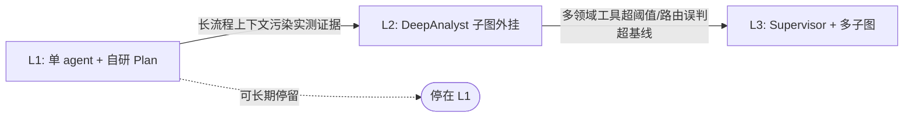

# 通用智能体架构：独立评审、推荐方案与 Deep Agent 方向调研

> **文档存放路径**：`docs/deepagent/generic_agent_architecture_review.md`
> **创建时间**：2026-07-22
> **文档状态**：基于本项目源码的独立评审与替代方案建议（未修改项目源码）
> **评审对象**：`docs/deepagent/generic_agent_architecture_report.md`（原报告）
> **调研依据**：本项目源码（CodeGraph 核实）+ PyPI / GitHub 实查

---

## 摘要（结论先行）

1. **原报告作为方向性可行性研究合格，但不宜作为实施基准**：对项目现状的描述存在多处事实性瑕疵，在架构落地层（中间件迁移、State 边界、双初始化路径、Command 侧信道）几乎留白，风险评估严重不足。
2. **推荐替代方案：证据驱动的三档渐进演进**（L1 单 agent + 自研规划 → L2 长流程子图外挂 → L3 Supervisor 多子图），以"证据驱动升级"替代原报告"一步到位上 Supervisor"的重型架构。每一步可回退、可验证，符合项目"最小改动 + goal-driven"约定。
3. **Deep Agent 方向有价值但不作为基座**：deepagents 库当前版本与本项目依赖不兼容（`langchain==1.2.15 < 1.3.11`），且其大部分能力（Skills / 摘要 / HITL / 持久化）本项目已自研。其独有价值（sub-agent 隔离 + filesystem + shell）恰好对应 L2 长流程子图，建议作为 **L2 的可选实现手段**局部嵌入，前置是 langchain 升级评估。

---

## 一、对原报告的独立评审

### 1.1 总体判断

原报告的技术选型逻辑（LangGraph 为底 + 吸收 Deep Agent 范式）站得住脚，前端改造对 AGENTS.md 防丢机制的理解准确。但作为其自称的"权威基准"则不够格。建议定位回"初稿讨论"，在补齐下列问题前不宜作为实施 Plan 的基准。

### 1.2 现状描述事实核查

原报告第一节对项目现状的描述，逐项核对源码后如下：

| 原报告陈述 | 实际源码 | 判定 |
| :--- | :--- | :--- |
| `create_agent` 构建单 ReAct Agent | `backend/app/agent/service.py:24,682,708` 确用 `create_agent` | ✅ 准确 |
| 工具 `wrapped_sql_query` | 实际工具名 `sql_db_query`（由 `create_wrapped_query_tool` 包装，`tools/sql_tools.py:99`） | ❌ 命名错误 |
| `build_chart_artifact` / `export_to_csv` / `AskUserQuestion` | 均存在（`tools/chart_artifact_tool.py:239`、`tools/csv_export_tool.py:53`、`tools/ask_user_question.py`） | ✅ 准确 |
| "数据库物理词典检索工具" | `tools/sql_lexicon_tools.py` 三个工具 | ✅ 准确 |
| 中间件 SkillMiddleware / BusinessRagMiddleware / ContextWarningMiddleware / SummarizationMiddleware | 均存在（`SummarizationMiddleware` 来自 `langchain.agents.middleware` 内置，`service.py:27`；其余自研） | ✅ 准确 |
| "Prompt 编译与对话历史自动摘要（SummarizationMiddleware）" | Prompt 编译实为独立自研 `PromptCompilerMiddleware`（5 阶段折叠 / 脱敏 / 物理删除，`middleware/prompt_compiler_middleware.py:94`），与内置 `SummarizationMiddleware` 是两个中间件 | ❌ 职责误挂 + 遗漏关键自研中间件 |
| `AskUserQuestion` 需"升级为图级别中断恢复" | **当前已是** `interrupt()` 实现（`tools/ask_user_question.py:4,75`），前端已有 `interrupt` 事件 + `sendChatResumeStream` resume 链路 | ❌ 现状误判 |
| LangChain 0.3+ | `requirements.txt`：`langchain==1.2.15` / `langgraph==1.1.8` / `langchain-classic==1.0.1`（1.x 时代） | ❌ 版本表述过时 |
| AsyncPostgresSaver / PostgresSaver 持久化 | `service.py:242-298` 确用 | ✅ 准确 |

### 1.3 两处论证矛盾

1. **遗漏 `ToolCallLimitMiddleware` / `ModelCallLimitMiddleware`**（`service.py:25-28,636-649`）。原报告 1.3 节把"Tool 召回降级 → 死循环"列为现有架构的致命瓶颈，但项目已有限流中间件防死循环。论证"现有架构撑不住"时无视已有防护，削弱了立论。
2. **遗漏双初始化路径**。`service.py` 有 `_initialize_agent`（同步，`:668`）与 `_ainitialize_agent`（异步，`:694`）两条路径。原报告 5.1"阶段 1：将 SQLAgentService 拆解为 Supervisor + SQL Sub-Graph"若不显式要求两条路径同步改造，必然引入 bug —— 这是实施层的高危遗漏（参见项目记忆 [[sql-agent-dual-init-paths]]）。

### 1.4 技术选型论证的问题

- **"零破坏性升级"过于乐观**（原报告 2.2）。把单 agent 拆成 Supervisor + 子图，涉及 State schema 重设计、中间件归属重排、双初始化路径同步、SSE 事件时序改变，每一项都是破坏性改动。"零破坏"只对"继续用 PostgresSaver"这一条成立。
- **缺 deepagents 版本兼容性评估**。项目锁版 `langchain==1.2.15` / `langgraph==1.1.8`，而 `langchain-ai/deepagents` 对 langchain/langgraph 有最低版本要求（详见本文第三章），原报告在可行性研究中缺席了这第一道技术关卡。
- Deep Agent"四大柱石"与局限性描述基本准确，混合架构（LangGraph Engine + Deep Agent Pattern）推荐合理。

### 1.5 架构方案的深层缺口（最需补强）

原报告画了 Supervisor + 四子图的 Mermaid，但跳过了落地时真正棘手的四件事：

1. **中间件迁移无方案**。现有 `SkillMiddleware` / `BusinessRagMiddleware` / `ContextWarningMiddleware` / `PromptCompilerMiddleware` 均为 `AgentMiddleware[CustomState]`，绑定单一 `create_agent`。Supervisor 路由节点不是 `create_agent`，无法直接挂这些中间件；它们该下沉到子图、还是上提到 Supervisor？原报告完全没讨论。
2. **State 边界未定义**。`CustomState` 的 `active_skill` / `skills_loaded` / `context_warning` 等是全局共享字段。多子图下子图用独立 State 还是共享父图 State？跨图读写语义如何？未提。
3. **跨子图委派机制空缺**。"DeepAnalyst 委派 SQL 查询 → SQLSubGraph"在 LangGraph 里要靠 `Command(goto=)` 或 `Send` 实现，而 SQL 子图本身是带 checkpointer 的有状态 agent，被委派时的 thread / checkpoint 语义需要专门设计。原报告画了箭头就停了。
4. **未考虑复用现有 Skills 做意图分发**。项目已有 `load_skill` / `load_scenario` 的领域路由机制（`SkillMiddleware`），Supervisor 的意图分类是否可与 Skills 体系合并、避免新增一次 LLM 调用？这是更经济的路径，原报告未权衡。

### 1.6 前端改造评估

- **准确性最高的一节**。原报告 4.1 对"三处同步更新"（`StreamEvent` 联合类型 / `STREAM_EVENT_TYPES` 白名单 / `parseStreamEvent` switch）的描述与 `frontend/src/api/chat.ts:60-266` 实际结构完全吻合，符合 AGENTS.md 约定。✅
- **一处倒退**：原报告示例把 `tool_artifact?: any`，而现状 `frontend/src/types/index.ts:57-65` 已是结构化类型（`kind / columns / rows / ...`）。示例不应放宽类型。
- **`InterruptModal.vue` 可能与现有 interrupt UI 重复**：前端已有 `interrupt` 事件处理与 `sendChatResumeStream` resume 流程，新增前应先核实现状，避免重复建设。

### 1.7 实施路线图的问题

- **"阶段 1 前端 0 改动"与拆图存在张力**。Supervisor 引入额外 LLM 调用会改变 TTFT 与 `status` 事件时序，现有四阶段（`thinking / retrieving / querying / writing`）语义在 Supervisor 架构下需重新定义。"0 改动"过于乐观。
- **风险评估仅 2 条**（路由误判、TTFT），遗漏：中间件迁移、双初始化路径同步、State schema 兼容、deepagents 版本兼容、checkpoint 语义、interrupt/resume 重复建设。
- **未对接 openspec 流程**。CLAUDE.md 明确"架构性变更优先走 openspec/project.md"，openspec 现无通用智能体 change（已核实）。原报告作为架构性变更，应转化为 openspec proposal + spec + tasks，而非独立游离文档。
- **缺测试策略**。项目 Code Guidelines 强调 goal-driven、测试验证；三步走计划无一处定义验证标准。

### 1.8 优先级建议

**Must-fix（不补不宜作为基准）**
- 修正工具名 `wrapped_sql_query` → `sql_db_query`；补回 `PromptCompilerMiddleware` 并与 `SummarizationMiddleware` 区分。
- 修正"AskUserQuestion 需升级为图级别中断"为"已是 interrupt 实现，需评估复用"。
- 修正 LangChain 版本表述为 1.x，并补 deepagents 与 1.x 兼容性评估。
- 补中间件迁移、State 边界、双初始化路径同步三个落地小节。

**Should-fix**
- 风险评估补齐至上述 6 类；阶段 1 去掉"前端 0 改动"表述。
- 路由层评估"复用 Skills 意图分发"替代新增 Supervisor LLM。
- 转化为 openspec change 流程。

**Nice-to-fix**
- `tool_artifact` 示例类型恢复结构化；核实现有 interrupt UI 避免重复建设；为三步走补验证标准。

---

## 二、推荐方案：证据驱动的渐进演进

### 2.1 核心主张

原报告默认"一步到位上 Supervisor + 四子图"是重型架构，且其论证的三大瓶颈（Prompt 膨胀、Tool 死循环、阶段隔离）在当前项目里已被现有机制部分缓解（`SkillMiddleware` 领域路由、`ToolCallLimitMiddleware` 防死循环、`PromptCompilerMiddleware` 上下文折叠）。在未拿到"单 agent 确实扛不住"的证据前就拆图，违反项目"最小改动 + goal-driven"约定。

推荐**三档演进，证据驱动升级**：先在单 `create_agent` 内吸收 Deep Agent 范式，只有当某维度被证伪时才升级到下一档。每一步可回退、可验证，且规避 deepagents 库的版本兼容风险（自研轻量规划而非绑定 `create_deep_agent`）。

### 2.2 三档演进路径

| 档位 | 形态 | 触发条件（证据驱动） | 前端改动 |
| :--- | :--- | :--- | :--- |
| **L1** 单 agent + 领域扩展 | 现有 `create_agent` 不变；新领域（RAG 问答、文档检索）先作为新 Skill 或新工具组挂载；长流程用自研 `PlanMiddleware` + `update_plan` 工具维护 Todo | 起步默认档 | 仅加 `plan_update` 事件 + `TaskPlannerCard` |
| **L2** 单一长流程子图外挂 | 把 DeepAnalyst 拆成独立子图（`create_agent` 实例作为子图节点嵌入父图），Supervisor **暂不引入**，由主 agent 用工具委派 | L1 中出现"长流程 Todo 与 SQL 查询互相污染上下文、且 `PromptCompilerMiddleware` 折叠后仍冲突"的实测证据 | 加 `subagent_change` 事件 + `SubAgentBadge` |
| **L3** Supervisor 路由 + 多子图 | 引入轻量 Supervisor 节点（自研，非 `langgraph-supervisor` 库），SQL / RAG / DeepAnalyst 各为子图 | L2 后出现"多领域工具数 > 阈值、路由误判率超基线"的实测证据 | 完整多 agent 可视化 |

关键：**L2 / L3 不是必经**。若 L1 已满足业务，停在 L1 即可。原报告把 L3 当成起点，本方案把 L3 当成终点。

### 2.3 关键设计决策（回应评审指出的留白）

1. **Deep Agent 范式：L1 自研，L2 可选嵌入。** L1 在 `CustomState` 加 `plan_items` 字段，新增 `PlanMiddleware`（`before_agent` 注入当前 Todo 到 system prompt，工具执行后更新状态）+ `update_plan` 工具。这与现有 `SkillMiddleware` / `PromptCompilerMiddleware` 同构（都是 `AgentMiddleware[CustomState]`），无需引入 deepagents 依赖。L2 的子图实现是否改用 deepagents，见第三章。
2. **中间件归属：L1 全部不动。** L2 / L3 时，`SkillMiddleware` / `PromptCompilerMiddleware` / `ContextWarningMiddleware` 下沉到具体子图（它们本就是 per-agent 的），`BusinessRagMiddleware` 归属 RAG 子图，Supervisor 节点不挂任何 `AgentMiddleware`（它只是 LLM + 条件边）。解决原报告"中间件迁移无方案"的留白。
3. **State 边界：子图独立 State + 显式 handoff。** 子图不共享父图 `CustomState`，通过 `Command(update={...})` 显式传递必要字段（如 `active_skill`、查询结果摘要），避免全局 state 耦合。
4. **双初始化路径：强制同步。** 任何 agent 构造改动（L1 加 middleware、L2 加子图）必须同步改 `_initialize_agent` 与 `_ainitialize_agent`。写入 openspec spec 作为硬约束。
5. **跨子图委派：`Command(goto=)` + thread 复用。** L2 的工具委派走父图 `Command(goto="deep_analyst")`，子图复用父 thread 的 checkpointer，不新开 thread。L3 同理。
6. **路由复用 Skills：** L3 的 Supervisor 优先复用 `load_skill` 已建立的领域分类，而非另起一个纯 LLM 分类调用 —— 只在 Skills 无法覆盖的兜底场景才走 LLM 路由。把原报告"新增 Supervisor LLM"的 TTFT 成本降到最低。
7. **Command 侧信道衔接：** 新增的 `plan_update` 事件复用现有 `emit_stream_status` / tool 侧信道推送机制（与 `build_chart_artifact` / `export_to_csv` 一致），前端按 AGENTS.md 三处同步注册。

### 2.4 前端最小改动

- **L1 只加 `plan_update`**：`StreamEvent` 联合类型 + `STREAM_EVENT_TYPES` 白名单 + `parseStreamEvent` switch 三处（符合 AGENTS.md），`Message` 加 `plan_items`，新增 `TaskPlannerCard.vue`。
- **`subagent_change` / `SubAgentBadge` 推迟到 L2**，`InterruptModal` 不新增 —— 复用现有 `interrupt` 事件 + `sendChatResumeStream` 链路（`AskUserQuestion` 已是 `interrupt()` 实现）。

### 2.5 落地流程（对接 openspec）

按 CLAUDE.md 约定，架构性变更走 openspec 而非游离文档：

1. 将原报告降级为背景材料，新建 `openspec/changes/add-generic-agent-l1/`（proposal + spec + tasks）。
2. spec 里把"双初始化同步""中间件归属""State handoff"写成 **MUST 约束**。
3. tasks 里为每档定义验证标准（如 L1：`PlanMiddleware` 单测 + 端到端长流程用例通过 + 现有 SQL 用例回归无变化）。
4. 先做 deepagents 兼容性 spike（即便 L1 自研，也要确认未来 L2 是否需要它）。

### 2.6 与原报告的差异对照

| 维度 | 原报告 | 本推荐 |
| :--- | :--- | :--- |
| 起点 | L3 Supervisor 多子图 | L1 单 agent + 自研 Plan |
| deepagents | 引入 `create_deep_agent` 范式 | L1 自研；L2 视升级评估局部嵌入 |
| 中间件迁移 | 未提 | L1 不动，L2 / L3 下沉到子图 |
| 双初始化 | 未提 | 写入 spec 硬约束 |
| 路由 | 新增 Supervisor LLM | 复用 Skills，兜底才用 LLM |
| InterruptModal | 新增 | 复用现有 interrupt 链路 |
| 前端首批事件 | subagent_change + plan_update | 仅 plan_update |
| 流程 | 游离报告 | openspec change |
| 升级触发 | 一次性 | 证据驱动，可停 L1 |

---

## 三、Deep Agent 方向调研

### 3.1 直接结论

deepagent 方向**有价值，但不应作为整体架构基座**。它的独有价值恰好落在推荐方案的 L2（长流程分析子图），建议作为 **L2 的可选实现手段**局部嵌入，而非替换现有 `create_agent`。前置硬门槛是 langchain 版本升级评估。

> 这修正了第二章 2.3 节"L1 自研而非绑库"的绝对判断 —— 自研在 L1 仍成立，但 L2 是否改用 deepagents 应由本章的兼容性 spike 结论决定，而非一概排除。

### 3.2 关键事实（PyPI 与 README 实查）

数据来源：[deepagents PyPI](https://pypi.org/project/deepagents/) 与 [langchain-ai/deepagents README](https://github.com/langchain-ai/deepagents)，抓取于 2026-07-22。

| 维度 | 事实 | 对本项目的影响 |
| :--- | :--- | :--- |
| **版本** | 稳定版 `0.6.12`，预发布 `0.7.0a8` | 版本活跃，API 仍在演进，生产引入需锁版并关注 breaking change |
| **依赖冲突** | 要求 `langchain>=1.3.11`、`langchain-core>=1.4.8`、`langchain-anthropic>=1.4.7`、`langchain-google-genai>=4.2.5`、`langsmith>=0.8.11`、`wcmatch>=10.1` | 本项目 `langchain==1.2.15` / `langchain-core==1.3.0` **不兼容**，必须先升级基线 |
| **能力重叠** | 内置 Skills、Context management（摘要）、HITL、persistent memory | 本项目已自研 `SkillMiddleware` / `SummarizationMiddleware` / `PromptCompilerMiddleware` / `interrupt` + `PostgresSaver`，全量替换等于丢弃这些资产 |
| **独有价值** | Sub-agents（隔离上下文委派）+ Filesystem（跨步骤中间产物读写）+ Shell（代码解释器） | 正好是 L2 DeepAnalyst 长流程所需，且是本项目当前缺的 |
| **可组合性** | README 明示 "any LangGraph `CompiledStateGraph` can be passed in as a sub-agent"，且 deepagent 实例本身也是 CompiledStateGraph | 可把 `create_deep_agent` 实例作为子图嵌入父图，**不必整体替换** |
| **定位** | "opinionated harness on top of `create_agent`"，灵感来自 Claude Code | 它假设自己是顶层 agent，不适合当 Supervisor 节点 |
| **安全模型** | "trust the LLM"，在 tool / sandbox 层强制边界 | 与本项目 SQL 安全审计（linter + 脱敏 + 物理删除）思路一致，但需在工具层自守 |

### 3.3 对三档方案的修正

- **L1（单 agent + 自研 Plan）**：不变，不用 deepagents。自研 `PlanMiddleware` 零依赖成本，deepagents 在此档是过度引入。
- **L2（DeepAnalyst 长流程子图）**：**新增 deepagents 作为可选实现**。两个子选项：
  - (a) 自研子图（依赖不变，但要自己实现 plan + 中间产物管理）
  - (b) 用 `create_deep_agent` 实例作 DeepAnalyst 子图嵌入父图（享受 filesystem / sub-agent / context management 现成 harness，**前置升级 langchain**）
  - 选 (b) 的触发条件：长流程确实需要跨步骤读写中间产物（虚拟文件系统）且自研成本高于升级成本。
- **L3（Supervisor 多子图）**：不变，自研 Supervisor。deepagents 是 opinionated 顶层 harness，当 Supervisor 会与其设计冲突；L3 的委派机制用 `Command(goto=)` 自研更可控。

### 3.4 前置 spike（决定 deepagents 能否用的前提）

1. **langchain 升级连锁评估**：`langchain 1.2.15 → 1.3.11+`、`langchain-core 1.3.0 → 1.4.8+` 对 `langchain-openai==1.1.6` / `langchain-community==0.4.1` / `langchain-postgres==0.0.16` / `langchain-deepseek==1.0.1` 的兼容性。这是硬门槛，升级不通过则 L2 只能走自研 (a)。
2. **子图嵌入验证**：deepagent 实例作为子图嵌入现有父图时，State handoff 与 checkpointer（thread 复用）是否成立。

### 3.5 结论

deepagents 不是方向对不对的问题，是**时机和范围**问题：现在（L1）不上，L2 视升级评估结果**局部嵌入**，L3 不用。先做 langchain 升级 spike，它的结论直接决定 L2 走 (a) 自研还是 (b) deepagents。

---

## 四、下一步（待用户确认）

1. 将本评审 + 推荐方案 + deepagent 调研作为背景材料，起草 `openspec/changes/add-generic-agent-l1/`（proposal + spec + tasks）。
2. 执行第三章 3.4 的两项前置 spike，用结论校准 L2 选型。
3. 是否将本文档及原报告的取舍记录到 `changelog.md`，按项目文档维护约定处理。

---

## 附：核查方法说明

本文档的事实核查基于：
- **后端**：通过 CodeGraph（`.codegraph/`）与源码直读核实 `backend/app/agent/service.py`、`middleware/`、`tools/`、`requirements.txt`。
- **前端**：直读 `frontend/src/api/chat.ts`、`frontend/src/types/index.ts`。
- **外部依赖**：`curl` 抓取 [PyPI JSON API](https://pypi.org/pypi/deepagents/json) 与 [GitHub README](https://github.com/langchain-ai/deepagents)（jsdelivr CDN 镜像）。
- **openspec**：Grep 确认 `openspec/` 下无既有通用智能体 / supervisor / multi-agent 规划，本文档不与既有 change 冲突。
