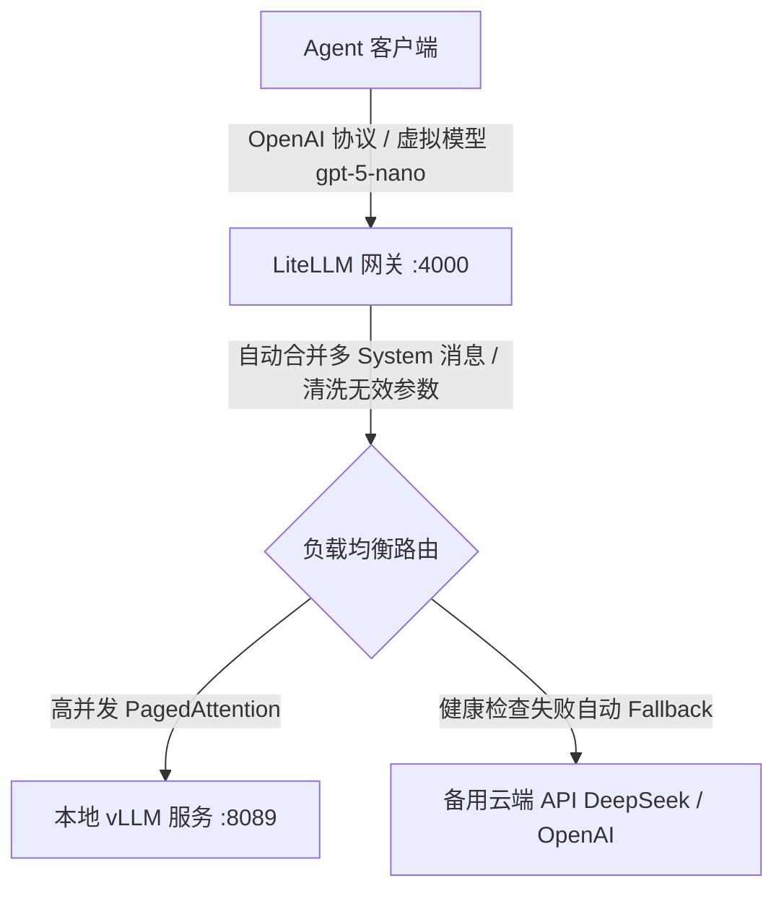

# 2026-05-24 17:32:00 - 沉淀本地大模型部署与 Agent 架构选型技术方案报告

# 本地大模型部署与 Agent 架构选型技术方案报告

## 1. 技术背景与部署概况

为了在局域网内部署并私有化落地高性能大语言模型应用，本项目在局域网服务器上部署了 Qwen 系列模型作为核心智能体：
*   **部署平台**：WSL (Ubuntu) / Linux 环境，使用 vLLM 推理引擎。
*   **vLLM 启动命令（单张 5090 极致调优版）**：
    ```bash
    # ----------------------------------------------------
    #  RTX 5090 单卡极致算力爆发与环境配置
    # ----------------------------------------------------
    export CUDA_DEVICE_ORDER=PCI_BUS_ID
    export CUDA_VISIBLE_DEVICES=0            # 显式锁定单卡

    export OMP_NUM_THREADS=4                 # CPU 多线程并行调度
    export VLLM_USE_FLASHINFER_SAMPLER=1    # 开启 FlashInfer 极速采样（低 TTFT 延迟）
    export VLLM_TEST_FORCE_FP8_MARLIN=1     # 对 FP8 激活模型启用 Marlin 极速内核
    export VLLM_ENABLE_CUDAGRAPH_GC=1       # 垃圾回收 CUDA 图显存，杜绝泄露

    # 清除 FlashInfer 过期缓存
    rm -rf ~/.cache/flashinfer

    # 启动推理服务（挂载 Qwen3.6-enhanced 模板）
    vllm serve /home/julius/models/RedHatAIQwen3.6-35B-A3B-NVFP4 \
      --served-model-name gpt-5-nano \
      --chat-template /home/julius/models/qwen3.6-enhanced.jinja \
      --default-chat-template-kwargs '{"preserve_thinking": false}' \
      --attention-backend FLASHINFER \
      --tensor-parallel-size 1 \
      --max-model-len 64072 \
      --max-num-seqs 4 \
      --max-num-batched-tokens 4096 \
      --kv-cache-dtype fp8 \
      --gpu-memory-utilization 0.90 \
      --dtype auto \
      --enable-auto-tool-choice \
      --enable-chunked-prefill \
      --enable-prefix-caching \
      --tool-call-parser qwen3_xml \
      --reasoning-parser qwen3 \
      --no-use-tqdm-on-load \
      --moe_backend flashinfer_cutlass \
      --host 0.0.0.0 \
      --port 8089 \
      --language-model-only
    ```
*   **Agent 客户端配置**：基于 Python 3.12 + FastAPI + LangChain/LangGraph 1.0+ 构建的模块化 Agent 工作流，连接配置如下：
    ```bash
    DEEPSEEK_API_KEY='sk-no-key-required'
    DEEPSEEK_MODEL='gpt-5-nano'
    DEEPSEEK_BASE_URL='http://192.168.3.245:8089/v1'
    ```

---

## 2. 核心技术痛点与根因排查

在配套开发 Agent 并运行工作流时，遇到了两个极其经典的本地部署与接口不兼容问题：

### 痛点一：多 System 消息引起 vLLM 报 400 BadRequest 错误
*   **报错现象**：
    ```text
    openai.BadRequestError: Error code: 400 - {'error': {'message': 'System message must be at the beginning.', 'type': 'BadRequestError', 'param': None, 'code': 400}}
    ValueError: System message must be at the beginning.
    ```
*   **根本原因**：
    1.  **客户端侧（LangChain 多中间件）**：本项目启用了 `BusinessRagMiddleware`（业务知识 RAG 中间件）。当 RAG 命中背景知识后，会动态生成一条带有 `role="system"` 的 `SystemMessage` 对象插入到对话历史 `messages` 列表的开头。在最终发起 `ainvoke` 时，LangChain 会将主系统提示词（`ModelRequest.system_message`）与对话历史合并，导致发送给 vLLM 的 `messages` 列表中在非首位出现了**多个** `system` 角色的消息。
    2.  **服务端侧（vLLM + Qwen 模板）**：Qwen 官方分词器配置（`tokenizer_config.json`）里的 `chat_template`（Jinja2 模板）有着极其严苛的安全和注意力防护限制——**一旦检测到非首位（`not loop.first`）出现了 `role == 'system'` 的消息，模板编译就会直接抛出 `System message must be at the beginning` 错误**，以防注意力分布偏移。

### 痛点二：工具调用（Tool Call）意图被误当成纯文本吐出，导致 Agent 运行提前收尾
*   **报错现象**：大模型决定调用工具，但客户端并没有触发任何工具节点（Tool Node）执行，而是直接打印 `tool_calls=0` 并退出了 Graph 运行。前端只收到了一串纯文本：`tool_use(name="load_skill", arguments={"skill_name": "paint_shop_vehicle_logistics"})`。
*   **根本原因**：
    1.  **Prompt 格式干扰**：客户端发送给大模型的 System Prompt 极其庞大且包含强烈的行为引导（如“不要中途停下来解释你会做什么——直接去做”）。这在一定程度上干扰了模型的 Self-Attention，导致模型在输出工具调用意图时，没有发出标准的特殊 Token，而是以类似人类直觉的普通文本（`tool_use(...)`）进行了渲染。
    2.  **vLLM 解析器脱轨**：vLLM 的 `--tool-call-parser qwen3_coder` 依赖强正则匹配。当模型输出的 Token 序列发生一丁点偏移，正则匹配失败，vLLM 就会放弃封装，而是直接作为普通的 `content` 纯文本吐给客户端。
    3.  **客户端判断落空**：LangChain 客户端看到 API 协议中返回的 `tool_calls` 列表为空，误以为本次模型没有调用工具，直接把工具调用文本当作“大模型的最终结论”展示，并正常退出了 Graph 运行。

---

## 3. 为什么 llama.cpp 没有遇到这两种问题？

在相同的 Agent 客户端和提示词配置下，使用 `llama.cpp`（通过 `llama-server`）进行部署时，上述两个问题均未出现。这源于双方在底层设计哲学和兼容机制上的本质差异：

### 3.1 对多系统消息（System Messages）的宽容度差异
*   **vLLM (理论派)**：100% 忠实还原原厂的 Jinja2 模板，通过标准 Python 引擎执行。模板里写了 `raise_exception`，vLLM 就必须无脑抛错拒绝请求。
*   **llama.cpp (实干派)**：使用 C++ 自研的轻量级 Jinja 渲染器，**不支持或直接忽略了模板中 `raise_exception` 这类自定义异常函数的执行**。此外，若使用其内置的 ChatML 模板，模板里仅仅是把所有消息循环包裹 `<|im_start|>` 标签，根本没有任何关于系统消息位置的安全审计代码，因此表现得无比宽容。

### 3.2 对工具调用（Tool Calling）的约束力差异
*   **GBNF 语法采样限制器（降维打击）**：`llama.cpp` 拥有业界最强大的 **Grammar-based Sampling** 限制器。当你向其传入 `tools` Schema 时，C++ 底层会将 Schema 编译为状态机，**强行干预并限制大模型输出下一个 Token 的概率分布**。这在数学层面封死了所有格式不正确的工具输出路线，强制模型必须吐出符合规范的 JSON。
*   **硬编码 C++ 状态机适配**：`llama-server` 内部有专门为 Qwen/Llama3 等模型硬编码的流式解析器，在接收到 `tools` 时会在 C++ 侧做 Prompt 的预重构。即使模型输出没有携带原厂的标准特殊 token，只要输出了诸如 `<tool_call>` 或是 `tool_use(` 的片断，C++ 状态机就能稳健捕获并组装成标准的 `tool_calls` 数组返回。

---

## 4. 开源社区终极修复：Qwen3.5/3.6 增强型 Chat Template 方案

针对上述“多 System 消息报错”以及“推理模型中 `<think>` 标签未闭合导致 Tool Call 降级为纯文本”的两个高频经典 Bug，开源大模型开发者社区贡献了一个公认的**“终极神级救星”补丁仓库**：[allanchan339/vLLM-Qwen3-3.5-3.6-chat-template-fix](https://github.com/allanchan339/vLLM-Qwen3-3.5-3.6-chat-template-fix)。

该项目通过重写大模型的 Jinja2 模板（Jinja Chat Template），在 vLLM 推理端实现了一石二鸟的底层适配：

### 4.1 核心修复原理与技术价值
1.  **强制闭合 `<think>` 推理标签（根治 Tool Call 降级纯文本）**：
    Qwen3 / 3.5 / 3.6 推理系列模型在决定调用工具前会先在内部输出 `<think> 思考过程 ... </think>`。官方模板极易因为模型未正确输出闭合标签，导致 vLLM 的 `qwen3_coder` 解析器崩溃，进而退化为纯文本输出。该增强模板在 Jinja 代码里注入了**对未关闭 `<think>` 推理块的自动检测与补全闭合**逻辑，确保了格式解析链的 100% 稳定性。
2.  **物理剥离多 System 消息拦截规则**：
    该模板直接**物理删除了原厂模板中限制 `System message must be at the beginning` 的 raise 抛错异常**，并能够自动折叠、清洗合并所有传入的多系统消息，直接在推理引擎入口消除了 400 报错。
3.  **智能隐藏历史 Reasoning 链（节省 Token 并提速）**：
    模板在渲染多轮历史对话时，会**自动过滤并隐藏前几轮历史消息中的 `<think>` 推理内容**，只将当前轮的推理和最终的 Tool/Answer 喂给模型。这不仅可以为您省下数千个 Context Token 消耗，还能将首字延迟（TTFT）拉低数倍。

### 4.2 vLLM 部署落地三步走
该方案同样完全符合**“不修改客户端 Agent 一寸代码”**的诉求：

1.  **下载模板**：从该开源仓库下载对应的修复模板（如 `qwen3-enhanced.jinja`），保存在本地路径（如 `/home/julius/models/qwen_enhanced.jinja`）。
2.  **调整启动命令**：在 vLLM 启动命令中挂载该模板，并将解析器切换为匹配度更高、基于 XML 标签解析的更稳健的 `qwen3_xml`：
    ```bash
    # ----------------------------------------------------
    #  RTX 5090 单卡极致算力爆发与环境配置
    # ----------------------------------------------------
    export CUDA_DEVICE_ORDER=PCI_BUS_ID
    export CUDA_VISIBLE_DEVICES=0            # 显式锁定单卡

    export OMP_NUM_THREADS=4                 # CPU 多线程并行调度
    export VLLM_USE_FLASHINFER_SAMPLER=1    # 开启 FlashInfer 极速采样（低 TTFT 延迟）
    export VLLM_TEST_FORCE_FP8_MARLIN=1     # 对 FP8 激活模型启用 Marlin 极速内核
    export VLLM_ENABLE_CUDAGRAPH_GC=1       # 垃圾回收 CUDA 图显存，杜绝泄露

    # 清除 FlashInfer 过期缓存
    rm -rf ~/.cache/flashinfer

    # 启动推理服务（挂载 Qwen3.6-enhanced 模板）
    vllm serve /home/julius/models/RedHatAIQwen3.6-35B-A3B-NVFP4 \
      --served-model-name gpt-5-nano \
      --chat-template /home/julius/models/qwen3.6-enhanced.jinja \
      --default-chat-template-kwargs '{"preserve_thinking": false}' \
      --attention-backend FLASHINFER \
      --tensor-parallel-size 1 \
      --max-model-len 64072 \
      --max-num-seqs 4 \
      --max-num-batched-tokens 4096 \
      --kv-cache-dtype fp8 \
      --gpu-memory-utilization 0.90 \
      --dtype auto \
      --enable-auto-tool-choice \
      --enable-chunked-prefill \
      --enable-prefix-caching \
      --tool-call-parser qwen3_xml \
      --reasoning-parser qwen3 \
      --no-use-tqdm-on-load \
      --moe_backend flashinfer_cutlass \
      --host 0.0.0.0 \
      --port 8089 \
      --language-model-only
    ```
3.  **重启服务**：重启后，多 System 消息报错与工具调用退化问题将同时迎刃而解！

### 4.3 另一款通用基石：froggeric 模板（Hugging Face 平台）

开源社区中与 `allanchan339` 的模板齐名且极受欢迎的另一个类似修复项目是：[froggeric/Qwen-Fixed-Chat-Templates](https://huggingface.co/froggeric/Qwen-Fixed-Chat-Templates)。

*   **平台分布**：该项目主要托管在 **Hugging Face** 平台而非 GitHub。
*   **核心特色**：
    1.  **全平台兼容性极佳**：由于它的 Jinja2 模板避开了 Python 专属过滤器（如 `|items` 等），它的通用性极强，能够极其完美地适配以 C++ 作为底层的 **`llama.cpp`** 推理服务，同时支持 vLLM、LM Studio 和 MLX。
    2.  **推理手动开关支持 (`<|think_on|>/<|think_off|>`)**：它在模板中注入了推理控制标记，允许用户在客户端通过开关决定是否开启/展示大模型的推理思考过程。
    3.  **消除多 System 校验**：同样物理删除了“System message must be at the beginning” 的拦截限制，在多平台下均提供了极佳的自适应能力。
*   **选型建议**：如果您未来打算做多引擎平滑过渡（如本地开发用 `llama.cpp`，线上用 `vLLM`），`froggeric` 的模板是目前最完美的通用桥梁。

---

## 5. 两套本地部署大模型推理引擎横向对比

| 评估指标 | 方案 A：vLLM 路线 (企业生产级标配) | 方案 B：llama.cpp 路线 (单卡轻量开发) |
| :--- | :--- | :--- |
| **并发吞吐性能** | **🏆 极高** (PagedAttention + 连续批处理支持海量并发) | **极低** (并发增加时延迟呈指数级拉长，易显存溢出) |
| **多显卡分布式推理** | **🏆 强悍** (Tensor Parallelism，支持无缝拓展大参数模型)| 弱 (分布式与张量并行支持较差) |
| **工具调用格式稳定性** | 中等 (依赖原厂正则解析，易被 Prompt 干扰脱轨) | **🏆 极强** (C++ 底层 GBNF 语法强约束采样) |
| **多 System 消息兼容性** | 严苛 (需在网关层做清洗或修改 Chat Template) | **🏆 宽容** (C++ 自动兼容，内置 ChatML 无校验) |
| **部署与内存消耗** | 刚性占满 (启动强占 80%-90% 显存，启动略慢) | **🏆 弹性极佳** (GGUF 极致量化与 Offloading，秒启动) |
| **最佳适用场景** | **局域网企业多人并发、生产环境落地、高并发 Agent** | **本地个人单卡开发调试、离线功能演示、算力受限环境** |

---

## 5. 基于本项目技术栈的终极架构选型与推荐

### 5.1 本项目技术栈特点分析
本项目是标准的 **Python 3.12 + FastAPI + LangChain/LangGraph + Docker Compose** 架构。
1.  **开发效率优先**：LangGraph 的状态图调试非常复杂，容错率低，需要模型输出具有极强的格式稳定性。
2.  **企业级落地导向**：项目预留了 Docker Compose，以支持未来一键发布到局域网生产服务器，需要支撑局域网多人并发访问。

### 5.2 终极推荐方案：vLLM + LiteLLM 网关 + LangGraph

针对本项目的特点，最完美的工业级生产架构是：**“由 vLLM 担当高性能计算引擎（负责极速输出），由 LiteLLM 担当大模型网关（负责防呆兼容与格式清洗），客户端 LangGraph 保持零侵入”**。



#### 🌟 为什么这是最完美的方案？
1.  **免改客户端代码解决多 System 报错**：在 `LiteLLM` 中配置 `drop_invalid_params: true` 或 `force_single_system_message: true`，网关会在转发前**自动合并多 system 消息**。
2.  **网关容灾（Fallback）保障 Agent 不宕机**：本地显卡显存有限，一旦并发超载导致 vLLM 宕机，LiteLLM 可以在毫秒级内自动降级切换到官方云端 API（如 DeepSeek API），对前端用户和 Agent 核心代码**完全无感**。
3.  **零成本集成到 Docker 编排**：只需在已有的 `docker-compose.yml` 中新增十几行配置即可完成。

### 5.3 决策分水岭：开发阶段直连 vs. 生产上线启用 LiteLLM

随着我们在 vLLM 引擎底层通过**“挂载 qwen3.6-enhanced.jinja 增强模板 + 选用 qwen3_xml 解析器”**彻底解决了多系统消息报错和 Tool Call 纯文本退化的两大死穴，大模型网关的引入在开发与生产阶段有了明确的决策路线：

#### 1. 开发阶段（极致精简，推荐直接裸连）
*   **开发建议**：在单人本地开发、场景测试、SQL 调试阶段，**完全不需要引入 LiteLLM**。
*   **配置方式**：直接修改 `.env` 配置文件，让您的 Agent 客户端直连本地的 vLLM 推理服务端口：
    ```bash
    DEEPSEEK_BASE_URL='http://127.0.0.1:8089/v1'  # 👈 裸连 vLLM 单卡服务端口
    ```
*   **核心优势**：链路最精简，没有中间代理层的多余开销，省去了多开一个 Docker 容器的内存消耗，调试和排除故障阻力最小。

#### 2. 生产上线与局域网公开阶段（高可用安全屏障，推荐按需引入）
当您的 Agent 系统开发完毕，准备**向生产环境演进（交付给部门内多人使用或正式上线运行）**时，推荐按照本指南在中间层架设 LiteLLM：
*   **场景一：自动容灾备份（Failover）**：本地 5090 虽然性能强悍，但属于单卡部署。一旦多人并发长 Context 触发偶发性 VRAM 溢出（OOM）导致 vLLM 进程崩溃，LiteLLM 会在毫秒级内无缝将请求转发到官方云端 DeepSeek API，**客户端 100% 不会断联报错**。
*   **场景二：流控与多租户管理（Rate Limiting）**：为局域网内不同的团队或应用生成独立的子 API Key，控制每个 Key 的每分钟请求频次（RPM/TPM）及总额度，防止本地 5090 显卡被他人高频脚本意外冲瘫痪。
*   **场景三：语义缓存加速（Semantic Caching）**：网关层自动做语义缓存，如果检测到两次问题的意思高度相似，直接读取缓存返回，避免本地 vLLM 重复计算，瞬间将 TTFT 拉到 10ms 级并省下大笔 GPU 算力。

---

## 6. 一键落地指引 (LiteLLM 快速集成)

### 6.1 步骤一：创建 `litellm-config.yaml` 配置文件
在项目根目录下创建该配置文件，用来定义路由规则与清洗选项：

```yaml
model_list:
  - model_name: gpt-5-nano          # 供您的 Agent 客户端调用的统一模型名
    litellm_params:
      model: openai/gpt-5-nano
      api_base: http://192.168.3.245:8089/v1 # 您的本地 vLLM 实例地址
      api_key: sk-no-key-required
      drop_invalid_params: true     # 👈 核心：自动清洗无效参数，合并多 System 消息以防 vLLM 报错
      
  - model_name: deepseek-backup      # 备份路由：当本地显卡 OOM 宕机时自动切到该渠道
    litellm_params:
      model: deepseek/deepseek-chat
      api_key: your-official-deepseek-key

router_settings:
  routing_strategy: least-busy       # 多显卡负载均衡策略
  enable_fallbacks: true             # 开启自动容灾切换
  fallbacks: [{"gpt-5-nano": ["deepseek-backup"]}]
```

### 6.2 步骤二：在 `docker-compose.yml` 中注册 LiteLLM 节点
在服务列表中，增加 `litellm` 网关节点的定义：

```yaml
services:
  # ... 您现有的 backend, frontend 服务 ...
  litellm:
    image: ghcr.io/berriai/litellm:main-latest
    ports:
      - "4000:4000"
    volumes:
      - ./litellm-config.yaml:/app/config.yaml
    command: [ "--config", "/app/config.yaml", "--port", "4000" ]
    restart: always
```

### 6.3 步骤三：修改客户端配置
完全不需要动 Python 代码，仅需将根目录下的 `.env` 环境变量的 `DEEPSEEK_BASE_URL` 指向 LiteLLM 实例即可完成切换：

```bash
# 之前直连本地 vLLM 导致报错
# DEEPSEEK_BASE_URL='http://192.168.3.245:8089/v1'

# 现在指向 LiteLLM 网关（若本地开发连接 localhost，若在 Docker Compose 内则连接 http://litellm:4000/v1）
DEEPSEEK_BASE_URL='http://127.0.0.1:4000/v1'
```
