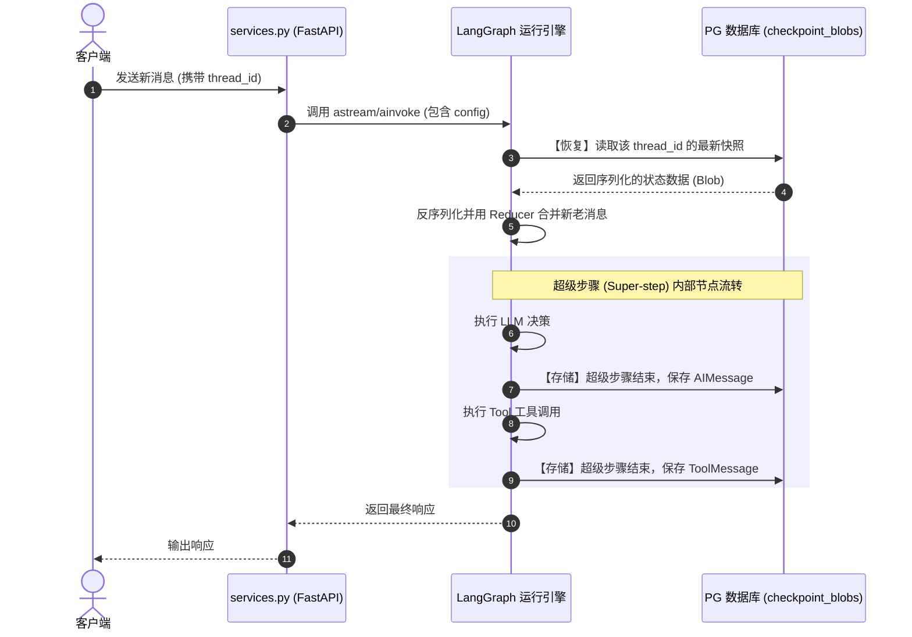

# LangGraph 记忆与状态持久化机制技术指南

> **创建时间**：2026-06-20
> **文档位置**：[langgraph_memory_and_persistence_guide.md](file:///f:/000_dev/Python/workplace/rearch_agent/.tree/features/agent/docs/langgraph_memory_and_persistence_guide.md)
> **主要内容**：本文档整理归纳了项目基于 LangGraph 状态持久化（Checkpointer 机制）、多 System Message 动态合并及物理抽干中间件、以及上下文自动摘要控制记忆长度的整体设计与实现方案。

---

## 目录
- [1. 核心架构与“双模式”持久化](#1-核心架构与双模式持久化)
  - [1.1 本地模式 (FastAPI 本地运行)](#11-本地模式-fastapi-本地运行)
  - [1.2 托管模式 (LangGraph Cloud / Dev 模式)](#12-托管模式-langgraph-cloud--dev-模式)
- [2. 状态恢复与存储的触发时机](#2-状态恢复与存储的触发时机)
  - [2.1 状态恢复 (Restore / Read)](#21-状态恢复-restore--read)
  - [2.2 状态存储 (Save / Write)](#22-状态存储-save--write)
- [3. 原始 LangGraph 对 System Message 的保存行为](#3-原始-langgraph-对-system-message-的保存行为)
- [4. SafeMergeSystemMiddleware 的物理抽干与自愈合并](#4-safemergesystemmiddleware-的物理抽干与自愈合并)
  - [4.1 原始多 System 消息在本地部署模型的痛点](#41-原始多-system-消息在本地部署模型的痛点)
  - [4.2 拦截、物理抽干与大一统合并算法](#42-拦截物理抽干与大一统合并算法)
- [5. 上下文控制：记忆长度裁剪与摘要 (Summarization)](#5-上下文控制记忆长度裁剪与摘要-summarization)
  - [5.1 精确 Token 计数器](#51-精确-token-计数器)
  - [5.2 摘要与滑动窗口裁剪中间件](#52-摘要与滑动窗口裁剪中间件)
- [6. 挂起与断点恢复 (Interrupt & Resume)](#6-挂起与断点恢复-interrupt--resume)
- [7. Context API 瞬态数据通道与父子沙箱状态治理 (Phase 1 优化)](#7-context-api-瞬态数据通道与父子沙箱状态治理-phase-1-优化)
  - [7.1 为什么瞬态检索大对象不能写入 State](#71-为什么瞬态检索大对象不能写入-state)
  - [7.2 RequestContext 单轮请求级内存透传 (0 字节入库)](#72-requestcontext-单轮请求级内存透传-0-字节入库)
  - [7.3 父子状态物理沙箱隔离 (消除 INVALID_CONCURRENT_GRAPH_UPDATE)](#73-父子状态物理沙箱隔离-消除-invalid_concurrent_graph_update)

---

## 1. 核心架构与“双模式”持久化

项目中对 LangChain/LangGraph 的记忆核心依托于 **Checkpointer（检查点保存器）**。该机制不通过传统的 Memory 类手动拼接历史消息，而是自动在图的执行步骤边界上持久化整个 State（状态）。

项目支持 **双模式持久化**：

### 1.1 本地模式 (FastAPI 本地运行)
* 在 [service.py](file:///f:/000_dev/Python/workplace/rearch_agent/.tree/features/agent/backend/app/agent/service.py) 中，由 [_create_local_async_checkpointer](file:///f:/000_dev/Python/workplace/rearch_agent/.tree/features/agent/backend/app/agent/service.py#L263-L296) 异步初始化 `AsyncPostgresSaver`。
* 底层基于 `psycopg_pool.AsyncConnectionPool` 数据库连接池连接到配置的 `settings.database_url`。
* 并在本地运行时，显式将 `checkpointer` 传递给 [create_agent](file:///f:/000_dev/Python/workplace/rearch_agent/.tree/features/agent/backend/app/agent/service.py#L796)。
* `checkpointer.setup()` 会自动在 PostgreSQL 数据库中创建 `checkpoints`、`checkpoint_blobs`、`checkpoint_writes` 和 `checkpoint_metadata` 四张表用于存储二进制的状态快照。

### 1.2 托管模式 (LangGraph Cloud / Dev 模式)
* 如果检测到当前在 LangGraph API 托管/调试环境，则不会在代码中显式注入 `checkpointer`。
* 此时，存储资源直接由 LangGraph Platform / CLI 运行时接管与注入。

---

## 2. 状态恢复与存储的触发时机

### 2.1 状态恢复 (Restore / Read)
当在 [services.py](file:///f:/000_dev/Python/workplace/rearch_agent/.tree/features/agent/backend/app/services.py) 中调用 `agent.ainvoke()`、`agent.astream()` 或 `agent.aget_state()` 并传入配置 `thread_id`：
* **前置加载**：在运行图内的第一个节点之前，LangGraph 会优先向 PG 数据库发起 Select 查询，打捞出该 `thread_id` 最新的状态快照并进行反序列化。
* **追加合并**：将新输入的消息（如 `HumanMessage`）通过 `add_messages` 合并器（Reducer）追加到打捞出的历史消息列表尾部。

### 2.2 状态存储 (Save / Write)
* **Super-step（超级步骤）边界**：图按“超级步骤”运转（例如 LLM 执行完成、或 Tool 执行完成）。每当一个超级步骤结束，最新的 State（包含新增的 messages 等）就会作为一个 Checkpoint 提交存入 PG `checkpoint_blobs` 表。
* **Task（任务）级别写入**：超级步骤内部，每个子节点（如并行的多个工具）执行完成时，其输出会即时写进 `checkpoint_writes` 临时表用于断电或异常容错。
* **运行中断 (Interrupt)**：如执行澄清工具 `AskUserQuestion`，图会强制中断并立即写入 Checkpoint。
* **运行终止 (END)**：图执行到终点时写入最终状态快照。

---

## 3. 原始 LangGraph 对 System Message 的保存行为

如果不考虑项目中的任何自定义中间件，原始 LangGraph 视所有的 `SystemMessage` 为普通的 `BaseMessage` 实例：
* **会被完整保存**：第一轮交互中传入 of `SystemMessage`（系统全局指令或 RAG 检索出的表结构）会随 State 完整序列化写入 PG 中。
* **第二轮打捞与位置原封不动**：第二轮发起交互时，`SystemMessage` 会原封不动地从 PG 中反序列化到初始位置（一般是列表最头部）。
* **追加机制导致重复**：若第二轮继续重复在 payload 中传递 `SystemMessage`，由于 Reducer 的 `append` 追加特性，它会被追加在历史对话的中间位置，最终在消息流中产生多条散落的 `SystemMessage`。

---

## 4. SafeMergeSystemMiddleware 的物理抽干与自愈合并

为了规避上述原生保存行为的痛点，项目引入了 [SafeMergeSystemMiddleware](file:///f:/000_dev/Python/workplace/rearch_agent/.tree/features/agent/backend/app/agent/middleware/safe_merge_middleware.py#L73) 中间件。

### 4.1 原始多 System 消息在本地部署模型的痛点
* 本地部署的推理服务（如 vLLM/Ollama）格式要求严格，如果在消息历史中夹杂多个 `SystemMessage`，或者将其放置在列表非首部位置，会直接报错：`HTTP 400 (Only one system message is allowed)`。
* 历史多轮遗留的、过期的 RAG 背景知识会不断堆积，污染后续的新问题。

### 4.2 拦截、物理抽干与大一统合并算法
在向大模型发起网络发包的前一刻，中间件会动态拦截请求并执行：
1. **全局物理抽干**：深度遍历消息列表，提取并**拔除（过滤）**所有由 RAG 动态注入的 System 消息（含有 `__business_rag_context__` 标记的 `SystemMessage`）。
2. **文本拼接与融合**：将全局核心 `system_prompt` 与抽干出的全部 RAG 知识合并为一大段纯文本，并在最末尾追加当前系统的日期时间（如 `[系统提示: 当前日期: 2026-06-20 (星期六)]`）。
3. **消息覆写**：用拼接融合后的纯文本构造**唯一的一个全局 `SystemMessage`** 发送给 LLM，确保消息列表中只含有首部的一条 System 消息和干净的 Human/AI 轮次。

---

## 5. 上下文控制：记忆长度裁剪与摘要 (Summarization)

长对话累积会导致超出 LLM 上下文窗口限制，项目通过摘要机制自动控制记忆长度。

### 5.1 精确 Token 计数器
在 [service.py](file:///f:/000_dev/Python/workplace/rearch_agent/.tree/features/agent/backend/app/agent/service.py#L633-L677) 中定义了 `exact_token_counter`：
* 物理抽干并合并所有 `system` 消息。
* 基于配置的 Token 估算器（如 `vllm` 或 `llama_cpp`）准确计算当前上下文消息的 Token 总数。

### 5.2 摘要与滑动窗口裁剪中间件
利用内置的 [SummarizationMiddleware](file:///f:/000_dev/Python/workplace/rearch_agent/.tree/features/agent/backend/app/agent/service.py#L663)：
* **触发点**：当上下文总 Token 超过 `settings.llm_context_summarize_trigger_tokens` 时触发。
* **摘要生成**：系统自动静默调用大模型，对旧的历史对话生成摘要。
* **裁剪保留**：消息列表中仅保留**最近的 5 条消息**，较早的对话历史被丢弃，并由生成的摘要信息代替，从而将上下文大小牢牢控制在安全窗口内。

---

## 6. 挂起与断点恢复 (Interrupt & Resume)

在人机协同或澄清确认场景下，记忆还包括**任务执行挂起的断点现场**。
* **遇到挂起**：当大模型因需求歧义调用 [AskUserQuestion](file:///f:/000_dev/Python/workplace/rearch_agent/.tree/features/agent/backend/app/agent/tools/ask_user_question.py) 工具时，LangGraph 会产生 `interrupt` 信号。
* **断点保存**：当前的执行进度（比如挂起在哪个 Node，Tool 正在等什么回答）以及当前的局部状态会被安全地保存进 PostgreSQL checkpointer 数据库。
* **断点恢复**：用户给出澄清答复后，FastAPI 通过 `Command(resume=answers)` 唤醒。LangGraph 自动从数据库拉取**挂起时的精确快照**并无缝向下流转，让智能体表现出“完美记得刚才卡在哪”的断点记忆特性。

---

## 7. Context API 瞬态数据通道与父子沙箱状态治理 (Phase 1 优化)

为了彻底解决单轮大体量检索对持久化 Checkpoint 数据库的膨胀冲击以及多子智能体并发执行时的状态写冲突，项目重构采用了 **Context API 原生瞬态数据流** 与 **父子状态物理沙箱隔离** 机制。

### 7.1 为什么瞬态检索大对象不能写入 State
在之前的设计中，单轮 RAG 检索出的业务术语（`rag_context`）与数据库物理词典及 DDL 骨架（`lexicon_context`）被挂载在全局 `CustomState` 中。
* **存储暴涨**：由于 Checkpointer 会在每个超级步骤将 State 全量序列化存储，导致 PostgreSQL `checkpoint_blobs` 每轮膨胀数十至数百 KB；
* **历史上下文污染**：上一轮查询车间 A 遗留的旧表 DDL 会持续留在持久化快照中，干扰后续针对车间 B 查询的注意力与自愈。

### 7.2 RequestContext 单轮请求级内存透传 (0 字节入库)
基于 LangGraph 原生的 `Context API` (`context_schema=RequestContext`)：
1. **契约定义**：在 `backend/app/agent/context.py` 中定义 `RequestContext`，承载 `lexicon_context`、`rag_context`、`rag_query`、`user_id` 与 `session_id`；
2. **纯内存流转**：`BusinessRagMiddleware` 检索出的 DDL 与术语仅写入 `Runtime.context`，并不向 State 回写（`return None`）；
3. **动态提示词编译**：`PromptCompilerMiddleware` 与 `RagPromptInjectorMiddleware` 优先从 `request.runtime.context` 提取物理表 DDL 拼入 `<runtime_context>` 分区；
4. **服务层直读推送**：`chat_service.py` 直接从 `req_context` 读取并推送前端 SSE 事件，100% 绕过持久化打捞；
5. **0 字节 Checkpoint**：数据库 Checkpoint 快照彻底瘦身（仅含 `messages`、`context_warning` 与 `tool_artifact` 控制位，单快照体积 < 5KB），持久化存储体积降低 90% 以上。

### 7.3 父子状态物理沙箱隔离 (消除 INVALID_CONCURRENT_GRAPH_UPDATE)
* **父图状态瘦身 (`CustomState`)**：仅保留全局会话所必需的字段，主 Agent 纯净编排，移除 `SkillMiddleware`；
* **子图局部沙箱 (`SqlSubAgentState`)**：SQL 子智能体独占持有 `skills_loaded`、`active_skill` 等领域私有状态；
* **并发零冲突**：当主 Agent 并发委派多个子智能体处理不同车间任务时，各子智能体在各自沙箱中独立加载技能，并通过任务工具返回纯文本结果，私有状态不向父图扩散，从根本上杜绝了 `INVALID_CONCURRENT_GRAPH_UPDATE` 状态写冲突。

