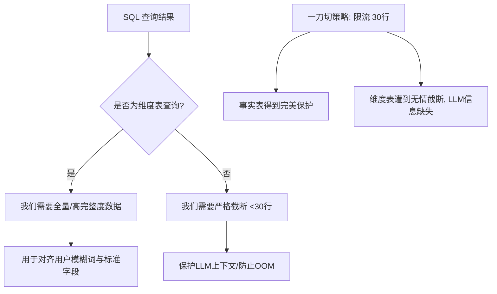

# SQL 查询截断机制下维度表数据缺失与对齐矛盾分析报告

## 1. 背景与核心矛盾 (Background & Core Contradiction)

在生产数据查询智能体（SQL Agent）中，我们引入了针对查询结果的硬截断机制（如设置 `SQL_RESULT_HARD_LIMIT='30'`）。这一限制设计初衷是为了在面对巨量**事实表（Fact Tables）**时保护大模型的上下文窗口，防止因全表扫描或未加约束的查询导致大模型崩溃（OOM）、Token 极速消耗和响应延迟。

然而，全局采用单一的硬截断参数（一刀切策略），引发了**事实表防御性截断**与**维度表（Dimension Tables）全量数据召回**之间的核心矛盾：



### 核心矛盾定义

- **事实表（Fact Tables）**：行数巨大（成千上万条物流日志），**必须严格控制（限流）**，强迫大模型使用 `GROUP BY` 或 `COUNT`。
- **维度表（Dimension Tables）**：行数极少（一般在 10 ~ 200 行之间，如颜色表、车型表、车间工艺区域表 `process_areas`）。它们本质上是系统的**实体字典**。大模型在遇到用户的模糊词时，必须有能力全量读取这些字典，用于语义对齐。若全局限流 30 行，就会导致大模型拿到的字典不完整，从而产生严重的"理解偏差"和"幻觉"。

---

## 2. 痛点场景剖析：以 process_areas（车间工艺区域表）为例

在涂装（Paint Shop）等工业生产场景中，车间工艺区域（`process_areas`）是极其关键的维度信息。以下是硬截断机制在模糊匹配场景下产生的具体链路痛点：

```
1. 用户模糊提问: "涂装车间里有哪些异常车辆?"
      |
      v
2. LLM 产生意图: 数据库里哪个区域代表 "涂装车间"?
   LLM 生成 SQL: SELECT * FROM process_areas  (该表定义了完整工艺区域, 共 60 行)
      |
      v
3. 系统硬防御介入: 检查到返回 60 行，触发截断 (SQL_RESULT_HARD_LIMIT = 30)
   系统行为: 强制砍掉后 55 行，只把前 5 行作为数据预览返回给 LLM
      |
      v
4. LLM 陷入盲区: 前 5 行预览里只有 "前处理", "电泳" 等区域。
   真正的 "面漆"、"中涂" 等工艺区域存在于被截断的 55 行中，LLM 完全不可见。
      |
      v
5. 连锁反应（回答失真）:
   LLM 无法将 "涂装车间" 正确对齐到实际的工艺区域，导致它要么猜测一个不存在的区域（幻觉），
   要么生成一个条件残缺的 SQL，导致最终返回给用户的统计数据严重失真或为空。
```

---

## 3. 行业主流解决方案深度对比 (Solutions Comparison)

针对这种"大事实表需要关门，小维度表需要开路"的矛盾，行业内通常采用以下四种差异化处理方案：

### 方案 A：动态旁路检测（Dimensional Table Whitelisting）—— 推荐 ⭐⭐⭐⭐⭐

- **实现方式**：
  在代码的 SQL 查询拦截器（如包装工具 `sql_db_query`）中，**不再一刀切地根据行数拦截**。而是引入一套"智能旁路机制"：通过 **sqlglot AST 解析**精确提取查询中涉及的全部表名，判定本次查询目标是否为系统注册的**维度表/字典表**（如 `process_areas`、`car_models`、`colors`）。
- **截断策略**：
  - AST 解析后涉及的表**全部属于维度白名单**时，自动提升硬限制（如放宽至 300 行），确保字典数据全量返回。
  - 只要混入了任何一张事实表（`JOIN` 或子查询），则严格执行 30 行截断。
- **优点**：AST 解析能正确处理 CTE、子查询、别名、schema 限定名等所有复杂情况，对大模型完全透明，且完美解决维度表截断痛点。
- **缺点**：引入了 `sqlglot` 依赖（纯 Python，无 C 扩展要求，已是行业标准，影响极小）。

> ⚠️ **为什么不能用子串/正则匹配？**
> 使用字符串子串检测 SQL 表名是在用错误的工具做 parser 的活，存在三类不可接受的误判场景：
>
> | 场景 | SQL 示例 | 误判结果 |
> |:---|:---|:---|
> | **字段名含维度表名** | `SELECT process_areas_id FROM vehicle_tracking` | 字段名触发维度白名单 → 事实表被误放行，海量数据涌入 LLM |
> | **子查询混用** | `SELECT * FROM process_areas WHERE id IN (SELECT area_id FROM vehicle_tracking)` | 子查询中的事实表命中拦截 → 维度查询被误截断 |
> | **CTE 别名** | `WITH a AS (SELECT * FROM process_areas) SELECT * FROM a JOIN vehicle_tracking ...` | 同上 |
>
> 以上三类误判在实际 Agent 运行中必然发生，子串方案不可用于生产环境。

### 方案 B：DDL 枚举值预注入（Schema Pre-loading）—— 推荐 ⭐⭐⭐⭐

- **实现方式**：
  既然维度表本身就是模式的一部分，在 `db_utils.py` 获取表结构（DDL）时，如果遇到小体量的字典表列，在拼接建表语句的 SQL 注释时，自动将这些枚举值注入进去。
  ```sql
  CREATE TABLE process_areas (
      area_id INT,
      area_name VARCHAR(50) -- 区域名。可用工艺区域全集: ['前处理', '电泳', 'PVC', '中涂', '面漆', '报交', '点修补']
  );
  ```
- **优点**：大模型在分析 Schema 的第一阶段就掌握了全量字典，甚至不需要再发一次 `SELECT *` 的 SQL 查询。
- **缺点**：当维度表的数据经常变动或数据项达到上百条时，会导致 System Prompt 的 Token 消耗过大。

### 方案 C：提供专用实体检索小工具（Dedicated Lookup Tool）—— 推荐 ⭐⭐⭐

- **实现方式**：
  限制 SQL 工具的硬截断不变。给大模型新增一个专用的元数据查询工具：`lookup_dimension(table, column, fuzzy_query)`。
  - 这个工具不受 30 行截断限制。
  - 允许大模型通过它直接去查字典表的所有去重值。
- **优点**：职责极其单一，避免了复杂 SQL 在主通道撞墙。
- **缺点**：增加了大模型的 Tool 调用轮次（Agent 需要先 Call 这个工具，拿到值后，再 Call SQL 工具，增加了反应延迟）。

### 方案 D：前置向量检索术语对齐（Semantic Matching Pre-processor）—— 推荐 ⭐⭐⭐⭐

- **实现方式**：
  在 SQL Agent 启动意图识别的更前置阶段，使用已有的 RAG 向量通道（如 Milvus）。
  - 将 `process_areas` 中的每一个区域名以及它的模糊同义词录入向量库。
  - 用户的自然语言一进来，系统自动利用向量库先做一次匹配，将模糊词翻译为"标准工艺区域名"写入提示词，再让大模型生成 SQL。
- **优点**：用户体验极佳，甚至能识别错别字和黑话（如"油漆"自动对齐到"面漆"）。
- **缺点**：需要额外维护一套向量库数据同步逻辑。

---

## 4. 具体落地架构设计建议 (Action Plan)

为了以最低的改动成本、最优雅的方式解决当前 `process_areas` 等表格触碰截断的问题，建议在项目中落实 **"方案 A（动态旁路检测）"**。

### 1. 配置注册维度表白名单 (config.py)

在 [config.py](file:///f:/000_dev/Python/workplace/rearch_agent/.tree/features/agent/backend/app/config.py) 中，显式定义维度表/字典表白名单，这符合我们"最小改动"与"约定优于配置"的原则：

```python
# backend/app/config.py
class Settings(BaseSettings):
    # ...
    # 维度表/字典表白名单，免受严格的 30 行硬限制约束
    dimension_tables: list[str] = ["process_areas", "car_models", "colors", "defect_stations"]
    # 维度查询的宽松截断限制（比如放宽到 300 行）
    dimension_result_hard_limit: int = 300
```

### 2. 重写拦截检测逻辑 (sql_tools.py)

在 [sql_tools.py](file:///f:/000_dev/Python/workplace/rearch_agent/.tree/features/agent/backend/app/agent/tools/sql_tools.py) 的 `sql_db_query` 中，增加"动态硬截断限制选择"。

**关键实现原则：必须使用 `sqlglot` 进行 AST 级别的表名提取，禁止使用子串/正则匹配。** 原因参见方案 A 的警告说明。

```python
# backend/app/agent/tools/sql_tools.py
import sqlglot


def _extract_table_names(query: str) -> set[str]:
    """
    使用 sqlglot AST 精确提取 SQL 中涉及的所有表名。
    能正确处理：CTE、子查询、多表 JOIN、schema 限定名（schema.table）、表别名等。
    解析失败时返回空集合，调用方应按保守策略（事实表）处理。
    """
    try:
        tables = set()
        parsed = sqlglot.parse_one(query, error_level=sqlglot.ErrorLevel.IGNORE)
        for table in parsed.find_all(sqlglot.exp.Table):
            tables.add(table.name.lower())
        return tables
    except Exception:
        # 极少数情况下 AST 解析彻底失败，回退到保守策略（严格截断）
        return set()


def _is_pure_dimension_query(query: str) -> bool:
    """
    判断当前查询是否仅涉及维度表/字典表（不含任何事实表）。
    基于 sqlglot AST 精确提取所有涉及的表名后与白名单比对。
    只有当 SQL 中涉及的【全部】表名都在维度白名单内，才返回 True。
    """
    involved_tables = _extract_table_names(query)
    if not involved_tables:
        # 解析失败或空查询，回退到保守策略（严格截断）
        return False

    dim_whitelist = set(settings.dimension_tables)

    # 关键：使用集合 issubset，确保没有任何一张非维度表混入
    return involved_tables.issubset(dim_whitelist)


# 在 sql_db_query 执行器中动态调整硬限制：
# ...
is_dim = _is_pure_dimension_query(query)
current_hard_limit = (
    settings.dimension_result_hard_limit if is_dim else settings.sql_result_hard_limit
)

if estimated_rows >= current_hard_limit:
    # 执行超限截断
    # ...
```

### 3. 方案总结与收益

通过引入**动态旁路检测（基于 sqlglot AST）**，系统实现了精细化的动态流量治理：

1. 当大模型查询 `process_areas` 或 `colors` 字典时，系统自动应用 `300 行` 宽松红线，确保 60 行的字典数据**全量返回**，模型无缝获取全部工艺区域进行完美对齐。
2. 当大模型意外生成了对事实表的无限制查询时，系统依然保持 `30 行` 钢铁红线，瞬间进行防御性截断，确保后端服务安全无虞。
3. 对于**维度表与事实表混查**（如多表 JOIN），系统通过 AST 精确识别并**降级到事实表截断策略**，避免因误放行导致海量数据溢出。
