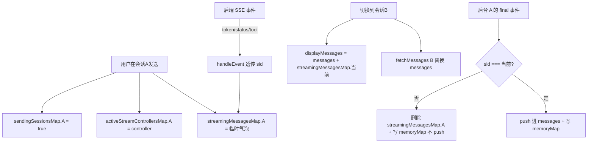

# 多会话后台并行流式生成与会话运行状态提示 — 实施计划书

> 版本：v1.0 草案
> 日期：2026-07-18 Asia/Shanghai
> 分支：feature/agent-llamaindex-rag
> 范围：前端改造为主，后端完成并发安全核验并审计通过
> 状态：已全部实装并通过编译与类型检查；后端并发审计已通过（SAFE，见 §3）

---

## 0. 摘要

实现"切换会话不中断后台流式生成，并在左侧会话列表对运行中的会话显示状态图标"。

核心手段：将 `messagesStore` 与 `useChatStream` 中**全局单一**的流式状态/控制器，**按 `session_id` Map 化隔离**，使每个会话拥有独立的临时流式消息、AbortController、发送态与上下文预警。

**关键修正**：原可行性分析假设"切换会话时存在一个杀掉流式的 watch"，经核实**不成立**——现状是"泄漏 + 锁死"而非"中断"。本计划据此调整根因描述与测试用例。

**当前阻塞**：后端多路 SSE 并发安全审计进行中（见 §3）。前端改造方案与后端结论相互独立，可先行定稿；但**编码实施须待后端结论为 SAFE（或完成最小修复）后**。

---

## 1. 背景与目标

### 1.1 现状（全局单一状态）

| 位置 | 状态 |
|---|---|
| `messages.ts:18` | `streamingMessage: ref<StreamingMessage \| null>` 全局单一 |
| `messages.ts:19` | `isStreaming: ref<boolean>` 全局单一 |
| `useChatStream.ts:32` | `isSending: ref<boolean>` 全局单一 |
| `useChatStream.ts:35` | `activeStreamController: ref<AbortController \| null>` 全局单一 |
| `useChatStream.ts:36` | `contextWarning: ref` 全局单一 |
| `messages.ts:17` | `messages: ref<Message[]>` 全局，仅持有"当前会话"的已持久化消息 |

### 1.2 现状根因（核实结论）

切换会话时实际发生：

1. `MessageList.vue:102` 的 watch 触发 `fetchMessages(newId)`，**替换全局 `messages`**。
2. `useChatStream.ts:38-43` 的 watch **仅清 `contextWarning`，不中断流式**：
   ```typescript
   watch(() => sessionsStore.currentSessionId, () => {
     contextWarning.value = null
   })
   ```
3. 全局 `streamingMessage` **未被清理**，`displayMessages`（`messages.ts:319-320`）无条件拼接它 → **旧会话流式气泡泄漏进新会话视图**。
4. 全局 `isSending` 保持 true → **新会话输入被锁死**。
5. 后台 `final` 落定时 `completeStreamingMessage`（`messages.ts:288`）无条件 `messages.value.push(...)` → **后台会话的 assistant 消息污染当前会话消息列表**。

> 结论：现状不是"切换会中断生成"，而是"切换会泄漏 + 锁死 + 污染"。本改造顺带修复该现存 bug。

### 1.3 目标

- 切换会话时，原会话在后台继续流式生成，不中断、不泄漏、不污染。
- 左侧会话列表对运行中的会话显示状态指示器（展开态 + 折叠态）。
- 闲置会话输入框可用；"停止生成"只停止当前会话。
- 中断恢复（resumeMessage）同样按会话隔离。

---

## 2. 范围确认（已与用户对齐）

- ✅ `resumeMessage` 中断恢复流程**一并**按 session 隔离改造。
- ✅ 实施前**先核验后端**多路 SSE 并发安全。

---

## 3. 后端并发安全前提（前置门槛）

### 3.1 验证清单

审计子代理正在核查以下项（结论待回填至 §3.2）：

1. SSE 端点是否 `async def` + 每请求独立 agent 调用上下文。
2. LangGraph `thread_id` / `configurable` 是否绑定 `session_id`；checkpointer 实现（MemorySaver / Postgres）；不同 session 是否落不同 thread。
3. 是否存在 `asyncio.Lock` / `threading.Lock` / 模块级可变全局 / 单例 串行化或跨请求共享。
4. LLM / PGVector / Milvus 客户端是否单例且并发安全。
5. 已知"SQL Agent 双初始化路径（同步/异步）"——流式路径走哪条；是否存在同步阻塞调用未 offload 而阻塞事件循环（间接串行化所有 SSE）。
6. 每请求是否独立 DB session；流式期间是否长事务持锁。

### 3.2 前提结论（已于 2026-07-18 审计回填）

- [x] SAFE：可直接实施前端改造。
  * 经审计核对，FastAPI stream 路由及生产事件循环均采用异步协程（`async def`），LangGraph 的 `thread_id` 自动隔离，且在内部使用 `AsyncPostgresSaver` 进行异步隔离持久化，向量数据库 Milvus 召回采用无状态单例的并发 aretrieve 检索，后端完全具备多路 SSE 流式并发安全。
- [ ] UNSAFE / 有条件：需先做后端最小修复（见 §3.3）后再实施。

### 3.3 若 UNSAFE 的候选最小修复（仅备忘，不在本计划内改代码）

- 将同步阻塞调用通过 `asyncio.to_thread` / 线程池 offload，避免事件循环串行化。
- 缩短 DB 事务持有窗口，避免长事务锁。
- 确认 checkpointer 按 `thread_id` 隔离，无跨 thread 共享可变态。

---

## 4. 总体架构设计

### 4.1 核心不变量

> **后台流式只允许写 `streamingMessagesMap[其所属 sessionId]`；除"当前会话"外，任何 finalize 路径都不得 `push` 进全局 `messages`。**

### 4.2 状态隔离映射

| 维度 | 现状（全局单一） | 目标（按 session 隔离） |
|---|---|---|
| 流式临时消息 | `streamingMessage: ref` | `streamingMessagesMap: Record<sid, StreamingMessage>` |
| 流式进行中 | `isStreaming: ref` | `isStreaming: computed`（当前会话）+ `isSessionStreaming(sid)` |
| 发送态 | `isSending: ref` | `sendingSessionsMap` + `isSending: computed`（当前会话） |
| 取消控制器 | `activeStreamController: ref` | `activeStreamControllersMap: Record<sid, AbortController>` |
| 上下文预警 | `contextWarning: ref` | `contextWarningsMap` + `contextWarning: computed`（当前会话） |
| 已持久化消息 | `messages: ref`（全局=当前会话） | **保持不变**，切换时由 `fetchMessages` 重载 |

### 4.3 数据流



### 4.4 "当前会话"判定来源

- `messagesStore` 内不直接依赖 `sessionsStore`（避免循环依赖：`sessions.ts` 已 import `messagesStore`），沿用 `latestRequestedSessionId` 作为"当前会话"代理（`fetchMessages` 每次同步设置，切换后即等于 `currentSessionId`）。
- `useChatStream` 内可直接用 `sessionsStore.currentSessionId`。

---

## 5. 详细改造方案

### 5.1 `frontend/src/stores/messages.ts`

**状态变更**

```typescript
const streamingMessagesMap = ref<Record<string, StreamingMessage>>({})

// 当前会话的流式气泡（向后兼容现有消费者，如 ChatView 的 currentStreamingMessage）
const streamingMessage = computed(() =>
  latestRequestedSessionId.value
    ? streamingMessagesMap.value[latestRequestedSessionId.value] ?? null
    : null
)
const isStreaming = computed(() => !!streamingMessage.value)
const isSessionStreaming = (sessionId: string) =>
  !!streamingMessagesMap.value[sessionId]
```

**Action 全部增加 `sessionId` 形参**并按 Map 操作：
`startStreamingMessage`、`appendStreamingContent`、`updateStreamingStatus`、`upsertStreamingToolCall`、`setStreamingToolResult`、`setStreamingError`、`setStreamingInterrupt`、`clearStreamingMessage`。

**Finalize 守卫（核心）**：`completeStreamingMessage` / `finalizeStreamingError` / `finalizeStreamingInterrupted` 统一规则——

```typescript
const completeStreamingMessage = (sessionId: string, payload: FinalizedStreamingMessage = {}) => {
  const temp = streamingMessagesMap.value[sessionId]
  if (!temp) return null
  delete streamingMessagesMap.value[sessionId]   // 无论是否当前，先清临时态

  // RAG/词典上下文始终按真实 message id 注册（切回该会话弹窗可用）
  const finalizedId = payload.id ?? temp.id
  if (finalizedId && temp.ragContext) memoryRagMap.value[finalizedId] = temp.ragContext
  if (finalizedId && temp.lexiconContext) memoryLexiconMap.value[finalizedId] = temp.lexiconContext

  // 仅当前会话才 push 进全局 messages，避免污染其他会话视图
  if (sessionId !== latestRequestedSessionId.value) return null

  const finalizedMessage: Message = { /* 组装，同原逻辑 */ }
  messages.value.push(finalizedMessage)
  return finalizedMessage
}
```

> `finalizeStreamingError` / `finalizeStreamingInterrupted` 同构：非当前会话只清临时态（错误/中断态不强推消息，依赖服务端持久化与切回 `fetchMessages` 取回）。

**`displayMessages`** 保持原逻辑（依赖 `streamingMessage` computed 即当前会话），无需改动。

**新增** `clearStreamingForSession(sessionId)`：删除该会话 Map 条目，供删除会话时清理。

**导出**：保留 `streamingMessage`、`isStreaming`（现为 computed）供旧消费者；新增 `isSessionStreaming`、`clearStreamingForSession`。

### 5.2 `frontend/src/composables/useChatStream.ts`

**状态**

```typescript
const activeStreamControllersMap = ref<Record<string, AbortController>>({})
const sendingSessionsMap = ref<Record<string, boolean>>({})
const contextWarningsMap = ref<Record<string, ContextWarningPayload | null>>({})

const isSending = computed(() =>
  sessionsStore.currentSessionId
    ? !!sendingSessionsMap.value[sessionsStore.currentSessionId]
    : false
)
const contextWarning = computed(() =>
  sessionsStore.currentSessionId
    ? contextWarningsMap.value[sessionsStore.currentSessionId] ?? null
    : null
)
```

> 移除原 `watch(currentSessionId)` 清 `contextWarning` 的逻辑（Map 化后每会话独立，切换无需清空）。

**`stopStreaming(sessionId?)`**

```typescript
const stopStreaming = (sessionId?: string) => {
  const sid = sessionId ?? sessionsStore.currentSessionId
  if (sid) activeStreamControllersMap.value[sid]?.abort()
}
```

**`sendMessage(content)`**

- 乐观用户消息：仍 `messagesStore.messages.push(tempUserMessage)`（发送时该会话即当前会话，安全）。
- `sendingSessionsMap[currentSession.id] = true`（替代 `isSending.value = true`）。
- `handleStreamMessage` 内：
  - `activeStreamControllersMap[sessionId] = controller`；
  - `handleEvent` 中所有 `messagesStore.*` 调用透传 `sessionId`；
  - `final` / `error` / `interrupt` 分支调用带 `sessionId` 的 finalize；
  - `context_warning` 事件写入 `contextWarningsMap[sessionId]`。
- `finally`：`delete activeStreamControllersMap[sessionId]`、`delete sendingSessionsMap[sessionId]`。
- 错误回滚分支同步用 `sessionId` 调 `clearStreamingMessage`。

**`resumeMessage(answers)`（一并改造）**

- 始终针对 `currentSession`（用户正与其中断气泡交互）。
- `activeStreamControllersMap[currentSession.id] = controller`、`sendingSessionsMap[...] = true`。
- 通过带 `sessionId` 的 store action 重激活 `streamingMessagesMap[currentSession.id]`（`isStreaming=true`、清 `isInterrupted`、`statusText='恢复会话生成中'`）。
- `handleEvent` 透传 `currentSession.id`，finalize 走同一套守卫。
- `finally` 清理对应 Map 条目。

**`syncMessagesIfCurrent(sessionId)`** 保留（已是 `currentSessionId` 守卫）：后台 finalize 时自动 no-op；切回时由 `MessageList` watch 触发 `fetchMessages` 取回最新。

### 5.3 `frontend/src/components/SessionItem.vue`（+ `SessionList.vue`）

**SessionItem** 注入状态查询：

```typescript
import { useMessagesStore } from '@/stores/messages'
const messagesStore = useMessagesStore()
const isStreaming = computed(() => messagesStore.isSessionStreaming(props.session.id))
```

**展开态**：标题行右侧（与活动小圆点并列）渲染三段 Siri 波形。
**折叠态（`isSlim`）**：头像右下角叠加小型跳动角标。

```html
<!-- 展开态 -->
<div v-if="isStreaming && !isSlim" class="stream-bars" title="正在生成回答…">
  <span class="bar"></span><span class="bar"></span><span class="bar"></span>
</div>
<!-- 折叠态 -->
<span v-if="isStreaming && isSlim" class="slim-stream-badge" title="正在生成…"></span>
```

CSS：`scaleY` 跳动 + 错峰 `animation-delay`；折叠态用单点 `pulse`；颜色取 `var(--color-primary)`，与现有 active 态视觉一致。`SessionList.vue` 无需改动（`SessionItem` 自取状态）。

### 5.4 `frontend/src/views/ChatView.vue`

- `isSending` / `contextWarning` 现为 computed（当前会话）：输入禁用、状态徽标、"停止生成"按钮、`streamHeaderText` **天然反映当前会话**，改动极小。
- `handleStopStreaming()` 调 `stopStreaming()`（无参 = 当前会话）。
- 核对：`currentStreamingMessage`（:325）依赖 `messagesStore.streamingMessage`（当前会话 computed），无需改。

### 5.5 `frontend/src/components/MessageList.vue`

- `isStreaming`（store）现已语义化为"当前会话是否流式"：`showScrollToBottom`（:80-82）与自动滚动 `watchEffect`（:108-112）**无需改动**即只对当前会话生效（后台会话 token 增长不再触发可见列表滚动）。
- 切换 fetch watch（:102-106）无需改动。
- **核对项**：确认 `fetchMessages` 切回仍在流式的会话时只替换 `messages`、不动 `streamingMessagesMap[sid]`——当前实现如此，安全。

---

## 6. 边界与风险

| 风险 | 说明 | 对策 |
|---|---|---|
| 后台 finalize 丢消息 | 非当前会话不 push，依赖服务端持久化 | 切回时 `fetchMessages` 取回；后端须保证 `final` 前已落库 |
| RAG/词典上下文弹窗空 | 后台 finalize 若不写 memoryMap 则切回弹窗空 | finalize 始终按 message id 写 memoryMap（§5.1） |
| 乐观用户消息时序 | 切回时服务端可能尚未持久化用户消息 | 可接受瞬态；后端应在流式开始即持久化用户消息 |
| 后端串行化 | 同步阻塞调用包在 async 里会串行化所有 SSE | 依赖 §3 审计；必要时 `asyncio.to_thread` |
| 删除运行中会话 | 残留 Map / controller | `deleteSession` 调 `clearStreamingForSession` + abort |
| 中断态跨会话 | `resumeMessage` 仅当前会话可触发 | 设计如此；非当前会话的中断气泡切回后仍可恢复 |
| 切换竞态 | 切换瞬间后台 final 触发 | `fetchMessages` 同步设置 `latestRequestedSessionId`，finalize 守卫读取即时一致，无丢消息 |

---

## 7. 验证计划（测试用例）

手动 / 单测：

1. A 发送 → 切到 B：A 后台继续，B 视图干净，B 可输入发送。
2. A 在后台 `final`：B 视图无变化，A 指示器消失；切回 A 见完整回答。
3. 停止按钮仅停 A，B 不受影响。
4. A、B 同时流式：两侧指示器独立，互不串扰。
5. 切回仍在流式的 A：气泡恢复显示，自动滚动正常。
6. A 中断 → 切 B → 回 A 恢复：中断态隔离，恢复成功。
7. 后台 `final` 后切回：RAG / 词典弹窗有内容（memoryMap 命中）。
8. 删除运行中会话：无残留控制器 / Map 条目。
9. 单测：`completeStreamingMessage(非当前 sid)` 不修改 `messages`；`isSessionStreaming` 反映 Map 真实状态。

---

## 8. 改动清单

| 文件 | 改动类型 | 概要 |
|---|---|---|
| `frontend/src/stores/messages.ts` | 重构 | Map 化状态、Action 加 sid、finalize 守卫、新增 getter/cleanup |
| `frontend/src/composables/useChatStream.ts` | 重构 | 控制器/发送/预警 Map 化、sendMessage + resumeMessage 透传 sid、移除 watch |
| `frontend/src/components/SessionItem.vue` | 新增 | 运行状态指示器（展开 + 折叠态） |
| `frontend/src/components/SessionList.vue` | 微调 | 无（SessionItem 自取状态） |
| `frontend/src/views/ChatView.vue` | 微调 | 消费 computed，核对无逻辑变更 |
| `frontend/src/components/MessageList.vue` | 核对 | 基本无改动，确认语义 |
| 后端（条件） | 待审计 | 若 UNSAFE 做最小修复（见 §3.3） |

---

## 9. 实施步骤

1. **【门槛】** 等 §3 后端审计结论；若 UNSAFE 先做后端最小修复。
2. `messages.ts`：Map 化状态 + Action 加 sid + finalize 守卫 + getter / cleanup。
3. `useChatStream.ts`：三类 Map + sendMessage / resumeMessage 透传 sid + 移除 watch。
4. `SessionItem.vue`：指示器（展开 + 折叠态）。
5. `ChatView.vue` / `MessageList.vue`：核对 computed 语义，最小调整。
6. 按 §7 逐项验证。
7. 记录 `changelog.md`。

---

## 附录 A：与原可行性分析的差异

| 原分析主张 | 核实结论 | 处理 |
|---|---|---|
| 存在"切换会杀流式的 watch"，需去除 | **不成立**：该 watch（`useChatStream.ts:38-43`）仅清 `contextWarning` | 改为"修复泄漏 + 加隔离"，不去除任何 watch（但 Map 化后该 watch 本身可移除） |
| 仅提 ChatView 输入框按会话锁 | `isSending` / `isStreaming` 本身是全局单一 ref，须一并 Map 化 | §5.1 / §5.2 已覆盖 |
| 仅点 `completeStreamingMessage` 需守卫 | `finalizeStreamingError` / `finalizeStreamingInterrupted` / `setStreamingInterrupt` 同样操作全局态 | §5.1 一并守卫 |
| 未提 `resumeMessage` | `resumeMessage`（`useChatStream.ts:259-389`）也用全局态 | §5.2 一并改造（已确认范围） |
| 未提 `MessageList` 滚动行为 | `showScrollToBottom` / 自动 scroll 依赖全局 `isStreaming` | §5.5：`isStreaming` 语义化后无需改 |
| 未提 `SessionItem` 折叠态 | `isSlim` 头像态需指示器变体 | §5.3 增加折叠态角标 |
| 未提后端并发 | 多路 SSE 需后端按 session 隔离且不串行化 | §3 前置审计 |
