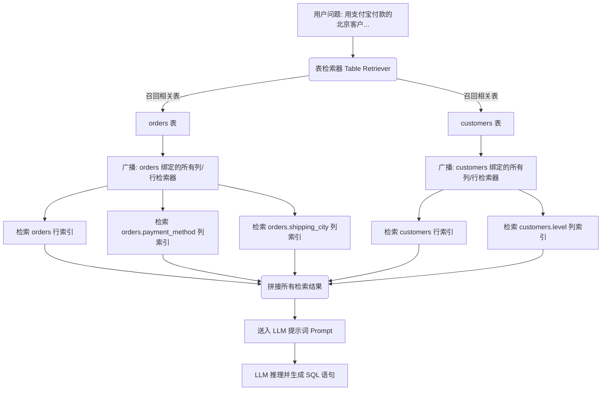

# LlamaIndex SQL 三层检索最佳实践指南

本指南重点总结 LlamaIndex 自动 Pipeline 模式下，行级检索（Row-level）与列级检索（Column-level）的**广播式应用机制**、**前置列过滤配置方式**以及生产环境下的优化配置规范。

---

## 一、 行级与列级检索的“广播式应用机制”

在 LlamaIndex 的 `SQLTableRetrieverQueryEngine` 自动运行通道中，行检索和列检索是**基于表召回结果被动触发的“广播式检索”**。

### 1. 广播式机制的工作原理
当用户发起一个查询（例如：`“用支付宝付款的北京客户有哪些？”`）时，系统的底层执行链条如下：



### 2. 广播式机制的局限性
* **检索压力放大（Fan-out）**：如果召回了 2 张表，每张表配置了 4 个列检索器和 1 个行检索器，系统会自动并发执行 $(4+1) \times 2 = 10$ 次向量检索。
* **无效上下文噪音**：即使用户问题只问了“支付方式”，由于广播机制，`shipping_city` 的列检索器依然会被动触发，并强行返回一个“最相似”的城市名（如“北京”），塞入 Prompt 成为干扰噪音。

因此，**限制检索的物理范围**（包括行检索的字段范围、列检索的去重上限）是确保整个系统性能与准确性的第一要务。

---

## 二、 行级检索：前置列过滤配置最佳实践

### 1. 为什么要进行前置列过滤？
行级检索通常将数据库一整行记录拼接成一个向量节点。如果不做过滤：
* 数据库里非语义的干扰列（如 `created_at`、`updated_at`、`log_id`）和连续数值列（如 `amount`、`price`）会被强行向量化。
* 向量检索时会引入大量噪声，且单节点文本过长会造成 LLM 上下文（Context）浪费。

### 2. 配置方法与代码示例
最佳实践是在构建行索引之前，**显式指定需要参与向量化的关键语义列（维度列）**，避开 `SELECT *`。

在本项目中，可以通过如下配置实现行检索的前置列过滤：

#### 🛠️ Python 侧配置（修改 `main.py` 中的构建入参）
```python
# main.py

# ❌ 错误做法：直接传入 table，导致使用 SELECT * 向量化所有列
# row_indices = build_all_row_indices(engine, {
#     table: {"limit": 1000} for table in all_tables
# })

# ✅ 正确做法：只针对核心维度表建行索引，且精确限制参与向量化的列（仅保留具备实体检索意义的列）
row_indices_config = {
    "customers": {
        "columns": ["name"],               # 仅对姓名建行索引，用于“张三”、“李四”等名字召回
        "limit": 1000
    },
    "products": {
        "columns": ["name", "brand"],      # 仅对商品名和品牌建行索引，用于商品实体召回
        "limit": 1000
    }
    # orders, inventory, system_logs 等流水/干扰表不在此配置中，即完全不建行索引
}

# 批量构建行索引
row_indices = build_all_row_indices(engine, row_indices_config)
```

#### ⚙️ 底层 SQL 生成与拼接逻辑（`src/row_index.py`）
在底层，前置列过滤通过控制 SQL 查询和节点拼接来实现：

```python
def build_row_index(engine, table_name: str, columns: list = None, limit: int = 1000):
    # 1. 动态生成 SQL：仅查询配置 of 列，不使用 SELECT *
    cols_str = ", ".join(columns) if columns else "*"
    query = f"SELECT {cols_str} FROM {table_name} LIMIT {limit}"
    
    with engine.connect() as conn:
        rows = conn.execute(text(query)).fetchall()
        
    # 2. 节点拼装：仅将配置的字段与值拼接为 TextNode
    nodes = []
    for row in rows:
        row_dict = dict(zip(columns, row))
        # 拼接为: name=张三 或者是 name=iPhone 15 Pro, brand=Apple
        node_text = ", ".join([f"{k}={v}" for k, v in row_dict.items() if v is not None])
        nodes.append(TextNode(text=node_text))
        
    return VectorStoreIndex(nodes)
```

---

## 三、 列级检索：去重与安全防御配置最佳实践

列级检索用于对齐低基数列（如状态、类型、城市等）的枚举值。它的配置重点在于**去重防爆**和**防报错占位**。

### 1. 严格限制去重值上限 (DISTINCT Limit)
如果一个列的去重值太多（比如用户表里的“邮箱”列），将其作为列索引会导致向量节点数量爆炸。
* **最佳实践**：执行 `SELECT DISTINCT {column_name}` 并限制 `LIMIT 100`（或最多 1000）。如果在代码中发现该列去重值数量超过阈值，**应在日志警告并跳过该列索引构建**。

### 2. 占位符安全防护（防止 LlamaIndex 源码抛出 KeyError）
LlamaIndex 的 `SQLTableRetrieverQueryEngine` 在组装上下文时，会强制访问所有可用表的列检索器字典（即 `self._cols_retrievers[table_name]`），如果检索器缺少某张表的 Key，会直接抛出 `KeyError` 崩溃。
* **最佳实践**：对于不构建任何列索引的表（如 `system_logs`、`inventory`），**必须使用空字典 `{}` 进行显式占位**。

```python
# 组装 cols_retrievers 时的防崩溃机制
cols_retrievers = {}
for table_name in sql_database.get_usable_table_names():
    if table_name in column_indices and column_indices[table_name]:
        # 有列索引，装入对应的列检索器
        cols_retrievers[table_name] = {
            col: index.as_retriever(similarity_top_k=1)
            for col, index in column_indices[table_name].items()
        }
    else:
        # ✅ 核心防线：对没有列索引的表，强制传入空字典占位
        cols_retrievers[table_name] = {}
```

---

## 四、 生产环境持久化优化：共享 Collection + 标量过滤

在生产环境（如使用 Milvus 或 Qdrant）中，如果为每个列都创建一个独立的向量集合（Collection），会导致数据库连接及资源管理混乱。

### 推荐物理布局：
* **行索引**：核心维度表，每张表独立建 1 个 Collection（如 `idx_row_products`、`idx_row_customers`）。
* **列索引**：**所有表的所有枚举列，共用 1 个全局列 Collection**（如 `idx_global_columns`）。

#### 🔹 全局列 Collection 结构设计 (Milvus 示例)：
* **向量字段 (Vector)**: `embedding` (存储 `"表名.列名=去重值"` 的向量)
* **标量字段 (Fields)**: 
  * `table_name` (如 `'orders'`) -> 建立标量索引
  * `column_name` (如 `'payment_method'`) -> 建立标量索引
  * `value` (如 `'支付宝'`)

#### 🔹 检索时的过滤机制：
当 LlamaIndex 自动检索 `orders.payment_method` 时，为该列检索器绑定特定的 `MetadataFilters`。向量数据库会首先在物理上限制范围，只在 `table_name='orders' AND column_name='payment_method'` 的数据空间内进行向量比对。这既保证了查询的隔离性，又避免了创建几十个 Collection 的资源浪费。
