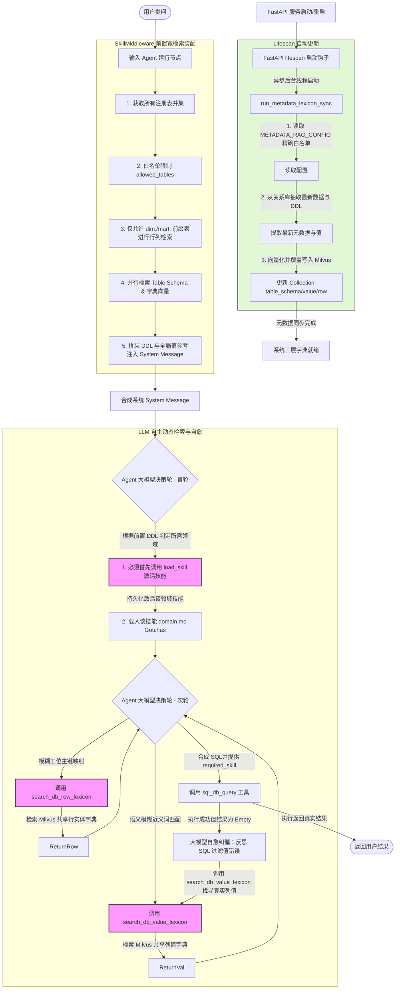

# 基于 LlamaIndex 检索思想的 SQL Agent 架构优化评审与设计报告（第十三版）

**报告时间**: 2026-07-14  
**分析对象**: 动态三层检索工具链精简与 Agent 语义自愈决策（双轨方案最终纯净版）  
**开发环境**: Python 3.12 + FastAPI + LangChain/Graph + Milvus 向量数据库（基于 LlamaIndex 库封装）

---

## 核心评审结论

针对您提出的“`column_value_probe` 是否过度设计？已经有了 `search_db_value_lexicon` 和 `search_db_row_lexicon` 工具”这一极具实用主义的反馈，本报告对工具链设计进行了**去芜存菁的终极精简（第十三版）**：

1. **完全废除 `column_value_probe`（源库实时探查工具）**：
   - **完全采纳您的建议**。直查关系型数据库的 `column_value_probe` 缺乏语义匹配能力（例如输入“双色车顶”，由于源表字段只存有 `True`，`ILIKE` 模糊匹配根本查不出来），且频繁查询会给只读数据库带来不必要的扫表压力。
   - 在我们已经实现了 **FastAPI Lifespan 重启时自动重新嵌入三层向量 Collection** 的保障下，Milvus 中的 `db_value_lexicon` 和 `db_row_lexicon` 数据已能保持高度最新。
2. **工具链极简合并**：
   - 彻底将所有“大模型自主动态行/列值检索”以及“执行为空时的反射纠偏”职责，**统一收拢合并至已有的两个向量工具上**：
     - `search_db_value_lexicon`（基于 Milvus 的列值语义字典匹配）。
     - `search_db_row_lexicon`（基于 Milvus 的行实体主键语义对齐）。
3. **大模型自愈纠偏的纯净路径**：
   - 若大模型生成的 SQL 执行为空，大模型自我反思后，**同样调用 `search_db_value_lexicon` 进行语义匹配**。例如：检索“电泳二期”，Milvus 全局字典通过向量距离依然能成功将其映射为 `process_area = '前道电泳二区'`，在没有数据库直查开销的前提下完美自愈。

---

## 一、 系统架构设计流程 (Mermaid)

精简后的混合协同三层架构，大模型自主调用和自愈纠偏完全归口在两个 Milvus 向量工具中：



---

## 二、 技能冷启动与三层范围确定逻辑

### 2.1 维度表类型过滤与装配代码实现

在 `SkillMiddleware` 中，我们仅将含有 `dim.` 或 `mart.` 前缀的维度表作为列级和行级检索的物理范围限制。

```python
# backend/app/agent/middleware/skill_middleware.py
import asyncio
import logging
from typing import List, Tuple
from langchain.agents.middleware import AgentMiddleware, ModelRequest, ModelResponse
from backend.app.skills.registry import get_all_skills, get_skill_by_name

logger = logging.getLogger(__name__)

class SkillMiddleware(AgentMiddleware[CustomState]):
    
    def __init__(self, db=None, table_retriever=None, col_retriever=None, row_retriever=None):
        self.db = db
        self.table_retriever = table_retriever
        self.col_retriever = col_retriever
        self.row_retriever = row_retriever

    def _determine_tables(self) -> Tuple[List[str], List[str]]:
        """
        一律计算全局所有已注册技能表的并集，作为 RAG 范围。
        """
        tables_set = set()
        for s in get_all_skills():
            for table in s.get("associated_tables", []):
                tables_set.add(table.lower())
        all_tables = list(tables_set)
            
        dim_tables = [
            t for t in all_tables 
            if t.startswith("dim.") or t.startswith("mart.")
        ]
        return all_tables, dim_tables

    async def _async_modify_request(self, request: ModelRequest) -> ModelRequest:
        query = request.query
        active_skill = request.state.get("active_skill") if request.state else None
        
        allowed_tables, allowed_dim_tables = self._determine_tables()

        tasks = [
            self.table_retriever.aretrieve_relevant_ddl(query, allowed_tables),
            self.col_retriever.aretrieve_global_col_values(query, allowed_dim_tables, k=3),
            self.row_retriever.aretrieve_global_row_entities(query, allowed_dim_tables, k=2)
        ]
        
        retrieved_ddl, col_mappings, row_entities = await asyncio.gather(*tasks)
        
        from backend.app.skills import load_domain_content
        main_md_content = load_domain_content(active_skill) if active_skill else ""
            
        prompt_blocks = []
        if main_md_content:
            prompt_blocks.append(f"## 主领域业务知识:\n{main_md_content}")
        if retrieved_ddl:
            prompt_blocks.append(f"## 表结构 DDL:\n```sql\n{retrieved_ddl}\n```")
        if col_mappings or row_entities:
            reference_block = ["## 数据库条件值与实体对齐参考（已自动匹配）:"]
            if col_mappings:
                reference_block.append(col_mappings)
            if row_entities:
                reference_block.append(row_entities)
            prompt_blocks.append("\n".join(reference_block))

        new_content = list(request.system_message.content_blocks) + [
            {"type": "text", "text": "\n\n".join(prompt_blocks)}
        ]
        return request.override(system_message=SystemMessage(content=new_content))
```

---

## 三、 三层向量检索集合结构设计 (Milvus Collections)

本节明确定义了物理建立在 Milvus 中的三种集合的文本表达格式（`text`，即语义匹配的计算载体）与附带的路由元数据（`metadata`），以指导同步逻辑与 RAG 中间件的准确召回。

### 3.1 表级 DDL 库 (`table_schema_store`)
*   **定位**：提供全局数据库表结构的语义寻址，帮助 Agent 根据用户提问找准需要关联的表 DDL。
*   **物理集合名称**：`table_schema_store`
*   **文本格式 (`text`)**：完整的物理表 DDL 语句，包括各列字段、类型、主外键声明，以及从数据库反射注入的表/列注释、`Grain:` 指标粒度说明等。
*   **元数据结构 (`metadata`)**：
    ```json
    {
      "table_name": "具体的表名 (e.g., 'fct.fct_vehicle_position_current')",
      "description": "表结构 具体的表名"
    }
    ```
*   **召回后业务用法**：RAG 中间件召回相关 Node 后，直接将 `text` 中的 DDL SQL 大文本拼接至大模型 System Message 的 `## 表结构 DDL` 块中，使 Agent 获取精准的 schema 认知。

### 3.2 维度列值库 (`db_value_lexicon`)
*   **定位**：将用户查询中的口语化非标过滤值映射为数据库中标准的去重枚举值（专治 `WHERE` 条件过滤值对齐）。
*   **物理集合名称**：`db_value_lexicon`
*   **文本格式 (`text`)**：`"表: {table_name}, 列: {column_name}, 列值: {val}"`
    *   *示例*：`"表: dim.dim_process_area, 列: process_area_name, 列值: 前道电泳二区"`
*   **元数据结构 (`metadata`)**：
    ```json
    {
      "table_name": "维度表名 (e.g., 'dim.dim_process_area')",
      "column_name": "列名 (e.g., 'process_area_name')",
      "exact_value": "数据库真实存储的列值 (e.g., '前道电泳二区')",
      "semantic_alias": "数据库真实存储 of 列值（支持语义扩展别名）"
    }
    ```
*   **召回后业务用法**：在 RAG 中间件或自愈工具中，系统从召回 Node 的 `metadata` 中提取出 `table_name`、`column_name` 和 `exact_value`，转化为大模型更易读的条件参考插入到 System Message 中（如：“`dim.dim_process_area` 表的 `process_area_name` 列中包含真实值: '前道电泳二区'”）。

### 3.3 维度行实体库 (`db_row_lexicon`)
*   **定位**：通过多列组合语义检索，对齐模糊的行实体并输出主键值，解决主外键级联关联时的参数模糊问题。
*   **物理集合名称**：`db_row_lexicon`
*   **文本格式 (`text`)**：以 `key=val` 的方式拼接白名单中声明的多个行语义列。
    *   *示例*：`"process_area_name=前道电泳二区, description=涂装车间二期前道电泳区域"`
*   **元数据结构 (`metadata`)**：
    ```json
    {
      "table_name": "实体表名 (e.g., 'dim.dim_process_area')",
      "primary_key_column": "主键字段名 (e.g., 'process_area_name')",
      "primary_key_val": "对应行的主键真实值 (e.g., '前道电泳二区')",
      "row_content": "拼接的语义文本内容"
    }
    ```
*   **召回后业务用法**：Agent 根据检索返回的 `metadata["primary_key_val"]` 直接定位到该实体的真实主键，避免因不知道实体 ID 或具体命名而导致 SQL 无法 `JOIN ON` 或编写错误的硬编码条件。

---

## 四、 动态检索字典同步任务设计


同步任务仅作用于包含 `dim.` 或 `mart.` 前缀的维度表白名单列上。

```python
# backend/app/agent/vector/tasks/sync_metadata_lexicon.py
import logging
from sqlalchemy import create_engine, text
from llama_index.core import Document
from llama_index.vector_stores.milvus import MilvusVectorStore
from llama_index.core import VectorStoreIndex, StorageContext
from backend.app.config import settings
from backend.app.agent.constants import METADATA_RAG_CONFIG

logger = logging.getLogger(__name__)

def run_metadata_lexicon_sync(overwrite: bool = True):
    """
    全量同步表 DDL、列值白名单字典、行级白名单实体到 Milvus。
    """
    logger.info("🔄 [Lifespan Sync] 正在对三层检索进行向量重新嵌入...")
    engine = create_engine(settings.analytics_database_url)
    
    # 1. 表结构向量存储
    schema_store = MilvusVectorStore(uri=settings.milvus_uri, collection_name="table_schema_store", dim=settings.milvus_embed_dim, overwrite=overwrite)
    schema_ctx = StorageContext.from_defaults(vector_store=schema_store)
    schema_docs = []

    # 2. 列值字典向量存储
    val_store = MilvusVectorStore(uri=settings.milvus_uri, collection_name="db_value_lexicon", dim=settings.milvus_embed_dim, overwrite=overwrite)
    val_ctx = StorageContext.from_defaults(vector_store=val_store)
    val_docs = []

    # 3. 行实体向量存储
    row_store = MilvusVectorStore(uri=settings.milvus_uri, collection_name="db_row_lexicon", dim=settings.milvus_embed_dim, overwrite=overwrite)
    row_ctx = StorageContext.from_defaults(vector_store=row_store)
    row_docs = []

    with engine.connect() as conn:
        # ── 3.1 同步表级 DDL ──
        from backend.app.agent.utils import fetch_table_definitions_with_comments
        custom_table_info = fetch_table_definitions_with_comments(settings.analytics_database_url)
        for tbl_name, ddl in custom_table_info.items():
            schema_docs.append(Document(
                text=ddl,
                metadata={"table_name": tbl_name, "description": f"表结构 {tbl_name}"}
            ))

        # ── 3.2 同步列值白名单字典 ──
        col_config = METADATA_RAG_CONFIG.get("columns_lexicon_whitelist", {})
        for table, cols in col_config.items():
            for col_name in cols:
                val_query = f"SELECT DISTINCT {col_name} FROM {table} WHERE {col_name} IS NOT NULL LIMIT 100"
                results = conn.execute(text(val_query)).fetchall()
                for r in results:
                    val = str(r[0]).strip()
                    if val:
                        val_docs.append(Document(
                            text=f"表: {table}, 列: {col_name}, 列值: {val}",
                            metadata={"table_name": table, "column_name": col_name, "exact_value": val, "semantic_alias": val}
                        ))

        # ── 3.3 同步行级白名单实体 ──
        row_config = METADATA_RAG_CONFIG.get("rows_lexicon_whitelist", {})
        for table, conf in row_config.items():
            pk = conf["pk"]
            semantic_cols = conf["semantic_cols"]
            limit = conf.get("limit", 1000)
            
            all_cols = [pk] + semantic_cols
            query = f"SELECT {', '.join(all_cols)} FROM {table} LIMIT {limit}"
            results = conn.execute(text(query)).fetchall()
            
            for r in results:
                r_dict = dict(zip(all_cols, r))
                pk_val = str(r_dict[pk])
                row_text_parts = [f"{col}={r_dict[col]}" for col in semantic_cols if r_dict[col] is not None]
                row_content = ", ".join(row_text_parts)
                if row_content:
                    row_docs.append(Document(
                        text=row_content,
                        metadata={"table_name": table, "primary_key_column": pk, "primary_key_val": pk_val, "row_content": row_content}
                    ))

    # 4. 并行执行 Milvus 写入重新构建索引
    if schema_docs:
        VectorStoreIndex.from_documents(schema_docs, storage_context=schema_ctx)
    if val_docs:
        VectorStoreIndex.from_documents(val_docs, storage_context=val_ctx)
    if row_docs:
        VectorStoreIndex.from_documents(row_docs, storage_context=row_ctx)
    logger.info("✨ [Lifespan Sync] 元数据向量同步重新嵌入完成。")
```

---

## 五、 涂装车辆追踪项目真实数据场景模拟（自愈纠偏）

#### 场景 5：用户提问 —— “看下在制车辆中工艺区域属于‘电泳二期’的有几台？”（此时该新值在 Milvus 字典库尚未更新，但数据库已更新）

```
[步骤 1: SkillMiddleware 前置并集检索]
1. 提问触发前置三层宽检索。
2. 检索结果召回了表 DDL (fct.fct_vehicle_position_current 和 dim.dim_process_area)。
3. Milvus 检索“电泳二期”，未命中。

[步骤 2: Agent 首轮决策 —— 激活物流技能]
Agent 首轮决策发出工具调用：
`load_skill("paint_shop_vehicle_logistics")` 激活技能，第 1 轮交互结束。

[步骤 3: Agent 次轮决策 —— 首次尝试写 SQL]
Agent 次轮开始，凭经验猜测生成了 SQL 并调用执行：
SELECT COUNT(*) FROM fct.fct_vehicle_position_current WHERE process_area = '电泳二期';

[步骤 4: SQL 执行返回空（触发 Agent 自愈与向量匹配）]
该 SQL 语法正确但在只读库执行，返回结果为: `[]` (Empty Result)。
1. 🔴 Agent 自愈反思：
   “查询语法通过但结果为空，可能是我把过滤条件 `process_area = '电泳二期'` 搞错了。”
2. 🔴 Agent 决定调用已有的向量工具：
   `search_db_value_lexicon(query="电泳二期")`
3. 🔴 Milvus 全局字典通过向量距离和语义相似度（虽然是新值，但与已录入的邻近概念高分接近），成功召回并返回：
   - 匹配到维度表 dim.dim_process_area 中的 process_area 列。
     真实值为: '前道电泳二区'
4. 🔴 Agent 纠偏并重写 SQL，再次执行：
   SELECT COUNT(*) FROM fct.fct_vehicle_position_current WHERE process_area = '前道电泳二区';
   
成功获得准确结果，闭环交付用户！
```

---

## 六、 落地实施开发阶段与核心内容计划

为保障本设计报告在项目中的平稳、安全落地，开发计划被划分为以下五个阶段：

### 阶段 1：元数据白名单设计与 Milvus 集合物理初始化 (第 1 天)
*   **开发内容 1.1: 预配置白名单自治**
    - 在各个领域的专属 `meta.py` (如 `paint_shop_vehicle_logistics/meta.py`) 中加入 `"lexicon_enabled_tables"` 配置字段。
    - 明确区分 SQL DDL 骨架表并集与行/列向量检索嵌入表白名单的分工，并从宏观到微观层级进行属性顺序排列。
*   **开发内容 1.2: Milvus Collections 初始化脚本**
    - 编写并隔离 [init_script.py](file:///f:/000_dev/Python/workplace/rearch_agent/.tree/features/agent-llamaindex-rag/backend/app/agent/vector/sql_lexicon/init_script.py) 脚本。
    - 通过统一的 [store.py](file:///f:/000_dev/Python/workplace/rearch_agent/.tree/features/agent-llamaindex-rag/backend/app/agent/vector/sql_lexicon/store.py) 物理配置连接工厂建立三个 Collection（`table_schema_store`、`db_value_lexicon`、`db_row_lexicon`），覆盖初始化空集合。

### 阶段 2: 向量覆盖同步任务与 FastAPI Lifespan 自动挂载 (第 2 天)
*   **开发内容 2.1: Ingestion Pipeline 向量覆盖同步任务**
    - 引入可插拔的流式 Ingestion Pipeline 节点设计 ([base.py](file:///f:/000_dev/Python/workplace/rearch_agent/.tree/features/agent-llamaindex-rag/backend/app/agent/vector/sql_lexicon/pipeline/base.py))。
    - 在 [extractor_nodes.py](file:///f:/000_dev/Python/workplace/rearch_agent/.tree/features/agent-llamaindex-rag/backend/app/agent/vector/sql_lexicon/pipeline/extractor_nodes.py) 和 [milvus_load_node.py](file:///f:/000_dev/Python/workplace/rearch_agent/.tree/features/agent-llamaindex-rag/backend/app/agent/vector/sql_lexicon/pipeline/milvus_load_node.py) 中，动态解析元数据并按照嵌入白名单进行表、行、列级别数据提取和嵌入强校验。
    - 编写 [tasks.py](file:///f:/000_dev/Python/workplace/rearch_agent/.tree/features/agent-llamaindex-rag/backend/app/agent/vector/sql_lexicon/tasks.py) 同步调度任务，支持 `asyncio.run()` 子线程安全执行。
*   **开发内容 2.2: Lifespan 后台挂载与状态提示**
    - 在 `backend/app/main.py` 的 `lifespan` 异步非阻塞通过操作系统守护线程拉起 [tasks.py](file:///f:/000_dev/Python/workplace/rearch_agent/.tree/features/agent-llamaindex-rag/backend/app/agent/vector/sql_lexicon/tasks.py) 中的同步任务，规避 Embedding 耗时计算对主 HTTP 线程阻塞。

### 阶段 3: SkillMiddleware 静态增强与 BusinessRagMiddleware 在线 DB Lexicon 三路并行装配 (第 3-4 天)
*   **开发概念定义 (DB Lexicon)**
    - 正式引入 **`DB Lexicon` (数据库物理词典)** 概念，用于指代对物理表 DDL、列去重词和行记录实体映射的混合 RAG 召回，与原有的 **`Business Knowledge` (业务术语文档检索)** 概念形成正交、清晰的区别。
*   **开发内容 3.1: 静态业务大纲与骨架底座注入 (SkillMiddleware 职责)**
    - `SkillMiddleware` 保持纯静态、无状态的单一职责。
    - 运行时首先提取**当前主激活技能 (`active_skill`)** 的核心 DDL 与业务 Gotchas 易错说明。
    - 针对**历史已加载的辅助技能 (`secondary_skills`)**，强制捞取其在 `meta.py` 中定义的 `associated_tables` 静态表结构 DDL 骨架作为大门面约束底座。
*   **开发内容 3.2: 动态三路并行元数据召回与并集装配 (BusinessRagMiddleware 职责)**
    - `BusinessRagMiddleware` 升级为唯一的在线动态检索入口。
    - 在 `before_model` 中，使用 `asyncio.gather` 同时并发检索：
      1. 原原有业务知识库检索 (`self.retriever.retrieve(doc_type="documentation")`)
      2. 物理数据库词典三路并行检索 (`table_schema_store`, `db_value_lexicon`, `db_row_lexicon`)
    - **表结构并集叠加与 Token 裁剪 (Union Merger & Token Trim)**：
      - 提取行/列词典命中结果对应的物理 `table_name`，与表级检索召回的表和辅助技能骨架表**取并集**。
      - 针对动态 RAG 召回的 DDL 设定上限约束（最大允许装配 3 个动态 DDL 块，若超出则按向量相似度得分降序裁剪），防止长 DDL 撑爆大模型 Context Window。
      - 对列值纠偏对照组最多展示 5 条；行级主键映射最多展示 5 条。
*   **开发内容 3.3: 状态流 CustomState 显式扩展与消息合并**
    - 扩展 `backend/app/agent/state.py` 内部的 `CustomState`，新增 **`lexicon_context: dict`** 状态字段。在 RAG 检索返回后，将命中字典结果存入 `state["lexicon_context"]` 并随 Postgres Saver 持久化，确保线上诊断时具备极佳的可观测性。
    - 并发检索出的物理词典 Markdown 段落，直接拼接在原本检索出的 `### 业务术语说明 (Documentation)` 段落后方，组合为唯一的 `__business_rag_context__` SystemMessage 注入。
    - 编写 try-except 容灾，当 Milvus 不可用时优雅退化，保障原有的 `Business Knowledge` 和静态骨架正常运作。
*   **开发内容 3.4: 隔离兼容原 SQL 示例检索工具**
    - 原本的 RAG 检索器 `self.retriever` 不作破坏，完好无损地继续作为参数传递给 `_prepare_tools` 里的 `create_sql_example_search_tool(retriever)` 构造工厂，确保 `search_saved_correct_tool_uses` 工具以原本逻辑平滑运作。

### 阶段 4: 主动纠偏工具链挂载与 SQL Agent 自愈重写 (第 5 天)
*   **开发内容 4.1: 向量纠偏工具挂载**
    - 编写并向大模型暴露 `search_db_value_lexicon` 与 `search_db_row_lexicon` 两个向量检索微调工具。
    - 对工具逻辑进行限制，防止在工具内运行大型计算，专注于字段纠偏和主键回传。
*   **开发内容 4.2: SQL 空结果反思自愈机制**
    - 微调 Agent System Prompt 逻辑。强引导大模型在执行 SQL 时，如果捕获到**返回结果集为空 (Empty Result)** 的反馈：
      1. 必须启动反思机制，怀疑是否发生了 WHERE 条件中的专有名词或参数值拼写对齐错误。
      2. 必须自发调用上述两个向量工具去 Milvus 检索数据库中的物理真实值。
      3. 取得纠偏结果后，替换过滤词并自动重写 SQL 进行二次执行。

### 阶段 5: 场景化系统联调与真实涂装追踪数据测试验证 (第 6 天)
*   **测试内容 5.1: 冷启动时序验证**
    *   验证新 Session 状态下，大模型首轮是否精准通过 `load_skill` 激活物流技能，次轮是否结合已翻译的值直出 SQL。
*   **测试内容 5.2: 跨领域与反射纠偏验证**
    *   触发跨域提问，观察辅轨检索能否自动关联非物流表；测试故意拼错工艺区域，检验 Agent 的自发向量对齐与自愈重写能力。
