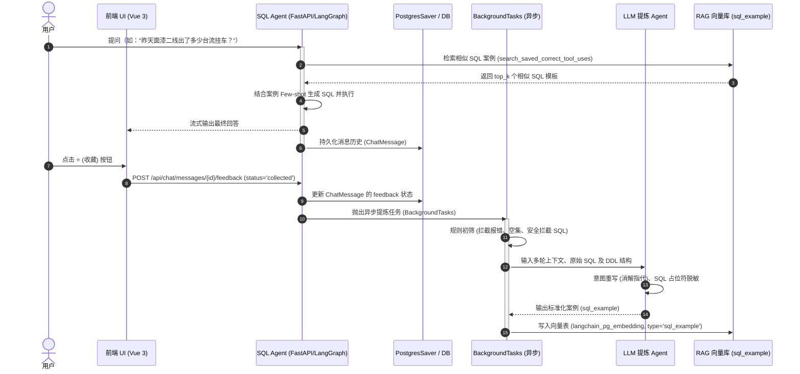

# 面向生产数据查询 SQL Agent 的“反馈驱动型自演进案例库”融合提议书 (Proposal)

## 1. 背景与痛点分析

在涂装车间等生产数据查询（SQL Agent）的实际应用中，智能体通常面临以下长尾挑战：
*   **长尾问题口径多变**：用户提问往往极其口语化且包含大量的车间方言，导致静态的 DDL 和业务术语文档（Documentation）难以完全覆盖。
*   **复杂多表关联（Join）生成困难**：大模型在生成包含 3 个表以上的 `JOIN`、子查询或复杂的窗口函数时，由于缺乏上下文相似的模板，极易产生语法错误或逻辑幻觉。
*   **“冷启动”与重用效率低**：即使智能体通过试错最终在某一轮生成了正确的 SQL，但这次成功经验并没有沉淀下来。下次用户提问相似内容时，智能体依然需要从头推理和调试，导致响应变慢且浪费 Token。

为了解决上述问题，本提议建议在现有 RAG 检索及 checkpointer 机制之上，引入一套**用户反馈驱动型自进化 Few-Shot SQL 案例库闭环系统**，让智能体在运行中自我学习、持续进化。

---

## 2. 核心目标与方案融合思路

为了兼顾**工程落地的可行性**和**入库案例的极高水准**，本方案对以下两种思路进行了深度融合：
1.  **显式反馈驱动（前端）**：在前端消息底部增加 👍 / 👎 / ⭐（收藏）交互。用户的显式收藏作为最直接的“黄金案例”信号源，降低盲目提取带来的无效计算。
2.  **隐式规则过滤与 LLM 提炼（后端）**：后端在捕获用户反馈信号后，通过规则过滤脏 SQL（报错、空结果、安全警告），并使用后台 LLM 异步进行多轮指代消解（意图重写）与 SQL 占位符脱敏，确保入库案例 100% 具备泛化性和安全性。

---

## 3. 技术架构设计

本系统将深度复用项目现有的 `FastAPI + LangGraph + PGVector / Milvus` 技术栈，采用**异步解耦**的方案实施，对现有核心对话主链路的侵入降到最低。

### 3.1 总体业务时序图

---

## 4. 工程改造落地清单 (修改文件范围)

### 4.1 后端改动清单 (Python/FastAPI)

1.  **模型层** `backend/app/models.py`
    *   `ChatMessage` 表新增 `feedback` 字段（类型：`String(50)`，默认：`none`，可选值：`none` / `like` / `dislike` / `collected`）。
2.  **Schema 层** `backend/app/schemas.py`
    *   新增 `MessageFeedbackRequest` Pydantic 规范模型，用于接收前端回传的赞踩状态。
3.  **CRUD 层** `backend/app/crud.py`
    *   新增 `update_message_feedback(db, message_id, feedback)` 方法。
    *   新增 `collect_sql_example(db, message_id)` 方法：
        *   根据消息 ID 获取当前轮前后的 `ChatMessage`（平铺读取，无需解析二进制 checkpoint）。
        *   调用**规则提取器**和**LLM提炼服务**加工数据。
4.  **API 接口层** `backend/app/api.py`
    *   新增 `POST /api/chat/messages/{id}/feedback` 路由，更新状态并在响应返回后，通过 `BackgroundTasks` 异步调用 `collect_sql_example`。
5.  **检索器适配层** `backend/app/agent/vector/pgvector/pgvector_retriever.py`
    *   放开对 `doc_type` 过滤的硬编码限制（目前强行过滤为 `documentation`），支持在检索 `sql_example` 时精准传递 `doc_type` 参数。

### 4.2 前端改动清单 (Vue 3 / Vite)

1.  **数据类型层** `frontend/src/types/index.ts`
    *   在 `Message` 接口中，新增可选属性 `feedback?: 'none' | 'like' | 'dislike' | 'collected'`。
2.  **组件层** `frontend/src/components/MessageItem.vue`
    *   在非流式完成态消息（AI回复卡片）的底部，增加操作工具栏，渲染 👍（点赞）、👎（点踩）和 ⭐（收藏/取消收藏）按钮。
3.  **接口请求层** `frontend/src/api/messages.ts`
    *   封装前端 API 方法 `submitMessageFeedback(messageId, feedbackStatus)`。
4.  **状态管理层** `frontend/src/stores/messages.ts`
    *   在 Pinia store 中更新修改反馈状态的 Action 逻辑。

---

## 5. 特殊场景问题与应对对策

为了让自动案例沉淀机制在复杂的生产环境中具备极强的鲁棒性，系统需要针对以下 6 种典型的边缘和复杂场景，设计明确的“规则收集 ➔ LLM提炼”应对策略：

### 5.1 场景一：LLM 在纠错循环中产生了错误 SQL
*   **问题**：由于字段写错等原因，LLM 在 Loop 中生成了 1-2 次报错 of SQL，在第 3 次自我纠错成功并返回结论。消息链中同时存在多个错误的 `ToolMessage` 和一个正确的 `ToolMessage`。
*   **对策（逆向仅取成功规则）**：规则提取器逆向遍历 `messages` 时，主动跳过所有报错（如 `Error:` 开头）的 `ToolMessage`，**只锁定并抓取最靠近最终回答的、那一个执行成功（无报错）的 `ToolMessage` 及其对应 SQL**。若整个遍历中所有的 SQL 均报错，则直接舍弃该回合案例。

### 5.2 场景二：LLM 分多步骤查询并给出最终结论
*   **问题**：大模型需要执行两次以上的不同查询才能凑齐最终结论（例如：步骤 A 先生成 SQL 查到特定车身的位置 ID，步骤 B 再生成 SQL 查询该位置的具体工艺配置）。
*   **对策（多步组合收集规则）**：提取器收集当前交互回合内所有成功执行的 `tool_calls` 及其结果，组合成一个有序的 `steps` 列表打包给后台。LLM 提炼 Agent 会将其整合并沉淀为一个“多步骤 Few-shot 案例”，指导智能体进行链式推理。如果追求极简，也可以在检测到多步 SQL 时直接丢弃，仅保留简单单步案例。

### 5.3 场景三：用户的一个意图需要多轮对话完成（澄清与补充提问）
*   **问题**：
    *   *澄清交互*：用户问“昨天出了多少台流挂车”，Agent 澄清“请问是一产线还是二产线？”，用户回答“二产线”，Agent 最终查数回答。
    *   *补充提问*：用户问“昨天一产线有多少流挂车”，Agent 回答后，用户接着追问“那二产线呢？”。
*   **对策（会话上下文回溯与 LLM 改写规则）**：
    1.  **规则回溯**：当提取器逆向遍历发现本轮包含澄清交互（如调用了 `AskUserQuestion`）或用户最新提问过短时，自动向上多抓取 2-3 轮的完整对话消息链进行打包。
    2.  **LLM 意图重写**：后台 LLM 接收到多轮原始数据后，执行“指代消解与意图重写”，将碎片化的多轮提问，融合改写为语义完整、可供检索的独立标准意图（例如“查询昨天二产线面漆段流挂缺陷的车辆总数”）。

### 5.4 场景四：SQL 执行成功，但数据库返回空结果 (Empty ResultSet)
*   **问题**：生成的 SQL 语法完全正确且执行成功，但因为数据库里没有该车身数据或昨天没有发生该缺陷，导致返回空集 `[]`。空案例的 Few-shot 参考价值极低。
*   **对策（空结果过滤规则）**：规则提取器检查 `ToolMessage.content` 的内容。如果解析为行数为 0 的空集合或 Null，则判定本条无沉淀价值，直接过滤丢弃。

### 5.5 场景五：跨业务域 (Multi-Skill) 导致的案例混淆
*   **问题**：系统包含多个技能域（如 `paint_shop` 涂装、`assembly_shop` 总装）。若提问词相似，总装的黄金 SQL 被召回并推荐给涂装的 Agent，会导致拼装出包含错误表名的 SQL。
*   **对策（Skill 域隔离检索过滤）**：
    1.  **标签写入**：规则提取器必须强行抓取 `tool_calls` 中的 `required_skill` 字段，作为案例的 `metadata.domain` 写入向量库。
    2.  **检索硬隔离**：在利用 `search_saved_correct_tool_uses` 检索相似案例时，必须使用元数据硬过滤（Metadata Hard Filter），只召回当前已加载技能域（domain）下的案例，严禁跨 Skill 混用。

### 5.6 场景六：被系统安全拦截器截断的危险 SQL
*   **问题**：用户的提问触发了安全检测（如含有 DML 危险修改操作，或访问敏感核心表），被系统的 `wrapped_query_tool` 强行拦截并报错。
*   **对策（安全警告过滤规则）**：提取器检查 `ToolMessage` 的返回值。如果其中含有安全警告标识（如 `Safety Warning` 或 `Blocked by security filter`），直接抛弃该回合，不予沉淀。

---

## 6. 人机协同（防污染审核机制）

> [!WARNING]
> **绝对的自动入库可能导致“坏案例级联放大”风险**。一旦大模型产生了一次业务口径错误但语法正确的 SQL（如计算直通率时用错了公式），自动入库后会诱导后续所有相似提问全部出错。

为了防止脏 SQL 和劣质数据灌入库中，系统提供**“半自动沉淀（人机协同）”**的安全缓冲机制：

*   **待审核暂存表** `pending_cases`：
    当用户在前台点击 ⭐（收藏）时，后端通过规则抓取并由后台 LLM 提炼出的 JSON 数据，不直接写入 `PGVector` 向量库，而是先写入普通 PostgreSQL 数据库表 `pending_cases` 中，其状态设为 `pending`。
*   **人机审核终端**：
    可在系统管理端界面中提供一个轻量级面板，展示：“用户原始提问”、“LLM 提炼意图”、“生成的 SQL”、“执行的数据结果”。管理员可以一键点击“审核通过并入库”（此时触发 `PGVector.add_documents()` 动作并把状态标为 `approved`），或者在输入框中对 SQL/意图进行微调后再入库。这能确保向量案例库的准确度保持在 100%。

---

## 7. 数据失效与 DDL 漂移应对方案

当系统更新、数据库表结构（DDL）发生变化时，旧案例可能会变成“毒药”。
*   **例行校验机制**：设计一个每天深夜执行的异步巡检脚本，遍历向量库中的所有 `sql_example`。
*   **自动化测试**：对每个案例运行 `EXPLAIN SELECT ...`：
    *   若执行成功，说明该案例依然有效。
    *   若执行失败（报错如表不存在、列不存在），则说明该案例因 DDL 漂移而过时，自动将其状态标记为 `inactive`（下线）并向管理员发出告警。

---

## 8. 分阶段实施路线图 (Phased Implementation Roadmap)

为了不对现有系统的稳定性造成冲击，建议采取“渐进式开发”：

*   **第一阶段（数据准备与提取，第 1-2 周）**：
    *   修改后端模型 `models.py`（新增 `feedback` 字段），开发 `POST /api/chat/messages/{id}/feedback` 路由。
    *   在前端 `MessageItem.vue` 中渲染 👍 / 👎 / ⭐ 按钮，并打通前端到后端的反馈保存逻辑。
    *   开发后台的**规则过滤提取器**，将用户点击 ⭐ 的对话内容整理成原始 JSON 数据暂存，进行质量和吞吐量观察。
*   **第二阶段（审核页面与自动提炼，第 3 周）**：
    *   开发后台 LLM 提炼 Agent（意图改写、SQL脱敏参数替换）。
    *   建立暂存表 `pending_cases`，完成“点击收藏 ➔ LLM提炼 ➔ 暂存待审核”的整条链路。
    *   在系统管理端提供极简的“案例审核列表”页面，支持开发和业务骨干手动确认或微调 SQL。
*   **第三阶段（向量入库与在线检索，第 4 周）**：
    *   重构 `PgVectorDocumentationRetriever` 对 `sql_example` 的硬编码限制。
    *   打通“审核通过 ➔ 写入 PGVector”链路。
    *   在 Agent 执行图里启用 `FewShotMiddleware`，在生成 SQL 前动态加载 Top-2 相似案例作为 reference，跑通闭环。
