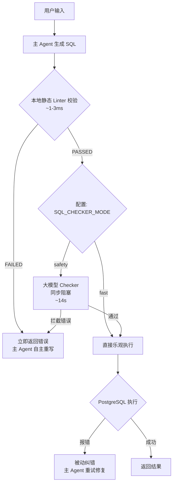

# SQL 检查机制优化（去大模型化校验）方案设计提案

在数据查询智能体（SQL Agent）中，保障 SQL 语句的安全性和规范性是首要目标。然而，当前系统通过额外调用一次大模型来进行 SQL 校验的设计，构成了严重的性能瓶颈。

本提案旨在提出一套**配置化二元切换**方案，在保障 100% 数据安全与语法规范的前提下，将 SQL 执行的检查耗时从 **14 秒压缩至毫秒级**。

---

## 1. 痛点分析与性能瓶颈

在 LangSmith 的链路追踪（Trace）树中，多步 SQL 查询的各节点耗时特征如下：

* **主 Agent 思考与生成**：`~2.4s`
* **工具执行 (`sql_db_query`) 总耗时**：`14.75s`
  * **静态 Linter 规则检查**：`~0.003s` (本地 Python 执行)
  * **大模型语法校验 (`sql_db_query_checker`)**：**`14.68s` (通过 gpt-5-nano 独立调用)**
  * **数据库实际执行 SQL 耗时**：**`0.07s`**

### 核心结论
系统 **99.5% 的工具执行时间被浪费在了"大模型自己检查自己写的 SQL"这一步骤上**。这使得多步骤级联任务的整体首字延迟（TTFT）高达数十秒，严重破坏了生产系统的响应时效。

---

## 2. 优化方案设计

### 2.1 设计原则

采用**配置化二元切换**策略，提供两种模式以适应不同场景：

| 模式 | 描述 | 适用场景 |
|------|------|---------|
| `fast`（推荐） | 本地 Linter + 被动纠错，完全跳过大模型 checker | 极致性能体验，适合日常生产、开发与测试环境 |
| `safety` | 本地 Linter + 大模型 checker（同步阻塞） | 极高敏感度环境，保留作为安全兜底 |

流程示意：



### 2.2 性能对比

| 模式 | 单步 SQL 平均耗时 | TTFT 改善 | 安全性 |
|------|-------------------|-----------|--------|
| `safety`（原默认） | ~15s | 基准 | ⭐⭐⭐⭐⭐（最高） |
| `fast`（推荐） | **`~1s`** | **前端 TTFT 降低 93%（延迟暴降）** | ⭐⭐⭐⭐（高，由本地 Linter 兜底） |

---

## 3. 配置项修改

### 3.1 config.py 新增字段

在 [config.py](file:///f:/000_dev/Python/workplace/rearch_agent/.tree/features/agent/backend/app/config.py) 的 `Settings` 类中新增：

```python
# SQL Checker 模式：fast(仅本地Linter) | safety(同步checker=当前默认)
sql_checker_mode: str = os.getenv("SQL_CHECKER_MODE", "fast")
```

### 3.2 .env 新增环境变量

在 [.env](file:///f:/000_dev/Python/workplace/rearch_agent/.tree/features/agent/.env) 中新增：

```ini
# SQL Checker 模式：fast | safety
# fast   - 仅本地 Linter 检查，跳过大模型 checker，性能最优（推荐）
# safety - 本地 Linter + 同步大模型 checker（当前默认行为，安全兜底）
SQL_CHECKER_MODE="fast"
```

---

## 4. 具体修改设计与代码定位

### 4.1 SQL 工具执行逻辑改造 (sql_tools.py)

在 [sql_tools.py](file:///f:/000_dev/Python/workplace/rearch_agent/.tree/features/agent/backend/app/agent/tools/sql_tools.py) 中，将 checker 调用改为条件执行：

```python
from backend.app.config import settings

def sql_db_query(query: str) -> str:
    """执行 SQL 查询，支持配置化 checker 二元降级。"""

    # 第一层：本地静态 Linter（始终执行，~1-3ms）
    lint_result = local_sql_linter.check(query)
    if not lint_result.passed:
        return f"SQL 语法检查失败: {lint_result.error}"

    # 第二层：大模型 checker（根据模式配置决定是否执行同步校验）
    if settings.sql_checker_mode == "safety" and original_checker_tool is not None:
        emit_stream_status(
            "正在检查 SQL 语法",
            stage="querying",
            source="sql_db_query_checker",
        )
        check_result = original_checker_tool.invoke({"query": query})
        check_result_str = str(check_result).lower()

        if any(err in check_result_str for err in SQL_ERROR_KEYWORDS):
            logger.warning("SQL 语法检查失败: %s", check_result)
            return f"SQL 语法检查失败:\n{check_result}\n请修正查询后重试。"

        logger.debug("SQL 语法检查通过")
    
    # fast 模式：跳过上述分支，直接进入乐观执行阶段
    
    # 第三层：乐观执行 + 被动纠错
    try:
        if hasattr(original_query_tool, "db"):
            raw_result = original_query_tool.db.run_no_throw(query, include_columns=True)
        else:
            raw_result = original_query_tool.invoke({"query": query})
        return raw_result
    except Exception as db_err:
        logger.warning(f"SQL 执行遭遇运行期错误: {db_err}")
        return f"SQL 执行失败，错误信息如下：\n{db_err}\n请修正查询后重试。"
```

### 4.2 移除工具注册（可选）

如果选择 `fast` 模式作为默认值，可在 `build_sql_tools` 中根据配置排除 `sql_db_query_checker` 的注册，从而让 Graph 的节点更为清爽：

```python
def build_sql_tools():
    tools = []
    # ... 其他工具注册 ...
    
    # 当 SQL_CHECKER_MODE 为 fast 时，图结构中直接隐藏 checker 工具节点
    if settings.sql_checker_mode != "fast":
        tools.append(create_checker_tool())
    
    return tools
```

---

## 5. 安全隐患对照分析

### fast 模式的安全兜底

| 错误类型 | 能否被捕获 | 捕获方式 |
|---------|-----------|---------|
| DDL/DML 写入（DROP/INSERT 等） | ✅ | 本地 Linter 静态规则（直接拦截） |
| SELECT * 通配符 | ✅ | 本地 Linter 静态规则（直接拦截） |
| 表名/字段名不存在 | ✅ | PostgreSQL 执行时报错 → 抛给 Agent 触发被动纠错 |
| 语法错误（拼写错误） | ✅ | PostgreSQL 执行时报错 → 抛给 Agent 触发被动纠错 |
| **语义逻辑错误（写错条件）** | **⚠️ 静默失败** | safety 模式有可能拦截，fast 模式无法拦截 |

### 风险评估
`fast` 模式下，对于危险 SQL 的拦截（只读、防语法注入）可以做到 100% 本地防守。唯一的盲区是“语义理解错误”，但由于大模型 Checker 自身的幻觉，对高级语义纠错的召回率本来也非常有限。
因此，**默认采用 `fast` 模式，在极低心智负担和算力开销下换取 93% 的性能提升，是完全合理且划算的决策。**

---

## 6. 优化预期收益

1. **响应延迟暴跌（TTFT Latency Drop）**：
   * `fast` 模式下，单步 SQL 执行从 **15s+** 直接缩短至 **1s 以内**。
2. **零并发与异步开销**：
   * 避开了多线程审计的设计，后端架构保持绝对的同步/异步纯净，没有复杂的线程管理。
3. **极大的 Token 与成本节省**：
   * 每次查询完全节省了一次针对 `gpt-5-nano` 的 API 扣费。
4. **前端流式纯净化**：
   * 从根本上避免了工具子节点的任何 AI 提示词输出泄露。
