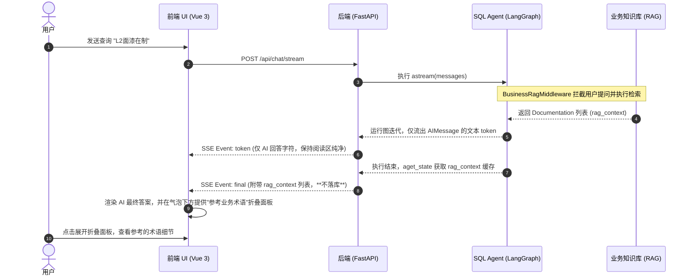

# 智能体流式输出隔离与 RAG 结构化呈现提案

大模型聊天会话管理系统（SQL Agent）由于在流式接收过程中缺乏对底层消息类型的严格过滤，导致 RAG 提示词、工具日志和 linter 报错无差别拼接入 AI 正文回答中。

为保障**系统稳定性、数据安全性与用户体验（UI/UX）**，特制定本方案，分为以下两个阶段实施。

---

## 阶段一：流式消息的物理隔离与防泄漏 (Bug 修复与安全性治理)

### 1. 核心目标
彻底解决流式输出中系统消息（SystemMessage）和工具执行结果（ToolMessage）泄露到 AI 最终回答正文中的问题。确保流式 Token 通道中只传递真正由 AI 角色（`AIMessage`）生成的文本。

### 2. 技术设计
LangGraph 会在 `messages` 通道中广播运行期间的所有状态块，包括：
* `SystemMessage`（RAG 检索上下文）
* `ToolMessage`（SQL 查询的入参及执行结果，包括 SQL Linter 报错拦截）
* `AIMessageChunk`（AI 真正生成的内容或工具调用）

#### 2.1 后端修改方案 (services.py)
在 FastAPI 本地执行流 [services.py](file:///f:/000_dev/Python/workplace/rearch_agent/.tree/features/agent/backend/app/services.py) 中，对 `chunk_type == "messages"` 块进行类型过滤。关键原则是：**仅过滤 token 输出，不影响 tool_call 和 tool_result 的事件收集**。

```python
                    if chunk_type == "messages":
                        if (
                            not isinstance(chunk_data, (tuple, list))
                            or len(chunk_data) != 2
                        ):
                            continue

                        message_chunk, metadata = chunk_data
                        node_name = (
                            metadata.get("langgraph_node")
                            if isinstance(metadata, dict)
                            else None
                        )

                        # 🚨 核心过滤：仅允许 AIMessage 提取 token 发送给前端
                        # ToolMessage 和 SystemMessage 的文本不应流入 UI
                        if isinstance(message_chunk, AIMessage):
                            for text_segment in self._extract_text_segments(message_chunk):
                                if not text_segment:
                                    continue
                                has_stream_tokens = True
                                await _emit(
                                    {
                                        "type": "token",
                                        "text": text_segment,
                                        "node": node_name,
                                    }
                                )

                        # Tool Call Chunk 收集（AIMessage 可能携带 tool_calls）
                        for event in self._collect_tool_call_chunk_events(
                            message_chunk,
                            accumulated_tool_calls,
                        ):
                            await _emit(event)

                        # Tool Result 收集（ToolMessage 的结果事件）
                        tool_result_event = self._collect_tool_result_event(
                            message_chunk,
                            accumulated_tool_calls,
                            accumulated_tool_results,
                        )
                        if tool_result_event:
                            await _emit(tool_result_event)
```

> **注意**：`services_graph.py` 为项目早期遗留文件，当前系统已不再使用，无需修改。

### 3. 第一阶段收益
* **UI/UX 纯净化**：AI 对话气泡中不再显示混乱的 `__business_rag_context__` 提示词以及激活技能等日志。
* **数据安全性**：彻底屏蔽了工具执行返回的原始 SQL 架构（DDL）和表关联，避免技术架构暴露。
* **零破坏性**：不修改底层的 LangGraph Checkpointer 机制，历史消息的记录与中断恢复逻辑保持原样。

---

## 阶段二：RAG 检索业务知识的结构化独立呈现 (UI/UX 体验升级)

### 1. 核心目标
虽然大段的业务文档不应混入 AI 正文，但**将大模型参考的业务定义单独呈现**，能显著提升 SQL 自动分析的**可信度与可解释性**。
本阶段将把检索到的 RAG 文档以**结构化卡片**的形式放在 AI 消息底端供用户按需折叠/展开查看。

### 2. 交互与架构设计



### 3. 设计原则
* rag_context **仅通过 SSE final 事件传递**给前端，不存入数据库
* 历史消息重载时不渲染 RAG 卡片（RAG 检索结果时效性强，过期的业务术语参考价值有限）
* 前端根据 `final` 事件中的 `rag_context` 数据动态渲染折叠面板

### 4. 前提条件

在阶段二实施前，需确保 `BusinessRagMiddleware`（或同类 RAG 中间件）已将检索结果写入 LangGraph 的图状态 `state["rag_context"]` 中。若尚未实现，需先补充该逻辑：

```python
# BusinessRagMiddleware 示例（需在图节点或中间件中实现）
state["rag_context"] = retrieved_docs  # list[Document]
```

### 5. 后端修改

#### 5.1 SSE 协议扩展 (schemas.py)
在 [schemas.py](file:///f:/000_dev/Python/workplace/rearch_agent/.tree/features/agent/backend/app/schemas.py) 的 `FinalStreamEvent` 中增加 `rag_context` 字段：

```python
class FinalStreamEvent(BaseModel):
    type: Literal["final"]
    content: str
    tool_calls: Optional[List[StreamToolCallPayload]] = None
    tool_results: Optional[Dict[str, str]] = None
    context_warning: Optional[ContextWarningPayload] = None
    message_id: Optional[str] = None
    created_at: Optional[datetime] = None
    # 🆕 新增：RAG 上下文列表（仅流式传递，不落库）
    rag_context: Optional[List[Dict[str, Any]]] = None
```

#### 5.2 后端最终事件组装 (api.py)
在 [api.py](file:///f:/000_dev/Python/workplace/rearch_agent/.tree/features/agent/backend/app/api.py) 的 `final` 处理段，从 LangGraph 的图状态 `state` 中提取 `rag_context`，**仅附加到 SSE final 事件中，不存入数据库**：

```python
                elif event_type == "final":
                    # ...
                    state = await agent_service.agent.aget_state(config)
                    rag_context_list = state.values.get("rag_context", []) if state else []

                    # 序列化为前端可消费的结构化列表
                    rag_context_payload = [
                        {
                            "title": doc.metadata.get("term") or doc.metadata.get("title") or "未命名",
                            "domain": doc.metadata.get("domain", "未知域"),
                            "aliases": doc.metadata.get("aliases", []),
                            "content": doc.page_content
                        }
                        for doc in rag_context_list
                    ] if rag_context_list else None

                    assistant_message = crud.create_message(
                        db,
                        MessageCreate(
                            session_id=session_id,
                            role="assistant",
                            content=full_content,
                            tool_calls=json.dumps(final_tool_calls, ensure_ascii=False) if final_tool_calls else None,
                            tool_results=json.dumps(final_tool_results, ensure_ascii=False) if final_tool_results else None,
                            # 🚫 rag_context 不落库
                        ),
                    )

                    final_event = {
                        **event,
                        "content": assistant_message.content,
                        "tool_calls": final_tool_calls,
                        "tool_results": final_tool_results,
                        "message_id": assistant_message.id,
                        "created_at": assistant_message.created_at.isoformat(),
                        "rag_context": rag_context_payload,  # 💨 仅 SSE 传递
                    }
                    yield _encode_sse(final_event)
```

### 6. 前端修改

#### 6.1 SSE 事件类型更新 (types/index.ts)
在 [types/index.ts](file:///f:/000_dev/Python/workplace/rearch_agent/.tree/features/agent/frontend/src/types/index.ts) 的 `StreamEvent` 中扩展 `final` 类型：

```typescript
export type StreamEvent =
  // ... 其他类型
  | {
      type: 'final'
      content: string
      tool_calls?: StreamToolCall[] | null
      tool_results?: Record<string, string> | null
      message_id?: string
      created_at?: string
      // 🆕 新增：RAG 上下文（仅在流式消息传递时存在，不落库）
      rag_context?: Array<{
        title: string
        domain: string
        aliases: string[]
        content: string
      }> | null
    }
```

#### 6.2 UI 渲染 (MessageItem.vue)
在 [MessageItem.vue](file:///f:/000_dev/Python/workplace/rearch_agent/.tree/features/agent/frontend/src/components/MessageItem.vue) 气泡底部，引入可折叠的展示卡片。数据来源为流式消息处理过程中缓存的 `rag_context`（由 `useChatStream` composable 管理）：

```vue
<script setup lang="ts">
// ... 现有导入

// rag_context 通过流式消息的 final 事件传递，由 useChatStream 缓存
// 此处从 streamingMessage 或消息存储中读取
const parsedRagContext = computed(() => {
  // 流式过程中从 streamingState 读取
  if (streamingState.value?.ragContext) {
    return streamingState.value.ragContext
  }
  // 已完成的消息，可以在 composable 层通过额外字段传递
  // 历史消息不渲染 RAG 卡片（因为不落库）
  return []
})
</script>

<template>
  <!-- ... 现有模板 ... -->

  <!-- 🆕 第二阶段新增：参考业务术语折叠卡片 -->
  <div v-if="!isUser && parsedRagContext.length > 0" class="px-4 pb-3">
    <details class="group rounded-2xl border border-neutral-150 bg-neutral-50/50 px-3 py-2 text-xs text-neutral-600">
      <summary class="flex cursor-pointer select-none items-center gap-1.5 font-medium text-neutral-700 hover:text-primary">
        <span>📂 参考业务术语 ({{ parsedRagContext.length }} 条)</span>
      </summary>
      <div class="mt-2.5 space-y-3.5 border-t border-neutral-200/60 pt-2.5">
        <div v-for="item in parsedRagContext" :key="item.title" class="space-y-1">
          <div class="flex items-center gap-2">
            <span class="rounded bg-primary/10 px-1.5 py-0.5 text-[10px] font-semibold text-primary">
              {{ item.domain }}
            </span>
            <span class="font-bold text-neutral-800 text-[13px]">{{ item.title }}</span>
            <span v-if="item.aliases.length" class="text-[10px] text-neutral-400">
              (别名: {{ item.aliases.join(', ') }})
            </span>
          </div>
          <p class="pl-0.5 text-[12px] leading-5 text-neutral-500 whitespace-pre-line">
            {{ item.content }}
          </p>
        </div>
      </div>
    </details>
  </div>
</template>
```

#### 6.3 StreamingMessage 类型扩展 (可选)
如果需要在前端流式消息状态中缓存 `rag_context`，可以在 `StreamingMessage` 中增加字段：

```typescript
export interface StreamingMessage {
  // ... 现有字段
  ragContext?: Array<{
    title: string
    domain: string
    aliases: string[]
    content: string
  }> | null
}
```

### 7. 第二阶段收益
* **高可解释性**：用户能够立刻明白 AI 为什么把 "L2面漆在制" 解释为 "paint_shop_vehicle_logistics" 下的特定产线。
* **交互渐进增强 (Progressive Disclosure)**：使用 `<details>` 标签默认收起，保证大部分不需要核对口径的用户首屏阅读流畅，需要验证数据科学性时点击即显。
* **零持久化负担**：RAG 上下文仅流式传递，不落库，消除数据库迁移和数据一致性风险。

---

## 附录：实施检查清单

| 优先级 | 任务 | 文件 | 说明 |
|-------|------|------|------|
| P0 | 修正 token 过滤逻辑 | `services.py` | 仅过滤非 AIMessage 的 token 输出，保留 tool 事件收集 |
| P1 | 确认 RAG 中间件写入 `rag_context` | 中间件代码 | 若缺失，需先补充将检索结果写入图状态的逻辑 |
| P2 | 扩展 SSE 协议 | `schemas.py` | `FinalStreamEvent` 增加 `rag_context` 字段 |
| P3 | API 层传递 rag_context | `api.py` | `final` 事件组装时提取并附加 `rag_context`，不落库 |
| P4 | 更新前端 SSE 事件类型 | `types/index.ts` | `StreamEvent` 的 `final` 类型增加 `rag_context` |
| P5 | 更新前端 UI | `MessageItem.vue` | 增加折叠卡片展示 RAG 上下文 |
| P6 | 更新前端流式状态（可选） | `types/index.ts` | `StreamingMessage` 增加 `ragContext` 缓存字段 |
