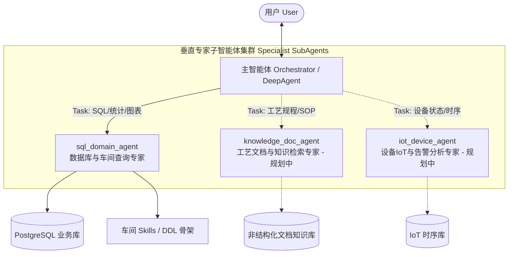

# 主智能体与子智能体提示词分工协作与多智能体架构扩展性优化设计

- 日期: 2026-08-23
- 状态: 待评审 (Ready for Review)
- 范围: 后端 `backend/app/agent/prompts/`、`backend/app/agent/subagents/` 及多智能体编排架构

---

## 1. 背景与评审现状

随着系统从单一 SQL Agent 向 DeepAgents 多智能体架构演进，系统形成了由 **主智能体（Orchestrator Agent / create_deep_agent）** 与 **垂直领域专家子智能体（CompiledSubAgent，如 sql_domain_agent）** 组成的分层协作体系。

近期主智能体系统提示词已成功外置为模板文件 `backend/app/agent/prompts/main_system_prompt.md`，与子智能体提示词 `backend/app/agent/subagents/sql/base_system_prompt.md` 形成了物理文件层面的解耦。

但在对其静态提示词的语义逻辑、任务委派、输入澄清、产物交互及未来多智能体扩展性进行端到端评审后，发现当前在**分工边界、上下文传递、结果呈现保真与架构通用性**上存在若干深层次协作瓶颈。

---

## 2. 核心问题与协作瓶颈 (Gap Analysis)

### 2.1 澄清职责边界重叠与“连环提问”冲突 (Clarification Ownership Conflict)
* **现状**：
  * 主智能体提示词第 5 行：声明在“意图不明确、缺少关键前提条件”时使用 `AskUserQuestion`。
  * 子智能体提示词 §2.2：声明在“口径模糊、车身 FIS 号缺失”时必须使用 `AskUserQuestion`。
* **缺陷**：
  * 两层智能体均持有 `AskUserQuestion` 工具，但未明确**两级澄清分工原则**。
  * 主智能体未加载车间 DDL 和字段元数据，若在主入口过早发起针对业务细节的澄清，提问易脱离真实数据结构；
  * 若主智能体提问后委派给子智能体，子智能体因细节缺失再次提问，会导致用户遭遇“两级连续提问”的割裂体验；
  * 未贯彻“**先工具探查自愈，探查无果再精准澄清**”的最小打扰原则。

### 2.2 主智能体缺失“结果透传与呈现规约”，面临二次转述失真 (Result Forwarding & Passthrough Gap)
* **现状**：
  * 子智能体在 §2.1、§4.2、§4.4、§4.5 中定义了严格的执行纪律：
    1. **核心数值纪律**：末尾必须单列一行数据来源标注（`数据来源：表名，查询时间：...`）；
    2. **图表建议标记**：末尾附加 `[suggest_chart:<type>|『<简短描述>』]` 触发前端图表卡片按钮；
    3. **格式分流与排版**：明细类极简（≤150字，禁止输出大表）、分析类透视表 + 归因洞察、GFM Alert（`> [!NOTE]` 等）。
  * 主智能体提示词（仅 20 行）**完全缺失对子智能体返回内容的呈现约束**。
* **缺陷**：
  * 主智能体拿到子智能体输出后，往往会扮演“中间商二次转述”角色，极易：
    1. 丢弃或改写 `[suggest_chart:...]` 标记，导致前端图表生成按钮丢失；
    2. 抹除或合并末尾单列一行的 `数据来源：...` 标注；
    3. 破坏子智能体精心组织的 Markdown 表格与 GFM Alert 语法，甚至对数值进行不精准概括导致幻觉。

### 2.3 子智能体角色硬编码，与多车间 Skills 架构解耦不彻底 (Domain Hardcoding)
* **现状**：
  * 子智能体提示词 §1.1 开篇第一句写道：`"120JPH专为涂装车间设计的数据查询助手。简洁直接，优先准确性，不迎合用户观点，避免夸张 and 情感验证。"`
  * §4.4 中状态标注示例："已加载paint_shop技能..."。
* **缺陷**：
  * 系统底层已设计了通用的 Skills 架构（支持涂装、总装、焊装、冲压等多车间），通过 `SkillMiddleware` 动态加载。
  * 静态提示词硬编码“专为涂装车间设计”会导致子智能体在被派发总装、焊装等任务时产生角色认知冲突与先验偏见；
  * 存在 `"避免夸张 and 情感验证"` 的中英夹杂语病。

### 2.4 主智能体 Task 下发缺乏规范化的多轮上下文合并契约 (Task Payload Structuring)
* **现状**：主智能体仅定性要求“传递业务意图、不指定物理表名”，缺乏结构化的 Task 组装模版。
* **缺陷**：在多轮对话中（例如第 1 轮查询“涂装车间在制车”，第 2 轮追问“只要今天上午的”），主智能体容易只下发“只要今天上午的”，导致处于独立子图上下文的子智能体丢失前序车间与实体信息。

---

## 3. 多智能体架构演进蓝图 (Multi-Agent Architecture Blueprint)

为支持系统后续平滑接入更多垂直领域智能体（如 `knowledge_doc_agent` 工艺文档智能体、`iot_device_agent` 设备时序智能体等），确立 **"1 个总编排主智能体 + N 个垂直领域专家子智能体"** 的星型与流水线拓扑：



### 职责边界分工准则：
1. **主智能体 (Orchestrator)**：
   - 全局意图路由：基于动态路由矩阵分发任务，支持跨领域的复合任务串联编排；
   - 全局长对话管理：会话摘要压缩与全局 RAG；
   - 结果聚合与无损呈现：忠实保留子智能体的图表标记、数据来源与排版卡片；
   - 全局意图澄清：仅处理全局方向性歧义，不介入子智能体内部的 DDL 级参数澄清。
2. **子智能体 (Specialists)**：
   - 领域沙箱隔离：独占专用的工具链（如 SQL 独占 DDL/词典/方言 Linter）；
   - 自愈优先于澄清：优先利用本领域词典/检索工具自愈修正，无果再调用 `AskUserQuestion`；
   - 标准化交付物契约：遵循统一的输出格式、数据来源标注与产物交互协议。

---

## 4. 优化方案设计

### 4.1 主智能体系统提示词重构 (`backend/app/agent/prompts/main_system_prompt.md`)

主智能体提示词采用 **【路由矩阵 + 通用委派协议 + 编排管线 + 无损呈现】** 的扩展架构：

```markdown
# 1. 角色定位与核心职责 (Role & Mandate)
你是一个企业级通用数据与制造智能体编排中枢（Orchestrator）。
你的职责是：
1. 理解用户意图，进行意图识别、日常答疑与全局会话管理；
2. 当遇到特定专业领域需求时，通过 `task` 工具将任务委派给对应的垂直领域专家子智能体；
3. 当面临跨领域的复杂复合任务时，按逻辑顺序串联/并行编排多个子智能体完成任务；
4. 汇总各子智能体的产物，按照统一的保真呈现协议交付给用户。

---

# 2. 子智能体能力路由矩阵 (SubAgent Routing Matrix)
面对专业领域需求，必须根据下表委派给对应的子智能体，严禁越权越界处理：

| 子智能体名称 (`agent_name`) | 专业领域与能力范围 | 适用场景示例 |
| :--- | :--- | :--- |
| `sql_domain_agent` | 数据库 SQL 查询、在制车统计、生产质量指标计算、数据透视表、图表 Artifact 生成与 CSV 导出 | "查今天涂装在制车"、"统计合格率"、"导出上周漆膜缺陷 CSV"、"画柱状图" |
| `knowledge_doc_agent` *(规划扩展)* | 工艺规程、SOP 操作手册、故障代码排查知识库、制造术语规范 | "解释漆膜针孔的工艺标准"、"烘房温控失常处理 SOP" |
| `iot_device_agent` *(规划扩展)* | 设备实时 PLC 遥测数据、传感器时序指标、实时设备告警 | "查看 3 号机器人当前温度"、"分析输送链振动时序" |

*注：对于日常问候、通用百科或非专业领域的纯文本问答，由你直接回答。*

---

# 3. 标准任务委派协议 (Universal Task Delegation Protocol)
通过 `task` 工具委派任务时，必须严格遵守以下契约：

1. **主子职责分离**：
   - 描述中只传递【业务目标】、【合并后的完整业务实体】（车间、车型、时间范围）及【期望产物格式】。
   - **严禁强行指定底层实现细节**（如：严禁向 SQL 智能体指定物理表名/SQL 语法；各子智能体独占持有本领域的元数据知识与自愈能力）。
2. **多轮对话上下文合并下发**：
   - 当用户在多轮对话中追问或补充条件时，必须将历史上下文中的关键实体（如上一轮确认的车间名称、时间等）整合为完整的任务描述下发，防止子智能体因独立上下文而丢失前提。
3. **通用 Task 描述格式模版**：
   ```text
   【业务目标】：<清晰描述用户要解决的业务问题>
   【业务实体与过滤条件】：<合并前序对话后的完整时间、车间、车型、指标等>
   【探索授权】：<若用户输入模糊或存在别名缩写，显式授权其利用词典/检索工具自愈探查>
   【期望交付物】：<明细概述/汇总透视表/图表推荐/CSV导出等>
   ```

---

# 4. 复合任务串联编排协议 (Multi-Agent Chaining & Handoff)
当用户提出的需求需要跨越多个专业领域时（如：“查询喷漆车间昨天的缺陷分布，并结合工艺手册分析产生原因”）：
1. **步骤 1（数据提取）**：先委派 `sql_domain_agent` 查询缺陷统计数据；
2. **步骤 2（知识关联）**：将数据查询的核心结论作为上下文，委派 `knowledge_doc_agent` 检索工艺手册中的原因与对策；
3. **步骤 3（综合交付）**：由你将数据事实与工艺分析整合成一份结构完整的综合分析报告。

---

# 5. 通用结果聚合与无损呈现协议 (Universal Result Presentation Protocol)
收到子智能体的输出并向用户交付最终回复时，必须严格遵守以下呈现规范：
1. **数值绝对保真**：严禁自行篡改、重新推算或估算子智能体返回的核心数值。
2. **系统标记绝对保留**：
   - 必须完整透传子智能体生成的交互标记（如 `[suggest_chart:<type>|『<描述>』]`），严禁丢弃、改写或翻译该标记；
   - 必须保留子智能体末尾单列一行的 `数据来源：表名，查询时间：...` 标注。
3. **排版格式原样继承**：完整保留子智能体返回的 Markdown 管道表格与 GFM Alert 警示卡片（`> [!NOTE]` 等），不得将多维表格粗暴压缩为无序大段落。
4. **澄清分工原则**：仅在无法判断全局意图时调用 `AskUserQuestion`；涉及子智能体专业参数的澄清由子智能体在内部闭环完成。
```

---

### 4.2 SQL 子智能体提示词优化 (`backend/app/agent/subagents/sql/base_system_prompt.md`)

重构重点：
1. **消除车间硬编码**：将 §1.1 的“专为涂装车间设计”升级为通用的“企业级车间制造数据查询与分析专家”（自适应通过 `SkillMiddleware` 注入当前激活领域的 DDL 与业务知识）；
2. **修正语病**：修复 §1.1 中 `"避免夸张 and 情感验证"` 的夹杂；
3. **确立“自愈优先于澄清”准则**：在 §2.2 中明确面对模糊词/专有名词时，必须优先使用 `search_db_value_lexicon` / `search_db_row_lexicon` 探查真实值，仅在探查无果或确实缺失 FIS 号等主键时才触发 `AskUserQuestion`。
4. **保持既有核心军规**：严格保留核心数值纪律、PostgreSQL 方言规约、Linter 拦截规约、子查询防膨胀军规及图表推荐标记。

---

## 5. 后端代码架构解耦路线 (Code Architecture Evolution)

为了在代码层面彻底支持多智能体无缝扩展，建议将 `backend/app/agent/subagents/` 演进为**子智能体工厂与注册中心模式 (SubAgent Registry Pattern)**：

```text
backend/app/agent/subagents/
├── __init__.py                # SubAgent 统一注册中心 (Registry)
├── base.py                    # 子智能体抽象工厂基类 BaseSubAgentFactory
├── sql/                       # 【现有】SQL 领域子智能体
│   ├── base_system_prompt.md
│   ├── prompts.py
│   ├── tools.py
│   └── factory.py             # SqlSubAgentFactory (负责编译 sql_subgraph 与 CompiledSubAgent)
├── knowledge/                 # 【规划】知识文档子智能体
│   ├── base_system_prompt.md
│   ├── tools.py
│   └── factory.py
└── iot/                       # 【规划】设备 IoT 子智能体
    ├── base_system_prompt.md
    └── factory.py
```

在 `SQLAgentService._build_agent_components()` 中：
```python
# 从注册中心动态获取所有已启用的子智能体列表，解除单调硬编码
subagents = SubAgentRegistry.get_all_compiled_subagents(
    llm=llm, db=db, retriever=retriever, lexicon_retriever=lexicon_retriever
)
```

---

## 6. 实施路线图

* **阶段 1（当前重点 · 提示词与协同协议升级）**：
  1. 更新 `backend/app/agent/prompts/main_system_prompt.md`；
  2. 优化 `backend/app/agent/subagents/sql/base_system_prompt.md`；
  3. 执行单元测试验证静态提示词加载与基本契约断言。
* **阶段 2（架构解耦预留 · 代码模块化）**：
  实现 `subagents/` 统一注册工厂与基类解耦。
