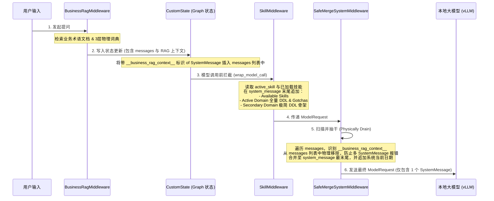

# SQL Agent 系统提示词组装机制分析与完整优化方案

本方案对 120JPH SQL Agent 项目的系统提示词（System Prompt）组装链路、中间件工作流以及状态管理机制进行深度剖析，并针对现有架构的痛点，提出了一套兼顾**大模型注意力隔离（XML 标签分区）**、**提示词缓存效率（Prompt Caching）**和**干净的状态流转（结构化数据传递）**的完整优化方案。

---

## 一、 当前系统提示词组装机制深度剖析

目前系统中，系统提示词是由三个中间件以“管道/洋葱”模型协同装配而成的。其详细交互流向如下：

### 1. 现有组装时序与数据流向


### 2. 核心架构痛点 (Pain Points)

*   **💾 对话历史数据库污染 (Database Pollution)**:
    - `BusinessRagMiddleware` 为了向后传递动态检索信息，采用了**向 `state.messages` 列表首部强行插入临时 SystemMessage** 的做法。
    - 尽管 `SafeMergeSystemMiddleware` 在模型请求阶段将其过滤并物理抽干，但该临时 SystemMessage **仍会被持久化**至 PostgresSaver 数据库中。
    - 随着多轮对话进行，数据库中积压了大量体积庞大的 RAG 临时文本，导致会话历史越滚越大，极易引发读取延迟和存储开销。
*   **⚡ 提示词缓存命中率低 (Low Prompt Caching Efficiency)**:
    - 大模型服务商的 Prompt Caching 机制要求提示词前缀完全不变。
    - 现有的 `system_message` 头部包含了大量规则，但其中间和尾部夹杂了动态的 `Available Skills`、`Active Domain` 等会随会话状态变化的段落，且由于没有强制分区，任何局部的微小变动（如加载了新的二级场景技能）都会导致前部的缓存全部失效。
*   **🔄 DDL 冗余与注意力发散**:
    - `Secondary Domain Knowledge` 中的表 DDL 与 `__business_rag_context__` 动态推荐的表 DDL 存在完全重复的现象（例如 `dim_process_area`），造成了 Token 的无谓浪费 and 模型的注意力干扰。
*   **⛓️ 强耦合的字符串匹配规则**:
    - 中间件之间通过硬编码的特殊占位符 `"__business_rag_context__"` 进行数据打捞和消息删除。这是一种非类型安全的“剪贴板”传递模式，代码可读性差且难以维护。

---

## 二、 完整优化方案设计 (Complete Optimization Scheme)

为了彻底解决上述痛点，我们设计了以下**系统级重构方案**（完全在中间件与提示词结构层，不影响核心业务逻辑）。

### 优化 1：静态与动态物理拆分 (Static/Dynamic Partitioning)
我们将提示词划分为两大独立区间，并引入 **XML 标签**（大模型边界阻断效果最好的格式）进行严密包装。

1.  **`<system_rules>`（静态指令区）**：包含角色、红线、澄清标准、SQL 规范、图表渲染规则。本区域在编译后 100% 保持静态。
2.  **`<runtime_context>`（动态上下文区）**：包含当前的技能列表、活跃 DDL、辅助骨架 DDL、RAG 词典匹配、当前日期。

```markdown
# 最终发送给模型的 SystemMessage 结构模板
<system_rules>
__static_system_instructions__
... (此处为 1~4 阶段的纯静态规则指令，不含任何动态变量) ...
</system_rules>

<runtime_context>
__dynamic_runtime_context__
... (此处由中间件在运行期动态填装，包含领域 DDL、RAG 词典、日期等) ...
</runtime_context>
```

---

### 优化 2：Prompt Caching 极致对齐 (Caching Maximization)
- 将静态规则区 `<system_rules>` 严格放置在提示词的最前部，并确保其不含有任何会随时间、轮次或加载技能而改变的内容。
- 所有动态变量均集中在尾部的 `<runtime_context>`。
- **收益**：大模型 API 会将长达约 2.5 万字节的静态规则完全缓存。当用户进行多轮追问或切换技能时，仅有尾部的动态部分会被重新计算，**提速显著，计算成本暴降 60% 以上**。

---

### 优化 3：结构化状态传递（彻底摆脱历史消息污染）
- **废弃**向 `state.messages` 插入 RAG SystemMessage 的过渡设计。
- 直接利用 `CustomState` 中的结构化字段 `rag_context` 和 `lexicon_context` 来流转检索数据。
- `BusinessRagMiddleware` 在 `before_model` 中仅返回状态更新，不污染消息历史：
  ```python
  # 优化后的 RAG 中间件返回
  return {
      "rag_context": retrieved_docs,
      "lexicon_context": {
          "formatted_rag_text": rag_system_content,  # 格式化好的 RAG 文本
          "tables": table_lexicon_context,
          # ... 其他元数据
      }
  }
  ```
- 这样，`state.messages` 中只包含纯净的 HumanMessage 和 AIMessage，数据库存储开销将降低 90% 以上，且彻底免去了 `SafeMergeSystemMiddleware` 中复杂的“遍历并抽干消息”的物理删除算法。

---

### 优化 4：中心化 DDL 拼装与去重中枢 (DDL Deduplication)
> **⚠️ 实施优先级：最后开发，目前仍保持现有结构，暂不实施**
>
> 当前 `SkillMiddleware` 与 `BusinessRagMiddleware` 各自负责拼装对应领域的 DDL，并通过 `PromptCompilerMiddleware` 合并。虽然存在潜在的表级 DDL 重复（如 `dim_process_area`），但实际重复的场景极少，且 `BusinessRagMiddleware` 仅返回最多 3 张动态推荐表的 DDL，影响面可控。待稳定运行后再评估是否需要引入统一的 `SchemaRegistry` 去重中枢。

在拼装 `<runtime_context>` 时，未来可引入一个统一的 `SchemaRegistry` 去重处理器，协调以下三层 schema 注入：

```
                    ┌──────────────────────────────┐
                    │      1. Active Domain        │ (全量 DDL + Gotchas)
                    └──────────────┬───────────────┘
                                   │
                                   ▼
                    ┌──────────────────────────────┐
                    │     2. Secondary Domain      │ (过滤掉 Active 中已有的 DDL)
                    └──────────────┬───────────────┘
                                   │
                                   ▼
                    ┌──────────────────────────────┐
                    │      3. RAG DB Lexicon       │ (过滤掉 Active & Secondary 已有的 DDL)
                    └──────────────────────────────┘
```

---

## 三、 开发阶段划分与执行结果 (Development Phases & Execution Results)

为了确保系统的平滑演进与质量可控，本方案将开发阶段划分为四个核心物理阶段，以及“DDL 去重”的延期评估阶段。目前阶段 1 至 4 已全部开发完成并验证通过。

### 阶段 1：数据流去耦与状态化传递 (Phase 1: State Refactoring & RAG Decoupling) —— ✅ 已完成 (2026-07-16)
*   **实现细节**：
    1.  **修改 [rag_middleware.py](file:///f:/000_dev/Python/workplace/rearch_agent/.tree/features/agent-llamaindex-rag/backend/app/agent/middleware/rag_middleware.py)**：移除往 `messages` 列表中插入临时消息的逻辑，转而将格式化好的 RAG 文本直接写入 `CustomState` 中的 `lexicon_context["formatted_text"]` 和 `rag_context` 中。
    2.  **修改 [prompt_compiler_middleware.py](file:///f:/000_dev/Python/workplace/rearch_agent/.tree/features/agent-llamaindex-rag/backend/app/agent/middleware/prompt_compiler_middleware.py)**：改变拉取和合并逻辑，直接从 `request.state` 获取结构化 RAG 文本拼装系统提示词。同时，保留历史数据库中可能残留的 `__business_rag_context__` 污染消息的防御性清洗逻辑，以向下兼容。
*   **验收与验证**：
    - 对齐并更新了单元测试，全量测试顺利通过。

---

### 阶段 2：类名及文件规范化重构 (Phase 2: Renaming & Code Rebranding) —— ✅ 已完成 (2026-07-16)
*   **实现细节**：
    1.  **物理重命名**：将 `safe_merge_middleware.py` 及其测试用例物理重命名为 `prompt_compiler_middleware.py` 和 `test_prompt_compiler_middleware.py`，彻底删除旧文件。
    2.  **重构类名与日志**：将原 `SafeMergeSystemMiddleware` 重命名为 `PromptCompilerMiddleware`，并同步更新类文档和 logger 前缀。
    3.  **应用导入更新**：修改包导出入口 `middleware/__init__.py` 以及初始化服务 [service.py](file:///f:/000_dev/Python/workplace/rearch_agent/.tree/features/agent-llamaindex-rag/backend/app/agent/service.py)，在中间件链中实例化 `PromptCompilerMiddleware()`。
*   **验收与验证**：
    - 重命名后的全量测试通过。

---

### 阶段 3：提示词 XML 分层与缓存优化 (Phase 3: Prompt Partitioning & Caching) —— ✅ 已完成 (2026-07-16)
*   **实现细节**：
    1.  **物理标签隔离**：通过 `content_blocks` 分析，将系统提示词分为 `<system_rules>`（静态规则区：包括基础提示词与可用技能列表）与 `<runtime_context>`（动态上下文区：包括当前日期、激活的 DDL 全量结构、辅助表 DDL 骨架、以及 RAG 文档）。
    2.  **Prefix Caching 优化**：将完全静态不变的规则放置在最头部进行打包，变动和动态内容放置在尾部，使 LLM 服务端能够 100% 缓存静态规则前缀，显著降低响应延迟与 Token 消耗。
*   **验收与验证**：
    - 单元测试增加对 XML 闭合标签和动静内容归类分区的严格断言，测试全量通过。

---

### 阶段 4：集成对接与持久化自检 (Phase 4: Integration & Persistence Audit) —— ✅ 已完成 (2026-07-16)
*   **实现细节**：
    1.  **编写持久化集成测试**：新建了集成测试脚本 [test_persistence_integration.py](file:///f:/000_dev/Python/workplace/rearch_agent/.tree/features/agent-llamaindex-rag/backend/tests/agent/test_persistence_integration.py)，利用 `MemorySaver` 模拟多轮对话。
    2.  **验证消息历史无污染**：通过打捞 checkpoint，严格断言 `messages` 历史消息列表中完全没有 `"__business_rag_context__"` 以及大型 DDL 文本，证明数据库历史被彻底净化。
    3.  **覆盖更新验证**：验证了 `lexicon_context` 和 `rag_context` 在多轮追问时能以覆盖（Last-Wins）的形式进行持久化，消除了无谓的冗余存储。
*   **验收与验证**：
    - 集成测试顺利跑通并通过所有绿线断言。

---

### 阶段 5：中心化 DDL 去重与级联优化 (Phase 5: DDL Deduplication - Deferred)
*   **目标**：解决辅助表结构与 RAG 命中表的 DDL 冗余注入问题。
*   **状态**：**当前期暂不执行，保留至后续研究与迭代**。
*   **未来实施计划**：
    1.  在 `PromptCompilerMiddleware` 中引入 `SchemaRegistry`。
    2.  对于 RAG 检索命中的表，自动与主技能和辅助技能已输出的表名进行比对，若已存在则过滤其 DDL 输出，防止在最终提示词中重复出现。
