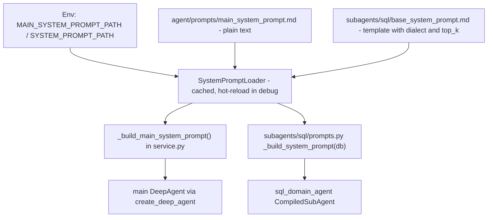

# Agent System Prompt Templates & Loader

Both LLM system prompts in the DeepAgent system are **file-backed Markdown templates** loaded through a shared `SystemPromptLoader`, so prompt changes are content edits, not code edits:

| Template | Default path (config knob) | Consumer |
|---|---|---|
| Main orchestrator prompt | `backend/app/agent/prompts/main_system_prompt.md` (`MAIN_SYSTEM_PROMPT_PATH`) | main DeepAgent (`create_deep_agent`), built in [agent-service](agent-service.md) |
| SQL subagent prompt | `backend/app/agent/subagents/sql/base_system_prompt.md` (`SYSTEM_PROMPT_PATH`) | `sql_domain_agent` compiled subgraph, built in [subagent-sql](subagent-sql.md) |

Defaults live in `backend/app/config.py` (`Settings.main_system_prompt_path` / `Settings.system_prompt_path`); both are env-overridable — see [deployment-and-testing](../operations/deployment-and-testing.md).

## Load & compile path

_Caption: both prompt templates flow through one loader class; only the SQL template is variable-rendered._

- `SystemPromptLoader` (`backend/app/agent/utils/system_prompt_loader.py`, re-exported from `backend/app/agent/utils/__init__.py` and from `backend/app/agent/subagents/sql/prompts.py` as a compatibility re-export) caches the template text; missing file raises `FileNotFoundError`; mtime-based hot-reload happens **only when `settings.debug` is on** (default `true` in `config.py`, set via `DEBUG`). Module-level loaders `_main_prompt_loader` (in `service.py`) and `_system_prompt_loader` (in `subagents/sql/prompts.py`) pin the path at import time, so changing the env vars requires a process restart.
- Main prompt: `service.py::_build_main_system_prompt()` returns the raw string — no `PromptTemplate` rendering, so the main template must not contain unescaped `{...}` variables.
- SQL prompt: `subagents/sql/prompts.py::_build_system_prompt(db)` wraps the text in `PromptTemplate.from_template(...)` and formats `{dialect}` (from `MaterializedViewSQLDatabase.dialect`) and `{top_k}` (from `settings.sql_agent_top_k`).
- Prompt assembly happens once per agent build in `service.py::_build_agent_components` (main prompt at the `create_deep_agent` call site, SQL prompt at the `create_agent` subgraph call site); per-model-call compilation of DDL/RAG into the subagent system message is a separate concern — see [middleware-pipeline](middleware-pipeline.md).

## The main↔subagent collaboration contract

`main_system_prompt.md` is structured in four sections that define how the orchestrator and `sql_domain_agent` divide work. These are LLM-behavior contracts (prompt text, not code), but the frontend relies on two of them, so treat them as load-bearing:

1. **Role & mandate** — the main agent owns user-facing intent routing, chit-chat, and session management; DB queries, statistics, paint-shop work-in-progress counts, metrics, charts, and CSV exports are delegated through the `task` tool to the specialist subagent.
2. **Routing matrix** — a table mapping `agent_name` → capability scope; today only `sql_domain_agent` (the paint-shop "Data Agent") is implemented. The matrix is the extension seam for more specialists (see below).
3. **Task delegation protocol** — the task description carries only business goals, *merged multi-turn* filter conditions, and expected deliverable format; it must never specify physical table names or SQL syntax. A standard 4-field template (业务目标 / 业务实体与过滤条件 / 探索授权 / 期望交付物) is given, and exploratory queries explicitly authorize the subagent to probe `search_db_value_lexicon` (see [tools-and-sql-linter](tools-and-sql-linter.md) for the tool itself).
4. **Result presentation protocol** — the main agent delivers subagent output losslessly: numbers are never re-computed; `[suggest_chart:<type>|『<desc>』]` markers are passed through unmodified (the frontend `MessageItem.vue` parses that exact syntax to render one-click chart buttons — see [chat-app](../frontend/chat-app.md)); the subagent's final-line `数据来源：表名，查询时间：...` footer and GFM Alert blocks are preserved; and the **two-level clarification split** holds: the main agent uses `AskUserQuestion` only for global-direction ambiguity, while domain parameters (FIS numbers, metric definitions, paint-shop data) are clarified inside the subagent — see [clarification-flow](../workflows/clarification-flow.md).

## Subagent "self-heal before asking" rule

`base_system_prompt.md` §2.2 orders input validation: when an entity name or metric term is ambiguous, the subagent **first** probes the physical lexicon (`search_db_value_lexicon` / `search_db_row_lexicon`) to align on real DB values, and only escalates to `AskUserQuestion` when probing fails, a key parameter (e.g. FIS number) is genuinely missing, or a metric definition has major branching ambiguity. §3.1 step 1 (load domain skill, then validate) repeats the same ordering. This "minimal disturbance" rule is the mirror half of the main agent's clarification split.

## Evolution blueprint (planned, not yet in code)

`docs/superpowers/specs/2026-08-23-multi-agent-prompt-and-architecture-optimization.md` (status: ready for review) plans a **"1 orchestrator + N specialists"** topology with `knowledge_doc_agent` and `iot_device_agent` as the next specialists, and a **SubAgent Registry/factory pattern** for `backend/app/agent/subagents/` (registry in `__init__.py`, `BaseSubAgentFactory` in `base.py`, per-domain `factory.py`) so `_build_agent_components` discovers subagents dynamically instead of hardcoding `sql_subagent`. As of this commit the registry has **not** landed — `backend/app/agent/subagents/__init__.py` is a one-line comment stub and `service.py` still builds the SQL subagent inline. Revisit this page when that refactor is implemented.

## Invariants & tests

- Default template exists and the built main prompt still contains the contract anchors (`sql_domain_agent`, `Task Delegation Protocol`, `search_db_value_lexicon`, `AskUserQuestion`) — `backend/tests/agent/test_main_system_prompt.py` (`test_main_system_prompt_default_path_exists`, `test_build_main_system_prompt_anchors`).
- Loader class identity across the utils package export and the subagent compatibility re-export; caching and `FileNotFoundError` — `backend/tests/agent/utils/test_system_prompt_loader.py`.
- Middleware ownership around prompt compilation — `backend/tests/agent/test_agent_component_boundaries.py`.

## Change recipe: edit the prompt collaboration contract

1. Edit the owning Markdown template (main: `backend/app/agent/prompts/main_system_prompt.md`; SQL: `backend/app/agent/subagents/sql/base_system_prompt.md`). Template text changes are picked up without a restart only when `settings.debug` is on (the loader re-reads on mtime change) *and* the agent is rebuilt; otherwise a service restart is required (the module-level loader pins the path at import).
2. Do **not** remove or rename the `[suggest_chart:<type>|『...』]` marker syntax or the `数据来源：` footer line without also updating: the subagent prompt §2.1/§4.x rules, the main prompt's passthrough rules, `frontend/src/components/chat/MessageItem.vue` (marker regex + one-click buttons), and `frontend/src/utils/markdown.ts` (data-source extraction).
3. Keep the clarification split consistent across both templates — if you move a clarification duty from subagent to main (or vice versa), update §2.2 of the SQL prompt, §4 of the main prompt, and [clarification-flow](../workflows/clarification-flow.md).
4. Validate: `cd backend && python -m pytest tests/agent/test_main_system_prompt.py tests/agent/utils/test_system_prompt_loader.py -q`; if markers or the footer changed, also run `cd frontend && npx vue-tsc --noEmit` and re-check `MessageItem.vue` rendering.

## Change recipe: point prompts at custom templates

Set `MAIN_SYSTEM_PROMPT_PATH` / `SYSTEM_PROMPT_PATH` (see [deployment-and-testing](../operations/deployment-and-testing.md)). Remember: loaders are module-level and pin the path at import — a restart is required. Remember the asymmetry: the main template is a plain string (no `{vars}`), the SQL template is a `PromptTemplate` that expects `{dialect}` and `{top_k}`.
