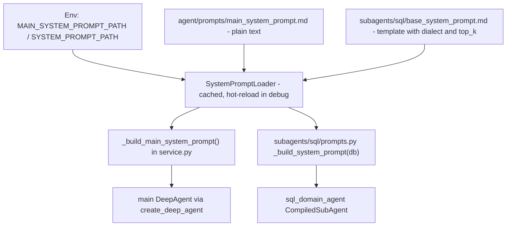

# 智能体系统提示词模板与加载器

DeepAgent 系统中的两个 LLM 系统提示词均为**基于文件的 Markdown 模板**，并通过共享的 `SystemPromptLoader` 加载；因此提示词变更属于内容编辑，而非代码编辑：

| 模板 | 默认路径（配置项） | 使用方 |
|---|---|---|
| 主编排器提示词 | `backend/app/agent/prompts/main_system_prompt.md`（`MAIN_SYSTEM_PROMPT_PATH`） | 主 DeepAgent（`create_deep_agent`），在 [agent-service](agent-service.md) 中构建 |
| SQL 子智能体提示词 | `backend/app/agent/subagents/sql/base_system_prompt.md`（`SYSTEM_PROMPT_PATH`） | `sql_domain_agent` 编译子图，在 [subagent-sql](subagent-sql.md) 中构建 |

默认值位于 `backend/app/config.py`（`Settings.main_system_prompt_path` / `Settings.system_prompt_path`）；两者均可通过环境变量覆盖——参见 [deployment-and-testing](../operations/deployment-and-testing.md)。

## 加载与编译路径

_说明：两个提示词模板均通过同一个加载器类流转；只有 SQL 模板会进行变量渲染。_

- `SystemPromptLoader`（`backend/app/agent/utils/system_prompt_loader.py`，从 `backend/app/agent/utils/__init__.py` 再导出，并从 `backend/app/agent/subagents/sql/prompts.py` 作为兼容性再导出）缓存模板文本；文件缺失时抛出 `FileNotFoundError`；基于 mtime 的热重载**仅在 `settings.debug` 开启时发生**（在 `config.py` 中默认为 `true`，通过 `DEBUG` 设置）。模块级加载器 `_main_prompt_loader`（位于 `service.py`）和 `_system_prompt_loader`（位于 `subagents/sql/prompts.py`）会在导入时固定路径，因此更改环境变量需要重启进程。
- 主提示词：`service.py::_build_main_system_prompt()` 返回原始字符串——不经过 `PromptTemplate` 渲染，因此主模板中不得包含未转义的 `{...}` 变量。
- SQL 提示词：`subagents/sql/prompts.py::_build_system_prompt(db)` 将文本包装进 `PromptTemplate.from_template(...)`，并格式化 `{dialect}`（来自 `MaterializedViewSQLDatabase.dialect`）和 `{top_k}`（来自 `settings.sql_agent_top_k`）。
- 提示词组装在 `service.py::_build_agent_components` 中每次构建代理时发生一次（主提示词位于 `create_deep_agent` 调用点，SQL 提示词位于 `create_agent` 子图调用点）；每次模型调用时将 DDL/RAG 编译进子智能体系统消息是另一独立关注点——参见 [middleware-pipeline](middleware-pipeline.md)。

## 主智能体↔子智能体协作契约

`main_system_prompt.md` 由四个章节构成，定义了编排器与 `sql_domain_agent` 如何分工。这些是 LLM 行为契约（提示词文本而非代码），但前端依赖其中两项，因此应将其视为承重约束：

1. **角色与职责** — 主智能体负责面向用户的意图路由、闲聊和会话管理；数据库查询、统计、油漆车间在制数量、指标、图表以及 CSV 导出通过 `task` 工具委托给专家子智能体。
2. **路由矩阵** — 一个将 `agent_name` 映射到能力范围的表格；目前仅实现了 `sql_domain_agent`（油漆车间“Data Agent”）。该矩阵是扩展更多专家的接缝（见下文）。
3. **任务委派协议** — 任务描述仅承载业务目标、*已合并的多轮* 过滤条件以及期望交付物格式；绝不应指定物理表名或 SQL 语法。其中给出了标准 4 字段模板（业务目标 / 业务实体与过滤条件 / 探索授权 / 期望交付物），探索性查询会显式授权子智能体探测 `search_db_value_lexicon`（工具本身参见 [tools-and-sql-linter](tools-and-sql-linter.md)）。
4. **结果呈现协议** — 主智能体无损地传递子智能体输出：数值绝不再次计算；`[suggest_chart:<type>|『<desc>』]` 标记原样透传（前端 `MessageItem.vue` 会解析该精确语法以渲染一键图表按钮——参见 [chat-app](../frontend/chat-app.md)）；子智能体最后一行的 `数据来源：表名，查询时间：...` 页脚和 GFM 告警块会被保留；并且**两级澄清拆分**成立：主智能体仅在全局方向歧义时使用 `AskUserQuestion`，而领域参数（FIS 编号、指标定义、油漆车间数据）在子智能体内部澄清——参见 [clarification-flow](../workflows/clarification-flow.md)。

## 子智能体“先自愈再询问”规则

`base_system_prompt.md` §2.2 规定了输入校验：当实体名称或指标术语存在歧义时，子智能体**首先**探测物理词汇集（`search_db_value_lexicon` / `search_db_row_lexicon`），以与实际数据库取值对齐；只有当探测失败、某个关键参数（例如 FIS 编号）确实缺失，或指标定义存在重大分支歧义时，才升级到 `AskUserQuestion`。§3.1 步骤 1（加载领域技能，然后校验）重复了同一顺序。这条“最小扰动”规则是主智能体澄清拆分的对应另一半。

## 演进蓝图（已规划，尚未落到代码）

`docs/superpowers/specs/2026-08-23-multi-agent-prompt-and-architecture-optimization.md`（状态：待评审）规划了 **“1 个编排器 + N 个专家”** 拓扑，下一批专家为 `knowledge_doc_agent` 和 `iot_device_agent`，并为 `backend/app/agent/subagents/` 引入 **SubAgent 注册表/工厂模式**（注册表位于 `__init__.py`，`BaseSubAgentFactory` 位于 `base.py`，各领域一个 `factory.py`），使 `_build_agent_components` 能够动态发现子智能体，而非硬编码 `sql_subagent`。截至本提交，注册表**尚未**落地——`backend/app/agent/subagents/__init__.py` 仍是一个单行注释占位文件，且 `service.py` 仍然内联构建 SQL 子智能体。待该重构实现后，应重新查看本页。

## 不变量与测试

- 默认模板存在，且构建出的主提示词仍包含契约锚点（`sql_domain_agent`、`Task Delegation Protocol`、`search_db_value_lexicon`、`AskUserQuestion`）——`backend/tests/agent/test_main_system_prompt.py`（`test_main_system_prompt_default_path_exists`、`test_build_main_system_prompt_anchors`）。
- utils 包导出与子智能体兼容性再导出之间加载器类身份一致；缓存和 `FileNotFoundError` —— `backend/tests/agent/utils/test_system_prompt_loader.py`。
- 提示词编译周围的中间件归属 —— `backend/tests/agent/test_agent_component_boundaries.py`。

## 变更配方：编辑提示词协作契约

1. 编辑所属的 Markdown 模板（主：`backend/app/agent/prompts/main_system_prompt.md`；SQL：`backend/app/agent/subagents/sql/base_system_prompt.md`）。仅当 `settings.debug` 开启（加载器会在 mtime 变化时重新读取）*且* 代理已重新构建时，模板文本变更才无需重启即可生效；否则必须重启服务（模块级加载器在导入时固定路径）。
2. 不要**移除或重命名** `[suggest_chart:<type>|『...』]` 标记语法或 `数据来源：` 页脚行，同时不更新以下内容：子智能体提示词 §2.1/§4.x 规则、主提示词的透传规则、`frontend/src/components/chat/MessageItem.vue`（标记正则 + 一键按钮）以及 `frontend/src/utils/markdown.ts`（数据源提取）。
3. 保持两个模板之间的澄清拆分一致——如果将某项澄清职责从子智能体移到主智能体（或相反），请更新 SQL 提示词 §2.2、主提示词 §4，以及 [clarification-flow](../workflows/clarification-flow.md)。
4. 校验：`cd backend && python -m pytest tests/agent/test_main_system_prompt.py tests/agent/utils/test_system_prompt_loader.py -q`；如果标记或页脚发生变化，还应运行 `cd frontend && npx vue-tsc --noEmit` 并重新检查 `MessageItem.vue` 渲染。

## 变更配方：将提示词指向自定义模板

设置 `MAIN_SYSTEM_PROMPT_PATH` / `SYSTEM_PROMPT_PATH`（参见 [deployment-and-testing](../operations/deployment-and-testing.md)）。请记住：加载器是模块级的，并在导入时固定路径——必须重启。请记住不对称性：主模板是纯字符串（没有 `{vars}`），SQL 模板是期望 `{dialect}` 和 `{top_k}` 的 `PromptTemplate`。