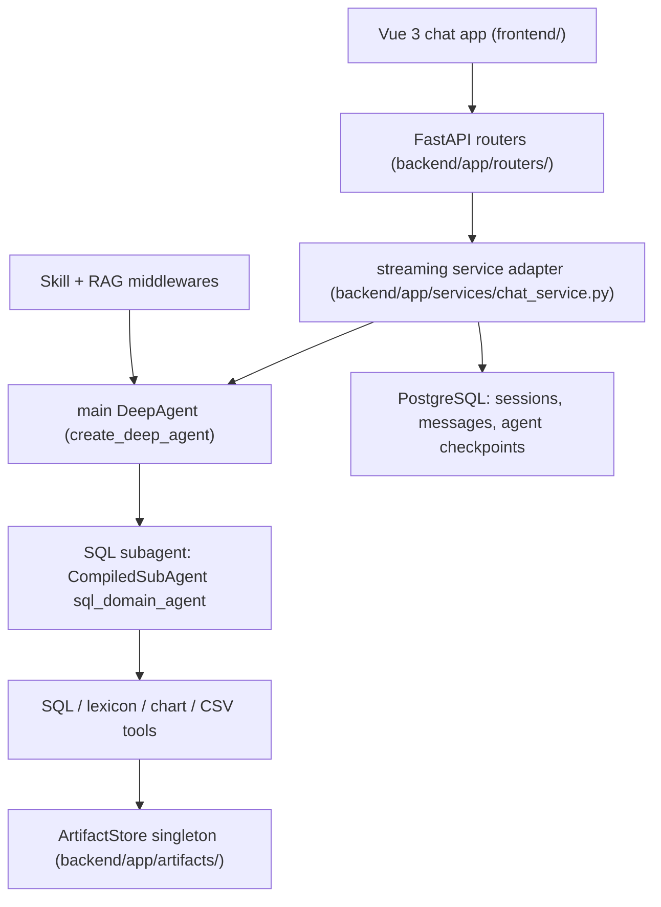

# Backend/Frontend Architecture Overview

rearch_agent is a production data-query chat system: users ask business questions in a multi-session chat UI; a DeepAgent main coordinator routes work to a compiled **SQL domain subagent** that runs guarded queries against a business PostgreSQL database; results flow back as structured SSE events with side-channel artifacts (charts, CSV exports, query-result tables) persisted for lossless rehydration after refresh.

## Runtime topology

_Caption: request path from the Vue frontend through the FastAPI streaming adapter into the DeepAgent graph, its SQL subagent, and the unified artifact store._

## Two coexisting runtime modes

The same graph factory supports two persistence modes, detected in `backend/app/agent/service.py`:

- **LangGraph managed mode** — `langgraph.json` declares graph `agent` as `backend/app/agent/service.py:build_agent_graph`; the LangGraph runtime injects `store`/`checkpointer` at run time (`_is_langgraph_managed_runtime()` detects `LANGGRAPH_API_URL`).
- **FastAPI local mode** — `SQLAgentService.create_local_async()` builds the graph locally with an `AsyncPostgresSaver` over `DATABASE_URL` (see [deployment-and-testing](../operations/deployment-and-testing.md)).

Both paths are wired from `backend/app/agent/service.py::_build_agent_components`; changes to tool registration, middleware assembly, or RAG wiring must update both — this is a standing invariant documented in `AGENTS.md`.

## Component map

| Area | Canonical page | Owning entrypoints |
|---|---|---|
| Agent assembly, LLM factory, dual init | [agent-service](agent-service.md) | `backend/app/agent/service.py`, `backend/app/agent/llm.py` |
| System prompt templates & loader | [agent-prompts](agent-prompts.md) | `backend/app/agent/prompts/main_system_prompt.md`, `backend/app/agent/subagents/sql/base_system_prompt.md`, `backend/app/agent/utils/system_prompt_loader.py` |
| State & transient context sandboxing | [state-and-context](state-and-context.md) | `backend/app/agent/state.py`, `backend/app/agent/context.py` |
| SQL domain subagent | [subagent-sql](subagent-sql.md) | `backend/app/agent/subagents/sql/` |
| Middleware pipeline | [middleware-pipeline](middleware-pipeline.md) | `backend/app/agent/middleware/` |
| Tools & SQL safety layer | [tools-and-sql-linter](tools-and-sql-linter.md) | `backend/app/agent/subagents/sql/tools.py`, `backend/app/agent/tools/` |
| Domain skills & scenarios | [skills-and-scenarios](../domain/skills-and-scenarios.md) | `backend/app/skills/`, `backend/app/routers/scenarios.py` |
| RAG & DB lexicon | [rag-and-lexicon](../domain/rag-and-lexicon.md) | `backend/app/agent/vector/` |
| Chat data model & persistence | [data-model-and-persistence](../domain/data-model-and-persistence.md) | `backend/app/models.py`, `backend/app/database.py` |
| Vue frontend | [chat-app](../frontend/chat-app.md) | `frontend/src/` |
| SSE streaming protocol | [streaming-protocol](../workflows/streaming-protocol.md) | `backend/app/schemas.py`, `backend/app/routers/chat.py` |
| Clarification (HITL) flow | [clarification-flow](../workflows/clarification-flow.md) | `backend/app/agent/tools/ask_user_question.py` |
| Artifact lifecycle | [artifact-lifecycle](../workflows/artifact-lifecycle.md) | `backend/app/artifacts/`, `backend/app/routers/artifacts.py` |
| Deployment & testing | [deployment-and-testing](../operations/deployment-and-testing.md) | `docker-compose.yml`, `run_backend.py` |

## Key invariants (repository-wide)

- All Agent invocations must pass `config["configurable"]["thread_id"] = session_id` (message history is checkpoint-managed, not manually loaded — `backend/app/routers/chat.py`).
- Single-round retrieval data (RAG docs, lexicon DDL) travels through the LangGraph **Context API** (`context_schema=RequestContext`), never through checkpointed state — see [state-and-context](state-and-context.md).
- Transient tool payloads ride the `Command(update={"messages", "tool_artifact"})` side channel into `CustomState.tool_artifact`, not plain tool return strings — see [artifact-lifecycle](../workflows/artifact-lifecycle.md).
- Frontend stream events are registered in three places (types union, `STREAM_EVENT_TYPES` whitelist, `parseStreamEvent` switch) — see [streaming-protocol](../workflows/streaming-protocol.md).

## Where to start

- Cross-module change: read this page, then the canonical page for the touched area.
- Design intent lives in `docs/deepagent/` (architecture reviews, refactoring roadmap) and `docs/multiagent_sidechannel/` (artifact tiering spec v1.1); OpenSpec deltas live in `openspec/`.
- Multi-agent evolution intent (Orchestrator + N Specialists topology, SubAgent Registry factory pattern, main↔subagent prompt collaboration contract) is specced in `docs/superpowers/specs/2026-08-23-multi-agent-prompt-and-architecture-optimization.md`; the prompt side is already implemented (see [agent-prompts](agent-prompts.md)), the code-side registry is still planned.
- Note: the `AGENTS.md` doc index still lists an `agent_docs/` folder that no longer exists; current intent docs are under `docs/` and `openspec/`.
