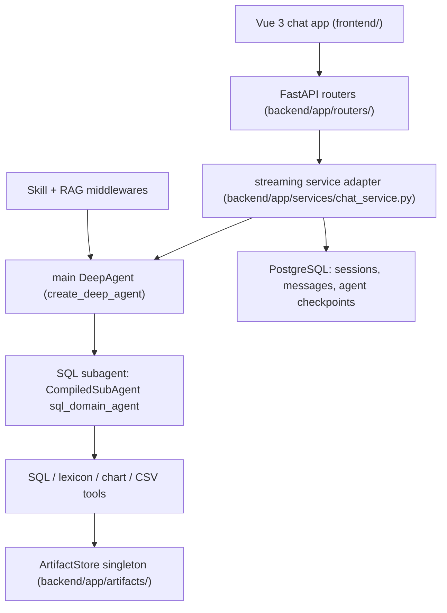

# 后端/前端架构概览

rearch_agent 是一个生产级数据查询聊天系统：用户在多会话聊天界面中提出业务问题；DeepAgent 主协调器将工作路由到一个已编译的 **SQL 领域子智能体**，该子智能体对业务 PostgreSQL 数据库运行受保护的查询；结果以结构化 SSE 事件形式回流，并附带旁路制品（图表、CSV 导出、查询结果表），持久化以便刷新后无损恢复。

## 运行时拓扑

_图注：从 Vue 前端经由 FastAPI 流式适配器进入 DeepAgent 图、其 SQL 子智能体以及统一制品存储的请求路径。_

## 两种并存的运行时模式

同一图工厂支持两种持久化模式，在 `backend/app/agent/service.py` 中检测：

- **LangGraph 托管模式** — `langgraph.json` 将图 `agent` 声明为 `backend/app/agent/service.py:build_agent_graph`；LangGraph 运行时在运行时注入 `store`/`checkpointer`（`_is_langgraph_managed_runtime()` 检测 `LANGGRAPH_API_URL`）。
- **FastAPI 本地模式** — `SQLAgentService.create_local_async()` 使用基于 `DATABASE_URL` 的 `AsyncPostgresSaver` 在本地构建图（参见 [部署与测试](../operations/deployment-and-testing.md)）。

两条路径均在 `backend/app/agent/service.py::_build_agent_components` 中接线；对工具注册、中间件组装或 RAG 接线的任何更改都必须同时更新这两条路径 — 这是在 `AGENTS.md` 中记录的常设不变量。

## 组件映射

| 区域 | 规范页面 | 所属入口点 |
|---|---|---|
| 智能体装配、LLM 工厂、双重初始化 | [智能体服务](agent-service.md) | `backend/app/agent/service.py`，`backend/app/agent/llm.py` |
| 系统提示模板与加载器 | [智能体提示](agent-prompts.md) | `backend/app/agent/prompts/main_system_prompt.md`，`backend/app/agent/subagents/sql/base_system_prompt.md`，`backend/app/agent/utils/system_prompt_loader.py` |
| 状态与瞬态上下文沙箱隔离 | [状态与上下文](state-and-context.md) | `backend/app/agent/state.py`，`backend/app/agent/context.py` |
| SQL 领域子智能体 | [SQL 子智能体](subagent-sql.md) | `backend/app/agent/subagents/sql/` |
| 中间件流水线 | [中间件流水线](middleware-pipeline.md) | `backend/app/agent/middleware/` |
| 工具与 SQL 安全层 | [工具与 SQL 检查器](tools-and-sql-linter.md) | `backend/app/agent/subagents/sql/tools.py`，`backend/app/agent/tools/` |
| 领域技能与场景 | [技能与场景](../domain/skills-and-scenarios.md) | `backend/app/skills/`，`backend/app/routers/scenarios.py` |
| RAG 与数据库词典 | [RAG 与词典](../domain/rag-and-lexicon.md) | `backend/app/agent/vector/` |
| 聊天数据模型与持久化 | [数据模型与持久化](../domain/data-model-and-persistence.md) | `backend/app/models.py`，`backend/app/database.py` |
| Vue 前端 | [聊天应用](../frontend/chat-app.md) | `frontend/src/` |
| SSE 流式协议 | [流式协议](../workflows/streaming-protocol.md) | `backend/app/schemas.py`，`backend/app/routers/chat.py` |
| 澄清（HITL）流程 | [澄清流程](../workflows/clarification-flow.md) | `backend/app/agent/tools/ask_user_question.py` |
| 制品生命周期 | [制品生命周期](../workflows/artifact-lifecycle.md) | `backend/app/artifacts/`，`backend/app/routers/artifacts.py` |
| 部署与测试 | [部署与测试](../operations/deployment-and-testing.md) | `docker-compose.yml`，`run_backend.py` |

## 关键不变量（整个仓库）

- 所有智能体调用都必须传递 `config["configurable"]["thread_id"] = session_id`（消息历史由检查点管理，而非手动加载 — `backend/app/routers/chat.py`）。
- 单轮检索数据（RAG 文档、词典 DDL）通过 LangGraph **Context API**（`context_schema=RequestContext`）传输，绝不经由检查点状态 — 参见 [状态与上下文](state-and-context.md)。
- 瞬态工具负载通过 `Command(update={"messages", "tool_artifact"})` 旁路通道进入 `CustomState.tool_artifact`，而不是普通的工具返回字符串 — 参见 [制品生命周期](../workflows/artifact-lifecycle.md)。
- 前端流事件在三个位置注册（类型联合、`STREAM_EVENT_TYPES` 白名单、`parseStreamEvent` 的 switch 语句）— 参见 [流式协议](../workflows/streaming-protocol.md)。

## 从哪里开始

- 跨模块变更：先阅读本页，再阅读所触及区域的规范页面。
- 设计意图位于 `docs/deepagent/`（架构评审、重构路线图）和 `docs/multiagent_sidechannel/`（制品分层规范 v1.1）；OpenSpec 增量位于 `openspec/`。
- 多智能体演进意图（Orchestrator + N Specialists 拓扑、SubAgent Registry 工厂模式、主↔子智能体提示协作契约）已在 `docs/superpowers/specs/2026-08-23-multi-agent-prompt-and-architecture-optimization.md` 中制定规范；提示侧已实现（参见 [智能体提示](agent-prompts.md)），代码侧注册表仍在计划中。
- 注意：`AGENTS.md` 文档索引仍列出了一个不再存在的 `agent_docs/` 文件夹；当前意图文档位于 `docs/` 和 `openspec/` 下。