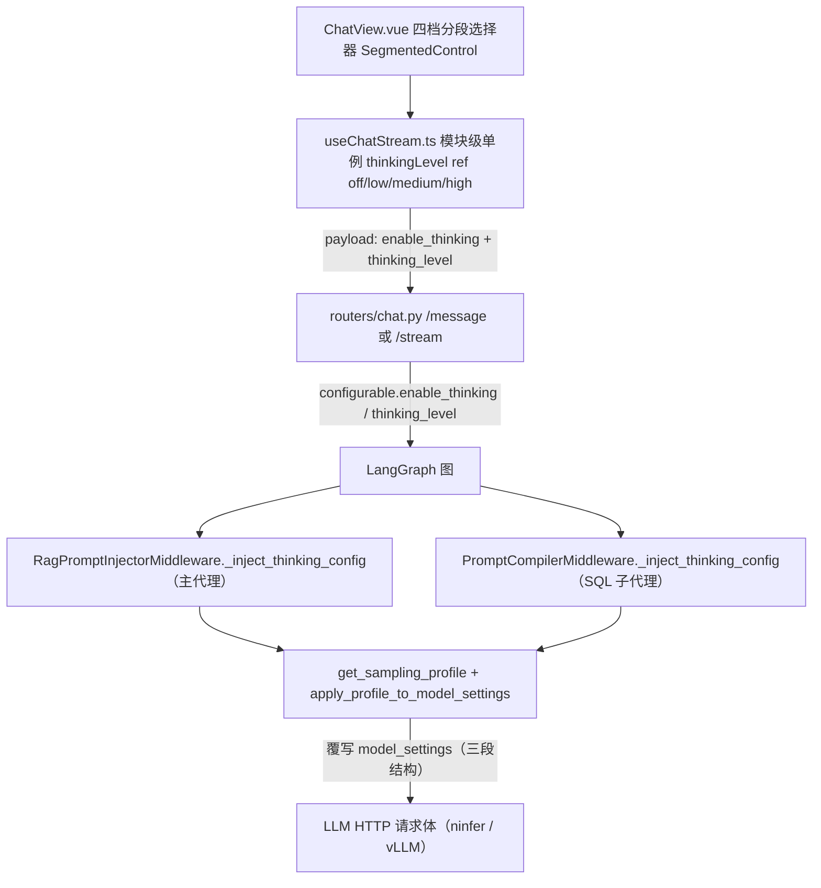

# 模型采样参数组合与动态注入（Sampling Profiles）

`backend/app/agent/config/` 承载"按请求动态覆写 LLM 采样参数"的配置子系统：`model_sampling_profiles.yaml` 声明 thinking / fast 两档参数组合，`profile_loader.py` 负责加载、校验与机械写入 `model_settings`，两个[中间件](middleware-pipeline.md)在 pre-model 时刻从客户端传入的 `configurable.enable_thinking` / `configurable.thinking_level` 打捞参数并注入。功能演进：Phase 2 实现思考/快答二档切换；Phase 3 在 thinking 档内增加 `thinking_level` 四档强度（UI 档位 → `reasoning_effort` 映射）。

## 设计权威文档（Design Authority）

本功能的设计意图权威来源如下（wiki 只做导航与运行时契约速览，不复制其内容；行为变更应先更新这些文档，再同步本页）：

- **ADR**：`docs/architecture/adr-model-sampling-profiles.md` — D1–D7 决策记录：中间件层动态覆写（D1）、YAML 配置源与 fail-fast（D2）、仅思考/非思考二档泛化（D3）、reasoning_effort 与 enable_thinking 同时注入（D4）、参数分层复用现有约定（D5）、双中间件保持现状（D6）、reasoning_effort 传输位置开关（D7，ninfer 切换），以及"profile 全量覆写 init-time 默认"的覆写语义。
- **术语表**：`docs/architecture/glossary-model-sampling.md` — 采样参数组合 / 思考模式 / 快答模式 / 参数分层 / `enable_thinking` / `reasoning_effort` / `thinkingLevelMap` 等术语定义与历史修正。
- **Phase 2 设计**：`docs/thinking_mode/phase2_sampling_profiles_design.md` — 二档切换完整方案（需求来源、传输分层、被否决方案：双 LLM 实例 / 前端传完整参数集 / 环境变量扩展）。
- **Phase 3 设计**：`docs/thinking_mode/phase3_thinking_levels_design.md` — 思考强度多级控制；§3.5 为 `REASONING_EFFORT_TRANSPORT` 传输位置开关的细节（ninfer 与 vLLM ≤0.27.1 的约定差异）。
- **变更规范**：`openspec/changes/phase2-sampling-profiles-stage-c/spec.md`（阶段 C 端到端验收与收尾）、`openspec/changes/phase3-thinking-levels/spec.md`（四档选择器实现决策与测试清单）。

## 三段结构与传输分层

YAML 中每个 profile 使用与 [`_create_llm`](agent-service.md) 完全一致的三段结构（这也是与 LLM 提供商的传输契约）：

| 段 | 传输位置 | 参数示例 |
|---|---|---|
| `top_level` | 请求体顶层（OpenAI 标准字段） | `temperature`、`top_p`、`presence_penalty` |
| `extra_body` | `extra_body` 字典（vLLM 非标准采样参数，OpenAI SDK 不拦截） | `top_k`、`min_p`、`repetition_penalty` |
| `chat_template_kwargs` | `extra_body.chat_template_kwargs`（Qwen3 模板变量） | `enable_thinking` |

`apply_profile_to_model_settings(model_settings, profile)` 按三段机械写入（原地修改）：`top_level` → `model_settings[key]`；`extra_body` → `model_settings["extra_body"][key]`；`chat_template_kwargs` → `model_settings["extra_body"]["chat_template_kwargs"][key]`。

## 配置加载与 fail-fast

`_load_profiles()`（`lru_cache(maxsize=1)`，启动时一次性加载）：

- 文件缺失 → `FileNotFoundError`；YAML 为空 → `ValueError`。
- 必须同时存在 `thinking` 与 `fast` 两个 profile（`_REQUIRED_PROFILES`），缺失即启动失败。
- 每个 profile 只允许 `_VALID_SECTIONS = {"top_level", "extra_body", "chat_template_kwargs"}` 中的段，未知段抛 `ValueError`。
- `_NON_PROFILE_KEYS = {"thinking_level_map"}` 是顶层非 profile 键白名单（Phase 3 新增），跳过校验但仍保留在返回结构中。

[代理服务](agent-service.md) 的**两条初始化路径**（`_initialize_agent` 与 `_ainitialize_agent`）都会调用 `_load_profiles()` 做 eager load（`service.py`），使 YAML 配置问题在启动时即暴露，而不是等首个请求失败。

## reasoning_effort 传输位置开关

`reasoning_effort` 在 YAML 的 `extra_body` 段做**中性声明**，`get_sampling_profile` 将其弹出后按环境变量 `REASONING_EFFORT_TRANSPORT` 移到实际传输位置：

| transport 值 | 落点 | 适用后端 |
|---|---|---|
| `top_level`（默认） | 请求体顶层 | **ninfer**：仅接受顶层 `reasoning_effort`；对 `chat_template_kwargs` 做白名单校验（非 `enable_thinking`/`preserve_thinking` 键直接 400） |
| `chat_template_kwargs` | `extra_body.chat_template_kwargs` | **vLLM ≤0.27.1**：顶层参数接受但不透传模板，仅 ctk 通道生效 |

- `_get_effort_transport()` 读取环境变量（默认 `top_level`），非法值**导入即抛 ValueError**（fail-fast）；模块导入时打印 INFO 日志标明当前位置。
- `enable_thinking` **不受开关影响**，始终在 `chat_template_kwargs`（ninfer 白名单与 vLLM 官方通道都接受）。
- 切换推理框架只需改 `.env` / `.env_docker` 中的 `REASONING_EFFORT_TRANSPORT` 并重启，代码/YAML/前端不动（见 [部署与测试](../operations/deployment-and-testing.md)）。
- 误配行为设计为可发现：ninfer 上误配 `chat_template_kwargs` → 首个请求 400（显性）；vLLM ≤0.27.1 上误配 `top_level` → 档位静默失效（顶层不透传模板），思考开关仍正常、不报错。

## thinking_level_map（Phase 3）

YAML 顶层 `thinking_level_map` 提供 UI 思考级别 → `reasoning_effort` 映射：`low→low`、`medium→medium`、`high→xhigh`。

`get_sampling_profile(enable_thinking, thinking_level=None)` 行为矩阵：

| 输入 | reasoning_effort 结果 |
|---|---|
| `enable_thinking=True` + `thinking_level=None` | profile 默认值（当前 `medium`）——Phase 2 行为完全兼容 |
| `enable_thinking=True` + `thinking_level="high"` | `xhigh`（经 map 覆写） |
| `enable_thinking=True` + `thinking_level` 不在 map 中 / map 缺失 | 跳过覆写，用 profile 默认值，**不抛错** |
| `enable_thinking=False`（fast 档） | 不传 `reasoning_effort`，**忽略**传入的 `thinking_level` |

实现不变量：返回值是 `copy.deepcopy(profile)`（Phase 3 从浅拷贝升级），防止嵌套段覆写污染 `lru_cache` 全局缓存——`test_get_sampling_profile_returns_deep_copy` 专门断言嵌套段隔离。

## 请求链路与前端档位映射

_采样参数注入链路：前端档位 → 请求字段 → configurable → 双中间件对称注入 → model_settings → 网络发包。_

请求侧契约：

- `backend/app/schemas.py::ChatRequest`：`enable_thinking: Optional[bool]` + `thinking_level: Literal["low", "medium", "high"] | None`（Phase 3 用 `Literal` 在 API 层校验枚举值，非法值 422，不依赖中间件 try/except 兜底）。
- `backend/app/routers/chat.py`：`/message` 与 `/stream` **两处**在 `configurable` 构造中透传 `enable_thinking` 与 `thinking_level`；`resume` 端点 config 只含 `thread_id`，连 `enable_thinking` 都不传，**不继承思考档位**（与 Phase 1/2 限制一致）。
- 前端映射（`frontend/src/composables/useChatStream.ts`）：2026-08-30 起 `thinkingLevel` ref（默认 `medium`）等状态上提为**模块级单例**（L33-37），供 `ChatView` / `MessageItem` 等所有 `useChatStream()` 调用方共享；`enableThinking = computed(() => thinkingLevel.value !== 'off')`、`thinkingLevelParam` 在 `off` 时返回 `undefined`（不传）。流式 payload（`enable_thinking` + `thinking_level`）在 `handleStreamMessage` 的 `sendChatStream` 调用处构造（约 L298-329），非流式 `handleNormalMessage`（约 L334-349）同样携带；`resumeMessage` 只发送 `session_id` + `answers`，**不携带思考档位**（与后端 `resume` 端点 config 仅含 `thread_id` 不继承档位一致）。
- `frontend/src/views/ChatView.vue`（L185-193）：`SegmentedControl` 四档 options（关闭/轻思考/标准思考/深度思考）绑定 `thinkingLevel`，替换原"深度思考" ToggleSwitch；`frontend/src/components/common/SegmentedControl.vue` 为通用分段选择器（Tailwind + 暗色模式，本地打包，符合离线约束）。
- 流控生命周期细节（`isSending`、`abortSessionStream`、`stopStreaming`、AbortController 管理等）见 [前端流式生命周期](../frontend/streaming-lifecycle.md)，本页不展开。

## 不变量与测试

- 双中间件**对称注入**：`test_prompt_compiler_middleware.py` / `test_rag_prompt_injector_middleware.py` 各覆盖 enable_thinking True/False/None 三态 + Phase 3 的 level 覆写（`test_*_thinking_level_high_overrides_effort`、`test_*_thinking_level_none_defaults_medium`、`test_*_fast_with_thinking_level_ignores_level`、transport=ctk 对称用例）。
- loader 语义：`backend/tests/agent/test_sampling_profile_loader.py`（`test_load_profiles_returns_both_modes`、`test_load_profiles_unknown_section_raises`、`test_get_sampling_profile_*` 系列、`test_get_sampling_profile_returns_deep_copy`、transport 四用例 `test_get_sampling_profile_transport_*`、`test_get_sampling_profile_invalid_transport_raises`）。
- 覆写语义（ADR 后果）：客户端显式传 `enable_thinking` 时，profile 参数**全量覆写** `_create_llm` 的 init-time 默认值（非叠加）；`enable_thinking=None` 时中间件不覆写，保留启动默认——形成 `profile → init-time env 默认` 的 fallback 链。
- 最小验证：`cd backend && python -m pytest tests/agent/test_sampling_profile_loader.py tests/agent/middleware/test_prompt_compiler_middleware.py tests/agent/middleware/test_rag_prompt_injector_middleware.py -q`；前端 `cd frontend && npx vue-tsc --noEmit`。
- 端到端手工验证脚本：`backend/tests/manual_verify_sampling_request_body.py [thinking|fast] [--level low|medium|high]`（httpx `RecordingTransport` 拦截实际 HTTP 请求体，校验 reasoning_effort 到达 LLM 网络包）。

## 变更配方

1. **改参数值**：编辑 `model_sampling_profiles.yaml` 对应段的键值；改 `thinking_level_map` 调整 UI 级别 → reasoning_effort 映射。配置在启动时 eager load，改完需重启服务。
2. **新增采样参数**：在 YAML 的 `top_level` / `extra_body` / `chat_template_kwargs` 段中加键，并按[`_create_llm`](agent-service.md) 的传输分层确认落点（标准参数顶层、vLLM 非标准参数 extra_body、模板变量 ctk）。
3. **切换推理后端**：只改 `.env` 的 `REASONING_EFFORT_TRANSPORT`（`top_level`=ninfer / `chat_template_kwargs`=vLLM ≤0.27.1）并重启；不要改代码或 YAML 结构。
4. **新增 profile 档位**：需要新的 `_REQUIRED_PROFILES` 成员 + YAML 段落，并检查 `get_sampling_profile` 的选择逻辑。
5. **前端档位变更**：`ThinkingLevel` 联合类型（`frontend/src/types/index.ts`）、`useChatStream.ts` 的模块级单例 `thinkingLevel` ref（L33-37）与两个 payload（流式 `handleStreamMessage` 约 L298-329、非流式 `handleNormalMessage` 约 L334-349）、`ChatView.vue` 的 `SegmentedControl` options（L185-193）三处需同步；`resumeMessage` 不携带思考档位，无需改动。
6. **行为语义变更**：先更新设计权威文档（ADR / Phase 2、3 设计 / openspec spec），再同步本页与测试。

非目标：`temperature`/`top_p` 不随 level 变化（用户确认"仅控 reasoning_effort"）；不扩展为每档独立完整参数组（`thinking_level_map` 为未来扩展留了复用空间）。
