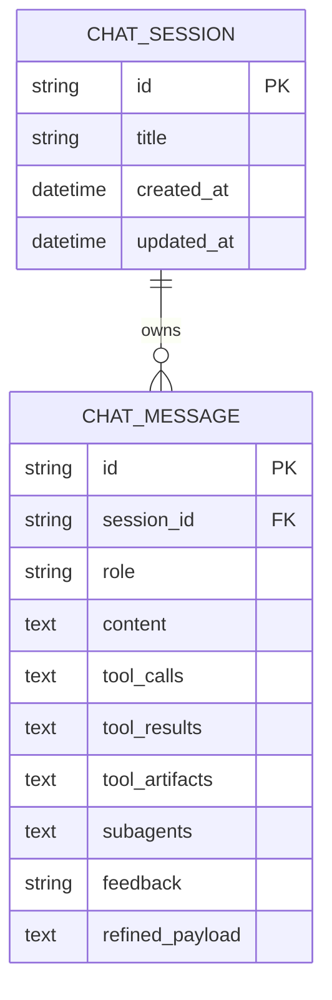

# Data Model & Chat Persistence

`backend/app/models.py` + `backend/app/database.py` own the relational persistence; agent state persistence (checkpoints) is a separate layer in [agent-service](../architecture/agent-service.md).

## Entities

_Caption: one `chat_sessions` row owns its `chat_messages` (UUID primary keys, `session_id` FK with cascade). The artifact/snapshot columns back rehydration._

Key columns on `ChatMessage` (see [artifact-lifecycle](../workflows/artifact-lifecycle.md) for their producers):
- `tool_artifacts` — JSON snapshot dict of `chart_spec` / `file_export` / `query_result` records, keyed by `tool_call_id`.
- `subagents` — JSON snapshot of subagent session state (per `subagent_id`).
- `refined_payload` — LLM-refined golden-case JSON (`rewritten_query`, `desensitized_sql`, `domain`) feeding the [RAG feedback pipeline](rag-and-lexicon.md#feedback-driven-golden-case-pipeline).
- `feedback` — `none | like | dislike | collected | approved`.

`create_tables()` in `backend/app/database.py` runs `Base.metadata.create_all` then idempotently adds the `subagents` / `tool_artifacts` TEXT columns (`ADD COLUMN IF NOT EXISTS`).

## Dual-mode agent checkpointing

- **Local FastAPI** — `AsyncPostgresSaver` over `DATABASE_URL` (or sync `PostgresSaver` in the managed graph path); created in `SQLAgentService` (`_create_local_async_checkpointer` / `_create_local_checkpointer`).
- **LangGraph managed** — the runtime injects `store` / `checkpointer`; `build_agent_graph` never binds them locally.
- **Conversation history** is checkpoint-managed, so `backend/app/routers/chat.py` no longer manually loads history (it passes `thread_id=session_id`).

Transient RAG/lexicon data is deliberately **not** checkpointed — it rides the Context API ([state-and-context](../architecture/state-and-context.md)), keeping snapshots small.

## Invariants & tests

- Snapshot + collision-free multi-artifact persistence: `backend/tests/test_tool_artifacts_persistence.py` (`test_tool_artifacts_model_and_crud`, `test_tool_artifact_stream_events`, `test_multi_artifact_same_subagent_collision_free`).
- Checkpoint/pollution behavior: `backend/tests/agent/test_persistence_integration.py::test_agent_persistence_without_message_pollution` (`@pytest.mark.integration` — needs live infra, skipped by default).

## Change recipe: add a persisted message field

1. Add the column to `ChatMessage` in `backend/app/models.py`.
2. If it is new, add an idempotent `ALTER TABLE ... ADD COLUMN IF NOT EXISTS` in `create_tables()` (`backend/app/database.py`) so existing databases migrate without Alembic.
3. Mirror it in the Pydantic `MessageBase` in `backend/app/schemas.py` (keep `from_attributes=True`).
4. Validate with `tests/test_tool_artifacts_persistence.py` (add a CRUD assertion for the new field).
