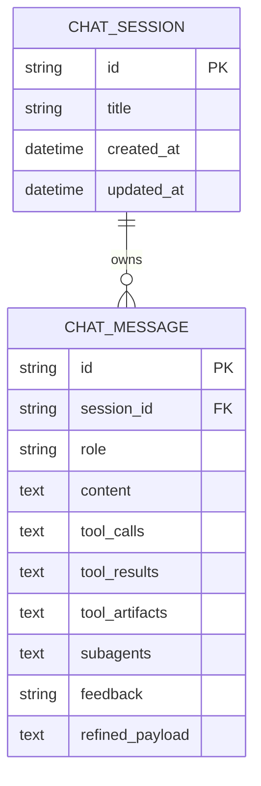

# 数据模型与聊天持久化

`backend/app/models.py` 和 `backend/app/database.py` 负责关系型持久化；代理状态持久化（检查点）是 [代理服务](../architecture/agent-service.md) 中的独立层。

## 实体

_说明：一条 `chat_sessions` 记录拥有其 `chat_messages`（UUID 主键，带级联的 `session_id` 外键）。工件/快照列用于支撑重新水化。_

`ChatMessage` 上的关键列（其生产者见 [工件生命周期](../workflows/artifact-lifecycle.md)）：
- `tool_artifacts` —— 以 `tool_call_id` 为键的 `chart_spec` / `file_export` / `query_result` 记录 JSON 快照字典。
- `subagents` —— 按 `subagent_id` 划分的子代理会话状态 JSON 快照。
- `refined_payload` —— 供 [RAG 反馈流水线](rag-and-lexicon.md#反馈驱动的黄金用例流水线) 使用的经 LLM 精炼的黄金案例 JSON（`rewritten_query`、`desensitized_sql`、`domain`）。
- `feedback` —— `none | like | dislike | collected | approved`。

`backend/app/database.py` 中的 `create_tables()` 先运行 `Base.metadata.create_all`，然后幂等地添加 `subagents` / `tool_artifacts` TEXT 列（`ADD COLUMN IF NOT EXISTS`）。

## 双模式代理检查点

- **本地 FastAPI** —— 基于 `DATABASE_URL` 的 `AsyncPostgresSaver`（在托管图路径中为同步 `PostgresSaver`）；在 `SQLAgentService` 中创建（`_create_local_async_checkpointer` / `_create_local_checkpointer`）。
- **LangGraph 托管** —— 运行时注入 `store` / `checkpointer`；`build_agent_graph` 不会在本地绑定它们。
- **会话历史** 由检查点管理，因此 `backend/app/routers/chat.py` 不再手动加载历史（它传入 `thread_id=session_id`）。

瞬态 RAG/词汇集数据有意**未**被检查点化——它经由 Context API 传递（[状态与上下文](../architecture/state-and-context.md)），以保持快照较小。

## 不变量与测试

- 快照 + 无冲突的多工件持久化：`backend/tests/test_tool_artifacts_persistence.py`（`test_tool_artifacts_model_and_crud`、`test_tool_artifact_stream_events`、`test_multi_artifact_same_subagent_collision_free`）。
- 检查点/污染行为：`backend/tests/agent/test_persistence_integration.py::test_agent_persistence_without_message_pollution`（`@pytest.mark.integration` —— 需要实际基础设施，默认跳过）。

## 变更配方：添加持久化消息字段

1. 在 `backend/app/models.py` 的 `ChatMessage` 中添加该列。
2. 如果是新列，在 `create_tables()`（`backend/app/database.py`）中添加幂等的 `ALTER TABLE ... ADD COLUMN IF NOT EXISTS`，使现有数据库无需 Alembic 即可迁移。
3. 在 `backend/app/schemas.py` 的 Pydantic `MessageBase` 中同步镜像（保持 `from_attributes=True`）。
4. 使用 `tests/test_tool_artifacts_persistence.py` 验证（为新字段添加 CRUD 断言）。