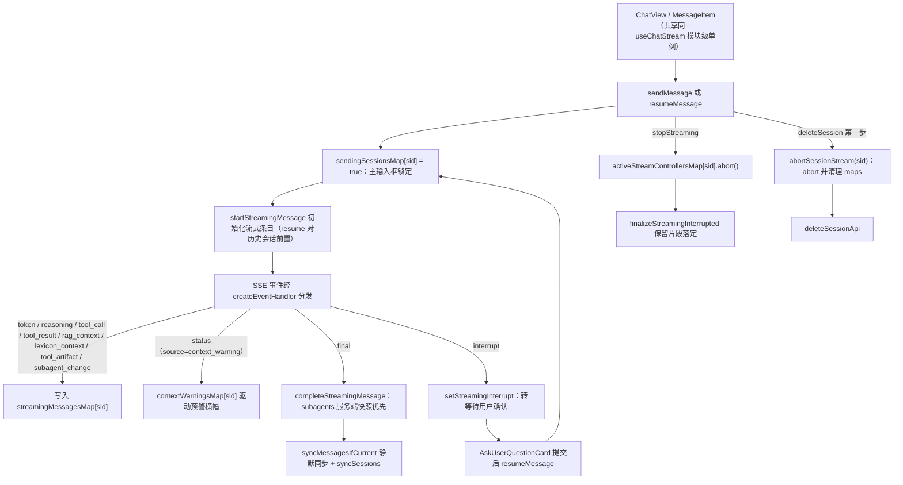
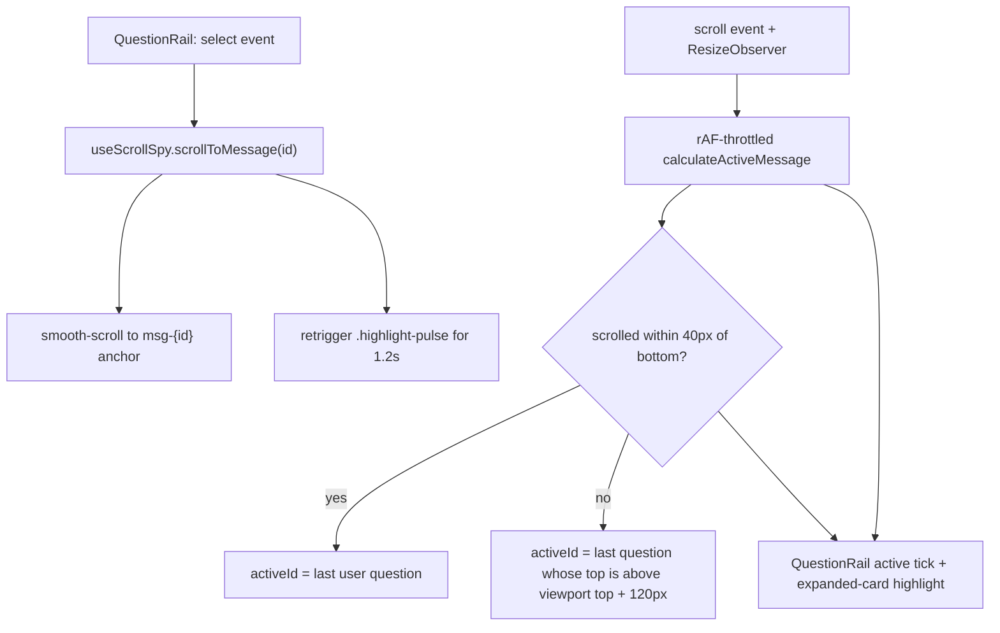

# Vue 3 聊天前端

`frontend/` 是聊天单页应用（Vue 3 `<script setup>` + Pinia setup 风格 store + Vite + Tailwind + ECharts）。它与位于 Nginx 前缀 `/rearch` 下的后端通信（axios 基础路径 `/rearch`，聊天 API `/rearch/api/chat` — 参见 `frontend/src/api/index.ts` 和 `frontend/src/api/chat.ts::API_BASE`）。禁止使用公开 CDN 资源；字体/库均本地化（`AGENTS.md` 离线约束）。

2026-08-30 审计（`frontend/docs/code-review-2026-08-30.md`，双代理复核 18/18 属实）修复了 8 个文件：流控状态上提为模块级单例（H2）、resume 链路初始化（H3）、`final` 事件 `subagents` 快照解析（H1）、两处 IME Enter 防护（M1）、直通 SQL 60s 超时（M2）、scenarioPanel 三路竞态守卫（M5）、删除会话前 abort 流（M8）、VariantB 抽屉双守卫（M9），并补修 Shift+Enter 双换行 bug。生命周期细节（单例状态、abort/stop/delete 顺序、已知遗留）见 [流式生命周期](../frontend/streaming-lifecycle.md)。

## 状态：Store

| Store | 文件 | 负责内容 |
|---|---|---|
| `useMessagesStore` | `frontend/src/stores/messages.ts` | 每个会话的 `messages` + `streamingMessagesMap`（多会话并行流式传输）；`reconstructSubagents` 根据持久化的 `tool_calls`/`tool_results` JSON 重建 `SubagentSessionState`；从渲染文本中移除内部 `<context_redacted>`/`<context_collapsed>` 标记；`memory*Map` 旁路缓存（RAG/词库/产物/推理/子代理）按消息 id 累积、只增不清（已知遗留，见 [流式生命周期](../frontend/streaming-lifecycle.md)） |
| `useSessionsStore` | `frontend/src/stores/sessions.ts` | 会话 CRUD 列表状态；`deleteSession` 第一步调用 `abortSessionStream(id)` 中止关联的活跃 SSE 流（abort 先于删除 API） |
| `useSkillsStore` | `frontend/src/stores/skills.ts` | 仪表盘技能发现（`GET /api/chat/skills`） |
| `useScenarioPanelStore` | `frontend/src/stores/scenarioPanel.ts` | 快速场景直连路径面板状态；领域树 / 参数元数据 / 直通查询三路独立竞态守卫（`fetchGuard` / `paramsGuard` / `queryGuard`） |

## 流式同步

- `frontend/src/composables/useChatStream.ts` 驱动 SSE 消费者；事件通过 `frontend/src/api/chat.ts::parseStreamEvent` 流转（白名单 + 按类型守卫，参见 [streaming-protocol](../workflows/streaming-protocol.md)）。
- **模块级单例流控（2026-08-30 H2 修复）**：`streamMode`、`thinkingLevel`、`activeStreamControllersMap`、`sendingSessionsMap`、`contextWarningsMap` 声明在 `useChatStream()` 函数体**外**（模块顶层），所有调用方共享同一份状态。`ChatView.vue`（主输入框 `isSending` 锁定、"停止生成" `stopStreaming`）与 `MessageItem.vue`（澄清提交 `resumeMessage`）两个调用方因此联动：提交澄清后主输入框被禁用，ChatView 的停止按钮能中止 resume 流。修复前每次调用生成相互隔离的局部实例，导致这两条链路失效。
- `abortSessionStream(sessionId)` 导出：abort 该会话的 `AbortController` 并清理 `sendingSessionsMap` / `contextWarningsMap` 条目；由 `sessions.ts::deleteSession` 在删除 API 之前调用（2026-08-30 M8 修复）。
- `createEventHandler(sessionId, hasTerminalEventRef)` 统一 `handleStreamMessage` 与 `resumeMessage` 的事件分发（13 类事件穷尽 switch，`plan_update` 为空操作预留，后端从不 emit）；`final` / `error` / `interrupt` 置位 `hasTerminalEvent`。
- `resumeMessage` 对历史会话/刷新后 `streamingMessagesMap[sessionId]` 条目不存在的场景**前置 `startStreamingMessage` 初始化**（2026-08-30 H3 修复），否则 store 侧 `if (!msg) return` 守卫会静默丢弃 resume 期间的全部流式事件。
- `api/chat.ts::parseStreamEvent` 的 `final` 分支补 `subagents` 校验与解析（2026-08-30 H1 修复）：`isRecord(parsed.subagents)` 通过后以 `Record<string, SubagentSessionState>` 下发，`completeStreamingMessage` 中服务端快照**优先于**本地流式累积；`context_warning` 确认走 `status(source=context_warning)` 事件通道，final 中不重复解析（属冗余副本）。
- `StreamingMessage` / `FinalizedStreamingMessage` / `SubagentSessionState` 类型位于 `frontend/src/types/index.ts`；内部标记移除和子代理重建位于 `stores/messages.ts`。

*流式生命周期概述：发送/恢复、事件分发、落定、停止与删除五条路径收敛于模块级单例状态。*

## 输入发送链

主输入框（`ChatView.vue`）与欢迎页输入框（`WelcomeDashboard.vue`）共用同一套 IME 防护（2026-08-30 M1 修复）：

- `ChatView.vue` 的 textarea 绑定 `@keydown.enter.exact="handleEnterKey"` 与 `@keydown.enter.shift.prevent="inputText += '\n'"`；`handleEnterKey` 先检查 `e.isComposing`——IME 合成中（选候选词）**不拦截** Enter，上屏后才 `preventDefault()` 并 `handleSendMessage()`，避免未转换的拼音被误当消息发出。
- Shift+Enter 分支补 `.prevent` 拦截原生换行（2026-08-30 复评补修）：只保留手动拼接 `inputText += '\n'`，修复双换行/中间换行被追加到末尾的既有 bug。
- `WelcomeDashboard.vue` 首页输入框（全页首个焦点控件）同样用 `handleEnterKey`（`e.isComposing` 时不拦截）。
- 发送按钮在 `isSending` 时（`sendingSessionsMap` 为真的当前会话）禁用/切换为"停止生成"，与单例流控联动；`handleSendMessage` 失败时移除乐观 user 消息并 `alert` 提示（原生 alert 属已知遗留 M6）。

## 思考强度分段选择器

输入工具栏的思考控制是四档分段选择器（Phase 3 实现；规范：`openspec/changes/phase3-thinking-levels/spec.md`），替换了 Phase 2 的"深度思考" ToggleSwitch：

- `frontend/src/components/common/SegmentedControl.vue` — 通用分段选择器组件（`modelValue` + `options`，`update:modelValue` 事件；Tailwind + 暗色模式，本地打包符合离线约束）。
- `frontend/src/views/ChatView.vue` — 渲染四个档位：关闭（`off`）/ 轻思考（`low`）/ 标准思考（`medium`）/ 深度思考（`high`），默认"标准思考"。
- `frontend/src/composables/useChatStream.ts` — `thinkingLevel` ref（`ThinkingLevel = 'off' | 'low' | 'medium' | 'high'`，来自 `frontend/src/types/index.ts`）；`enableThinking` 改为只读 computed（`thinkingLevel.value !== 'off'`）；`thinkingLevelParam` 在 `off` 时返回 `undefined`。流式与非流式**两处 payload** 均携带 `enable_thinking` + `thinking_level`。
- 后端契约：`ChatRequest.thinking_level: Literal["low","medium","high"]` 仅 `enable_thinking=true` 时生效，映射到 `reasoning_effort`（low→low / medium→medium / high→xhigh）；完整链路见 [采样参数组合与动态注入](../architecture/sampling-profiles.md)。

## 消息与产物渲染

- `frontend/src/components/chat/MessageItem.vue` — 消息气泡：状态行、`ReasoningAccordion`（思考过程）、`SubagentCard` 列表、Markdown 正文、调试面板；在等待澄清时显示"等待您的确认..."（[clarification-flow](../workflows/clarification-flow.md)）。它还会解析子代理的 `[suggest_chart:<type>|『desc』]` 标记（一键折线图/柱状图按钮）以及由 `frontend/src/utils/markdown.ts` 提取的 `数据来源：` 页脚——这两种标记格式均由 [agent-prompts](../architecture/agent-prompts.md) 中记录的提示词契约定义，因此在那里修改标记会破坏此 UI。澄清卡片提交走 `useChatStream()` 的 `resumeMessage`（与 ChatView 共享单例状态）。
- `frontend/src/components/chat/SubagentCard.vue` — 每个子代理的"专家工作台"：独立状态徽章、耗时、推理折叠面板、内部工具调用链以及嵌入产物。分层规则（`docs/multiagent_sidechannel/` 中的 spec v1.1）：Tier-1 交付物上浮到主气泡；`query_result` 表格和过程跟踪保持在此卡片内折叠。
- `frontend/src/components/artifacts/` — `ChartGroupCard.vue`（单图表视图 + 多图表选项卡）、`ChartArtifactCard.vue`、`QueryResultGroup.vue` / `TableResult.vue`（支持原生 20/50/100 分页和绝对行号的多表格切换器）、`DimensionTable.vue`、`ResultRenderer.vue` / `ScalarResult.vue`（直连路径场景输出，与 `frontend/src/components/common/ScenarioModal.vue` 和 `chat/FloatingScenarioCards.vue` 配合使用）。
- `frontend/src/components/chat/MessageList.vue` — 渲染 `MessageItem` 列表的滚动容器；它挂载 `QuestionRail` 和 scroll-spy（参见 [问题导航栏](#问题导航栏)），并向 `ChatView` 暴露 `scrollToBottom` / `scrollToMessage`。
- `frontend/src/components/chat/AskUserQuestionCard.vue` + `FloatingClarificationDock.vue` — 澄清卡片；`ReasoningAccordion.vue` — 思考面板。
- `frontend/src/components/agent/AdminReviewPanel.vue` — [RAG 反馈流水线](../domain/rag-and-lexicon.md) 的黄金案例审查界面。
- `frontend/src/components/chat/VariantB.vue` — 聊天页布局外壳（方案 B：微缩/展开双态侧边栏 + Bento 数据字典看板抽屉联动），由 `frontend/src/views/ChatView.vue` 直接渲染；侧边栏内通过插槽挂入 `SessionList` 与消息区；抽屉 `fetchTableData` 带请求序号 + 目标表比对双守卫（见 [直通场景与抽屉竞态防护](#直通场景与抽屉竞态防护)）。
- `frontend/src/views/ChatView.vue` — 单一视图；`WelcomeDashboard.vue` 是基于元数据的仪表盘（技能发现），首页输入框经 `handleDashboardSubmit` 创建新会话并发送。

## 问题导航栏

`frontend/src/components/chat/QuestionRail.vue` + `frontend/src/composables/useScrollSpy.ts`（两者均为 chat-nav 功能新增；规范：`docs/superpowers/specs/2026-08-23-question-navigation-rail-design.md`，计划：`docs/superpowers/plans/2026-08-23-question-rail.md`）添加一条位于右边缘的刻度导航栏，允许长会话在用户问题之间跳转。

- `MessageList.vue` 负责装配：它计算 `userQuestions: UserQuestionItem[]`（来自 `messages` 中 `role === 'user'` 的项，`index` 从 1 开始），并调用 `useScrollSpy(containerRef, userQuestions)`，其返回 `{ activeId, scrollToMessage, calculateActiveMessage }`。会话切换时，在 `fetchMessages` 之前将 `activeMessageId` 重置为 `null`。`defineExpose` 现同时向 `ChatView.vue`（`messageListRef`）暴露 `scrollToBottom` 和 `scrollToMessage`。
- `QuestionRail.vue` 渲染悬浮层：在 `questions.length < 2`、`loading` 为真（`messagesStore.loading`），或处于 `md` 断点以下（`hidden md:flex`）时隐藏。折叠状态为垂直刻度列（活动刻度更宽/更深）；悬停展开磨砂玻璃卡片，列出截断的问题文本；每一行发出 `select(id)`，由 `MessageList` 连接到 `scrollToMessage`。刻度使用 `v-memo`，并带有 `role="navigation"`/`aria-label` 无障碍属性。
- `MessageItem.vue` 为用户气泡添加 DOM 锚点 `:id="msg-${message.id}"`（仅限 user 角色），并添加 `.highlight-pulse` 关键帧样式（1.2 秒 box-shadow/scale "呼吸" 光晕，自动移除）。
- `useScrollSpy` 不变量：rAF 节流的滚动处理器；`ACTIVATION_OFFSET_TOP = 120px`（当用户消息顶部位于容器顶部 + 120px 或更高处时，该消息为"活动"状态）；滚动至距底部 `BOTTOM_THRESHOLD = 40px` 范围内时，强制 *最后一个* 用户问题为活动状态；消息流上的 `ResizeObserver` 会在流式内容/图表增长时重新校准；`scrollToMessage` 平滑滚动到 `el.top - 16px`，并通过强制重排重新触发 `.highlight-pulse`；`onUnmounted` 取消 rAF、定时器、监听器和 observer。

*问题导航栏运行时流程：用户驱动的定位（点击路径）和被动 scroll-spy（滚动路径）都收敛到 `activeId`。*

注意：设计规范的 §2.1 还列出了键盘导航（方向键/Enter），但已发布的 `QuestionRail.vue` 仅实现了鼠标交互（`mouseenter`/`mouseleave`/click）——没有键盘事件处理器。应将规范文本视为未实现意图，而非当前行为。

## 直通场景与抽屉竞态防护

- `frontend/src/composables/useRequestGuard.ts` — 通用请求序号竞态防护：`next()` 递增返回最新请求 id，`isFresh(id)` 判断是否仍为最新；用于快速切换场景/翻页/抽屉时丢弃过期响应。
- `useScenarioPanelStore` 三路独立守卫（2026-08-30 M5 修复）：`fetchGuard`（领域树）、`paramsGuard`（参数元数据）、`queryGuard`（直通查询）各自独立计数，响应/错误/`finally` 收尾**全分支**加 `isFresh` 检查——快速切场景时旧响应不再覆盖 `paramsMeta`/`queryResult`。
- `executeScenarioApi` 单独 `timeout: 60000`（2026-08-30 M2 修复）：直通查询是真实 SQL 执行，慢查询可超过全局 axios 实例的 `timeout: 10000`（`frontend/src/api/index.ts`）；`getScenariosApi` / `getScenarioParamsApi` 仍走全局 10s。
- `VariantB.vue` 抽屉 `fetchTableData` 双守卫（2026-08-30 M9 修复）：`tableDataGuard` 请求序号 + 落定时再比对 `activeTable.value !== requestedTable`，快速切换抽屉时旧表响应不覆盖新表；已知遗留：无 AbortController 主动中断（防覆盖已达成，可接受）。

## 不变量与验证

- 子代理帧必须在端到端保留 `subagent_id`/`subagent_name` 元数据（后端测试：`backend/tests/agent/test_subagent_stream_scoping.py`；前端对应项：`STREAM_EVENT_TYPES` + `parseStreamEvent`）。
- 流控/偏好 ref 是 `useChatStream.ts` 模块级单例（ChatView 与 MessageItem 共享）；在函数体内新增局部 ref 会重新引入 H2 类失效。
- 删除会话前必须先 `abortSessionStream(id)`（`sessions.ts::deleteSession` 第一步），否则 SSE 后台空跑。
- `final` 事件的 `subagents` 以服务端快照为准（`parseStreamEvent` 校验为 Record 并解析）；本地流式累积仅作回退。
- **没有专门的前端单元测试套件** —— 有限的验证是类型检查：`cd frontend && npx vue-tsc --noEmit`（仓库的 `build:check` 脚本为 `vue-tsc && vite build`）。
- 新的后端流事件需要三处前端注册（`AGENTS.md` 中的不变量，规范文档位于 [streaming-protocol](../workflows/streaming-protocol.md)）。

## 变更配方：添加或重新调整消息卡片元素样式

1. 组件：添加在 `frontend/src/components/chat/`（消息级）或 `frontend/src/components/artifacts/`（数据交付物）下；保持流式阶段渲染与最终化渲染分离（仓库约定）。
2. 新的持久化字段：扩展 `frontend/src/types/index.ts` 中的 `Message`/`StreamingMessage` 类型以及 `stores/messages.ts` 中的重建逻辑。
3. 如果它渲染子代理工作，请基于 `SubagentSessionState`（`subagent_id` = 任务调用 id），而不是消息级假设。
4. 构建前使用 `cd frontend && npx vue-tsc --noEmit` 验证。

## 变更配方：扩展问题导航栏或滚动定位

该导航栏是一个四文件契约；保持各部分同步：

1. **锚点不变量**：`MessageItem.vue` 仅对用户消息绑定 `:id="'msg-' + message.id"`；`useScrollSpy` 通过 `document.getElementById(`msg-${id}`)` 解析锚点，并将 `.highlight-pulse` 作用于同一节点。在某一处重命名 `msg-` 前缀会静默破坏定位。
2. **数据契约**：`UserQuestionItem`（`frontend/src/composables/useScrollSpy.ts`）由 `MessageList.vue` 的 `userQuestions` 计算属性产生。修改项形状（例如添加 `index` 显示）时，需同时更新该类型和该计算属性。
3. **可见性规则**位于 `QuestionRail.vue` 的根 `v-if`（`questions.length >= 2 && !loading`）和 `hidden md:flex` 断点类中——请在该处调整，而非在父组件中调整。
4. **阈值**（`ACTIVATION_OFFSET_TOP = 120`、`BOTTOM_THRESHOLD = 40`、`- 16` 滚动内边距、1.2 秒脉冲窗口）是 `useScrollSpy.ts` / `MessageItem.vue` 样式中的模块常量；请就地修改，并注意与 `MessageList.vue` 中现有 `scrollToBottom` 自动跟随逻辑（`isNearBottom` / `bottomThreshold = 96` 是独立的 96px 常量——不要将其与 scroll-spy 的 40px 常量"去重"）的交互。
5. **会话切换重置**：对 `sessionsStore.currentSessionId` 的 `watch` 必须确保在 `fetchMessages` 之前 `activeMessageId.value = null`，否则上一会话中过期的 `activeId` 会在新会话中点亮刻度。
6. 使用 `cd frontend && npx vue-tsc --noEmit` 验证；没有前端单元测试套件，因此唯一的静态检查是类型检查。
