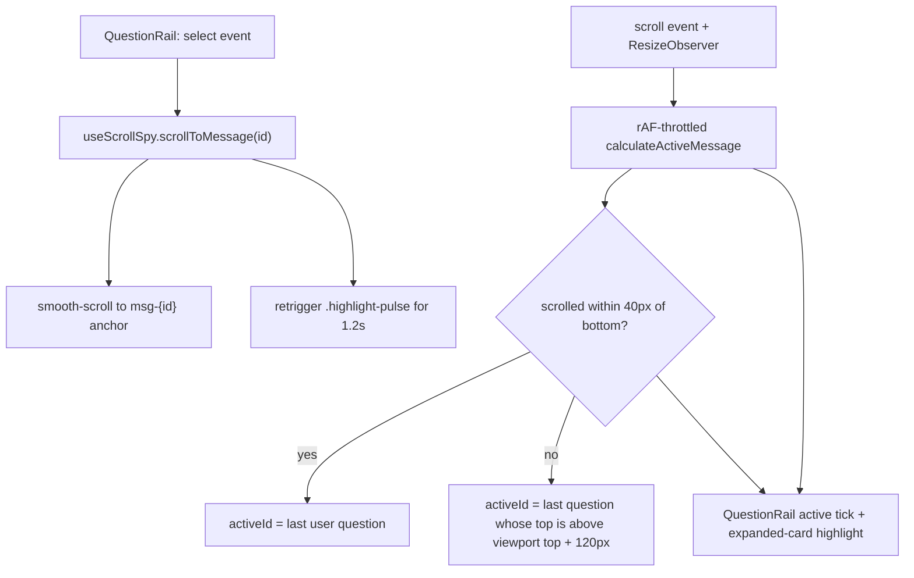

# Vue 3 Chat Frontend

`frontend/` is the chat SPA (Vue 3 `<script setup>` + Pinia setup stores + Vite + Tailwind + ECharts). It talks to the backend under the Nginx prefix `/rearch` (axios base `/rearch`, chat API `/rearch/api/chat` — see `frontend/src/api/index.ts` and `frontend/src/api/chat.ts::API_BASE`). No public CDN resources are allowed; fonts/libraries are localized (`AGENTS.md` offline constraint).

## State: stores

| Store | File | Owns |
|---|---|---|
| `useMessagesStore` | `frontend/src/stores/messages.ts` | Per-session `messages` + `streamingMessagesMap` (multi-session parallel streaming); `reconstructSubagents` rebuilds `SubagentSessionState` from persisted `tool_calls`/`tool_results` JSON; strips internal `<context_redacted>`/`<context_collapsed>` markers from rendered text |
| `useSessionsStore` | `frontend/src/stores/sessions.ts` | Session CRUD list state |
| `useSkillsStore` | `frontend/src/stores/skills.ts` | Dashboard skill discovery (`GET /api/chat/skills`) |
| `useScenarioPanelStore` | `frontend/src/stores/scenarioPanel.ts` | Quick-scenario direct-path panel state |

## Streaming sync

- `frontend/src/composables/useChatStream.ts` drives the SSE consumer; events flow through `frontend/src/api/chat.ts::parseStreamEvent` (whitelist + per-type guards, see [streaming-protocol](../workflows/streaming-protocol.md)).
- The `StreamingMessage` / `FinalizedStreamingMessage` / `SubagentSessionState` types live in `frontend/src/types/index.ts`; internal-marker stripping and subagent reconstruction live in `stores/messages.ts`.

## Message & artifact rendering

- `frontend/src/components/chat/MessageItem.vue` — the message bubble: status line, `ReasoningAccordion` (thinking), `SubagentCard` list, markdown body, debug panel; shows "等待您的确认..." while a clarification is pending ([clarification-flow](../workflows/clarification-flow.md)). It also parses the subagent's `[suggest_chart:<type>|『desc』]` marker (one-click line/bar chart buttons) and the `数据来源：` footer that `frontend/src/utils/markdown.ts` extracts — both marker formats are defined by the prompt contract documented in [agent-prompts](../architecture/agent-prompts.md), so changing the markers there breaks this UI.
- `frontend/src/components/chat/SubagentCard.vue` — per-subagent "expert workbench": independent status badge, duration, reasoning accordion, internal tool-call chain, and embedded artifacts. Tiering (spec v1.1 in `docs/multiagent_sidechannel/`): Tier-1 deliverables bubble up to the main bubble; `query_result` tables and process traces stay collapsed inside this card.
- `frontend/src/components/artifacts/` — `ChartGroupCard.vue` (single-chart view + multi-chart tabs), `ChartArtifactCard.vue`, `QueryResultGroup.vue` / `TableResult.vue` (multi-table switcher with native 20/50/100 pagination and absolute row numbers), `DimensionTable.vue`, `ResultRenderer.vue` / `ScalarResult.vue` (direct-path scenario output, paired with `frontend/src/components/common/ScenarioModal.vue` and `chat/FloatingScenarioCards.vue`).
- `frontend/src/components/chat/MessageList.vue` — the scroll container that renders the `MessageItem` list; it mounts `QuestionRail` and the scroll-spy (see [Question navigation rail](#question-navigation-rail)) and exposes `scrollToBottom` / `scrollToMessage` to `ChatView`.
- `frontend/src/components/chat/AskUserQuestionCard.vue` + `FloatingClarificationDock.vue` — clarification cards; `ReasoningAccordion.vue` — thinking panel.
- `frontend/src/components/agent/AdminReviewPanel.vue` — golden-case review UI for the [RAG feedback pipeline](../domain/rag-and-lexicon.md).
- `frontend/src/views/ChatView.vue` — the single view; `WelcomeDashboard.vue` is the metadata-driven dashboard (skill discovery).

## Question navigation rail

`frontend/src/components/chat/QuestionRail.vue` + `frontend/src/composables/useScrollSpy.ts` (both new in the chat-nav feature; spec: `docs/superpowers/specs/2026-08-23-question-navigation-rail-design.md`, plan: `docs/superpowers/plans/2026-08-23-question-rail.md`) add a right-edge tick rail that lets long conversations jump between user questions.

- `MessageList.vue` owns the assembly: it computes `userQuestions: UserQuestionItem[]` (from `messages` where `role === 'user'`, 1-based `index`) and calls `useScrollSpy(containerRef, userQuestions)`, which returns `{ activeId, scrollToMessage, calculateActiveMessage }`. On session switch it resets `activeMessageId` to `null` before `fetchMessages`. `defineExpose` now exposes **both** `scrollToBottom` and `scrollToMessage` to `ChatView.vue` (`messageListRef`).
- `QuestionRail.vue` renders the overlay: hidden while `questions.length < 2`, while `loading` (`messagesStore.loading`), or below the `md` breakpoint (`hidden md:flex`). Collapsed state is a vertical tick column (active tick wider/darker); hovering expands a frosted-glass card listing truncated question text; each row emits `select(id)` which `MessageList` wires to `scrollToMessage`. Uses `v-memo` on ticks and `role="navigation"`/`aria-label` a11y attributes.
- `MessageItem.vue` gives user bubbles the DOM anchor `:id="msg-${message.id}"` (user role only) plus the `.highlight-pulse` keyframe style (1.2s box-shadow/scale "breathing" glow, self-removing).
- `useScrollSpy` invariants: rAF-throttled scroll handler; `ACTIVATION_OFFSET_TOP = 120px` (a user message is "active" when its top is at/above the container top + 120px); when scrolled to bottom within `BOTTOM_THRESHOLD = 40px` the *last* user question is forced active; a `ResizeObserver` on the message stream recalibrates as streaming/charts grow; `scrollToMessage` smooth-scrolls to `el.top - 16px` and re-triggers `.highlight-pulse` via a forced reflow; `onUnmounted` cancels the rAF, timers, listeners, and observer.

*Question-rail runtime flow: user-driven locate (click path) and passive scroll-spy (scroll path) both converge on `activeId`.*

Note: the design spec's §2.1 also lists keyboard navigation (arrow keys/Enter), but the shipped `QuestionRail.vue` implements mouse-only interaction (`mouseenter`/`mouseleave`/click) — no key handlers. Treat the spec text as unimplemented intent, not current behavior.

## Invariants & validation

- Subagent frames must keep `subagent_id`/`subagent_name` metadata end-to-end (backend test: `backend/tests/agent/test_subagent_stream_scoping.py`; frontend mirror: `STREAM_EVENT_TYPES` + `parseStreamEvent`).
- **No dedicated frontend unit test suite** — the narrow validation is the type check: `cd frontend && npx vue-tsc --noEmit` (the repo's `build:check` script is `vue-tsc && vite build`).
- New backend stream events require the three-place frontend registration (invariant in `AGENTS.md`, canonical doc in [streaming-protocol](../workflows/streaming-protocol.md)).

## Change recipe: add or restyle a message-card element

1. Component: add under `frontend/src/components/chat/` (message-level) or `frontend/src/components/artifacts/` (data deliverables); keep streaming-phase and finalized rendering separated (repo convention).
2. New persisted fields: extend the `Message`/`StreamingMessage` types in `frontend/src/types/index.ts` and the reconstruction logic in `stores/messages.ts`.
3. If it renders subagent work, key it off `SubagentSessionState` (`subagent_id` = task call id) rather than message-level assumptions.
4. Validate with `cd frontend && npx vue-tsc --noEmit` before building.

## Change recipe: extend the question navigation rail or scroll positioning

The rail is a four-file contract; keep the pieces in sync:

1. **Anchor invariant**: `MessageItem.vue` binds `:id="'msg-' + message.id"` for user messages only; `useScrollSpy` resolves anchors via `document.getElementById(`msg-${id}`)` and targets the same node for `.highlight-pulse`. Renaming the `msg-` prefix in one place silently breaks locating.
2. **Data contract**: `UserQuestionItem` (`frontend/src/composables/useScrollSpy.ts`) is produced by `MessageList.vue`'s `userQuestions` computed. Change the item shape (e.g. add `index` display) in both the type and that computed.
3. **Visibility rules** live in `QuestionRail.vue`'s root `v-if` (`questions.length >= 2 && !loading`) and the `hidden md:flex` breakpoint class — adjust there, not in the parent.
4. **Thresholds** (`ACTIVATION_OFFSET_TOP = 120`, `BOTTOM_THRESHOLD = 40`, the `- 16` scroll padding, the 1.2s pulse window) are module constants in `useScrollSpy.ts` / `MessageItem.vue` styles; change them in place and watch for interaction with the existing `scrollToBottom` auto-follow logic in `MessageList.vue` (`isNearBottom` / `bottomThreshold = 96` is a separate 96px constant — do not "dedupe" it with the scroll-spy's 40px one).
5. **Session-switch reset**: the `watch` on `sessionsStore.currentSessionId` must keep `activeMessageId.value = null` before `fetchMessages`, or a stale `activeId` from the previous session will light up ticks in the new one.
6. Validate with `cd frontend && npx vue-tsc --noEmit`; there is no frontend unit-test suite, so the only static check is the type check.
