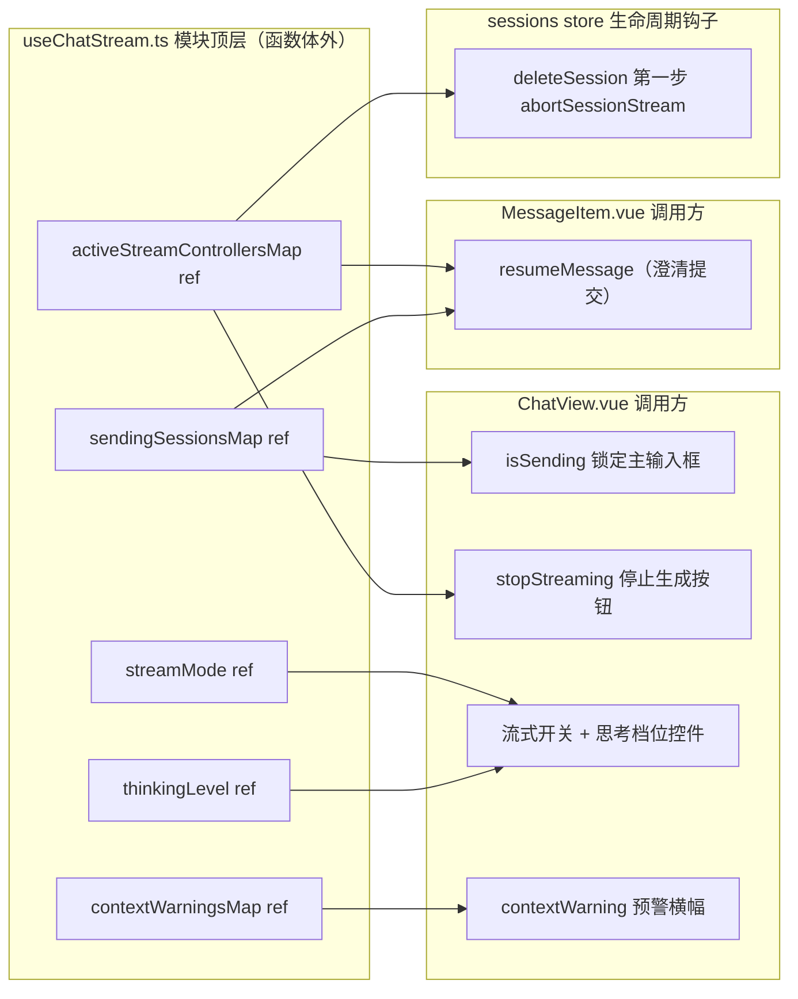
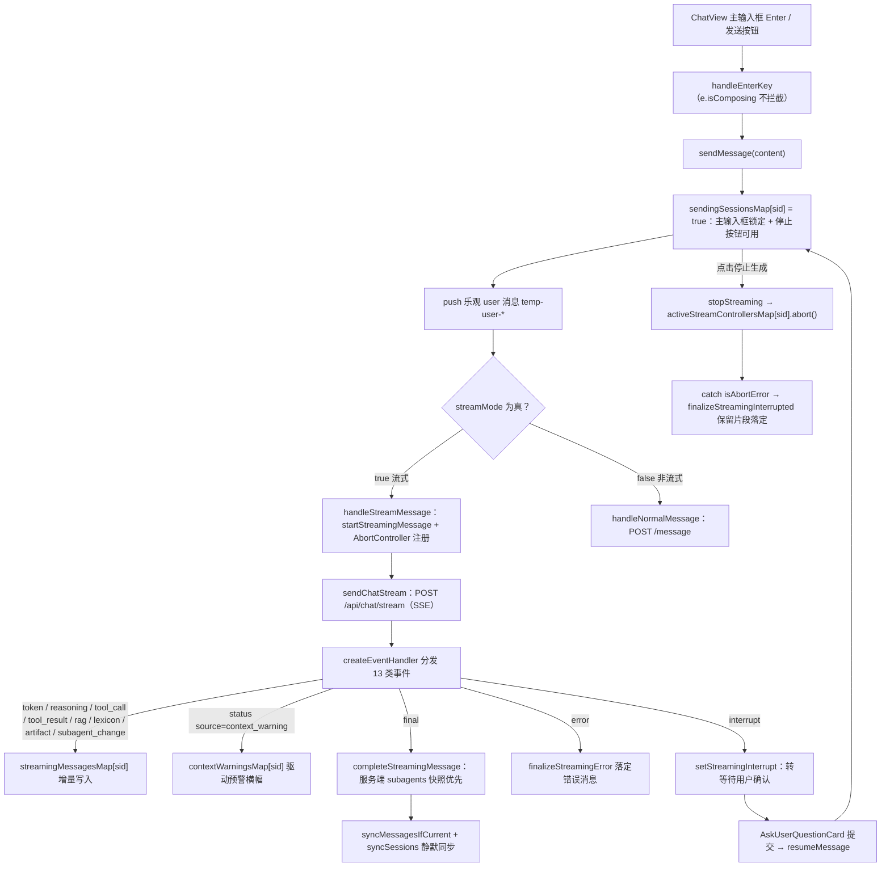
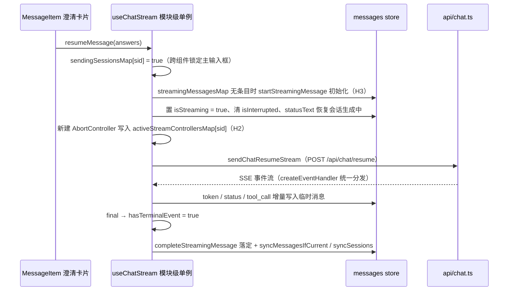
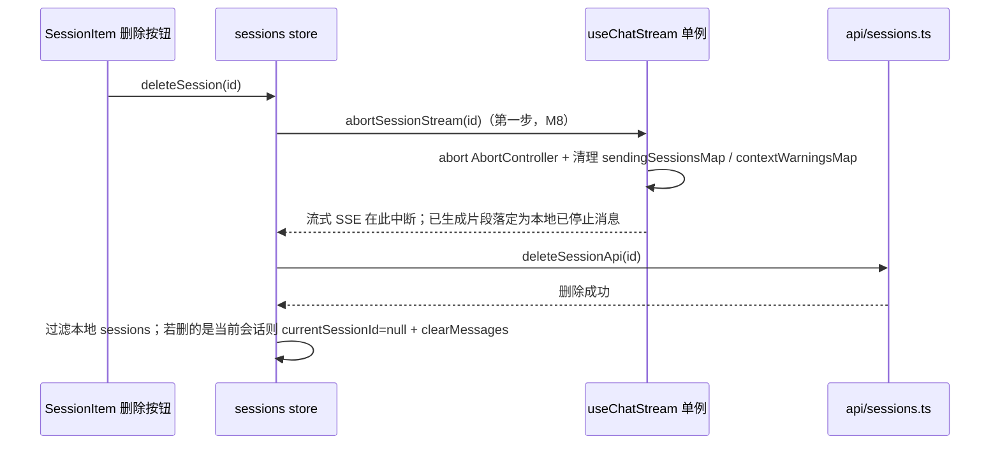

# 前端流式发送 / 恢复 / 停止 / 删除生命周期

本文档集中描述 2026-08-30 前端审计修复（`frontend/docs/code-review-2026-08-30.md` 的 H1–H3 / M1 / M2 / M5 / M8 / M9 发现，实施记录见 `changelog.md` 顶部条目）引入并固化的**流式会话生命周期契约**：谁拥有流控状态、发送与 resume 如何进入流、停止生成与删除会话如何中止流、以及所有异步写路径的竞态防护与超时分层。与 [聊天前端](../frontend/chat-app.md)（组件与状态全貌）、[SSE 流式传输协议](../workflows/streaming-protocol.md)（事件协议双重注册）、[澄清流程](../workflows/clarification-flow.md)（interrupt/resume 语义）互补。

验证方式：前端无单元测试套件，唯一静态检查为 `cd frontend && npx vue-tsc --noEmit`（`frontend/package.json` 的 `build:check` 为 `vue-tsc && vite build`）。

## 模块级单例流控状态（H2）

`useChatStream()` 的流控与偏好状态**声明在模块顶层（函数体外）**，而不是函数体内：

```ts
// frontend/src/composables/useChatStream.ts（模块级）
const streamMode = ref(true)
const thinkingLevel = ref<ThinkingLevel>('medium')
const activeStreamControllersMap = ref<Record<string, AbortController>>({})
const sendingSessionsMap = ref<Record<string, boolean>>({})
const contextWarningsMap = ref<Record<string, ContextWarningPayload | null>>({})
```

- `ChatView.vue`（主输入框 `isSending` 锁定、"停止生成"按钮、流式开关与思考档位控件）和 `MessageItem.vue`（澄清卡片提交 `resumeMessage`）各自调用 `useChatStream()`，但读写的是**同一份**模块级 ref。
- `isSending` 是 `computed`：`sendingSessionsMap[currentSessionId]` 为真时主输入框 textarea `:disabled="isSending"`、发送按钮切换为"停止生成"、头部状态点显示"处理中"。
- 审计前这些 ref 在函数体内，每次调用生成相互隔离的局部实例：MessageItem 提交澄清后 `sendingSessionsMap` 写在局部实例上，ChatView 的 `isSending` 恒为 false（主输入框未锁定，可并发发新消息覆盖进行中的流式态），ChatView 的"停止生成"调用的 `activeStreamControllersMap` 为空（无法中止 resume 流）。**在函数体内新增局部 ref 会原样复现 H2。**


*模块级单例 ref 与三个调用方的共享关系：任何调用方写入 sendingSessionsMap / activeStreamControllersMap，其余调用方立即可见。*

## 发送 → 流式 → 落定 / 停止 生命周期


*发送/恢复、事件分发、落定、停止生成五条路径收敛于模块级单例状态；终端事件（final / error / interrupt）与 [DONE] 标记构成流式收尾。*

关键顺序语义：

1. **乐观更新**：`sendMessage` 先把 `temp-user-${Date.now()}` 用户消息推入 `messagesStore.messages`，再发请求；失败时按 id 移除该临时消息并 `clearStreamingMessage` + 重拉同步（`syncMessagesIfCurrent`）。
2. **Abort 注册**：`handleStreamMessage` 新建 `AbortController` 写入共享的 `activeStreamControllersMap[sid]`，`finally` 中仅当 map 里仍是本控制器时才删除（防止新流覆盖旧流的误删）。
3. **终止校验**：SSE 读完后 `hasTerminalEvent` 必须为真，否则抛"流式响应未正常结束"（对应 M10 遗留路径）。
4. **停止生成**：`stopStreaming` 对当前会话 abort；`sendMessage` / `resumeMessage` 的 catch 识别 `isAbortError` 后调 `finalizeStreamingInterrupted`——保留已生成片段、子智能体 running 态标记为 interrupted，落定为 `is_interrupted: true` 的本地消息（`${temp.id}-interrupted`），并把 reasoning/产物写入 `memory*Map`。
5. **非流式路径**：`handleNormalMessage` 成功后把响应 `context_warning` 写入 `contextWarningsMap`，重拉消息列表并同步会话。

## resume 链路（H3 + H2 联动）

`MessageItem.vue` 的澄清卡片提交调 `useChatStream().resumeMessage(answers)`（`:1005-1014`）：


*resume 链路：MessageItem 提交 → 单例状态写入 → SSE 恢复流；两个 2026-08-30 修复（H2 单例化、H3 前置初始化）缺一不可。*

- **H3 前置初始化**：历史会话或页面刷新后 `streamingMessagesMap[sessionId]` 条目不存在。`resumeMessage` 开头检查目标条目，缺失则先 `startStreamingMessage(currentSession.id)` 再置位——否则 store 侧 `appendStreamingContent / appendStreamingReasoning / upsertStreamingToolCall / setStreamingToolResult / completeStreamingMessage` 的 `if (!msg) return` 守卫会**静默丢弃 resume 期间全部流式事件**，界面静止无字直到流结束靠全量重拉"突变"展示。
- **H2 联动**：resume 期间 `sendingSessionsMap` 写在共享单例上，ChatView 的 `isSending` 立即为真（主输入框禁用，防重复提交）；"停止生成"按钮通过共享 `activeStreamControllersMap` 能中止 resume 流。
- resume 的 catch 分支：abort → `finalizeStreamingInterrupted`；其他错误 → `clearStreamingMessage` + 重拉 + 重新抛出（`MessageItem` 复位 `isLocalSubmitted` 供重试）。

## 删除会话 abort 时序（M8）

`useChatStream.ts` 导出 `abortSessionStream(sessionId)`（abort 控制器 + 清理 `sendingSessionsMap` / `contextWarningsMap` 条目）；`sessions.ts` 的 `deleteSession` **第一步**调用它，再调删除 API：


*删除会话时序：abort 先于删除 API；若删除失败，流已中止、片段已本地落定（有意取舍，需重发）。*

- 不 abort 的后果：底层 SSE 长连接在后台空跑到后端生成完毕，浪费服务端算力且前端游离解析。
- 模块间依赖：`sessions.ts` 顶层 `import { abortSessionStream } from '@/composables/useChatStream'`，而 `useChatStream` 运行时经 `useSessionsStore()` 取会话——构成循环 import，但双方仅**函数体内**调用对侧绑定，Vite ESM 安全（`vite build` 已验证）。
- 已知遗留：若删除 API 失败，`sendingSessionsMap` 条目已被 `abortSessionStream` 清除（不会残留），但 `streamingMessagesMap[sid]` 的落定消息仍保留在消息列表——归入 M3 择期项。

## 事件处理与落定（createEventHandler）

`handleStreamMessage` 与 `resumeMessage` 共用 `createEventHandler(sessionId, hasTerminalEventRef)`：对 13 类 `StreamEvent` 的穷尽 switch（`assertNever` 兜底）：

- 增量写入类（`token` / `reasoning` / `tool_call` / `tool_result` / `rag_context` / `lexicon_context` / `tool_artifact` / `subagent_change`）写入 `streamingMessagesMap[sid]`，带 `subagent_id` 的帧按子智能体划分；
- `status`：`source === 'context_warning'` 时写入 `contextWarningsMap[sid]` 驱动预警横幅，其余更新 stage/statusText；
- 终端事件 `final` / `error` / `interrupt` 置位 `hasTerminalEventRef`，分别调 `completeStreamingMessage` / `finalizeStreamingError` / `setStreamingInterrupt`，随后 `syncMessagesIfCurrent` + `syncSessions`；
- `plan_update` 为空操作预留（后端从不 emit，见[已知遗留](#已知遗留)）。

**H1：`final` 事件的 `subagents` 服务端快照。** `api/chat.ts::parseStreamEvent` 的 `final` 分支补 `isRecord(parsed.subagents)` 校验并解析（服务端快照含本地流式累积没有的字段，如 `description`）；`createEventHandler` 的 `final` 分支把 `event.subagents` 传给 `completeStreamingMessage`，落定时 `payload.subagents ?? temp.subagents` **服务端快照优先**。`final` 中的 `context_warning` 不解析——后端同时经 `status(source=context_warning)` 通道下发，属冗余副本（代码内已留注释）。

落定写入只在当前显示会话生效：`completeStreamingMessage` / `finalizeStreamingError` / `finalizeStreamingInterrupted` 均检查 `sessionId !== latestRequestedSessionId` 时直接返回 null（防止后台会话的落定污染当前视图）；`fetchMessages` 同样以 `latestRequestedSessionId` 双保险。

## 竞态防护与超时（M5 / M9 / M2 + fetchGuard）

`useRequestGuard()`（`frontend/src/composables/useRequestGuard.ts`）是极简请求序号计数器：`next()` 递增返回最新 id，`isFresh(id)` 判断是否仍为最新。**不变量：所有异步写路径的响应赋值、错误落定、loading 收尾全分支都必须过 `isFresh`**，快速切换时旧响应整体跳过：

| 写路径 | 守卫 | 位置 |
|---|---|---|
| 消息列表 `fetchMessages` | `fetchGuard` + `latestRequestedSessionId` 比对 | `stores/messages.ts` |
| 会话列表 `fetchSessions` | `fetchGuard` | `stores/sessions.ts` |
| 场景领域树 `fetchDomainTree` | `fetchGuard`（既有） | `stores/scenarioPanel.ts` |
| 场景参数元数据 `loadScenarioParams` | `paramsGuard`（M5 新增，独立计数） | `stores/scenarioPanel.ts` |
| 直通查询 `executeQuery` | `queryGuard`（M5 新增，独立计数） | `stores/scenarioPanel.ts` |
| Bento 抽屉字典表 `fetchTableData` | `tableDataGuard` + 落定时比对 `activeTable`（M9 双守卫） | `components/chat/VariantB.vue` |

超时分层（M2）：全局 axios 实例 `timeout: 10000`（`api/index.ts`），但 `executeScenarioApi` 单独 `timeout: 60000`——直通查询是真实 SQL 执行，慢查询可超 10s；`getScenariosApi` / `getScenarioParamsApi` 保持全局 10s 快速失败。非流式 `/message` 用裸 `axios`（`API_BASE = '/rearch/api/chat'` 绝对路径，前缀自带，无超时问题）。

## IME 发送链（M1）

主输入框（`ChatView.vue`）与欢迎页输入框（`WelcomeDashboard.vue`）共用同一套防护：`handleEnterKey` 先查 `e.isComposing`——IME 合成中（候选词确认）**不拦截** Enter，上屏后才 `preventDefault()` 并发送，避免未转换拼音被误当消息发出。`ChatView` 的 textarea 绑 `@keydown.enter.exact="handleEnterKey"`，Shift+Enter 分支 `@keydown.enter.shift.prevent="inputText += '\n'"`（`.prevent` 拦截原生换行，修复双换行/中间换行跑位）；`WelcomeDashboard` 的输入框同样过 `handleEnterKey`（修复前连 `.exact` 都没有，欢迎页输入框是全页首个焦点控件，风险同类）。

## 不变量

1. `streamMode` / `thinkingLevel` / `activeStreamControllersMap` / `sendingSessionsMap` / `contextWarningsMap` 是模块级单例，所有 `useChatStream()` 调用方共享；改回函数级 ref 会复现 H2（主输入框未锁定 + 停止生成失效）。
2. `abortSessionStream` 必须先于 `deleteSession` API 调用；若删除失败流已中止、已生成片段落定为本地"已停止生成"消息，属有意取舍。
3. `resumeMessage` 对不存在流式条目的会话先 `startStreamingMessage` 初始化，否则 store 的 `if (!msg)` 守卫会静默丢弃全部流式事件。
4. 所有异步写路径经 `useRequestGuard.isFresh` 过滤过期响应（scenarioPanel `paramsGuard`/`queryGuard`、VariantB `tableDataGuard`、sessions `fetchGuard`、messages `fetchGuard`）。
5. `executeScenarioApi` 单独 60s 超时，其余走全局 axios 10s。

## 已知遗留

- **`sendingSessionsMap` 删除失败路径残留**：`abortSessionStream` 已清 map，但删除失败后消息列表残留本地"已停止"片段，需重发（归入 M3 择期）。
- **messages store 的 `memory*Map` 无界增长**：`memoryRagMap` / `memoryLexiconMap` / `memoryArtifactMap` / `memoryArtifactPool` / `memoryReasoningMap` / `memoryReasoningDurationMap` / `memorySubagentsMap` 按消息 id 累积、无淘汰，`clearMessages` / `deleteSession` 均不回收（M3）。
- **错误处理未统一（M6）**：发送失败用原生 `alert()`（`ChatView.vue::handleSendMessage`），删除确认经 `useConfirmation` 包一层 `window.confirm`；`handleDashboardSubmit` / `handleCreateSession` / `SessionList` 删除无 try/catch。
- **M10 网络中断错位路径**：`hasTerminalEvent` 校验抛错时 `sendMessage` 的 catch 移除乐观 user 消息并重拉；若后端已持久化 assistant 消息，历史中可能出现"assistant 回复无对应 user 提问"，仅客户端断开/网络中断时触发（待补查）。
- **`plan_update` 死契约**：`createEventHandler` 的 `case 'plan_update': return` 为空操作，后端从不 emit（仅 schema 类型声明 + 白名单"接受"）。
- **`final` 冗余 `context_warning` 副本**：后端同时经 `status(source=context_warning)` 通道与 `final` 载荷下发，前端不解析 final 副本（代码内已留注释）。

## 验证

前端无单元测试套件；修改后运行 `cd frontend && npx vue-tsc --noEmit` 做类型级验证（零错误），后端协议侧验证见 [SSE 流式传输协议](../workflows/streaming-protocol.md)（`backend/tests` 下的 SSE 相关测试）。
