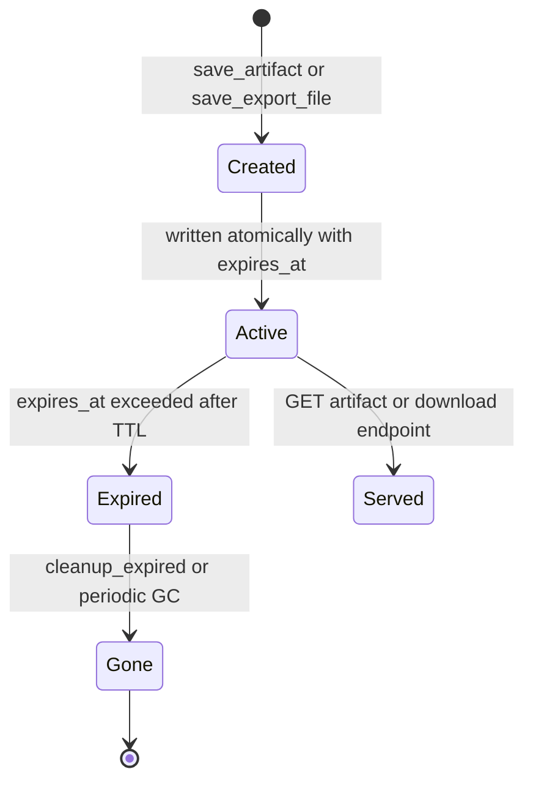

# Artifact Side-Channel & Lifecycle

`backend/app/artifacts/` is the single store for all physical artifacts (charts, CSV exports, and structured query-result payloads) so that they can be rehydrated after an F5 refresh or session replay. It replaces the old `backend/app/chart_artifacts.py` and `backend/app/export_files.py` (both deleted in commit 7f4f8b3 when the unified store landed). Design spec: `docs/multiagent_sidechannel/multiagent_artifact_bubble_up_and_tiering_spec.md` (v1.1).

## Why a side channel

Tools never dump large row sets into the LLM context. Instead the [query tool](../architecture/tools-and-sql-linter.md) and chart/CSV tools return `Command(update={"messages": [ToolMessage], "tool_artifact": {...}})`. That payload lands in `CustomState.tool_artifact` ([state-and-context](../architecture/state-and-context.md)), streams out as `tool_artifact` SSE events ([streaming-protocol](streaming-protocol.md)), and is persisted as a JSON snapshot in `ChatMessage.tool_artifacts` ([data-model](../domain/data-model-and-persistence.md)).

## The store

`ArtifactStore` (`backend/app/artifacts/store.py`) is a singleton obtained via `get_artifact_store()`. It owns:

- **Layout**: `base_dir/charts/` and `base_dir/exports/` (default `tempfile.gettempdir()/sql_agent_artifacts`, overridable by `ARTIFACTS_DIR`). Legacy `CHART_ARTIFACT_DIR` / `SQL_EXPORT_DIR` are kept in the whitelist for compatibility.
- **IDs**: `save_artifact` mints `cht_*` (chart) / `art_*`; `save_export_file` mints `exp_*`. All reads validate the id against `ARTIFACT_ID_PATTERN` and resolve the path against `allowed_base_dirs` — out-of-whitelist paths raise `PermissionError` (`_resolve_managed_file`).
- **Atomic writes**: `_atomic_write_text` uses a same-volume temp file + `os.replace`.
- **TTL + GC**: each record stores `created_at` / `expires_at` (default `ARTIFACTS_TTL_HOURS`, else `CHART_ARTIFACT_TTL_HOURS`, default 24). `cleanup_expired` deletes expired records; the app lifespan in `backend/app/main.py` runs a periodic `_periodic_artifact_gc_loop` (every 60 min).

## REST surface (`backend/app/routers/artifacts.py`)

| Endpoint | Purpose |
|---|---|
| `GET /api/chat/artifacts/{artifact_id}` | Unified metadata/content; strips `stored_path` for privacy |
| `GET /api/chat/artifacts/{artifact_id}/download` | Physical file download (CSV etc.) |
| `GET /api/chat/files/{file_id}`, `GET /api/chat/charts/{chart_id}` | Legacy compatibility, now served directly from `ArtifactStore` |

Error mapping: `ValueError` → 400, `FileNotFoundError` → 404, `TimeoutError` → 410 (expired).

## Lifecycle

_Caption: an artifact's physical lifecycle from creation through TTL expiry and garbage collection._

## Frontend rehydration

- Live streaming: `tool_artifact` events render `ChartGroupCard.vue` / `QueryResultGroup.vue` / `TableResult.vue` (see [chat-app](../frontend/chat-app.md)).
- After refresh / replay: `ChatMessage.tool_artifacts` + `subagents` snapshots are re-parsed by `frontend/src/stores/messages.ts` (`reconstructSubagents`), restoring cards with no LLM round-trip.
- Tiering (v1.1 spec): Tier-1 deliverables (`chart_spec`, `file_export`) bubble up to the main bubble; `query_result` tables and process traces stay inside the collapsed `SubagentCard`.

## Invariants & tests

- Save/get chart, export + src cleanup, path-traversal validation, expiry TimeoutError, and GC: `backend/tests/agent/test_artifact_store_lifecycle.py` (`test_artifact_store_save_and_get_chart`, `test_artifact_store_save_and_get_export_file_and_cleanup_src`, `test_artifact_store_security_path_validation`, `test_artifact_store_expired_timeout`, `test_artifact_store_cleanup_expired`).
- Persistence of the snapshot into `ChatMessage`: `backend/tests/test_tool_artifacts_persistence.py`.
- REST endpoints: `backend/tests/test_routers_coverage.py::test_artifacts_router_endpoints`.

## Change recipe: add a new artifact kind

1. Extend the `ArtifactKind` enum in `backend/app/artifacts/schemas.py` and add any payload fields to `BaseArtifactRecord`.
2. Produce it in the owning tool via a `Command(update={... "tool_artifact": ...})` and `save_artifact` / a new store method; return an `ArtifactHandle`.
3. If it is user-facing, add a `tool_artifact` SSE branch handling (mirror the existing [streaming-protocol](streaming-protocol.md) event) and a frontend renderer.
4. Validate: `cd backend && python -m pytest tests/agent/test_artifact_store_lifecycle.py tests/test_tool_artifacts_persistence.py -q`.
