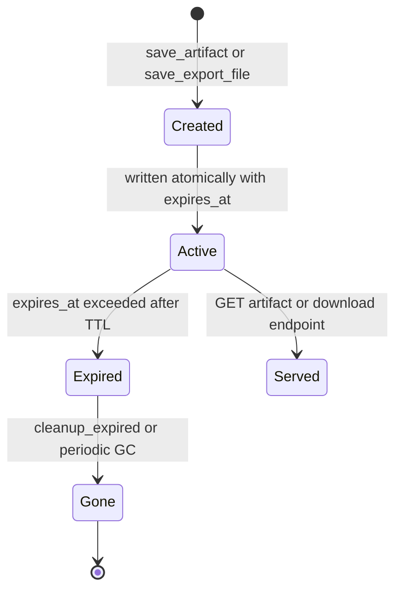

# 工件旁路通道与生命周期

`backend/app/artifacts/` 是所有物理工件（图表、CSV 导出和结构化查询结果载荷）的唯一存储，以便在 F5 刷新或会话回放后能够重新水合。它取代了旧的 `backend/app/chart_artifacts.py` 和 `backend/app/export_files.py`（这两个文件在统一存储落地时的提交 7f4f8b3 中均已删除）。设计规格：`docs/multiagent_sidechannel/multiagent_artifact_bubble_up_and_tiering_spec.md`（v1.1）。

## 为什么需要旁路通道

工具绝不会将大型行集倾倒到 LLM 上下文中。相反，[查询工具](../architecture/tools-and-sql-linter.md) 和图表/CSV 工具会返回 `Command(update={"messages": [ToolMessage], "tool_artifact": {...}})`。该载荷会进入 `CustomState.tool_artifact`（[状态与上下文](../architecture/state-and-context.md)），以 `tool_artifact` SSE 事件的形式流出（[流式协议](streaming-protocol.md)），并作为 JSON 快照持久化到 `ChatMessage.tool_artifacts` 中（[数据模型](../domain/data-model-and-persistence.md)）。

## 存储

`ArtifactStore`（`backend/app/artifacts/store.py`）是一个通过 `get_artifact_store()` 获取的单例。它拥有：

- **布局**：`base_dir/charts/` 和 `base_dir/exports/`（默认值为 `tempfile.gettempdir()/sql_agent_artifacts`，可由 `ARTIFACTS_DIR` 覆盖）。遗留的 `CHART_ARTIFACT_DIR` / `SQL_EXPORT_DIR` 为兼容性保留在白名单中。
- **ID**：`save_artifact` 生成 `cht_*`（图表）/ `art_*`；`save_export_file` 生成 `exp_*`。所有读取都会将 ID 与 `ARTIFACT_ID_PATTERN` 进行验证，并相对于 `allowed_base_dirs` 解析路径——白名单之外的路径会引发 `PermissionError`（`_resolve_managed_file`）。
- **原子写入**：`_atomic_write_text` 使用同卷临时文件 + `os.replace`。
- **TTL + GC**：每条记录都存储 `created_at` / `expires_at`（默认为 `ARTIFACTS_TTL_HOURS`，否则为 `CHART_ARTIFACT_TTL_HOURS`，默认值为 24）。`cleanup_expired` 会删除已过期记录；`backend/app/main.py` 中的应用生命周期会运行周期性的 `_periodic_artifact_gc_loop`（每 60 分钟一次）。

## REST 接口（`backend/app/routers/artifacts.py`）

| 端点 | 用途 |
|---|---|
| `GET /api/chat/artifacts/{artifact_id}` | 统一元数据/内容；为隐私移除 `stored_path` |
| `GET /api/chat/artifacts/{artifact_id}/download` | 物理文件下载（CSV 等） |
| `GET /api/chat/files/{file_id}`、`GET /api/chat/charts/{chart_id}` | 遗留兼容性，现直接由 `ArtifactStore` 提供 |

错误映射：`ValueError` → 400，`FileNotFoundError` → 404，`TimeoutError` → 410（已过期）。

## 生命周期

_图注：工件从创建到 TTL 过期和垃圾回收的物理生命周期。_

## 前端重新水合

- 实时流式传输：`tool_artifact` 事件会渲染 `ChartGroupCard.vue` / `QueryResultGroup.vue` / `TableResult.vue`（参见 [聊天应用](../frontend/chat-app.md)）。
- 刷新 / 回放后：`ChatMessage.tool_artifacts` + subagents 快照由 `frontend/src/stores/messages.ts`（`reconstructSubagents`）重新解析，无需 LLM 往返即可恢复卡片。
- 分级（v1.1 规格）：一级交付物（`chart_spec`、`file_export`）上浮到主气泡；`query_result` 表格和过程轨迹保留在折叠的 `SubagentCard` 内部。

## 不变量与测试

- 保存/获取图表、导出 + 源文件清理、路径穿越验证、过期 TimeoutError 以及 GC：`backend/tests/agent/test_artifact_store_lifecycle.py`（`test_artifact_store_save_and_get_chart`、`test_artifact_store_save_and_get_export_file_and_cleanup_src`、`test_artifact_store_security_path_validation`、`test_artifact_store_expired_timeout`、`test_artifact_store_cleanup_expired`）。
- 快照持久化到 `ChatMessage`：`backend/tests/test_tool_artifacts_persistence.py`。
- REST 端点：`backend/tests/test_routers_coverage.py::test_artifacts_router_endpoints`。

## 变更配方：新增工件类型

1. 扩展 `backend/app/artifacts/schemas.py` 中的 `ArtifactKind` 枚举，并在 `BaseArtifactRecord` 中添加任何载荷字段。
2. 在所属工具中通过 `Command(update={... "tool_artifact": ...})` 和 `save_artifact` / 一个新的存储方法来生成它；返回一个 `ArtifactHandle`。
3. 如果它是面向用户的，请添加一个 `tool_artifact` SSE 分支处理（镜像现有的 [流式协议](streaming-protocol.md) 事件）以及一个前端渲染器。
4. 验证：`cd backend && python -m pytest tests/agent/test_artifact_store_lifecycle.py tests/test_tool_artifacts_persistence.py -q`。