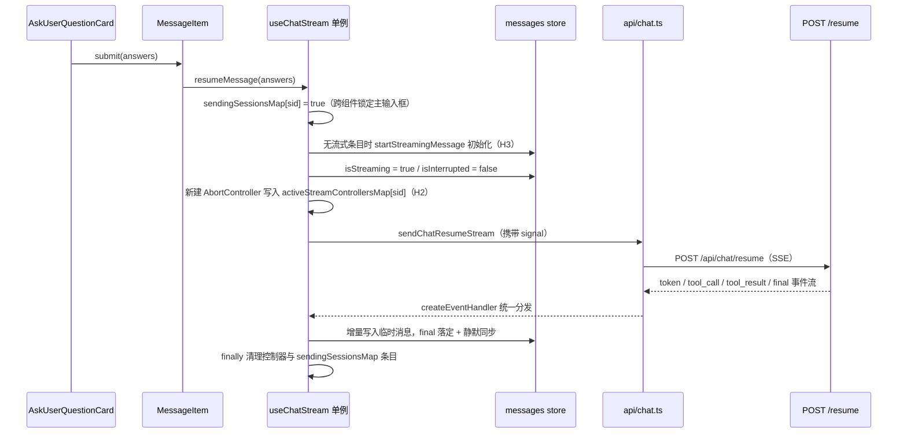

# 澄清流程（AskUserQuestion / HITL）

当需求不明确或技术权衡需要人工决策时，智能体暂停执行并呈现结构化问题卡片。该机制使用 LangGraph 原生 `interrupt` 控制流（LangGraph 1.1.8+）。设计模式说明：`docs/ask_user_question_design_pattern.md`。

**两级澄清归属。** 主 DeepAgent 和 `sql_domain_agent` 都可以调用 `AskUserQuestion`，并且提示词划分职责以避免“连续两轮提问”：主智能体仅在全局方向歧义（无法识别的意图、非数据类问题）时提问，而领域参数澄清（FIS 编号、指标定义、门店数据）在子智能体内部闭环——它会先通过 `search_db_value_lexicon` / `search_db_row_lexicon` 探测进行自修复，只有在探测失败时才升级到 `AskUserQuestion`。该契约位于提示词模板中；有关分工的确切措辞，见 [代理提示词](../architecture/agent-prompts.md)。

## 符号

| 符号 | 文件 | 角色 |
|---|---|---|
| `AskUserQuestion` | `backend/app/agent/tools/ask_user_question.py` | 其 `_run` 调用 `interrupt({"type": "ask_user_question", "questions": [...]})` 并返回答案字典的 `BaseTool` |
| `QuestionItem` / `QuestionOption` | 同一文件 | Pydantic 模式；一个 `field_validator` 接受 JSON 字符串、代码块包裹或 Python 字面量的问题列表。每个条目是单维度的（带 `options` 的选择模式，或 `options` 为空的开放输入模式） |
| `stream_message_resume` | `backend/app/routers/chat.py` | `POST /api/chat/resume`；从已持久化的助手 `tool_calls` 中查找 `AskUserQuestion` 工具调用 id，将用户答案持久化为 `tool_results` 消息，然后调用 `process_stream_resume` |
| `process_stream_resume` | `backend/app/services/chat_service.py` | 将 `Command(resume=answers)` 重新喂入与正常流相同的 `_stream_execution_loop` |
| `resumeMessage` | `frontend/src/composables/useChatStream.ts` | 澄清卡片提交入口（`MessageItem.vue` 调用）；先确保 `streamingMessagesMap[sessionId]` 条目存在（H3），置位流式态并注册 `AbortController`（H2），再走 `sendChatResumeStream` |
| `abortSessionStream` | 同一文件 | 中止指定会话的活跃 `AbortController` 并清理 `sendingSessionsMap` / `contextWarningsMap` 条目；`sessions.ts::deleteSession` 第一步调用（M8） |
| `setStreamingInterrupt` | `frontend/src/stores/messages.ts` | 将流式消息转为 `isInterrupted` 挂起态并写入 `questions` 与子智能体归属（`interrupt_subagent_*`） |

## 流程

1. 子智能体（或主智能体）调用 `AskUserQuestion`；LangGraph 中断执行并返回控制权。
2. 流式循环（[流式协议](streaming-protocol.md)）发出携带 `questions` 以及会话/子智能体 id 的 `interrupt` SSE 事件。
3. 路由器将带有 `AskUserQuestion` 工具调用的助手消息持久化，并将其冻结为 `completed`（参见 `backend/app/routers/chat.py` 中 `stream_message_post` 的 interrupt 处理）。
4. 前端渲染 `AskUserQuestionCard.vue`（以及 `FloatingClarificationDock.vue`）——互斥的单选/多选与自定义输入，支持悬停 Markdown 预览；提交后的卡片在加载历史记录时禁用（参见 [聊天应用](../frontend/chat-app.md)）。
5. 提交时，`POST /api/chat/resume` 将答案映射回 `ToolMessage` 结果并恢复执行；图从中断点继续。

### 前端 resume 链路（2026-08-30 修复）

澄清卡片提交经 `MessageItem.vue` 的 `handleQuestionSubmit` 调用 `useChatStream()` 的 `resumeMessage(answers)`（`MessageItem.vue:1005-1014`）。该链路依赖 2026-08-30 审计（`frontend/docs/code-review-2026-08-30.md` 的 H2 / H3 / M8）引入并固化的三个修复，缺一不可：

*resume 链路时序：MessageItem 提交 → 单例状态写入 → SSE 恢复流；H2 单例化、H3 前置初始化、M8 删除前 abort 三个修复共同支撑该链路。*

- **H3 前置初始化**：历史会话或页面刷新后 `streamingMessagesMap[sessionId]` 条目不存在。`resumeMessage` 开头检查目标条目，缺失则先 `startStreamingMessage(currentSession.id)` 再置位——否则 store 侧 `appendStreamingContent` / `appendStreamingReasoning` / `upsertStreamingToolCall` / `setStreamingToolResult` / `completeStreamingMessage` 的 `if (!msg) return` 守卫会**静默丢弃 resume 期间全部流式事件**，界面静止无字，直到流结束靠 `syncMessagesIfCurrent` 全量重拉"突变"展示。
- **H2 模块级单例流控**：`streamMode` / `thinkingLevel` / `activeStreamControllersMap` / `sendingSessionsMap` / `contextWarningsMap` 声明在 `useChatStream()` 函数体外（模块顶层），`MessageItem`（resume 入口）与 `ChatView`（主输入框 / 停止生成按钮）两个调用方共享同一份状态。提交澄清后 `ChatView` 的 `isSending` 立即为真（主输入框禁用，防并发覆盖进行中的流式态）；"停止生成"通过共享 `activeStreamControllersMap` 能中止 resume 流。修复前这些 ref 在函数体内相互隔离，主输入框不锁定、停止按钮无法中止 resume 流。
- **错误处理**：resume 的 catch 分支区分 abort（`isAbortError` → `finalizeStreamingInterrupted` 保留已生成片段落定）与其他错误（`clearStreamingMessage` + 重拉 + 重新抛出，`MessageItem` 复位 `isLocalSubmitted` 供重试）。
- **M8 删除会话前中止流**：`useChatStream.ts` 导出 `abortSessionStream(sessionId)`（abort 控制器 + 清理 `sendingSessionsMap` / `contextWarningsMap` 条目）；`sessions.ts::deleteSession` **第一步**调用它再调删除 API，避免删除后底层 SSE 长连接后台空跑至后端生成完毕。

完整生命周期（发送/恢复/停止/删除的顺序契约）、模块级单例状态图与已知遗留见 [流式生命周期](../frontend/streaming-lifecycle.md)。

## 不变式与测试

- 恢复 + interrupt 处理：`backend/tests/test_routers_coverage.py::test_chat_resume_endpoint` 和 `::test_chat_stream_endpoint_with_tool_artifact_and_interrupt`。
- `QuestionItem` 单维度规则：由 `ask_user_question.py` 中的 Pydantic 模式和校验器强制执行（没有专用单元测试文件——若修改问题契约，请在 `backend/tests/agent/` 下新增一个）。
- 前端 resume 链路无自动化测试，唯一静态检查为 `cd frontend && npx vue-tsc --noEmit`；完整生命周期与已知遗留（如 `memory*Map` 只增不清、无 ESLint）见 [流式生命周期](../frontend/streaming-lifecycle.md)。

## 变更配方：扩展澄清契约

1. 在 `backend/app/agent/tools/ask_user_question.py` 中为 `QuestionItem`/`QuestionOption` 添加字段；相应更新 `interrupt` 负载。
2. 在前端 `QuestionItem`/`QuestionOption` 类型（`frontend/src/types/index.ts`）以及 `AskUserQuestionCard.vue` 渲染中镜像这些字段。
3. 确保 `stream_message_resume` 仍能往返答案（它们作为 `interrupt` 的值字典返回）。
4. 验证：`cd backend && python -m pytest tests/test_routers_coverage.py -q` 和 `cd frontend && npx vue-tsc --noEmit`。
