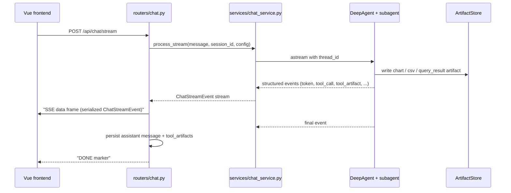

# SSE 流式传输协议

流式处理路径是核心面向用户的契约。事件定义为 `backend/app/schemas.py` 中的 Pydantic 可区分联合类型 `ChatStreamEvent`，并由 `frontend/src/api/chat.ts` + `frontend/src/types/index.ts` 中的 TypeScript 镜像消费。

## 事件联合类型（来自 `backend/app/schemas.py`）

`token`、`reasoning`、`status`（stage ∈ thinking/retrieving/querying/writing）、`tool_call`、`tool_result`、`final`、`error`、`interrupt`、`rag_context`、`lexicon_context`、`tool_artifact`、`subagent_change`、`plan_update`。

- `serialize_chat_stream_event(event)` 会依据 `ChatStreamEvent` `TypeAdapter` 校验任意事件，并调用 `model_dump(mode="json", exclude_none=True)` 对其进行序列化。这是唯一的序列化边界——路由在写入 `data: ...` SSE 帧之前调用它（`backend/app/routers/chat.py::_encode_sse`）。
- 支持子代理的字段（`subagent_id`、`subagent_name`）会随大多数事件载荷传递，使前端能够按子代理划分帧。

## 端点

- `POST /api/chat/stream` — 主流式端点（`backend/app/routers/chat.py::stream_message_post`）；聚合 `tool_calls` / `tool_results` / `tool_artifacts`，并在 `final`/`error` 路径上持久化助手消息。
- `POST /api/chat/resume` — 恢复挂起的澄清流程（参见 [clarification-flow](clarification-flow.md)）。
- `POST /api/chat/message` — 非流式路径（相同聚合，不使用 SSE）。

## 时序

_说明：一个来自 Vue 应用的流式请求，经由路由器和服务适配器进入代理图，伴随产物旁路通道和 SSE 帧回流。_

## 双重注册约定（仓库级不变量）

新增事件类型需要 **两侧** 同时实现，否则前端网络层会静默丢弃它（`AGENTS.md` 中有说明）：

- **后端**：新增 `BaseModel`，并将其加入 `ChatStreamEvent` 联合类型（`backend/app/schemas.py`）；通过 `emit_stream_event` / 代理发出该事件。
- **前端** —— 三个位置（`frontend/src/api/chat.ts` + `frontend/src/types/index.ts`）：
  1. `@/types` 中的 `StreamEvent` 联合类型。
  2. `frontend/src/api/chat.ts` 中 `STREAM_EVENT_TYPES` 白名单 `Set`。
  3. `frontend/src/api/chat.ts` 中 `parseStreamEvent` 的 `switch` 分支。

`parseStreamEvent` 的运行时守卫会拒绝任何 `type` 不在 `STREAM_EVENT_TYPES` 中的事件（这是针对未知事件的“静默过滤”防线）。

## 不变量与测试

- SSE 编码辅助函数 + 子代理作用域：`backend/tests/test_routers_coverage.py`（`test_encode_sse_helper`、`test_encode_sse_subagent_change`）、`backend/tests/agent/test_subagent_stream_scoping.py`（`test_serialize_tool_calls_keeps_subagent_metadata`、`test_status_signature_distinguishes_subagent`）。
- 推理事件 schema：`backend/tests/agent/test_sse_reasoning_events.py`。
- 完整流式流程（含 tool_artifact + interrupt）：`backend/tests/test_routers_coverage.py::test_chat_stream_endpoint_with_tool_artifact_and_interrupt`。

## 变更步骤：新增流式事件

1. 新增 `BaseModel` 子类，并将其追加到 `backend/app/schemas.py` 的 `ChatStreamEvent` 联合类型中。
2. 从代理/服务层发出该事件（通过 `backend/app/agent/utils/streaming.py` 中的 `emit_stream_event`，或直接写入 `chat_service.py`）。
3. 在前端同步镜像：`StreamEvent` 联合类型 → `STREAM_EVENT_TYPES` 集合 → `parseStreamEvent` 分支（均位于 `frontend/src/api/chat.ts` / `frontend/src/types/index.ts`）。
4. 验证：`cd backend && python -m pytest tests/test_routers_coverage.py tests/agent/test_subagent_stream_scoping.py -q` 以及 `cd frontend && npx vue-tsc --noEmit`。