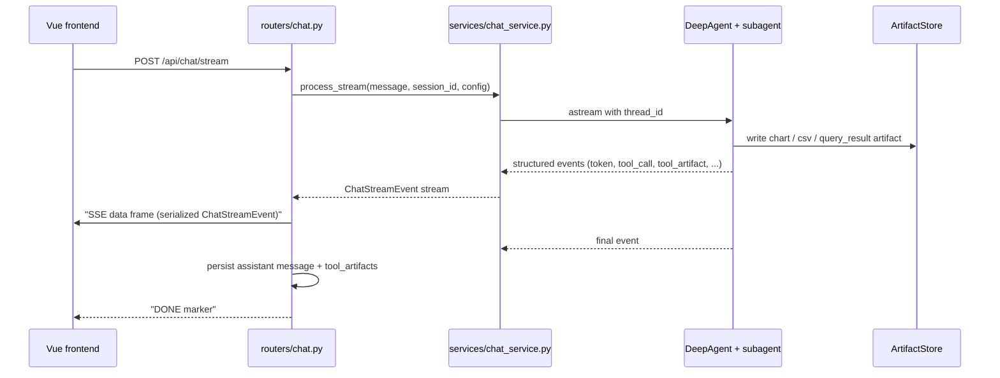

# SSE Streaming Protocol

The streaming path is the core user-facing contract. Events are defined as a Pydantic discriminated union `ChatStreamEvent` in `backend/app/schemas.py` and consumed by a TypeScript mirror in `frontend/src/api/chat.ts` + `frontend/src/types/index.ts`.

## Event union (from `backend/app/schemas.py`)

`token`, `reasoning`, `status` (stage ∈ thinking/retrieving/querying/writing), `tool_call`, `tool_result`, `final`, `error`, `interrupt`, `rag_context`, `lexicon_context`, `tool_artifact`, `subagent_change`, `plan_update`.

- `serialize_chat_stream_event(event)` validates any event against the `ChatStreamEvent` `TypeAdapter` and `model_dump(mode="json", exclude_none=True)` it. This is the single serialization boundary — the router calls it before writing `data: ...` SSE frames (`backend/app/routers/chat.py::_encode_sse`).
- Subagent-aware fields (`subagent_id`, `subagent_name`) ride most event payloads so the frontend can partition frames by subagent.

## Endpoints

- `POST /api/chat/stream` — main stream (`backend/app/routers/chat.py::stream_message_post`); aggregates `tool_calls` / `tool_results` / `tool_artifacts` and persists the assistant message on the `final`/`error` path.
- `POST /api/chat/resume` — resumes a suspended clarification (see [clarification-flow](clarification-flow.md)).
- `POST /api/chat/message` — non-streaming path (same aggregation, no SSE).

## Sequence

_Caption: one streaming request from the Vue app through the router and service adapter into the agent graph, with artifact side-channels and SSE frames flowing back._

## Dual registration contract (repository-wide invariant)

Adding a new event type requires **both** sides, or the frontend network layer silently drops it (`AGENTS.md` documents this):

- **Backend**: add the `BaseModel` + include it in the `ChatStreamEvent` union (`backend/app/schemas.py`); emit it via `emit_stream_event` / the agent.
- **Frontend** — three places (`frontend/src/api/chat.ts` + `frontend/src/types/index.ts`):
  1. The `StreamEvent` union type in `@/types`.
  2. The `STREAM_EVENT_TYPES` whitelist `Set` in `frontend/src/api/chat.ts`.
  3. The `parseStreamEvent` `switch` branch in `frontend/src/api/chat.ts`.

The `parseStreamEvent` runtime guard rejects any event whose `type` is not in `STREAM_EVENT_TYPES` (this is the "silent filter" defense against unknown events).

## Invariants & tests

- SSE encode helper + subagent scoping: `backend/tests/test_routers_coverage.py` (`test_encode_sse_helper`, `test_encode_sse_subagent_change`), `backend/tests/agent/test_subagent_stream_scoping.py` (`test_serialize_tool_calls_keeps_subagent_metadata`, `test_status_signature_distinguishes_subagent`).
- Reasoning event schema: `backend/tests/agent/test_sse_reasoning_events.py`.
- Full stream flows incl. tool_artifact + interrupt: `backend/tests/test_routers_coverage.py::test_chat_stream_endpoint_with_tool_artifact_and_interrupt`.

## Change recipe: add a new stream event

1. Add the `BaseModel` subclass and append it to the `ChatStreamEvent` union in `backend/app/schemas.py`.
2. Emit it from the agent/service layer (via `emit_stream_event` in `backend/app/agent/utils/streaming.py` or directly in `chat_service.py`).
3. Mirror on the frontend: `StreamEvent` union → `STREAM_EVENT_TYPES` set → `parseStreamEvent` case (all in `frontend/src/api/chat.ts` / `frontend/src/types/index.ts`).
4. Validate: `cd backend && python -m pytest tests/test_routers_coverage.py tests/agent/test_subagent_stream_scoping.py -q` and `cd frontend && npx vue-tsc --noEmit`.
